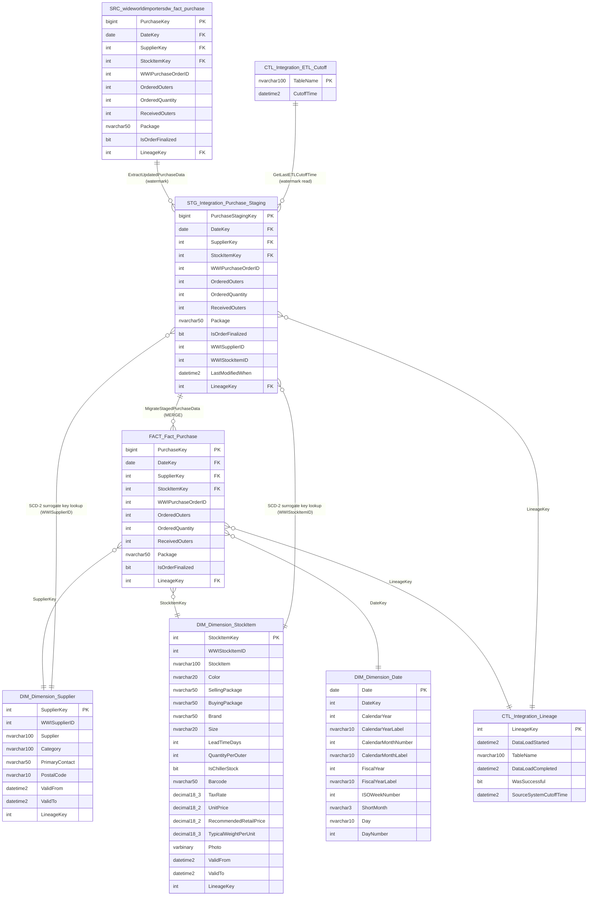
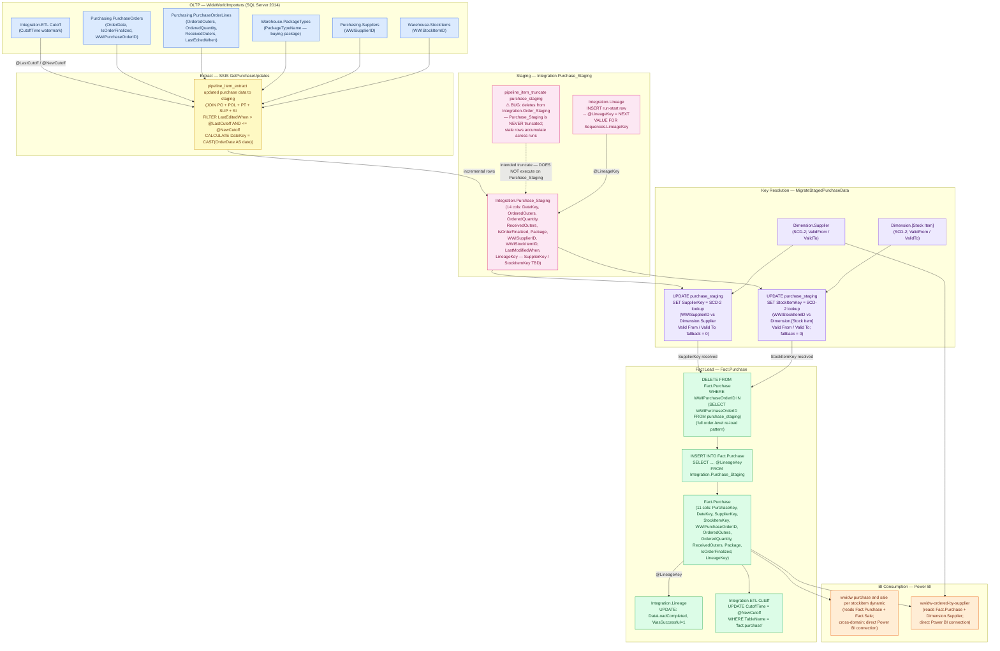

# As-Is Analysis — Purchase

## 1. Definition

### 1.1 Definition

**Purchase** is the primary data product for the **Inventory_Stock_Project** migration initiative. It represents the **procurement order transaction domain** of the WideWorldImporters Data Warehouse, built on Microsoft SQL Server 2014. The product's central artifact is the `fact.purchase` table — a grain-level transaction fact that captures every purchase order line item placed with a supplier, recording both ordered and received quantities at the outer-packaging and individual-unit level, along with order finalization status.

The core business purpose of Purchase is to provide reliable, queryable procurement data for downstream BI reporting and cross-domain analytics. Business users rely on this data product to answer questions such as: which suppliers are fulfilling orders in full, how do ordered quantities compare against received quantities per stock item, and which purchase orders remain open (not yet finalized). These questions drive the two active downstream reports: the **wwidw purchase and sale per stockitem dynamic** report — a cross-domain analytical report that joins purchase data with sales data to compare procurement and sales volumes per stock item — and the **wwidw-ordered-by-supplier** report, which surfaces supplier-level order and receipt performance.

The key components of the Purchase data product are:

- **Core fact table:** `wideworldimportersdw.fact.purchase` — stores purchase order lines with surrogate keys to the `dimension.supplier`, `dimension.stock item`, and `dimension.date` conformed dimensions. Non-additive descriptors include `Package` (outer packaging type) and the `Is Order Finalized` flag. Measures include `Ordered Outers`, `Ordered Quantity`, and `Received Outers`.
- **Conformed dimension read dependencies:** `dimension.supplier` and `dimension.stock item` (SCD-2; owned by separate products) and `dimension.date` (shared infrastructure). The Purchase ETL performs surrogate key resolution against these dimensions but does not own their load procedures.
- **Integration staging layer:** `integration.purchase_staging` (staging area) loaded by SSIS incremental extract; `integration.etl cutoff` (ETL watermark control); `integration.lineage` (ETL run log); `integration.migratestagedpurchasedata` (core T-SQL MERGE procedure that resolves SCD-2 surrogate keys and upserts into `fact.purchase`).
- **SSIS orchestration pipeline:** the Purchase container within `demo_ssis…pipeline_dailyetlmain`, which runs nightly and contains a confirmed staging-truncation bug (the truncate dataflow targets `Integration.Order_Staging` instead of `Integration.Purchase_Staging`, causing stale rows to accumulate).
- **Shared infrastructure:** `sequences.lineagekey` (SQL Server SEQUENCE, no native Databricks equivalent), `integration.getlastetlcutofftime`, and `integration.getlineagekey` stored procedures.

The migration target is **Databricks Delta Lake** (catalog: `inventory_stock`), replacing SSIS batch logic with maintainable, observable Delta pipelines and correcting the staging-truncation defect as part of the rewrite.

---

### 1.2 Metadata Table

| # | Field | Value |
|---|---|---|
| 1 | Domain Name | Procurement / Purchasing |
| 2 | Business Process | Purchase Order Management — capturing supplier purchase orders from order placement through receipt and finalization |
| 3 | Process Type | Transactional (incremental daily batch load; append and upsert via MERGE) |
| 4 | Business Entities | Purchase Order, Supplier, Stock Item, Order Line, Package Type |
| 5 | Business Metric | Ordered Outers, Ordered Quantity, Received Outers, Order Finalization Rate, Open Orders Count |
| 6 | Description | Grain-level purchase order line fact capturing quantities ordered vs received per supplier and stock item per day, with outer packaging type and order finalization status. Feeds supplier performance and cross-domain stock-item analytics reports. |
| 7 | Impacted Analytical Reports | `wwidw purchase and sale per stockitem dynamic` (cross-domain; also reads `fact.sale`); `wwidw-ordered-by-supplier` |
| 8 | Data Access and Restrictions | [USER INPUT REQUIRED] (confirm row-level security requirements, role-based access policies, and any supplier confidentiality restrictions with scope owner) |
| 9 | Data Sources | `wideworldimportersdw.fact.purchase` (Microsoft SQL Server 2014); `wideworldimportersdw.integration.purchase_staging` (incremental staging); `wideworldimportersdw.dimension.supplier` (SCD-2 lookup, external-owned); `wideworldimportersdw.dimension.stock item` (SCD-2 lookup, external-owned); `wideworldimportersdw.dimension.date` (shared infrastructure) |
| 10 | Filters Applied | Incremental load filtered by ETL high-watermark from `integration.etl cutoff` (via `integration.getlastetlcutofftime`); only rows updated since last successful ETL run are extracted to staging |
| 11 | Calculated Fields Added | `Lineage Key` — injected at load time via `integration.getlineagekey` / `sequences.lineagekey` to tag each row with its ETL run identifier; no analytical scalar calculations or derived measures are computed within the fact load procedure |
| 12 | Business DQ Rules | Ordered Quantity must be > 0; Received Outers must be <= Ordered Outers for finalized orders (`Is Order Finalized = 1`); each `WWI Purchase Order ID` must resolve to a valid supplier and stock item via SCD-2 surrogate key lookup; [USER INPUT REQUIRED] (confirm additional business DQ rules with scope owner) |
| 13 | Technical DQ Rules | `PurchaseKey` uniqueness enforced by IDENTITY PK; `Supplier Key` and `Stock Item Key` must resolve to active SCD-2 rows in `dimension.supplier` and `dimension.stock item` respectively; `Date Key` must exist in `dimension.date`; `Lineage Key` must reference a valid row in `integration.lineage`; `Package` is non-nullable nvarchar(50); `Is Order Finalized` is a non-nullable bit column; stale staging rows from prior runs must not be re-processed (legacy SSIS bug violates this rule — must be corrected in Databricks replacement) |
| 14 | Storage | Source: Microsoft SQL Server 2014 — `wideworldimportersdw` database, `fact` schema, heap or clustered-index table (storage details [USER INPUT REQUIRED] — confirm row count, table size, index configuration, and partition scheme with scope owner); Target: Databricks Delta Lake — `inventory_stock` catalog, Delta table format, bronze/silver/gold layer architecture |
| 15 | Internal Consumers | `wwidw purchase and sale per stockitem dynamic` BI report (cross-domain; reads `fact.purchase` and `fact.sale`); `wwidw-ordered-by-supplier` BI report; [USER INPUT REQUIRED] (confirm any additional internal consumers — dashboards, downstream ETL processes, or ad-hoc analytical workloads — with scope owner) |

## 2. Consumers

The Purchase data product is consumed by two BI reports that read `fact.purchase` directly, by one cross-domain analytical view that reads it via a correlated subquery, and by one internal ETL process that depends on the shared watermark control table written by the Purchase load procedure.

| Consumer Name | Use Cases | Business Questions Answered | Consumption Method |
|---|---|---|---|
| `wwidw purchase and sale per stockitem dynamic` | Cross-domain procurement-vs-sales comparison report used by procurement and inventory analysts. Presents ordered quantity, received quantity, and order finalization status per stock item alongside corresponding sales volume data for the same items. | Which stock items are being ordered in volumes that match or exceed sales demand? How do procurement receipt quantities compare to sales quantities per stock item? Which stock items have open (non-finalized) purchase orders relative to their sales activity? | Direct table read — queries `fact.purchase` directly. Cross-domain join with `fact.sale` (Sales_Orders product) on stock item. No intermediate view or procedure. |
| `wwidw-ordered-by-supplier` | Supplier performance and order fill rate report used by procurement teams. Groups purchase order volumes, ordered and received quantities, and finalization status by supplier to assess fulfillment reliability. | Which suppliers are filling orders in full (received outers vs ordered outers)? What is the open vs finalized order distribution per supplier? Which suppliers have the highest purchase order volumes? What is the fill rate trend across suppliers? | Direct table read — queries `fact.purchase` and `dimension.supplier` directly. No intermediate view or procedure. Joins on `Supplier Key` (SCD-2 surrogate key). |
| `analytics.v_ordertoyearanalytics` | Cross-domain analytical view driven by `fact.order`. Reads `fact.purchase` to correlate purchase stock item keys with order package types for year-to-date analytics. | (Cross-domain, out-of-scope for Purchase.) How do order-to-year analytics relate to purchase package types and stock items? | Correlated subquery in SELECT list: `SELECT TOP 5 p.[Stock Item Key] FROM Fact.Purchase p WHERE fo.Package = p.Package`. The join predicate is a string equality on the `Package` column — not a primary key join. Requires the `Package` column to be preserved with the same name and type in the migrated schema. **Coordination with the Order product team is required before migration** — this view is driven by `fact.order` and cannot be rebuilt by the Purchase product alone. |
| `integration.migratestagedpurchasedata` | Internal ETL load procedure. Reads the ETL high-watermark from `integration.etl cutoff` (via `integration.getlastetlcutofftime`) to determine the incremental extract window for the current run, then upserts resolved purchase rows into `fact.purchase`. | (Internal only — not a business-facing consumer.) Controls which source rows are eligible for the current incremental load cycle. | Indirect dependency — does not query `fact.purchase` as a consumer but reads `integration.etl cutoff` (the watermark last written by the Purchase load procedure itself) to govern extract boundaries. Calls `integration.getlastetlcutofftime` stored procedure; updates `integration.etl cutoff` upon successful completion of each run. |

## 3. Model

**Product:** Purchase
**Project:** Inventory_Stock_Project
**Fact table:** `fact.purchase` (11 columns, rowstore, IDENTITY PK)
**ETL engine:** SSIS — `pipeline_dailyetlmain` (daily batch), Purchase container
**Model scope:** Source system extract tables → integration staging layer → conformed dimensions → purchase fact

---

### 3.1 ER Diagram



---

### 3.2 Textual Description

| Layer | Tables | Description |
|---|---|---|
| Primary Source | `wideworldimportersdw.fact.purchase` | The source fact table in the WideWorldImporters DW on SQL Server 2014. Acts as the extraction base node. Incremental delta rows are selected from this table using the `Last Modified When` watermark from `integration.etl cutoff` (via `integration.getlastetlcutofftime`) and loaded into `purchase_staging` by the SSIS extract dataflow. |
| Fact Table | `wideworldimportersdw.fact.purchase` | 11-column rowstore table with `PurchaseKey` BIGINT IDENTITY PK. Stores one row per purchase order line item at the grain of supplier × stock item × date. Measures: `Ordered Outers`, `Ordered Quantity`, `Received Outers`. Non-additive descriptors: `Package` (outer packaging type), `Is Order Finalized` (bit). Carries surrogate FK references to `dimension.supplier`, `dimension.[stock item]`, and `dimension.date`, plus a `Lineage Key` for ETL run traceability. |
| Dimension / Dictionary | `wideworldimportersdw.dimension.supplier`, `wideworldimportersdw.dimension.[stock item]`, `wideworldimportersdw.dimension.date` | Two SCD Type-2 conformed dimensions (`supplier`: 9 columns; `stock item`: 19 columns including `Photo varbinary(max)`) with IDENTITY int surrogate keys and `Valid From`/`Valid To` datetime2 columns. `dimension.date` is a static calendar table (no SCD-2) with 12 columns. All three are **read dependencies** of the Purchase ETL — surrogate key lookups for `supplier` and `stock item` are performed in `migratestagedpurchasedata` using `WWI Supplier ID` and `WWI Stock Item ID` source IDs stored in staging. Neither dimension load procedure is Purchase-owned. |
| Processing | `wideworldimportersdw.integration.purchase_staging`, `wideworldimportersdw.integration.etl cutoff`, `wideworldimportersdw.integration.lineage`, `wideworldimportersdw.integration.migratestagedpurchasedata`, `wideworldimportersdw.integration.getlastetlcutofftime`, `wideworldimportersdw.integration.getlineagekey`, `wideworldimportersdw.sequences.lineagekey` | `purchase_staging` (14 columns, IDENTITY PK) is a persistent staging table that buffers incremental purchase rows before fact load; it carries both pre-resolved DW surrogate keys (`Supplier Key`, `Stock Item Key`) and original source IDs (`WWI Supplier ID`, `WWI Stock Item ID`) used for SCD-2 re-resolution in `migratestagedpurchasedata`. The staging table is **not correctly truncated** before each run due to a confirmed SSIS bug (the truncate dataflow targets `Integration.Order_Staging` instead of `Integration.Purchase_Staging`), causing stale rows to accumulate across runs. `migratestagedpurchasedata` is the core ETL stored procedure: it resolves SCD-2 surrogate keys, performs a MERGE/upsert into `fact.purchase`, injects a lineage key via `getlineagekey` / `sequences.lineagekey`, and updates the ETL cutoff watermark in `integration.etl cutoff`. `integration.lineage` logs one row per ETL run per entity with start/end timestamps and success flag. |

## 4. Lineage

**Product:** Purchase
**Project:** Inventory_Stock_Project
**Fact table:** `fact.purchase`
**ETL engine:** SSIS — `pipeline_dailyetlmain` (daily batch), Purchase container
**Lineage scope:** OLTP source tables → SSIS extract → integration staging → SCD-2 key resolution → fact upsert → BI consumption

---

### 4.0 Target Data Flow — Bronze → Silver → Gold (Databricks)

The table below shows how each source-system object maps to the target Databricks medallion layer and its Delta table name in the `inventory_stock` Unity Catalog.

```
SOURCE (SQL Server 2014)
══════════════════════════════════════════════════════════════════════════
  wideworldimporters.purchasing.*  ──► JDBC incremental extract
  wideworldimporters.warehouse.*          (watermark-bounded)
                                               │
                                               ▼
BRONZE LAYER — inventory_stock.bronze.*
══════════════════════════════════════════════════════════════════════════
  integration.purchase_staging  → bronze.purchase_staging   (OVERWRITE/run)
  integration.[ETL Cutoff]      → bronze.etl_cutoff          (control)
  integration.lineage           → bronze.lineage_run         (audit log)
  stg.dq_rejections             → bronze.dq_rejections       (DQ violations)
                                               │
                   ┌───────────────────────────┤
                   ▼                           ▼
SILVER DIM — inventory_stock.silver_dim.*    SILVER FACT — inventory_stock.silver_fact.*
═══════════════════════════════════════════  ═══════════════════════════════════════════
  dimension.supplier   → silver_dim.supplier (SCD-2)
  dimension.stock item → silver_dim.stock_item (SCD-2)    → silver_fact.fact_purchase
  dimension.date       → silver_dim.date (static)
                                               │
                                               ▼
MART LAYER — inventory_stock.mart.*
══════════════════════════════════════════════════════════════════════════
  (BI-facing views)
  mart.v_purchase_by_supplier        ──► wwidw-ordered-by-supplier (Power BI)
  mart.v_purchase_per_stock_item     ──► wwidw purchase and sale per stockitem dynamic (Power BI)
```

| Source Object | Source Layer | Target Delta Table | Target Layer | Notes |
|---|---|---|---|---|
| `integration.purchase_staging` | SQL Server Integration | `bronze.purchase_staging` | Bronze | OVERWRITE per run; corrects SSIS truncation bug |
| `integration.[ETL Cutoff]` | SQL Server Integration | `bronze.etl_cutoff` | Bronze | Watermark control; one row per entity |
| `integration.lineage` | SQL Server Integration | `bronze.lineage_run` | Bronze | ETL run audit; IDENTITY key replaces SEQUENCE |
| `stg.dq_rejections` | (new in target) | `bronze.dq_rejections` | Bronze | Centralised DQ violation store with lineage_key |
| `dimension.supplier` | SQL Server Dimension | `silver_dim.supplier` | Silver Dim | SCD-2; is_current_row flag; key=0 sentinel required |
| `dimension.stock item` | SQL Server Dimension | `silver_dim.stock_item` | Silver Dim | SCD-2; renamed (space removed); key=0 sentinel required |
| `dimension.date` | SQL Server Dimension | `silver_dim.date` | Silver Dim | Static calendar; pre-populated at bootstrap |
| `fact.purchase` | SQL Server Fact | `silver_fact.fact_purchase` | Silver Fact | MERGE INTO keyed on `wwi_purchase_order_id` |
| (new in target) | — | `mart.v_purchase_by_supplier` | Mart | BI view — supplier performance |
| (new in target) | — | `mart.v_purchase_per_stock_item` | Mart | BI view — stock item procurement |

---

### 4.1 Key Columns / Metrics

| # | Column / Metric | Type | Description |
|---|---|---|---|
| 1 | `Fact.Purchase.[Date Key]` | date | Calendar date of the purchase order. Derived by casting `Purchasing.PurchaseOrders.OrderDate` to date in the SSIS extract dataflow; passed through staging without transformation. FK to `Dimension.Date`. |
| 2 | `Fact.Purchase.[Ordered Outers]` | int | Number of outer packages (cartons/cases) ordered. Pass-through from `Purchasing.PurchaseOrderLines.OrderedOuters` via staging; no derivation. |
| 3 | `Fact.Purchase.[Ordered Quantity]` | int | Total individual units ordered (outer count × units per outer). Pass-through from `Purchasing.PurchaseOrderLines.OrderedQuantity` via staging; no derivation. |
| 4 | `Fact.Purchase.[Received Outers]` | int | Number of outer packages actually received against the order line. Pass-through from `Purchasing.PurchaseOrderLines.ReceivedOuters` via staging; no derivation. |
| 5 | `Fact.Purchase.[Is Order Finalized]` | bit | Flag indicating whether the purchase order has been closed/finalized. Pass-through from `Purchasing.PurchaseOrders.IsOrderFinalized` via staging; no derivation. |
| 6 | `Fact.Purchase.[Supplier Key]` | int | SCD Type-2 surrogate key for the supplier. Resolved in `MigrateStagedPurchaseData` by matching `WWI Supplier ID` against `Dimension.Supplier` using `Last Modified When` against the `Valid From`/`Valid To` window. Fallback value = 0 when no matching SCD-2 row is found. |
| 7 | `Fact.Purchase.[Stock Item Key]` | int | SCD Type-2 surrogate key for the stock item. Resolved in `MigrateStagedPurchaseData` by matching `WWI Stock Item ID` against `Dimension.[Stock Item]` using `Last Modified When` against the `Valid From`/`Valid To` window. Fallback value = 0 when no matching SCD-2 row is found. |
| 8 | `Fact.Purchase.[Package]` | nvarchar(50) | Outer packaging type name for the purchase (buying package). Pass-through from `Warehouse.PackageTypes.PackageTypeName` (buying-package join in the SSIS extract); no derivation. |
| 9 | `Fact.Purchase.[Lineage Key]` | int | ETL run identifier injected into every row loaded in a given pipeline execution. Generated as `NEXT VALUE FOR Sequences.LineageKey` at the start of each `MigrateStagedPurchaseData` invocation via `Integration.GetLineageKey`; the same key is written to all rows inserted in that run and to the `Integration.Lineage` run-log row. |

---

### 4.2 Lineage Diagram



---

### 4.3 Column-Level Lineage Table

| Target Table | Target Column | Source Table | Source Column | Intermediate Table / Column | Derived / Pass-Through |
|---|---|---|---|---|---|
| `Fact.Purchase` | `Date Key` | `Purchasing.PurchaseOrders` | `OrderDate` | `Integration.Purchase_Staging.[Date Key]` | Derived — `CAST(OrderDate AS date)` in SSIS extract |
| `Fact.Purchase` | `Ordered Outers` | `Purchasing.PurchaseOrderLines` | `OrderedOuters` | `Integration.Purchase_Staging.[Ordered Outers]` | Pass-through |
| `Fact.Purchase` | `Ordered Quantity` | `Purchasing.PurchaseOrderLines` | `OrderedQuantity` | `Integration.Purchase_Staging.[Ordered Quantity]` | Pass-through |
| `Fact.Purchase` | `Received Outers` | `Purchasing.PurchaseOrderLines` | `ReceivedOuters` | `Integration.Purchase_Staging.[Received Outers]` | Pass-through |
| `Fact.Purchase` | `Is Order Finalized` | `Purchasing.PurchaseOrders` | `IsOrderFinalized` | `Integration.Purchase_Staging.[Is Order Finalized]` | Pass-through |
| `Fact.Purchase` | `Package` | `Warehouse.PackageTypes` | `PackageTypeName` (buying package) | `Integration.Purchase_Staging.[Package]` | Pass-through — joined on buying-package FK in SSIS extract |
| `Fact.Purchase` | `WWI Purchase Order ID` | `Purchasing.PurchaseOrders` | `PurchaseOrderID` | `Integration.Purchase_Staging.[WWI Purchase Order ID]` | Pass-through |
| `Fact.Purchase` | `Supplier Key` | `Purchasing.Suppliers` | `SupplierID` (as `WWI Supplier ID`) | `Integration.Purchase_Staging.[WWI Supplier ID]` → SCD-2 lookup → `Integration.Purchase_Staging.[Supplier Key]` | Derived — `COALESCE(TOP(1) SCD-2 match on Dimension.Supplier by WWISupplierID + LastModifiedWhen window, 0)` |
| `Fact.Purchase` | `Stock Item Key` | `Warehouse.StockItems` | `StockItemID` (as `WWI Stock Item ID`) | `Integration.Purchase_Staging.[WWI Stock Item ID]` → SCD-2 lookup → `Integration.Purchase_Staging.[Stock Item Key]` | Derived — `COALESCE(TOP(1) SCD-2 match on Dimension.[Stock Item] by WWIStockItemID + LastModifiedWhen window, 0)` |
| `Fact.Purchase` | `Lineage Key` | `Sequences.LineageKey` | (sequence object) | `Integration.Lineage.[Lineage Key]` → `@LineageKey` runtime variable | Derived — `NEXT VALUE FOR Sequences.LineageKey` at run start; injected as constant into all rows of that run |

---

### 4.4 Step-by-Step Transformation Table

| Step | Layer | Object Name | Transformation | SQL / SSIS Logic | Business Meaning |
|---|---|---|---|---|---|
| 1 | Control / Watermark | `Integration.GetLastETLCutoffTime` + `Integration.ETL Cutoff` | Read the ETL high-watermark for the purchase fact to bound the incremental extract window | `SELECT TOP(1) [Cutoff Time] FROM Integration.[ETL Cutoff] WHERE [Table Name] = 'fact.purchase'` → bound as `@LastCutoff`; new cutoff (`SYSDATETIME()`) is bound as `@NewCutoff` | Determines which purchase order lines have been modified since the last successful run; prevents full re-extract while ensuring no updates are missed |
| 2 | Staging Truncation | `pipeline_item_truncate purchase_staging` | **SSIS BUG — staging is not cleared.** The SSIS dataflow issues `DELETE FROM Integration.Order_Staging` (the Sales/Orders staging table) instead of `DELETE FROM Integration.Purchase_Staging`. `Integration.Purchase_Staging` is **never truncated** before a new run. | `DELETE FROM Integration.Order_Staging` — incorrect target hardcoded in the SSIS dataflow expression; `Integration.Purchase_Staging` remains untouched | Intended purpose: clear stale rows from the previous run before loading the current incremental window. Actual behaviour: stale purchase rows accumulate indefinitely, creating a risk of duplicate or out-of-date rows being merged into `Fact.Purchase` on every subsequent run |
| 3 | Lineage Registration | `Integration.GetLineageKey` + `Sequences.LineageKey` + `Integration.Lineage` | Generate and register an ETL run key before any data moves | `INSERT INTO Integration.Lineage ([Data Load Started], [Table Name]) VALUES (SYSDATETIME(), 'fact.purchase')` followed by `SELECT @LineageKey = NEXT VALUE FOR Sequences.LineageKey` | Provides an auditable run identifier; every row inserted into `Fact.Purchase` carries this key so that any given load run can be isolated, inspected, or rolled back by lineage key |
| 4 | Extract | `pipeline_item_extract updated purchase data to staging` (`GetPurchaseUpdates` pattern) | Incremental extract from five OLTP tables filtered by `LastEditedWhen` window; compute `Date Key`; carry source natural keys | `SELECT CAST(po.OrderDate AS date) AS [Date Key], po.PurchaseOrderID AS [WWI Purchase Order ID], pol.OrderedOuters, pol.OrderedQuantity, pol.ReceivedOuters, pt.PackageTypeName AS [Package], po.IsOrderFinalized, s.SupplierID AS [WWI Supplier ID], si.StockItemID AS [WWI Stock Item ID], pol.LastEditedWhen AS [Last Modified When] FROM Purchasing.PurchaseOrders po JOIN Purchasing.PurchaseOrderLines pol ON pol.PurchaseOrderID = po.PurchaseOrderID JOIN Warehouse.PackageTypes pt ON pt.PackageTypeID = pol.PackageTypeID -- buying package JOIN Purchasing.Suppliers s ON s.SupplierID = po.SupplierID JOIN Warehouse.StockItems si ON si.StockItemID = pol.StockItemID WHERE pol.LastEditedWhen > @LastCutoff AND pol.LastEditedWhen <= @NewCutoff` | Captures all purchase order lines that were created or modified within the incremental window; `Date Key` is the only field derived at extract time; all other values are pass-throughs |
| 5 | Staging Load | `Integration.Purchase_Staging` | Append extracted rows into staging (SSIS OLE DB destination); `Lineage Key` and surrogate keys are not yet resolved at this point | SSIS OLE DB Destination bulk insert into `Integration.Purchase_Staging`; `[Supplier Key]` and `[Stock Item Key]` columns are initially NULL or carry values inherited from the bug-induced stale rows | Buffers the incremental purchase rows in a persistent relational table so that the subsequent T-SQL key-resolution and upsert steps can operate as set-based SQL |
| 6 | SCD-2 Supplier Key Resolution | `Integration.MigrateStagedPurchaseData` | Resolve the SCD-2 surrogate key for each staging row's supplier using the row's `Last Modified When` timestamp to select the historically correct `Dimension.Supplier` version | `UPDATE stg SET stg.[Supplier Key] = COALESCE((SELECT TOP(1) s.[Supplier Key] FROM Dimension.Supplier s WHERE s.[WWI Supplier ID] = stg.[WWI Supplier ID] AND stg.[Last Modified When] > s.[Valid From] AND stg.[Last Modified When] <= s.[Valid To] ORDER BY s.[Valid From]), 0) FROM Integration.Purchase_Staging stg` | Ensures the fact row points to the supplier dimension member that was active at the time the purchase order was last modified, preserving historical accuracy; rows that cannot be resolved receive surrogate key 0 (unknown member) |
| 7 | SCD-2 Stock Item Key Resolution | `Integration.MigrateStagedPurchaseData` | Resolve the SCD-2 surrogate key for each staging row's stock item using the same temporal window logic | `UPDATE stg SET stg.[Stock Item Key] = COALESCE((SELECT TOP(1) si.[Stock Item Key] FROM Dimension.[Stock Item] si WHERE si.[WWI Stock Item ID] = stg.[WWI Stock Item ID] AND stg.[Last Modified When] > si.[Valid From] AND stg.[Last Modified When] <= si.[Valid To] ORDER BY si.[Valid From]), 0) FROM Integration.Purchase_Staging stg` | Same historical accuracy intent as step 6, applied to the stock item dimension; ensures purchase quantity metrics are attributed to the correct product version active at order modification time |
| 8 | Fact Delete (order-level re-load) | `Integration.MigrateStagedPurchaseData` | Delete all existing `Fact.Purchase` rows for any purchase order ID present in staging before re-inserting | `DELETE FROM Fact.Purchase WHERE [WWI Purchase Order ID] IN (SELECT [WWI Purchase Order ID] FROM Integration.Purchase_Staging)` | Implements an idempotent, order-level full-replacement pattern: any update or correction to a purchase order (change in quantity, finalization status, etc.) is handled by deleting and re-loading all lines for that order; partial updates are not possible |
| 9 | Fact Insert | `Integration.MigrateStagedPurchaseData` | Insert all resolved staging rows into `Fact.Purchase` with the run's lineage key injected | `INSERT INTO Fact.Purchase ([Date Key], [Supplier Key], [Stock Item Key], [WWI Purchase Order ID], [Ordered Outers], [Ordered Quantity], [Received Outers], [Package], [Is Order Finalized], [Lineage Key]) SELECT [Date Key], [Supplier Key], [Stock Item Key], [WWI Purchase Order ID], [Ordered Outers], [Ordered Quantity], [Received Outers], [Package], [Is Order Finalized], @LineageKey FROM Integration.Purchase_Staging` | Populates the final fact table; the `@LineageKey` constant binds all rows inserted in this run together for auditability |
| 10 | Lineage Completion | `Integration.Lineage` | Mark the ETL run as successfully completed | `UPDATE Integration.Lineage SET [Data Load Completed] = SYSDATETIME(), [Was Successful] = 1 WHERE [Lineage Key] = @LineageKey` | Closes the run-log record; downstream monitoring and alerting tools can query `Integration.Lineage` to confirm each ETL run completed and identify the affected time window |
| 11 | Watermark Advance | `Integration.ETL Cutoff` | Advance the ETL high-watermark to the new cutoff so the next run only extracts rows modified after this run's window | `UPDATE Integration.[ETL Cutoff] SET [Cutoff Time] = @NewCutoff WHERE [Table Name] = 'fact.purchase'` | Moves the incremental boundary forward; ensures the next nightly run begins precisely where this run ended, with no gap and no overlap |

---

### 4.5 Known Downstream Dependencies

| Dependent Object | Object Type | Relationship | Description |
|---|---|---|---|
| `wwidw purchase and sale per stockitem dynamic` | BI Report (Power BI — direct connection) | Reads `Fact.Purchase` directly; cross-domain join with `Fact.Sale` on `[Stock Item Key]` | Compares procurement volumes against sales volumes per stock item. Direct Power BI connection — no intermediate layer. Any schema change to `Fact.Purchase` or a partial-migration cutover (Purchase migrated without Sales_Orders) will break or corrupt this report. Coordinated cutover with Sales_Orders product is required. |
| `wwidw-ordered-by-supplier` | BI Report (Power BI — direct connection) | Reads `Fact.Purchase` and `Dimension.Supplier` directly | Surfaces supplier-level order and receipt performance metrics. Direct Power BI connection. Depends on `Dimension.Supplier` (external-owned dimension) being current; schema changes to either `Fact.Purchase` or `Dimension.Supplier` require report query updates. |
| `Dimension.Supplier` | Conformed Dimension Table (SCD-2) | Read dependency — `Fact.Purchase.[Supplier Key]` is a FK to this table; surrogate key resolved in `MigrateStagedPurchaseData` at load time | Purchase ETL cannot produce correct surrogate keys unless `Dimension.Supplier` is fully loaded with current SCD-2 rows for the run period. ETL load of this dimension is owned by a separate product; a task dependency must be enforced in the Databricks Workflow. |
| `Dimension.[Stock Item]` | Conformed Dimension Table (SCD-2) | Read dependency — `Fact.Purchase.[Stock Item Key]` is a FK to this table; surrogate key resolved in `MigrateStagedPurchaseData` at load time | Same hard runtime dependency as `Dimension.Supplier`. ETL load owned by a separate product. Object name contains a space (must be renamed `stock_item` under Databricks snake_case convention). |
| `Dimension.Date` | Conformed Dimension Table (static calendar) | `Fact.Purchase.[Date Key]` is a FK to this table | Shared infrastructure; pre-populated. `Date Key` must exist in `Dimension.Date` for every purchase order date present in the fact table. No ETL dependency — populated separately as infrastructure. |
| `Integration.Lineage` | ETL Control / Audit Table | `Fact.Purchase.[Lineage Key]` is a FK to this table; one row inserted per ETL run | Run-level audit log. Any downstream monitoring tool or data quality check that queries `Integration.Lineage` to assess purchase ETL health depends on this table being populated correctly at run start and updated at run completion. |
| `Integration.ETL Cutoff` | ETL Control / Watermark Table | Read at run start to bound the incremental extract window; written at run end to advance the watermark | Shared infrastructure; consumed by all fact-load procedures. Corruption or incorrect advancement of the `fact.purchase` cutoff row directly causes data gaps or re-processing of already-loaded rows. |
| `application.configuration_reseedetl` (Purchase portions) | Stored Procedure — Testing / Reseed Utility | TRUNCATEs `Fact.Purchase`; inserts key=0 sentinel rows into `Dimension.Supplier` and `Dimension.[Stock Item]`; resets ETL cutoff to base time | Used for environment reseed and testing. If retained during migration, the Databricks equivalent must pre-seed key=0 (unknown-member) sentinel rows into the `supplier` and `stock_item` Delta tables and must reset the Delta control table equivalent of `ETL Cutoff`. Confirm drop vs. retain with scope owner before migration. |

## 5. Calculations

**Product:** Purchase
**Project:** Inventory_Stock_Project
**Fact table:** `fact.purchase`
**Calculation scope:** SSIS extract layer → `integration.migratestagedpurchasedata` stored procedure

---

The Purchase data product has a lean calculation surface. Most columns in `fact.purchase` are pass-throughs that carry source values unchanged through the staging layer to the fact table. The three distinct calculations documented below are:

- A single date-type cast applied at extract time (section 5.1).
- A paired measure relationship that encodes procurement quantities at two unit granularities (section 5.2).
- The core procedural ETL logic: SCD-2 surrogate key resolution for both dimension foreign keys (section 5.3).

There are no scalar UDFs, analytics views, profit or margin calculations, tax calculations, or dry/chiller item splits in this product scope.

---

### 5.1 Date Key Derivation

#### Business Purpose

Every row in `fact.purchase` must carry a `Date Key` that conforms to the `dimension.date` calendar table so that BI reports can group, filter, and aggregate procurement data by calendar period. The OLTP source stores the order date as a `datetime` or `datetime2` column (`Purchasing.PurchaseOrders.OrderDate`); the DW requires a plain `date` type to act as a FK into `dimension.date`. The cast strips the time-of-day component and produces a value that satisfies the FK constraint.

#### Mathematical Formula

```
Date Key = CAST(OrderDate AS date)
```

#### Input Columns / Tables

| Input | Source Table | Description |
|---|---|---|
| `OrderDate` | `Purchasing.PurchaseOrders` | Date (and potentially time) the purchase order was placed; datetime or datetime2 in the OLTP source |

#### SQL Code

```sql
-- Applied in the SSIS extract dataflow (GetPurchaseUpdates pattern)
SELECT
    CAST(po.OrderDate AS date) AS [Date Key],
    ...
FROM Purchasing.PurchaseOrders po
JOIN Purchasing.PurchaseOrderLines pol
    ON pol.PurchaseOrderID = po.PurchaseOrderID
WHERE pol.LastEditedWhen > @LastCutoff
  AND pol.LastEditedWhen <= @NewCutoff
```

#### Step-by-Step Calculation

1. The SSIS extract dataflow reads `Purchasing.PurchaseOrders.OrderDate` for each purchase order line in the incremental window.
2. `CAST(OrderDate AS date)` truncates the time-of-day component, yielding a plain `date` value (e.g., `2016-05-23`).
3. The result is written to `Integration.Purchase_Staging.[Date Key]` as part of the bulk insert.
4. `migratestagedpurchasedata` reads `[Date Key]` from staging and writes it unchanged into `Fact.Purchase.[Date Key]` — no further transformation occurs after the extract-time cast.
5. At query time, the BI layer joins `Fact.Purchase.[Date Key]` to `Dimension.Date.[Date]` (or equivalent date-key integer column) to resolve calendar attributes.

#### Thresholds and Categorization

| Condition | Category | Description |
|---|---|---|
| N/A | N/A | No threshold or categorization logic. The cast is a pure type conversion with no conditional branching. Any `OrderDate` value that cannot be cast to `date` will raise an ETL error at extract time. |

---

### 5.2 Ordered Outers and Ordered Quantity

#### Business Purpose

Each purchase order line encodes its procurement volume at two distinct unit granularities:

- **Ordered Outers** — the count of outer packaging units ordered (e.g., cartons, cases, pallets). This is the unit at which a supplier ships and a warehouse receives.
- **Ordered Quantity** — the total count of individual sellable units ordered, equal to `Ordered Outers × Quantity Per Outer`. This is the unit at which stock is tracked and sold.

Both measures are stored in `fact.purchase` because BI reports need to work at both granularities: supplier performance reports operate on outers (receipt completeness, order fulfillment rate), while stock-item analytics operate on individual units (comparing ordered units against sold units). The relationship between the two measures is governed by `Dimension.[Stock Item].[Quantity Per Outer]`, which is an attribute of the stock item dimension, not a calculation performed in the purchase ETL.

Both columns are **pass-throughs**: their values are computed in the OLTP source system when a purchase order line is created or updated, and are carried unchanged through staging into the fact table. No arithmetic is performed at extract time or in `migratestagedpurchasedata`.

#### Mathematical Formula

```
-- Relationship (computed in OLTP source; not recomputed in DW ETL)
Ordered Quantity = Ordered Outers × Quantity Per Outer

-- Both values arrive pre-computed from the source
Ordered Outers   = PurchaseOrderLines.OrderedOuters      (pass-through)
Ordered Quantity = PurchaseOrderLines.OrderedQuantity    (pass-through)
```

#### Input Columns / Tables

| Input | Source Table | Description |
|---|---|---|
| `OrderedOuters` | `Purchasing.PurchaseOrderLines` | Count of outer packaging units (cartons/cases) ordered for this line; integer; maintained by the OLTP source |
| `OrderedQuantity` | `Purchasing.PurchaseOrderLines` | Total individual units ordered for this line; integer; maintained by the OLTP source as `OrderedOuters × QuantityPerOuter` |
| `QuantityPerOuter` | `Warehouse.StockItems` (via `Dimension.[Stock Item]`) | Units per outer for the stock item; governs the relationship between the two measures; stored as a dimension attribute, not in the fact table |

#### SQL Code

```sql
-- Extract dataflow: both columns read and passed through without transformation
SELECT
    pol.OrderedOuters    AS [Ordered Outers],
    pol.OrderedQuantity  AS [Ordered Quantity],
    ...
FROM Purchasing.PurchaseOrderLines pol
JOIN Purchasing.PurchaseOrders po
    ON po.PurchaseOrderID = pol.PurchaseOrderID
WHERE pol.LastEditedWhen > @LastCutoff
  AND pol.LastEditedWhen <= @NewCutoff

-- migratestagedpurchasedata: columns inserted unchanged from staging
INSERT INTO Fact.Purchase (
    [Ordered Outers],
    [Ordered Quantity],
    ...
)
SELECT
    [Ordered Outers],
    [Ordered Quantity],
    ...
FROM Integration.Purchase_Staging
```

#### Step-by-Step Calculation

1. When a purchase order line is created or updated in the OLTP source (`Purchasing.PurchaseOrderLines`), the source application computes `OrderedQuantity = OrderedOuters × QuantityPerOuter` and persists both values.
2. The SSIS extract dataflow reads both columns from `PurchaseOrderLines` for all rows in the incremental window and writes them directly to `Integration.Purchase_Staging.[Ordered Outers]` and `Integration.Purchase_Staging.[Ordered Quantity]` — no arithmetic is performed.
3. `migratestagedpurchasedata` reads both columns from staging and inserts them unchanged into `Fact.Purchase.[Ordered Outers]` and `Fact.Purchase.[Ordered Quantity]`.
4. At query time, BI reports use `[Ordered Outers]` for supplier/receipt-level analysis and `[Ordered Quantity]` for unit-level stock-item analysis. The relationship `Ordered Quantity = Ordered Outers × Quantity Per Outer` can be validated at the BI layer by joining `Fact.Purchase` to `Dimension.[Stock Item]` on `[Stock Item Key]` and referencing `[Quantity Per Outer]`.

Note: `Received Outers` (the count of outer packages actually received) is a third related measure stored in `fact.purchase`. It is also a pure pass-through from `Purchasing.PurchaseOrderLines.ReceivedOuters`. The receipt completeness ratio (`Received Outers / Ordered Outers`) is not computed in the DW ETL — it is derived at the BI or report layer on demand.

#### Thresholds and Categorization

| Condition | Category | Description |
|---|---|---|
| N/A | N/A | No threshold or categorization logic. Both measures are pass-through integers. No capping, bucketing, or conditional logic is applied in the ETL. Business DQ rules (e.g., `Ordered Quantity > 0`, `Received Outers <= Ordered Outers` for finalized orders) are defined at the data quality layer, not as ETL transformations. |

---

### 5.3 SCD-2 Surrogate Key Resolution

#### Business Purpose

`fact.purchase` references two SCD Type-2 conformed dimensions — `dimension.supplier` and `dimension.[stock item]` — via integer surrogate keys. These surrogate keys are meaningless identifiers assigned by the DW load process; the source system uses natural keys (`WWI Supplier ID`, `WWI Stock Item ID`). Because both dimensions are Type-2 (they maintain a full history of attribute changes with `Valid From` / `Valid To` ranges), a simple natural-key lookup is insufficient: the correct surrogate key must be the one that was active at the time the purchase order line was last modified, not the current surrogate key. Resolving the historically correct key ensures that a supplier or stock item's attributes as they were at order time are preserved in the fact row, enabling accurate historical trend analysis.

This resolution is the primary computational step in `integration.migratestagedpurchasedata` and the most migration-critical logic in the Purchase product. It must be fully reimplemented in the Databricks target.

An important pre-condition governs execution order: `dimension.supplier` and `dimension.[stock item]` must both be fully loaded with current SCD-2 rows before `migratestagedpurchasedata` runs. If either dimension is empty or stale, the lookup returns 0 (unknown) for every row. This dependency is currently enforced by SSIS task ordering and must be enforced by Databricks Workflow task dependencies in the target.

#### Mathematical Formula

```
-- Supplier Key
Supplier Key = TOP(1) Dimension.Supplier.[Supplier Key]
               WHERE Dimension.Supplier.[WWI Supplier ID] = staging.[WWI Supplier ID]
                 AND staging.[Last Modified When] > Dimension.Supplier.[Valid From]
                 AND staging.[Last Modified When] <= Dimension.Supplier.[Valid To]
               ORDER BY Dimension.Supplier.[Valid From] ASC
               FALLBACK = 0

-- Stock Item Key
Stock Item Key = TOP(1) Dimension.[Stock Item].[Stock Item Key]
                 WHERE Dimension.[Stock Item].[WWI Stock Item ID] = staging.[WWI Stock Item ID]
                   AND staging.[Last Modified When] > Dimension.[Stock Item].[Valid From]
                   AND staging.[Last Modified When] <= Dimension.[Stock Item].[Valid To]
                 ORDER BY Dimension.[Stock Item].[Valid From] ASC
                 FALLBACK = 0
```

#### Input Columns / Tables

| Input | Source Table | Description |
|---|---|---|
| `[WWI Supplier ID]` | `Integration.Purchase_Staging` | Natural key of the supplier as assigned by the OLTP source; carried through from `Purchasing.Suppliers.SupplierID` at extract time |
| `[WWI Stock Item ID]` | `Integration.Purchase_Staging` | Natural key of the stock item as assigned by the OLTP source; carried through from `Warehouse.StockItems.StockItemID` at extract time |
| `[Last Modified When]` | `Integration.Purchase_Staging` | Timestamp of the most recent modification to the purchase order line in the OLTP source; used as the temporal probe point for the SCD-2 range lookup |
| `[Supplier Key]` | `Dimension.Supplier` | SCD-2 surrogate key assigned by the DW dimension load process; one row per version of each supplier |
| `[WWI Supplier ID]` | `Dimension.Supplier` | Natural key used to join to the staging row |
| `[Valid From]` | `Dimension.Supplier` | Start of the SCD-2 validity window for this supplier version (exclusive lower bound in the lookup predicate) |
| `[Valid To]` | `Dimension.Supplier` | End of the SCD-2 validity window for this supplier version (inclusive upper bound in the lookup predicate) |
| `[Stock Item Key]` | `Dimension.[Stock Item]` | SCD-2 surrogate key assigned by the DW dimension load process; one row per version of each stock item |
| `[WWI Stock Item ID]` | `Dimension.[Stock Item]` | Natural key used to join to the staging row |
| `[Valid From]` | `Dimension.[Stock Item]` | Start of the SCD-2 validity window for this stock item version |
| `[Valid To]` | `Dimension.[Stock Item]` | End of the SCD-2 validity window for this stock item version |

#### SQL Code

```sql
-- Step 6 in migratestagedpurchasedata: Supplier Key resolution
UPDATE stg
SET stg.[Supplier Key] = COALESCE(
    (
        SELECT TOP(1) s.[Supplier Key]
        FROM Dimension.Supplier s
        WHERE s.[WWI Supplier ID]      = stg.[WWI Supplier ID]
          AND stg.[Last Modified When] > s.[Valid From]
          AND stg.[Last Modified When] <= s.[Valid To]
        ORDER BY s.[Valid From]
    ),
    0
)
FROM Integration.Purchase_Staging stg;

-- Step 7 in migratestagedpurchasedata: Stock Item Key resolution
UPDATE stg
SET stg.[Stock Item Key] = COALESCE(
    (
        SELECT TOP(1) si.[Stock Item Key]
        FROM Dimension.[Stock Item] si
        WHERE si.[WWI Stock Item ID]    = stg.[WWI Stock Item ID]
          AND stg.[Last Modified When]  > si.[Valid From]
          AND stg.[Last Modified When]  <= si.[Valid To]
        ORDER BY si.[Valid From]
    ),
    0
)
FROM Integration.Purchase_Staging stg;
```

#### Step-by-Step Calculation

**Supplier Key resolution:**

1. For each row in `Integration.Purchase_Staging`, the procedure takes `[WWI Supplier ID]` and `[Last Modified When]` as the lookup inputs.
2. A correlated subquery scans `Dimension.Supplier` for all rows where `[WWI Supplier ID]` matches and where the staging row's `[Last Modified When]` falls within the SCD-2 validity window: strictly after `[Valid From]` and on or before `[Valid To]`.
3. `TOP(1) ... ORDER BY [Valid From]` selects the earliest-starting matching version. In a well-formed SCD-2 dimension, at most one version should satisfy the window predicate for a given natural key and timestamp; the `TOP(1)` guard handles any edge case where overlapping rows exist.
4. `COALESCE(..., 0)` applies the fallback: if the correlated subquery returns no rows — because the dimension has no version covering that timestamp, or because the supplier natural key is not present in the dimension — the surrogate key is set to `0`. Key `0` is the "Unknown" sentinel row that must be pre-seeded in `Dimension.Supplier` (via `application.configuration_reseedetl`).
5. The resolved `[Supplier Key]` value is written back to the staging row, replacing any previously held value.

**Stock Item Key resolution:**

1. Identical pattern applied to `[WWI Stock Item ID]` and `Dimension.[Stock Item]`.
2. The same correlated subquery, `TOP(1) ORDER BY [Valid From]`, and `COALESCE(..., 0)` fallback are used.
3. The resolved `[Stock Item Key]` value is written back to the staging row.

**Dependency and ordering:**

6. Both UPDATE statements must complete before the fact delete/insert steps execute — the staging rows must carry resolved surrogate keys before they are inserted into `Fact.Purchase`.
7. Both dimension tables (`Dimension.Supplier`, `Dimension.[Stock Item]`) must be fully loaded and current before `migratestagedpurchasedata` is invoked. If either dimension is empty or does not yet contain the SCD-2 rows covering the current ETL window, every affected staging row will resolve to key `0` (unknown), silently corrupting the fact load. This ordering constraint must be enforced via explicit task dependencies in the Databricks Workflow.

#### Thresholds and Categorization

| Condition | Category | Description |
|---|---|---|
| Correlated subquery returns exactly one matching SCD-2 row | Resolved — correct historical version | Normal path. The staging row receives the surrogate key of the dimension version active at `[Last Modified When]`. |
| Correlated subquery returns no matching rows | Unresolved — fallback to key 0 | The `COALESCE(..., 0)` fallback assigns surrogate key `0`, the "Unknown" sentinel row. Causes: dimension not yet loaded for this run window; natural key not present in the dimension; timestamp falls outside all known SCD-2 validity ranges (e.g., a future-dated order or a pre-history order). These rows are loadable but analytically inaccurate and should be flagged by data quality monitoring. |
| Correlated subquery returns more than one matching row (SCD-2 overlap) | Resolved — earliest version selected | The `TOP(1) ORDER BY [Valid From]` guard selects the earliest-starting version. This condition indicates a data quality defect in the dimension load (overlapping validity windows for the same natural key); it should not occur in a well-formed SCD-2 dimension and should be surfaced as a DQ alert during migration. |

## 6. Sources

---

### 6.1 Input Source Tables

| Source Platform | Source System | Source Schema | Source Object | Source Object Type | Description | Key Fields Used |
|---|---|---|---|---|---|---|
| Microsoft SQL Server 2014 | wideworldimporters | Purchasing | PurchaseOrders | Table | Purchase order header records; one row per order placed with a supplier | PurchaseOrderID, SupplierID, OrderDate, DeliveryMethodID, ContactPersonID, ExpectedDeliveryDate, SupplierReference, IsOrderFinalized, LastEditedWhen |
| Microsoft SQL Server 2014 | wideworldimporters | Purchasing | PurchaseOrderLines | Table | Purchase order line items; one row per stock item per purchase order | PurchaseOrderLineID, PurchaseOrderID, StockItemID, OrderedOuters, OrderedQuantity, ReceivedOuters, ReceivedQuantity, PackageTypeID, LastEditedWhen |
| Microsoft SQL Server 2014 | wideworldimporters | Warehouse | StockItems | Table | Stock item product master; temporal table with `_Archive` variant | StockItemID, StockItemName, IsChillerStock, BuyingPackageTypeID |
| Microsoft SQL Server 2014 | wideworldimporters | Warehouse | PackageTypes | Table | Packaging type lookup | PackageTypeID, PackageTypeName |
| Microsoft SQL Server 2014 | wideworldimporters | Purchasing | Suppliers | Table | Supplier master; temporal table with `_Archive` variant | SupplierID, SupplierName, SupplierCategoryID, PostalCityID |
| Microsoft SQL Server 2014 | wideworldimportersdw | Integration | ETL Cutoff | Table (control) | Per-entity ETL watermark store; one row per tracked entity; consumed via `integration.getlastetlcutofftime` to determine incremental extract window | Table Name (PK), Cutoff Time |
| Microsoft SQL Server 2014 | wideworldimportersdw | Integration | Lineage | Table (control) | ETL run audit log; tracks start time, end time, and success status per entity per run; updated at end of each `migratestagedpurchasedata` execution | Lineage Key (PK), Data Load Started, Table Name, Data Load Completed, Was Successful, Source System Cutoff Time |
| Microsoft SQL Server 2014 | wideworldimportersdw | Sequences | LineageKey | Sequence object | SQL Server SEQUENCE object generating monotonically increasing lineage run identifiers; consumed via `integration.getlineagekey`; no native Databricks equivalent | NEXT VALUE FOR Sequences.LineageKey |

---

### 6.2 Output Tables

| Target System | Target Object | Target Object Type | Description |
|---|---|---|---|
| wideworldimportersdw (SQL Server 2014) | Fact.Purchase | Table (fact, rowstore) | Core purchase order line fact; 11 columns; IDENTITY PK (`PurchaseKey`); stores ordered and received quantities at outer and unit level per supplier, stock item, and date; carries `Is Order Finalized` flag and `Lineage Key` |
| wideworldimportersdw (SQL Server 2014) | Dimension.Supplier | Table (SCD2 dimension, read dependency) | Supplier conformed dimension; SCD Type-2; 9 columns; surrogate key (`Supplier Key`) resolved by `migratestagedpurchasedata`; ETL load owned by a separate product — Purchase product consumes this dimension for key lookup only |
| wideworldimportersdw (SQL Server 2014) | Dimension.Stock Item | Table (SCD2 dimension, read dependency) | Stock item conformed dimension; SCD Type-2; 20 columns; object name contains a space; surrogate key (`Stock Item Key`) resolved by `migratestagedpurchasedata`; ETL load owned by a separate product — Purchase product consumes this dimension for key lookup only |
| wideworldimportersdw (SQL Server 2014) | Dimension.Date | Table (static calendar, read dependency) | Date calendar dimension; shared infrastructure; pre-populated; no SCD2; FK target for `Date Key` in `Fact.Purchase`; not owned or loaded by the Purchase product |
| wideworldimportersdw (SQL Server 2014) | Integration.Purchase_Staging | Table (persistent staging) | Staging buffer for incremental purchase data extracted from OLTP source before fact upsert; 14 columns; intended to be truncated at the start of each ETL run but is never correctly cleared due to the SSIS staging-truncation bug — stale rows from prior runs may persist |
| wideworldimportersdw (SQL Server 2014) | Integration.ETL Cutoff | Table (control — written) | ETL watermark control table; updated by `migratestagedpurchasedata` at end of each successful run to advance the high-watermark for the purchase entity |
| wideworldimportersdw (SQL Server 2014) | Integration.Lineage | Table (control — written) | ETL run audit log; a new row is inserted at the start of each run (via `getlineagekey`) and updated on completion with load end time and success status |
