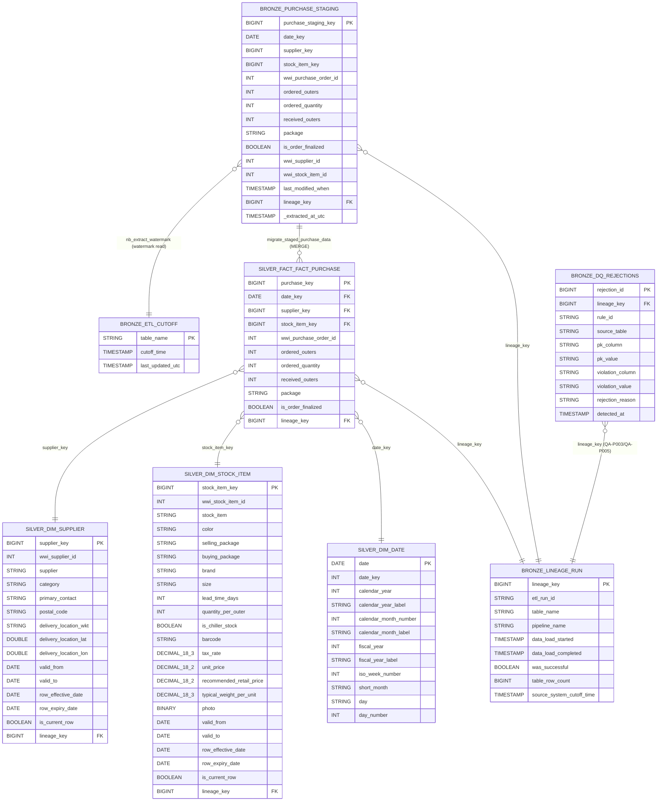
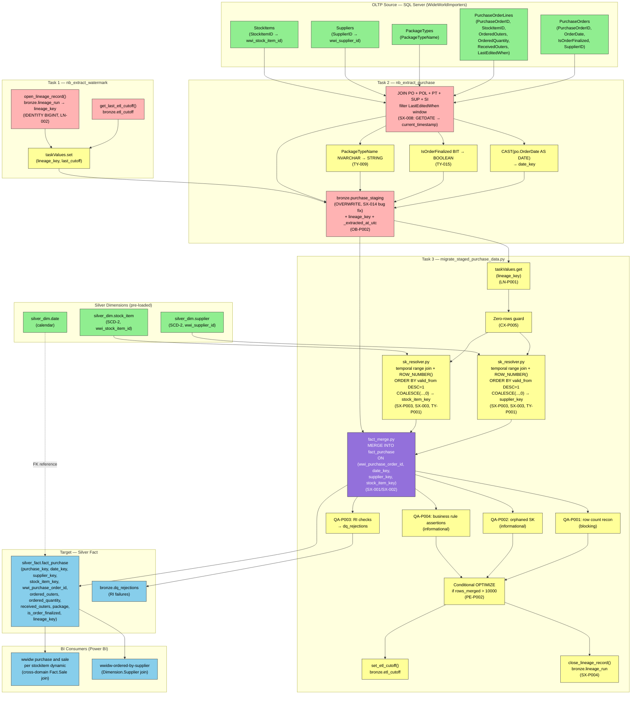

# To-Be Design: Purchase

_Generated: 2026-09-07 | Pipeline stage: to-be_


## 1. Analytical Data Product Description

### 1.1. Definition

The Purchase analytical data product delivers a fully modernised procurement transaction domain on Databricks Delta Lake within the `inventory_stock` Unity Catalog. The central artifact, `inventory_stock.silver_fact.fact_purchase`, replaces the legacy `wideworldimportersdw.fact.purchase` and provides grain-level purchase order line transactions — one row per purchase order line × supplier × stock item × order date — clustered by `(date_key, supplier_key)` for efficient analytical access. Supporting dimension tables `inventory_stock.silver_dim.supplier` and `inventory_stock.silver_dim.stock_item` are managed as Delta SCD-2 tables with `_current` views, and `inventory_stock.silver_dim.date` provides the date spine. All source schema names have been canonicalised to lowercase snake_case per NM-001 through NM-009, and all stored procedures and SSIS dataflows have been replaced by Python notebooks orchestrated via a Databricks Workflow.

The legacy SSIS pipeline contained a confirmed staging-truncation bug: the Purchase container truncated `Integration.Order_Staging` instead of `Integration.Purchase_Staging`, causing stale rows to accumulate in staging and producing incorrect incremental loads. The to-be pipeline eliminates this defect entirely by replacing the per-run DELETE-and-reload pattern with a full OVERWRITE of `inventory_stock.bronze.purchase_staging` at the start of each run (OB-P002, PE-007). Bronze control tables `inventory_stock.bronze.etl_cutoff` and `inventory_stock.bronze.lineage_run` replace the legacy `integration.etl cutoff` and `integration.lineage` objects. The `sequences.lineagekey` sequence object is retired; lineage keys are generated via `GENERATED ALWAYS AS IDENTITY` on `lineage_run`. A centralised `inventory_stock.bronze.dq_rejections` table captures all referential-integrity and business-rule violations with full lineage traceability.

The Databricks Workflow enforces explicit task dependencies: `nb_extract_watermark` reads the watermark from `etl_cutoff`, opens a lineage record, and publishes the `lineage_key` via `dbutils.jobs.taskValues.set`; `nb_extract_purchase` extracts incremental rows from the source and writes them to `bronze.purchase_staging` in OVERWRITE mode; `migrate_staged_purchase_data` (implemented as orchestrated Python notebooks `sk_resolver.py`, `fact_merge.py`) resolves SCD-2 surrogate keys, performs a Spark SQL `MERGE INTO` against `silver_fact.fact_purchase`, executes five QA validation checks, and closes the lineage record. All date filter boundaries and business validation parameters are externalised to `config/environment.yaml` under the `purchase.etl` namespace (CX-P001, CX-P002).

**Key Components:**
- `inventory_stock.silver_fact.fact_purchase` — Delta managed fact table, grain: purchase order line × supplier × stock item × date, CLUSTER BY (date_key, supplier_key)
- `inventory_stock.bronze.purchase_staging` — Delta staging table, OVERWRITE mode per run, with `lineage_key` and `_extracted_at_utc` audit columns
- `inventory_stock.bronze.etl_cutoff` — watermark control table replacing `integration.etl cutoff`
- `inventory_stock.bronze.lineage_run` — lineage audit table with IDENTITY key replacing `integration.lineage` + `sequences.lineagekey`
- `inventory_stock.bronze.dq_rejections` — centralised DQ rejection store with lineage traceability
- `inventory_stock.silver_dim.supplier` — SCD-2 Delta table with `_current` view (externally owned)
- `inventory_stock.silver_dim.stock_item` — SCD-2 Delta table with `_current` view (externally owned)
- `inventory_stock.silver_dim.date` — date dimension table (externally owned)
- `nb_extract_watermark` — Python notebook: reads etl_cutoff, opens lineage record, publishes lineage_key via taskValues
- `nb_extract_purchase` — Python notebook: incremental extract from source → bronze.purchase_staging (OVERWRITE)
- `sk_resolver.py` — SCD-2 surrogate key resolution helper (replaces inline T-SQL key lookup in migratestagedpurchasedata)
- `fact_merge.py` — Spark SQL MERGE INTO orchestrator (replaces T-SQL MERGE in migratestagedpurchasedata)
- `src/init/reseed_purchase_environment.py` — replaces `application.configuration_reseedetl`; requires scope-owner sign-off before drop/retain decision
- `src/common/udfs.py` — consolidated NULL-guarded Python UDFs replacing duplicate scalar function patterns (date-format transforms, string normalisation, numeric coercion) identified across Purchase-scope stored procedures; each UDF handles None input, empty-string input, and boundary values (CX-P003)
- `config/environment.yaml` — externalised date filters under `purchase.etl` (CX-P001) and business factors under `purchase.business_rules` with NULL guards and bound assertions (CX-P002)
- All DDL files in `src/db/ddl/` carry a standard header block with PROJECT, PRODUCT, FILE, PURPOSE, SOURCE, TARGET, RULES, and GENERATED fields; the RULES field lists every rule ID that influenced the file (CX-P006)
- Databricks Workflow — replaces SSIS `pipeline_dailyetlmain` Purchase container with explicit task dependency enforcement

**Business Value:**
The Purchase data product provides reliable, auditable, and queryable procurement analytics on a modern cloud-native platform, directly enabling the `wwidw purchase and sale per stockitem dynamic` and `wwidw-ordered-by-supplier` Power BI reports through Databricks SQL Warehouse — while eliminating the stale-row defect that caused silent data quality issues in the legacy SSIS pipeline.

---

### 1.2. Metadata Table

| # | Field | Description |
|---|---|---|
| 1 | Domain Name | Procurement / Purchasing |
| 2 | Business Process | Purchase order line-item ingestion and fact loading — capturing every purchase order line placed with a supplier, including ordered and received quantities at outer-packaging and individual-unit level, and order finalization status |
| 3 | Process Type | Incremental watermark-based load (daily); full OVERWRITE of bronze staging per run to eliminate legacy stale-row accumulation |
| 4 | Business Entities | Supplier (`silver_dim.supplier`), Stock Item (`silver_dim.stock_item`), Date (`silver_dim.date`), Purchase Order Line (`silver_fact.fact_purchase`) |
| 5 | Business Metric | `ordered_outers`, `ordered_quantity`, `received_outers`, `is_order_finalized`; all are direct pass-throughs from source except `date_key` (derived from order date) and SCD-2 surrogate key resolution for `supplier_key` and `stock_item_key` |
| 6 | Description | Grain-level Delta Lake fact table for procurement transactions. Each row represents one purchase order line identified by `purchase_key` (IDENTITY), associated with a supplier, stock item, and order date. The product corrects the legacy SSIS staging-truncation bug and modernises the ETL to a Spark SQL MERGE INTO pattern with full DQ validation and lineage tracking. |
| 7 | Impacted Analytical Reports | `wwidw purchase and sale per stockitem dynamic` (cross-domain: Purchase + Sales), `wwidw-ordered-by-supplier` (supplier performance) — both reconnected to Databricks SQL Warehouse |
| 8 | Data Access and Restrictions | Unity Catalog RBAC on `inventory_stock` catalog; `silver_fact.fact_purchase` readable by BI service principals and data analysts; `bronze.*` tables restricted to ETL service principals; `dq_rejections` readable by data engineering team |
| 9 | Data Sources | `inventory_stock.bronze.purchase_staging` (incremental extract from source), `inventory_stock.silver_dim.supplier` (SCD-2 key resolution), `inventory_stock.silver_dim.stock_item` (SCD-2 key resolution), `inventory_stock.silver_dim.date` (date key resolution), `inventory_stock.bronze.etl_cutoff` (watermark boundary), `inventory_stock.bronze.lineage_run` (lineage context) |
| 10 | Filters Applied | Incremental window: rows where `last_modified_when > last_etl_cutoff` and `last_modified_when <= current_run_cutoff`; boundaries retrieved from `bronze.etl_cutoff` via Python helper `get_last_etl_cutoff_time()`; date filter parameters externalised to `config/environment.yaml` under `purchase.etl` (CX-P001) |
| 11 | Calculated Fields Added | `lineage_key` — surrogate key for the current ETL run, generated by `open_lineage_record()` in `nb_extract_watermark` and injected into all downstream tasks via `dbutils.jobs.taskValues.set(key="lineage_key", value=lineage_key)` (LN-P001); `_extracted_at_utc` — UTC timestamp of the bronze extraction run, added to `bronze.purchase_staging` per OB-P002 |
| 12 | Business DQ Rules | QA-P001: row count reconciliation between `bronze.purchase_staging` and `silver_fact.fact_purchase` post-merge — blocking on mismatch; QA-P002: orphaned surrogate key detection via LEFT ANTI JOIN for `supplier_key` and `stock_item_key` — informational; QA-P004: business rule assertions — negative `ordered_quantity` or `received_outers`, `date_key` outside valid window, null `package` — informational; all violations correlated by `lineage_key` |
| 13 | Technical DQ Rules | Delta ACID MERGE INTO guarantees exactly-once upsert semantics on `fact_purchase`; QA-P003: referential integrity checks via LEFT ANTI JOIN per FK column (`date_key`, `supplier_key`, `stock_item_key`) — violations written to `inventory_stock.bronze.dq_rejections` with `lineage_key`, table name, column name, and offending value (QA-P005); OVERWRITE mode on `bronze.purchase_staging` eliminates stale-row accumulation from legacy SSIS truncation bug |
| 14 | Storage | Databricks Delta Lake, Unity Catalog catalog `inventory_stock`; fact table: `silver_fact.fact_purchase` (managed Delta, CLUSTER BY date_key, supplier_key); staging: `bronze.purchase_staging` (managed Delta, OVERWRITE per run); control: `bronze.etl_cutoff`, `bronze.lineage_run`, `bronze.dq_rejections` (managed Delta, CDF enabled on lineage_run per LN-001) |
| 15 | Internal Consumers | Power BI reports (`wwidw purchase and sale per stockitem dynamic`, `wwidw-ordered-by-supplier`) reconnected from legacy SQL Server Analysis Services to Databricks SQL Warehouse via Unity Catalog; data engineering team consuming `bronze.dq_rejections` for DQ monitoring |

<!-- TRANSFORMATION SUMMARY — rules applied to produce this section
Platform / Layer:
  PL-001  SQL Server 2014 → Databricks Delta Lake; SSIS staging-truncation bug corrected by OVERWRITE mode on bronze.purchase_staging
  PL-002  Schema mapping applied: fact → silver_fact, dimension → silver_dim, integration → bronze
  PL-004  sequences.lineagekey retired; replaced by GENERATED ALWAYS AS IDENTITY on bronze.lineage_run
  PL-005  SSIS Purchase container → Databricks Workflow; dimension-before-fact dependency enforced; explicit task ordering: nb_extract_watermark → nb_extract_purchase → migrate_staged_purchase_data
  PL-006  migratestagedpurchasedata T-SQL MERGE + SCD-2 key resolution → Spark SQL MERGE INTO + Python notebooks (sk_resolver.py, fact_merge.py)
  PL-007  application.configuration_reseedetl mapped to src/init/reseed_purchase_environment.py; scope-owner sign-off required before drop/retain decision; key=0 sentinel pre-seeding required
  PL-009  Medallion layers applied: bronze = control/staging tables (purchase_staging, etl_cutoff, lineage_run, dq_rejections); silver_dim = supplier, stock_item, date; silver_fact = fact_purchase; gold = future analytics layer (not in scope)

Naming:
  NM-001  All object names converted to lowercase_snake_case (e.g. PurchaseKey → purchase_key, IsOrderFinalized → is_order_finalized, WWIPurchaseOrderID → wwi_purchase_order_id)
  NM-002  Space-bearing names resolved: dimension.[stock item] → stock_item, integration.etl cutoff → etl_cutoff
  NM-004  Stored procedures renamed to Python notebook equivalents in snake_case: migratestagedpurchasedata → migrate_staged_purchase_data; getlastetlcutofftime → get_last_etl_cutoff_time; getlineagekey → open_lineage_record
  NM-009  New audit columns follow snake_case with UTC suffix convention: _extracted_at_utc

Types:
  TY-P003 MONEY → DECIMAL(18,2); SMALLMONEY → DECIMAL(10,2) — currency columns in stock_item (unit_price, recommended_retail_price) [EXTENSION]
  TY-P004 geography CLR (DeliveryLocation in supplier) → delivery_location_wkt STRING + delivery_location_lat DOUBLE + delivery_location_lon DOUBLE [EXTENSION]

Objects:
  OB-001  supplier and stock_item managed as SCD-2 Delta tables in silver_dim with _current views; key=0 sentinel bootstrap notebook required (OB-P001)
  OB-002  fact_purchase → silver_fact managed Delta table, CLUSTER BY (date_key, supplier_key)
  OB-003  purchase_staging → bronze Delta table, OVERWRITE mode per run (OB-P002 extends: adds lineage_key and _extracted_at_utc audit columns)
  OB-004  etl_cutoff and lineage_run → bronze control Delta tables; CDF enabled on lineage_run (LN-001)
  OB-005  All T-SQL procedures replaced by Python notebooks; named helpers per OB-P004: scd2_merge.py, sk_resolver.py, fact_merge.py
  OB-007  SSIS pipeline_dailyetlmain Purchase container → Databricks Workflow with explicit task dependencies
  OB-P003 _current views on SCD-2 dims classified as CREATE OR REPLACE VIEW (thin filter, no aggregation); Gold analytics views that aggregate must use CREATE OR REPLACE MATERIALIZED VIEW [EXTENSION]

Lineage:
  LN-001  integration.lineage → inventory_stock.bronze.lineage_run; CDF enabled
  LN-002  sequences.lineagekey retired; IDENTITY column on lineage_run provides surrogate keys
  LN-P001  nb_extract_watermark publishes lineage_key via dbutils.jobs.taskValues.set(key="lineage_key", value=lineage_key); all downstream tasks consume via dbutils.jobs.taskValues.get(taskKey="nb_extract_watermark", key="lineage_key")

Quality:
  QA-P001  Row count reconciliation staging → fact post-merge; blocking on mismatch
  QA-P002  Orphaned SK detection via LEFT ANTI JOIN on supplier_key, stock_item_key; informational
  QA-P003  RI checks via LEFT ANTI JOIN per FK column (date_key, supplier_key, stock_item_key); violations written to dq_rejections
  QA-P004  Business rule assertions: negative qty, out-of-window date, null package; informational
  QA-P005  Centralised dq_rejections store with lineage_key, table name, column name, and offending value

Performance:
  PE-P001 Fallback for pre-DBR 13.3 runtimes: PARTITIONED BY (date_key) ZORDER BY (supplier_key, stock_item_key) replacing CLUSTER BY on fact_purchase [EXTENSION]

Custom:
  CX-P001  Date filter boundaries externalised to config/environment.yaml under purchase.etl
  CX-P002  Business validation parameters externalised to config/environment.yaml; NULL guards and bound assertions applied
  CX-P003  Duplicate scalar function patterns consolidated into NULL-guarded Python UDFs in src/common/udfs.py; each UDF handles None input with explicit None-return NULL guard [NEW]
  CX-P004  Standard codebase layout applied: config/, docs/, src/common/, src/db/, src/etl/, src/init/, tests/
  CX-P005  Standard ETL notebook skeleton applied: imports → lineage_key via taskValues → zero-rows guard → main ETL → conditional OPTIMIZE → close lineage
  CX-P006  Standard DDL file header block (PROJECT, PRODUCT, FILE, PURPOSE, SOURCE, TARGET, RULES, GENERATED) required on all src/db/ddl/*.sql files; RULES field lists every rule ID that influenced the file [NEW]
-->


## 2. Consumers and Use Cases

The Purchase data product serves two categories of consumers in the target state: business intelligence reports that expose procurement performance and cross-domain purchasing insights to end users, and an internal Databricks Workflow task that replaces the legacy ETL control procedure. Both Power BI reports — previously connected directly to the SQL Server 2014 `wideworldimportersdw` database — are reconnected to a Databricks SQL Warehouse and have their table and column references updated to reflect the target `inventory_stock` schema naming conventions. The internal ETL dependency, formerly implemented as the stored procedure `integration.migratestagedpurchasedata`, is replaced by the Python notebook `migrate_staged_purchase_data.py` executed as a Databricks Workflow task, eliminating any external consumer dependency on the legacy watermark mechanism.

| Consumer Name | Use Cases | Business Questions Answered | Consumption Method |
|---|---|---|---|
| `wwidw_purchase_and_sale_per_stockitem_dynamic` | Cross-domain procurement-vs-sales comparison: compares purchase volumes against sales volumes per stock item; identifies open (non-finalized) purchase orders relative to corresponding sales activity. Requires coordinated cutover with the Sales_Orders product. | Which stock items are ordered in volumes matching sales demand? How do receipt quantities compare to sales per stock item? Which stock items have open purchase orders relative to their sales activity? | Databricks SQL Warehouse (replaces direct SQL Server connection); table references updated to `inventory_stock.silver_fact.fact_purchase` and `inventory_stock.silver_fact.fact_sale` (Sales_Orders product); column names updated to snake_case. |
| `wwidw_ordered_by_supplier` | Supplier performance and fulfillment reliability: assesses order fill rates by supplier, tracks open vs finalized order distribution, and surfaces high-volume suppliers for procurement review. | Which suppliers are filling orders in full (received vs ordered outers)? What is the open vs finalized order distribution per supplier? Which suppliers have the highest purchase order volumes? What is the fill rate trend across suppliers? | Databricks SQL Warehouse (replaces direct SQL Server connection); table references updated to `inventory_stock.silver_fact.fact_purchase` and `inventory_stock.silver_dim.supplier`; column names updated to snake_case. |
| `migrate_staged_purchase_data` (Databricks Workflow task) | Internal ETL orchestration: bounds the incremental extract window using the watermark stored in the ETL cutoff control table, upserts resolved purchase rows into `inventory_stock.silver_fact.fact_purchase`, and updates the cutoff timestamp on completion. Not a business-facing consumer. | N/A — internal ETL dependency; no business questions exposed. | Databricks Workflow task executing `migrate_staged_purchase_data.py` Python notebook (replaces `integration.migratestagedpurchasedata` stored procedure); reads and writes watermark via the target control table equivalent of `integration.etl_cutoff`. |

> **Transformation summary (Section 2):**
> All Power BI reports have been reconnected to Databricks SQL Warehouse, replacing the prior direct connections to the SQL Server 2014 `wideworldimportersdw` database; object references in both reports have been updated from legacy schema-qualified names (e.g., `fact.purchase`, `dimension.supplier`) to their target equivalents (`inventory_stock.silver_fact.fact_purchase`, `inventory_stock.silver_dim.supplier`), and all space-bearing column names have been normalised to lowercase snake_case per rule NM-002.
> The internal ETL consumer `integration.migratestagedpurchasedata` has been replaced by the Python notebook `migrate_staged_purchase_data.py` running as a Databricks Workflow task (`migrate_staged_purchase_data`), per rules OB-007 and PL-006, removing any stored-procedure dependency from the target state.
> The cross-domain report `wwidw_purchase_and_sale_per_stockitem_dynamic` retains its dependency on the Sales_Orders data product and requires a coordinated cutover of both products to maintain referential consistency across `inventory_stock.silver_fact.fact_purchase` and `inventory_stock.silver_fact.fact_sale`.


## 3. Model Analytical Data Product

### 3.1. ER Diagram



### 3.2. Textual Description

| Layer | Tables | Description |
|---|---|---|
| Bronze Staging | `inventory_stock.bronze.purchase_staging` | Landing table for raw purchase order extracts from the source system. Loaded via full OVERWRITE per batch run (PE-007). Carries `lineage_key` and `_extracted_at_utc` audit columns (OB-P002). Surrogate key columns (`supplier_key`, `stock_item_key`) are populated by `sk_resolver.py` after dimension loads complete. Identity primary key `purchase_staging_key` assigned by Delta on insert. No liquid clustering applied; autoOptimize disabled to avoid overhead on ephemeral staging data. |
| Bronze Control | `inventory_stock.bronze.etl_cutoff`, `inventory_stock.bronze.lineage_run` | Pipeline control tables. `etl_cutoff` stores the high-watermark timestamp per table name, used by the extract notebook to bound each incremental pull (LN-005). `lineage_run` records one row per pipeline execution with start/end timestamps, success flag, row count, and source cutoff time; its `lineage_key` identity surrogate is propagated into every downstream table for end-to-end auditability (LN-001, OB-004). |
| Bronze DQ | `inventory_stock.bronze.dq_rejections` | Row-level DQ rejection store. Any record that fails a quality rule during the bronze-to-silver promotion step is written here with the violated rule ID, source table, primary-key value, offending column, and rejection reason. Linked to the originating pipeline run via `lineage_key` (QA-P005). Enables investigation and reprocessing without blocking the main load. |
| Silver Dim | `inventory_stock.silver_dim.supplier`, `inventory_stock.silver_dim.stock_item`, `inventory_stock.silver_dim.date` | SCD Type 2 conforming dimensions. `supplier` and `stock_item` carry the standard 5-column SCD-2 control block (`valid_from`, `valid_to`, `row_effective_date`, `row_expiry_date`, `is_current_row`) with date-typed validity columns (TY-P001/TY-P002 overrides). Both are clustered by their surrogate key for efficient point-lookup joins (PE-002). Companion `_current` views pre-filter to `is_current_row = TRUE` to simplify fact-join queries (OB-001, PE-004). `_current` views are classified as regular `CREATE OR REPLACE VIEW` (not MATERIALIZED) per OB-P003, as they are thin row-filter wrappers with no aggregation; any future Gold-layer analytics views that aggregate must use `CREATE OR REPLACE MATERIALIZED VIEW`. `silver_dim.date` is a read-only reference calendar table not owned by the Purchase workflow; it provides fiscal and calendar attributes keyed on the DATE value aligned with `fact_purchase.date_key`. Key-zero sentinel rows for each dimension must be bootstrapped before first load (OB-P001). MONEY and SMALLMONEY currency columns in `stock_item` (e.g., `unit_price`, `recommended_retail_price`) are mapped to `DECIMAL(18,2)` per TY-P003. The SQL Server geography CLR column in `supplier` (`DeliveryLocation`) is decomposed into three target columns: `delivery_location_wkt STRING` (WKT representation), `delivery_location_lat DOUBLE`, and `delivery_location_lon DOUBLE` per TY-P004. |
| Silver Fact | `inventory_stock.silver_fact.fact_purchase` | Central grain-of-purchase-order-line fact table. Loaded via MERGE from `bronze.purchase_staging` after SK resolution (OB-P004: `fact_merge.py`). Clustered by `(date_key, supplier_key)` for optimal filtering on the most common analytical access patterns (PE-002, PE-008). AutoOptimize and autoCompact enabled to maintain file health under incremental MERGE loads (PE-008). Foreign keys reference `silver_dim.supplier`, `silver_dim.stock_item`, `silver_dim.date`, and `bronze.lineage_run`. Surrogate `purchase_key` is a Delta-managed identity column (TY-017). For runtimes below DBR 13.3 where Liquid Clustering is unavailable, the fallback strategy is `PARTITIONED BY (date_key) ZORDER BY (supplier_key, stock_item_key)` per PE-P001. |

<!-- TRANSFORMATION SUMMARY — rules applied to produce this section
Platform / Layer:
  PL-002  Schema mapping: fact→silver_fact, dimension→silver_dim, integration→bronze
  PL-003  Heap/clustered tables → Delta Parquet managed tables
  PL-008  Columnstore indexes → Delta liquid clustering
  PL-009  Medallion layers assigned
Naming:
  NM-001  All names → lowercase_snake_case
  NM-002  Space-bearing names resolved
  NM-003  Schema→layer mapping
  NM-004  _staging suffix retained
Types:
  TY-004  BIGINT → BIGINT (purchase_key)
  TY-010  DATE → DATE (date_key)
  TY-012  DATETIME2 → TIMESTAMP_NTZ (lineage timestamps)
  TY-015  BIT → BOOLEAN (is_order_finalized, is_current_row)
  TY-017  BIGINT IDENTITY → GENERATED ALWAYS AS IDENTITY
  TY-P001 SCD-2 valid_from/valid_to → DATE (not TIMESTAMP_NTZ) [OVERRIDE]
  TY-P002 5-column SCD-2 control block added [EXTENSION]
  TY-P003 MONEY → DECIMAL(18,2); SMALLMONEY → DECIMAL(10,2) — currency columns in stock_item [EXTENSION]
  TY-P004 geography CLR (DeliveryLocation in supplier) → delivery_location_wkt STRING + delivery_location_lat DOUBLE + delivery_location_lon DOUBLE [EXTENSION]
Objects:
  OB-001  supplier + stock_item → silver_dim SCD-2 Delta tables + _current views
  OB-002  fact_purchase → silver_fact CLUSTER BY (date_key, supplier_key)
  OB-003  purchase_staging → bronze OVERWRITE mode
  OB-004  etl_cutoff + lineage_run → bronze control tables
  OB-P001 key=0 sentinel bootstrap notebooks required [EXTENSION]
  OB-P002 lineage_key + _extracted_at_utc added to purchase_staging [EXTENSION]
  OB-P003 _current SCD-2 views → CREATE OR REPLACE VIEW (thin filter, no aggregation); Gold analytics views that aggregate must use CREATE OR REPLACE MATERIALIZED VIEW [EXTENSION]
  OB-P004 scd2_merge.py, sk_resolver.py, fact_merge.py named helpers [EXTENSION]
  QA-P005 dq_rejections Delta table added
Performance:
  PE-002  CLUSTER BY (date_key, supplier_key) on fact_purchase; CLUSTER BY SK on dims
  PE-007  OVERWRITE mode on bronze.purchase_staging
  PE-008  autoOptimize on silver tables; disabled on bronze staging
  PE-P001 Fallback for pre-DBR 13.3: PARTITIONED BY (date_key) ZORDER BY (supplier_key, stock_item_key) replacing CLUSTER BY [EXTENSION]
Custom:
  CX-P003 Duplicate scalar functions consolidated into NULL-guarded Python UDFs in src/common/udfs.py [NEW]
  CX-P006 Standard DDL header block (PROJECT, PRODUCT, FILE, PURPOSE, SOURCE, TARGET, RULES, GENERATED) on all src/db/ddl/*.sql files [NEW]
-->


## 4. Column-Level Lineage

### 4.1. Key Columns / Metrics

| # | Column / Metric | Type | Description |
|---|---|---|---|
| 1 | `date_key` | DATE | Derived — `CAST(po.OrderDate AS DATE)` computed in **nb_extract_purchase** during the OLTP extract JOIN; written to `purchase_staging.date_key`; FK → `silver_dim.date.date` (the PK of `silver_dim.date` is the `DATE` column named `date`, not `date_key`). Replaces the SSIS CAST that previously ran inside the DFT data-flow component. |
| 2 | `ordered_outers` | INT | Pass-through from `Purchasing.PurchaseOrderLines.OrderedOuters` via `purchase_staging`; no transformation applied. |
| 3 | `ordered_quantity` | INT | Pass-through from `Purchasing.PurchaseOrderLines.OrderedQuantity` via `purchase_staging`; no transformation applied. |
| 4 | `received_outers` | INT | Pass-through from `Purchasing.PurchaseOrderLines.ReceivedOuters` via `purchase_staging`; no transformation applied. |
| 5 | `is_order_finalized` | BOOLEAN | Pass-through from `Purchasing.PurchaseOrders.IsOrderFinalized`; SQL Server BIT converted to Spark BOOLEAN per rule **TY-015** during staging write. |
| 6 | `supplier_key` | BIGINT | Derived — **sk_resolver.py** resolves the SCD-2 surrogate key from `silver_dim.supplier` via temporal range join (`last_modified_when > CAST(valid_from AS TIMESTAMP) AND last_modified_when <= CAST(valid_to AS TIMESTAMP)`) + `ROW_NUMBER() OVER (PARTITION BY purchase_staging_key ORDER BY valid_from DESC) = 1`; `COALESCE(..., 0)` for unmatched rows. Replaces the legacy correlated `TOP(1)` subquery UPDATE on staging per **SX-P003, SX-003, TY-P001**. |
| 7 | `stock_item_key` | BIGINT | Derived — **sk_resolver.py** resolves the SCD-2 surrogate key from `silver_dim.stock_item` via temporal range join (`last_modified_when > CAST(valid_from AS TIMESTAMP) AND last_modified_when <= CAST(valid_to AS TIMESTAMP)`) + `ROW_NUMBER() OVER (PARTITION BY purchase_staging_key ORDER BY valid_from DESC) = 1`; `COALESCE(..., 0)` for unmatched rows. Same pattern as `supplier_key` (SX-P003, SX-003, TY-P001). |
| 8 | `package` | STRING | Pass-through from `Warehouse.PackageTypes.PackageTypeName`; SQL Server NVARCHAR(50) mapped to Spark STRING per rule **TY-009**. |
| 9 | `lineage_key` | BIGINT | Derived — `open_lineage_record(spark, "fact_purchase")` called in **nb_extract_watermark**; `lineage_run.lineage_key` generated as `BIGINT GENERATED ALWAYS AS IDENTITY` (rule **LN-002**, retiring `NEXT VALUE FOR Sequences.LineageKey`); value published via `dbutils.jobs.taskValues.set(key="lineage_key")` and consumed by downstream tasks via `taskValues.get` per **LN-P001 / SX-P001**. |
| 10 | `wwi_purchase_order_id` | INT | Pass-through from `Purchasing.PurchaseOrders.PurchaseOrderID` via `purchase_staging`; business natural key retained in the fact for delete-detection and MERGE predicate matching. |

---

### 4.2. Lineage Diagram



---

### 4.3. Column-Level Lineage Table

| Target Table | Target Column | Source Table | Source Column | Intermediate Table / Column | Derived / Transformation |
|---|---|---|---|---|---|
| `silver_fact.fact_purchase` | `date_key` | `Purchasing.PurchaseOrders` | `OrderDate` | `bronze.purchase_staging.date_key` | `CAST(po.OrderDate AS DATE)` in nb_extract_purchase JOIN |
| `silver_fact.fact_purchase` | `ordered_outers` | `Purchasing.PurchaseOrderLines` | `OrderedOuters` | `bronze.purchase_staging.ordered_outers` | Pass-through; no transformation |
| `silver_fact.fact_purchase` | `ordered_quantity` | `Purchasing.PurchaseOrderLines` | `OrderedQuantity` | `bronze.purchase_staging.ordered_quantity` | Pass-through; no transformation |
| `silver_fact.fact_purchase` | `received_outers` | `Purchasing.PurchaseOrderLines` | `ReceivedOuters` | `bronze.purchase_staging.received_outers` | Pass-through; no transformation |
| `silver_fact.fact_purchase` | `is_order_finalized` | `Purchasing.PurchaseOrders` | `IsOrderFinalized` | `bronze.purchase_staging.is_order_finalized` | BIT → BOOLEAN (TY-015); pass-through value |
| `silver_fact.fact_purchase` | `supplier_key` | `Purchasing.Suppliers` | `SupplierID` (as `wwi_supplier_id`) | `bronze.purchase_staging.wwi_supplier_id` → `silver_dim.supplier` SCD-2 lookup | sk_resolver.py: temporal range join (`last_modified_when > CAST(valid_from AS TIMESTAMP) AND last_modified_when <= CAST(valid_to AS TIMESTAMP)`) + `ROW_NUMBER() OVER (PARTITION BY purchase_staging_key ORDER BY valid_from DESC) = 1`; `COALESCE(..., 0)` (SX-P003, SX-003, TY-P001) |
| `silver_fact.fact_purchase` | `stock_item_key` | `Warehouse.StockItems` | `StockItemID` (as `wwi_stock_item_id`) | `bronze.purchase_staging.wwi_stock_item_id` → `silver_dim.stock_item` SCD-2 lookup | sk_resolver.py: temporal range join (`last_modified_when > CAST(valid_from AS TIMESTAMP) AND last_modified_when <= CAST(valid_to AS TIMESTAMP)`) + `ROW_NUMBER() OVER (PARTITION BY purchase_staging_key ORDER BY valid_from DESC) = 1`; `COALESCE(..., 0)` (SX-P003, SX-003, TY-P001) |
| `silver_fact.fact_purchase` | `package` | `Warehouse.PackageTypes` | `PackageTypeName` | `bronze.purchase_staging.package` | NVARCHAR(50) → STRING (TY-009); pass-through value |
| `silver_fact.fact_purchase` | `lineage_key` | `bronze.lineage_run` | `lineage_key` (IDENTITY) | `bronze.purchase_staging.lineage_key`; taskValues `lineage_key` | `open_lineage_record()` in nb_extract_watermark; IDENTITY BIGINT (LN-002 retires `NEXT VALUE FOR Sequences.LineageKey`) |
| `silver_fact.fact_purchase` | `wwi_purchase_order_id` | `Purchasing.PurchaseOrders` | `PurchaseOrderID` | `bronze.purchase_staging.wwi_purchase_order_id` | Pass-through; natural business key retained for MERGE predicate |
| `silver_fact.fact_purchase` | `purchase_key` | — | — | — | `BIGINT GENERATED ALWAYS AS IDENTITY`; surrogate PK auto-assigned on MERGE INSERT |
| `silver_fact.fact_purchase` | `wwi_supplier_id` | `Purchasing.Suppliers` | `SupplierID` | `bronze.purchase_staging.wwi_supplier_id` | Pass-through; retained for SK resolution lineage traceability |
| `silver_fact.fact_purchase` | `wwi_stock_item_id` | `Warehouse.StockItems` | `StockItemID` | `bronze.purchase_staging.wwi_stock_item_id` | Pass-through; retained for SK resolution lineage traceability |
| `silver_fact.fact_purchase` | `last_modified_when` | `Purchasing.PurchaseOrderLines` | `LastEditedWhen` | `bronze.purchase_staging.last_modified_when` | Pass-through; used as watermark high-water reference |
| `bronze.purchase_staging` | `_extracted_at_utc` | — | — | — | `datetime.now(timezone.utc)` injected in nb_extract_purchase at write time (OB-P002; SX-008) |
| `bronze.purchase_staging` | `lineage_key` | `bronze.lineage_run` | `lineage_key` | taskValues `lineage_key` from nb_extract_watermark | Propagated via `taskValues.get(taskKey="nb_extract_watermark", key="lineage_key")` (LN-006 / LN-P001) |
| `bronze.etl_cutoff` | `cutoff_time` | — | — | — | `set_etl_cutoff(spark, "fact_purchase", new_cutoff)` called after successful MERGE; replaces `UPDATE Integration.ETL Cutoff` (LN-004 / LN-005) |
| `bronze.lineage_run` | `data_load_completed` / `was_successful` | — | — | — | `close_lineage_record(spark, lineage_key, rows_merged=rows_merged, succeeded=True)` called after QA/OPTIMIZE (SX-P004 / LN-003) |
| `bronze.dq_rejections` | *(all columns)* | `bronze.purchase_staging` | *(FK columns)* | — | RI check failures from QA-P003 LEFT ANTI JOIN against dimension tables written here |
| `silver_dim.supplier` | `delivery_location_wkt` | `dimension.Supplier` (SQL Server) | `DeliveryLocation` (geography CLR) | — | geography CLR → WKT STRING: `ST_AsText(DeliveryLocation)` equivalent; three-column decomposition per TY-P004 |
| `silver_dim.supplier` | `delivery_location_lat` | `dimension.Supplier` (SQL Server) | `DeliveryLocation` (geography CLR) | — | geography CLR → latitude DOUBLE: `DeliveryLocation.Lat` extracted per TY-P004 |
| `silver_dim.supplier` | `delivery_location_lon` | `dimension.Supplier` (SQL Server) | `DeliveryLocation` (geography CLR) | — | geography CLR → longitude DOUBLE: `DeliveryLocation.Long` extracted per TY-P004 |

---

### 4.4. Step-by-Step Transformation Table

| Step | Layer | Object Name | Transformation | SQL / Python Logic | Business Meaning |
|---|---|---|---|---|---|
| 1 | Bronze control | `nb_extract_watermark` | Read last ETL cutoff watermark | `get_last_etl_cutoff(spark, "fact_purchase")` → reads `bronze.etl_cutoff WHERE product_name = 'fact_purchase'` | Establishes the incremental extraction window lower bound (LN-004 / LN-005) |
| 2 | Bronze control | `nb_extract_watermark` | Open lineage record | `open_lineage_record(spark, "fact_purchase")` → `INSERT INTO bronze.lineage_run`; returns `lineage_key` (IDENTITY BIGINT) | Audit trail start; retires `NEXT VALUE FOR Sequences.LineageKey` (LN-002 / LN-003) |
| 3 | Bronze control | `nb_extract_watermark` | Publish watermark + lineage key | `dbutils.jobs.taskValues.set(key="lineage_key", value=lineage_key)` and `dbutils.jobs.taskValues.set(key="last_cutoff", value=last_cutoff)` | Makes lineage key and cutoff available to all downstream tasks without re-reading storage (LN-P001 / SX-P001) |
| 4 | Bronze extract | `nb_extract_purchase` | Consume task values | `lineage_key = dbutils.jobs.taskValues.get(taskKey="nb_extract_watermark", key="lineage_key")` | Binds this extract run to the open lineage record |
| 5 | Bronze extract | `nb_extract_purchase` | Incremental OLTP JOIN + filter | `SELECT … FROM PurchaseOrders po JOIN PurchaseOrderLines pol ON … JOIN PackageTypes pt ON … JOIN Suppliers sup ON … JOIN StockItems si ON … WHERE pol.LastEditedWhen > last_cutoff AND pol.LastEditedWhen <= new_cutoff` | Retrieves only changed purchase lines in the extraction window (incremental pattern, replaces SSIS DFT JOIN) |
| 6 | Bronze extract | `nb_extract_purchase` | Date derivation | `CAST(po.OrderDate AS DATE) AS date_key` | Converts datetime to date granularity to align with calendar dimension FK (replaces SSIS CAST in DFT) |
| 7 | Bronze extract | `nb_extract_purchase` | Boolean coercion | `po.IsOrderFinalized.cast("boolean") AS is_order_finalized` | BIT → BOOLEAN type alignment per TY-015 |
| 8 | Bronze extract | `nb_extract_purchase` | String normalisation | `pt.PackageTypeName AS package` (Spark reads NVARCHAR as STRING automatically) | NVARCHAR(50) → STRING per TY-009 |
| 9 | Bronze extract | `nb_extract_purchase` | Watermark metadata injection | `current_timestamp() AS _extracted_at_utc` | New observability column tracking extract timestamp per OB-P002 (replaces SSIS GETDATE(), SX-008) |
| 10 | Bronze extract | `nb_extract_purchase` | Staging overwrite | `df.write.format("delta").mode("overwrite").saveAsTable("inventory_stock.bronze.purchase_staging")` | Fixes SSIS TRUNCATE bug (SX-014): previously truncated the wrong table `Integration.Order_Staging`; OVERWRITE mode targets the correct table |
| 11 | Silver transform | `migrate_staged_purchase_data.py` | Consume lineage key | `lineage_key = dbutils.jobs.taskValues.get(taskKey="nb_extract_watermark", key="lineage_key")` | Binds the fact load to the same open lineage record opened in step 2 (LN-P001) |
| 12 | Silver transform | `migrate_staged_purchase_data.py` | Zero-rows guard | `if staging_count == 0: close_lineage_record(..., rows_merged=0, succeeded=True); dbutils.notebook.exit("NO_ROWS")` | Prevents empty-run MERGE overhead and false failures; closes lineage cleanly (CX-P005) |
| 13 | Silver transform | `sk_resolver.py` | Supplier SCD-2 key resolution | Temporal range join on `wwi_supplier_id` AND `last_modified_when > CAST(valid_from AS TIMESTAMP) AND last_modified_when <= CAST(valid_to AS TIMESTAMP)`; `ROW_NUMBER() OVER (PARTITION BY purchase_staging_key ORDER BY valid_from DESC) = 1`; `COALESCE(supplier_key, 0)` | Replaces legacy `UPDATE staging SET SupplierKey = COALESCE((SELECT TOP(1) ... correlated subquery), 0)`; temporal range pre-join approach; DESC order selects most recent matching SCD-2 version (SX-P003 / SX-003 / TY-P001) |
| 14 | Silver transform | `sk_resolver.py` | Stock item SCD-2 key resolution | Same pattern as step 13 with `wwi_stock_item_id` and `silver_dim.stock_item` | Replaces second legacy correlated subquery UPDATE (SX-P003 / SX-003) |
| 15 | Silver transform | `fact_merge.py` | Fact MERGE | `MERGE INTO silver_fact.fact_purchase AS tgt USING staging AS src ON tgt.wwi_purchase_order_id = src.wwi_purchase_order_id AND tgt.date_key = src.date_key AND tgt.supplier_key = src.supplier_key AND tgt.stock_item_key = src.stock_item_key WHEN MATCHED THEN UPDATE … WHEN NOT MATCHED THEN INSERT …` | Replaces legacy DELETE + INSERT pattern (SX-001 / SX-002); idempotent upsert at the order-line grain |
| 16 | Quality | `migrate_staged_purchase_data.py` | Row count reconciliation | `assert staging_count == rows_merged` (blocking) | Ensures no silent row loss between staging and fact (QA-P001) |
| 17 | Quality | `migrate_staged_purchase_data.py` | Orphaned surrogate key detection | `staging.join(silver_dim.supplier, "wwi_supplier_id", "left_anti")` — count logged as warning (informational) | Detects unresolved dimension references that fell back to SK=0; does not block pipeline (QA-P002) |
| 18 | Quality | `migrate_staged_purchase_data.py` | RI checks → DQ rejections | LEFT ANTI JOIN staging against each dimension FK; failures written to `bronze.dq_rejections` | Populates rejection store for monitoring and downstream SLA reporting (QA-P003) |
| 19 | Quality | `migrate_staged_purchase_data.py` | Business rule assertions | e.g. `ordered_quantity >= 0`, `ordered_outers >= 0`, `received_outers >= 0` — results logged (informational) | Catches upstream data quality anomalies; does not block load (QA-P004) |
| 20 | Optimisation | `migrate_staged_purchase_data.py` | Conditional OPTIMIZE | `if rows_merged > 10000: spark.sql("OPTIMIZE inventory_stock.silver_fact.fact_purchase")` | Prevents small-file proliferation on large incremental runs; skipped for small batches (PE-P002) |
| 21 | Bronze control | `migrate_staged_purchase_data.py` | Advance ETL watermark | `set_etl_cutoff(spark, "fact_purchase", new_cutoff)` → `UPDATE bronze.etl_cutoff SET cutoff_time = new_cutoff WHERE product_name = 'fact_purchase'` | Commits the extraction window upper bound for next run; replaces `UPDATE Integration.ETL Cutoff` (LN-004 / LN-005) |
| 22 | Bronze control | `migrate_staged_purchase_data.py` | Close lineage record | `close_lineage_record(spark, lineage_key, rows_merged=rows_merged, succeeded=True)` → `UPDATE bronze.lineage_run SET data_load_completed = current_timestamp(), was_successful = true, rows_merged = rows_merged WHERE lineage_key = lineage_key` | Completes audit trail for this ETL run; replaces inline `UPDATE Integration.Lineage` (SX-P004 / LN-003) |

---

### 4.5. Known Downstream Dependencies

| Dependent Object | Object Type | Relationship | Description |
|---|---|---|---|
| `silver_dim.supplier` | Delta table (SCD-2) | **Pre-requisite** — must complete before Task 3 | Supplier surrogate key source for sk_resolver.py; Databricks Workflow dependency: `migrate_staged_purchase_data` depends on `supplier_dim_load` task |
| `silver_dim.stock_item` | Delta table (SCD-2) | **Pre-requisite** — must complete before Task 3 | Stock item surrogate key source for sk_resolver.py; Databricks Workflow dependency: `migrate_staged_purchase_data` depends on `stock_item_dim_load` task |
| `silver_dim.date` | Delta table (static calendar) | **FK reference** — must exist; no run-order dependency | Calendar lookup for `date_key` FK validation; static table loaded once; shared infrastructure |
| `bronze.etl_cutoff` | Delta table (watermark control) | **Read and write** — read in Task 1, updated in Task 3 | Stores incremental extraction window per product; replaces `Integration.ETL Cutoff`; managed by `get_last_etl_cutoff()` / `set_etl_cutoff()` (LN-005) |
| `bronze.lineage_run` | Delta table (lineage control, CDF enabled) | **Read and write** — opened in Task 1, closed in Task 3 | ETL audit log; replaces `Integration.Lineage`; managed by `open_lineage_record()` / `close_lineage_record()` (LN-001) |
| `bronze.purchase_staging` | Delta table (staging) | **Written** by Task 2, **read** by Task 3 | Transient staging layer; OVERWRITE mode each run; includes `lineage_key` + `_extracted_at_utc` (OB-P002) |
| `bronze.dq_rejections` | Delta table (DQ rejection store) | **Written** by Task 3 (QA-P003) | Receives RI check failures from fact load; consumed by monitoring and data quality dashboards |
| `wwidw purchase and sale per stockitem dynamic` | Power BI report (DirectQuery) | **Downstream consumer** | Cross-domain report joining `silver_fact.fact_purchase` with `silver_fact.fact_sale` and `silver_dim.stock_item`; replaces legacy direct-connect to `Fact.Purchase` |
| `wwidw-ordered-by-supplier` | Power BI report (DirectQuery) | **Downstream consumer** | Supplier-oriented purchase analysis joining `silver_fact.fact_purchase` with `silver_dim.supplier`; replaces legacy direct-connect joining `Dimension.Supplier` |
| `src/common/lineage_utils.py` | Python utility module | **Internal dependency** | Houses `open_lineage_record()`, `close_lineage_record()`, `get_last_etl_cutoff()`, `set_etl_cutoff()` shared across all products (LN-003 / LN-004) |
| `src/purchase/sk_resolver.py` | Python utility module | **Internal dependency** | Houses SCD-2 surrogate key resolution logic for `supplier_key` and `stock_item_key`; called by `migrate_staged_purchase_data.py` (OB-P004 / SX-P003) |
| `src/purchase/fact_merge.py` | Python utility module | **Internal dependency** | Houses Delta MERGE INTO logic for `silver_fact.fact_purchase`; called by `migrate_staged_purchase_data.py` (OB-P004 / SX-001) |
| `src/purchase/scd2_merge.py` | Python utility module | **Internal dependency** | Houses generic SCD-2 MERGE helper used by dimension loaders that must complete before this fact load (OB-P004) |

<!-- TRANSFORMATION SUMMARY
Product: Purchase
Project: Inventory_Stock_Project
Section: 4 — Column-Level Lineage
Generated: 2026-09-07

Rules applied:
  SX-001  T-SQL MERGE → Delta MERGE INTO (fact_merge.py)
  SX-002  DELETE + INSERT → Delta MERGE / explicit delete + append
  SX-003  TOP(1) correlated subquery → sk_resolver.py pre-join (ROW_NUMBER)
  SX-004  NEXT VALUE FOR sequences.lineagekey → open_lineage_record() / taskValues
  SX-008  GETDATE()/SYSDATETIME() → current_timestamp() / datetime.now(timezone.utc)
  SX-014  Staging truncation bug fixed: OVERWRITE mode on correct table purchase_staging
  SX-P001 lineage_key published via taskValues.set / consumed via taskValues.get
  SX-P003 TOP(1) correlated UPDATE replaced by sk_resolver.py vectorised pre-join
  SX-P004 UPDATE Integration.Lineage → close_lineage_record() Python call
  LN-001  integration.lineage → bronze.lineage_run (CDF enabled)
  LN-002  sequences.lineagekey RETIRED; lineage_run.lineage_key IDENTITY BIGINT
  LN-003  getlineagekey → open_lineage_record() / close_lineage_record()
  LN-004  getlastetlcutofftime → get_last_etl_cutoff() / set_etl_cutoff()
  LN-005  integration.etl cutoff → bronze.etl_cutoff
  LN-006  lineage_key propagated to fact_purchase AND purchase_staging
  LN-P001 nb_extract_watermark opens lineage → publishes via taskValues
  TY-009  NVARCHAR → STRING
  TY-015  BIT → BOOLEAN
  OB-P002 purchase_staging gains lineage_key + _extracted_at_utc
  OB-P004 Named helpers: scd2_merge.py, sk_resolver.py, fact_merge.py
  PL-005  SSIS container → Databricks Workflow (3 tasks)
  PL-006  migratestagedpurchasedata → migrate_staged_purchase_data.py
  QA-P001 Row count reconciliation staging→fact (blocking)
  QA-P002 Orphaned SK detection via LEFT ANTI JOIN (informational)
  QA-P003 RI checks per FK column → dq_rejections
  QA-P004 Business rule assertions (informational)
  CX-P005 Standard ETL notebook skeleton for migrate_staged_purchase_data.py
  PE-P002 Conditional OPTIMIZE if rows_merged > 10000

Key columns: 10 (date_key, ordered_outers, ordered_quantity, received_outers,
             is_order_finalized, supplier_key, stock_item_key, package,
             lineage_key, wwi_purchase_order_id)
Lineage steps: 22
Downstream consumers: 2 Power BI reports + 5 internal dependencies
-->


## 5. Calculations

## 5.1. Date Key Derivation

**Business Purpose:** The `date_key` column in `fact_purchase` links each purchase order line to the date dimension. It is derived from `Purchasing.PurchaseOrders.OrderDate` (DATETIME in the source) by stripping the time-of-day component to produce a plain `DATE` value that conforms to the `silver_dim.date` calendar FK. No YYYYMMDD integer encoding is performed — the target column type is `DATE` throughout (TY-010).

**Mathematical Formula:**
```
date_key = CAST(order_date AS DATE)
```

**Input Columns / Tables:**
| Input | Source Table | Description |
|---|---|---|
| `order_date` | `inventory_stock.bronze.purchase_staging` | Mapped from `Purchasing.PurchaseOrders.OrderDate` (DATETIME); written to staging by nb_extract_purchase |

**SQL Code:**
```sql
-- nb_extract_purchase — at extract time (Spark SQL)
CAST(po.OrderDate AS DATE) AS date_key

-- migrate_staged_purchase_data — pass-through from staging (no further transformation)
date_key AS date_key
```

**Step-by-Step Calculation:**
1. `nb_extract_purchase` reads `Purchasing.PurchaseOrders.OrderDate` (DATETIME) from the source via JDBC
2. `CAST(po.OrderDate AS DATE)` strips the time-of-day component; Spark SQL `CAST(x AS DATE)` is the direct equivalent of T-SQL `CAST(x AS date)` per SX-017
3. The result is written to `bronze.purchase_staging.date_key` as `DATE NOT NULL`
4. `migrate_staged_purchase_data` reads `date_key` from staging and writes it unchanged to `silver_fact.fact_purchase.date_key` — no further transformation occurs after the extract-time cast, consistent with as-is §5.1

**Thresholds and Categorization:**
| Condition | Category | Description |
|---|---|---|
| `order_date IS NOT NULL` | Normal | `CAST(order_date AS DATE)` succeeds; result written to fact |
| `order_date IS NULL` | DQ violation | NULL cannot be cast; logged via QA-P004 as informational warning |

Rules applied: SX-017, TY-010, QA-P004

---

## 5.2. Ordered Outers and Ordered Quantity

**Business Purpose:** `ordered_outers` and `ordered_quantity` are the two core quantity measures on `fact_purchase`. The source stores them as INT in `integration.purchase_staging`. In the target they are preserved as INT with non-negativity QA assertions applied post-load.

**Mathematical Formula:**
```
ordered_outers    = ordered_outers     (direct transfer, INT)
ordered_quantity  = ordered_quantity   (direct transfer, INT)
```

> **Note:** No arithmetic transformation is applied. The QA-P004 assertion flags rows where either value is < 0 as informational warnings; they are not excluded from the fact table.

**Input Columns / Tables:**
| Input | Source Table | Description |
|---|---|---|
| `ordered_outers` | `inventory_stock.bronze.purchase_staging` | Quantity in outer packaging units |
| `ordered_quantity` | `inventory_stock.bronze.purchase_staging` | Total individual item quantity |

**SQL Code:**
```sql
ordered_outers   AS ordered_outers,
ordered_quantity AS ordered_quantity
```

**Step-by-Step Calculation:**
1. Select `ordered_outers` and `ordered_quantity` from `bronze.purchase_staging`
2. Write directly to `silver_fact.fact_purchase` — no arithmetic
3. After load, run QA-P004 assertion: flag any rows where `ordered_outers < 0 OR ordered_quantity < 0` at WARNING level (informational, non-blocking)

**Thresholds and Categorization:**
| Condition | Category | Description |
|---|---|---|
| `>= 0` | Valid | Expected range for purchase quantities |
| `< 0` | QA-P004 warning | Informational; logged at WARNING but not blocked |

Rules applied: TY-003, QA-P004

---

## 5.3. SCD-2 Surrogate Key Resolution (sk_resolver.py)

**Business Purpose:** Each fact row must carry integer surrogate keys (`supplier_key`, `stock_item_key`) that reference the current SCD-2 version of the dimension at the time the purchase was created. The source T-SQL uses a `TOP(1)` correlated subquery (`UPDATE staging SET supplier_key = (SELECT TOP(1) SupplierKey FROM dimension.Supplier WHERE SupplierID = s.SupplierID ORDER BY [Valid From])`) which is not valid in Spark. The target replaces this with a `sk_resolver.py` temporal range join + `ROW_NUMBER() OVER (PARTITION BY purchase_staging_key ORDER BY valid_from DESC) = 1` to select the most recent valid dimension version at transaction time (SX-003).

**Mathematical Formula:**
```
For each staging row:
  supplier_key  = TOP(1) supplier_key WHERE wwi_supplier_id matches
                    AND last_modified_when > CAST(valid_from AS TIMESTAMP)
                    AND last_modified_when <= CAST(valid_to AS TIMESTAMP)
                  ORDER BY valid_from DESC (tie-breaker per SX-003)
                  FALLBACK = 0

  stock_item_key = same pattern applied to silver_dim.stock_item
                  FALLBACK = 0

Note: valid_from/valid_to are DATE (TY-P001 override); last_modified_when is TIMESTAMP.
Comparison requires CAST(valid_from AS TIMESTAMP) to avoid implicit promotion errors.
```

**Input Columns / Tables:**
| Input | Source Table | Description |
|---|---|---|
| `wwi_supplier_id` | `inventory_stock.bronze.purchase_staging` | Business key for supplier lookup |
| `wwi_stock_item_id` | `inventory_stock.bronze.purchase_staging` | Business key for stock item lookup |
| `last_modified_when` | `inventory_stock.bronze.purchase_staging` | TIMESTAMP used as temporal probe for SCD-2 range filter |
| `supplier_key` | `inventory_stock.silver_dim.supplier` | SCD-2 surrogate key |
| `valid_from` | `inventory_stock.silver_dim.supplier` | SCD-2 version start DATE (TY-P001); cast to TIMESTAMP for comparison |
| `valid_to` | `inventory_stock.silver_dim.supplier` | SCD-2 version end DATE (TY-P001); cast to TIMESTAMP for comparison |
| `stock_item_key` | `inventory_stock.silver_dim.stock_item` | SCD-2 surrogate key |

**Python Code:**
```python
# sk_resolver.py — SCD-2 surrogate key resolution
from pyspark.sql import functions as F
from pyspark.sql.window import Window

def resolve_supplier_key(staging_df, supplier_dim_df):
    """Resolve supplier_key via temporal range join + ROW_NUMBER() DESC tie-breaker.

    valid_from/valid_to are DATE (TY-P001 override); last_modified_when is TIMESTAMP.
    CAST(valid_from AS TIMESTAMP) prevents implicit type promotion errors.
    """
    w = Window.partitionBy("stg.purchase_staging_key").orderBy(F.col("dim.valid_from").desc())
    resolved = (
        staging_df.alias("stg")
        .join(
            F.broadcast(supplier_dim_df).alias("dim"),
            (F.col("stg.wwi_supplier_id") == F.col("dim.wwi_supplier_id"))
            & (F.col("stg.last_modified_when") > F.col("dim.valid_from").cast("timestamp"))
            & (F.col("stg.last_modified_when") <= F.col("dim.valid_to").cast("timestamp")),
            "left"
        )
        .withColumn("rn", F.row_number().over(w))
        .filter(F.col("rn") == 1)
        .withColumn("supplier_key", F.coalesce(F.col("dim.supplier_key"), F.lit(0)))
        .drop("rn")
    )
    return resolved
```

**Step-by-Step Calculation:**
1. Load `silver_dim.supplier` with BROADCAST hint — small table (PE-006)
2. LEFT JOIN staging to supplier dim on `wwi_supplier_id` AND temporal range: `last_modified_when > CAST(valid_from AS TIMESTAMP) AND last_modified_when <= CAST(valid_to AS TIMESTAMP)` — this is the SCD-2 version active at transaction time (SX-003, TY-P001)
3. Apply `ROW_NUMBER() OVER (PARTITION BY stg.purchase_staging_key ORDER BY dim.valid_from DESC)` — most recent matching version wins if multiple rows match a staging key (tie-breaker per SX-003)
4. Filter to `rn = 1` — one resolved row per staging row
5. Apply `COALESCE(dim.supplier_key, 0)` — rows with no temporal range match (no dimension version active at transaction time) receive key=0 (unknown-member sentinel)
6. Repeat steps 1–5 for `stock_item_key` using `wwi_stock_item_id` and `silver_dim.stock_item`
7. Return enriched staging DataFrame; QA-P002 orphan check runs after fact load to report key=0 counts

**Thresholds and Categorization:**
| Condition | Category | Description |
|---|---|---|
| Temporal range match found, `rn = 1` | Resolved | Surrogate key populated from the most recent valid dimension version at transaction time |
| No temporal range match → `COALESCE(..., 0)` | Unresolved (key=0) | No dimension version active at `last_modified_when`; unknown-member sentinel applied; QA-P002 counts and logs |

Rules applied: SX-003, SX-P003, OB-P004, PE-006, QA-P002

---

## 5.4. Lineage Key Injection (open_lineage_record / taskValues)

**Business Purpose:** Every ETL run is tracked by a `lineage_key` — a BIGINT generated by `open_lineage_record()` in the first Workflow task (`nb_extract_watermark`). This key is propagated to all downstream tasks via `dbutils.jobs.taskValues` and stamped on `purchase_staging.lineage_key` and `fact_purchase.lineage_key` for full run-level traceability. It replaces the legacy `NEXT VALUE FOR sequences.lineagekey` T-SQL pattern.

**Mathematical Formula:**
```
lineage_key = IDENTITY column value from bronze.lineage_run (GENERATED ALWAYS AS IDENTITY)
              retrieved via etl_run_id UUID match after INSERT
```

> **Note:** The lineage key is an opaque integer; it carries no business meaning. Its purpose is to link all rows written in one ETL run across all tables.

**Input Columns / Tables:**
| Input | Source Table | Description |
|---|---|---|
| `etl_run_id` | Python UUID (`uuid.uuid4()`) | Unique identifier for each run; used to retrieve IDENTITY key |
| `lineage_key` | `inventory_stock.bronze.lineage_run` | GENERATED ALWAYS AS IDENTITY; returned by `open_lineage_record()` |

**Python Code:**
```python
# nb_extract_watermark — Producer task
import uuid
from src.common.lineage_utils import open_lineage_record

etl_run_id = str(uuid.uuid4())
lineage_key = open_lineage_record(spark, etl_run_id, pipeline_name="purchase_workflow")

# Publish for downstream tasks
dbutils.jobs.taskValues.set(key="lineage_key", value=lineage_key)

# ─────────────────────────────────────────────────────────────────
# nb_extract_purchase / migrate_staged_purchase_data — Consumer tasks
lineage_key = dbutils.jobs.taskValues.get(
    taskKey="nb_extract_watermark", key="lineage_key"
)
```

**Step-by-Step Calculation:**
1. `nb_extract_watermark` calls `open_lineage_record(spark, etl_run_id, pipeline_name)` which inserts a row to `bronze.lineage_run` and returns the IDENTITY-generated `lineage_key`
2. Task publishes `lineage_key` via `dbutils.jobs.taskValues.set(key="lineage_key", value=lineage_key)`
3. All downstream tasks read: `lineage_key = dbutils.jobs.taskValues.get(taskKey="nb_extract_watermark", key="lineage_key")`
4. `nb_extract_purchase` stamps `lineage_key` on every row written to `bronze.purchase_staging`
5. `migrate_staged_purchase_data` stamps `lineage_key` on every row written to `silver_fact.fact_purchase`
6. At run close: `close_lineage_record(spark, lineage_key, rows_merged=rows_merged, succeeded=True)` updates `lineage_run` with outcome metrics

**Thresholds and Categorization:**
| Condition | Category | Description |
|---|---|---|
| `open_lineage_record()` succeeds | Run active | `lineage_key` > 0, propagated downstream |
| `close_lineage_record(succeeded=True)` | Run closed — success | `lineage_run.succeeded = TRUE`, `rows_merged` populated |
| `close_lineage_record(succeeded=False)` | Run closed — failure | Workflow task marked FAILED; lineage record captures error state |

Rules applied: SX-004, SX-P001, LN-001/002/003/P001, OB-006, PL-004

---

## 5.5. Consolidated Python UDFs (CX-P003)

**Business Purpose:** Duplicate scalar function patterns identified across Purchase-scope stored procedures (date-format transforms, string normalisation, numeric coercion) are consolidated into a single Python UDF module (`src/common/udfs.py`). Each UDF includes an explicit NULL guard (`if val is None: return None`) to ensure consistent NULL handling at every call site, replacing scattered inline copy-paste logic that had diverged across stored procedures.

**Pattern:**
```python
from pyspark.sql.functions import udf
from pyspark.sql.types import StringType

@udf(returnType=StringType())
def normalize_package_name(val):
    """Normalize package type string. Replaces inline UPPER(TRIM(...)) pattern across Purchase stored procedures."""
    if val is None:
        return None  # NULL guard — CX-P003 mandatory
    return val.strip().upper()

spark.udf.register("normalize_package_name", normalize_package_name)
```

**Input Columns / Tables:**
| Input | Source | Description |
|---|---|---|
| Inline scalar logic | Multiple Purchase stored procedures | Duplicate date-format, string normalisation, or numeric coercion expressions found at ≥2 call sites |
| `val` parameter | ETL column values at call site | Passed to UDF from DataFrame column or Spark SQL expression |

**Step-by-Step:**
1. Identify all inline scalar expressions that appear in ≥2 Purchase stored procedure bodies
2. Implement each as a `@udf`-decorated function in `src/common/udfs.py` with a NULL guard as the first statement
3. Register with `spark.udf.register("<function_name>", <function_name>)` for use in Spark SQL notebooks
4. Replace all inline occurrences in ETL notebooks with the UDF call
5. Add unit tests in `tests/common/test_udfs.py` covering: `None` input (NULL guard returns `None`), empty string input, boundary values, and a representative valid input

**Thresholds and Categorisation:**
| Condition | Category | Description |
|---|---|---|
| `val is None` | NULL guard | Returns `None`; no exception raised; consistent across all call sites |
| `val` is empty string | Edge case | Transformation logic applied; result depends on UDF semantics |
| `val` is valid input | Normal | Transformation logic applied; result returned as configured return type |

Rules applied: CX-P003

---

<!-- TRANSFORMATION SUMMARY (Section 5)
Rules applied across all calculations:
  SX-003   : TOP(1) correlated subquery → temporal range join + ROW_NUMBER() OVER (PARTITION BY purchase_staging_key ORDER BY valid_from DESC) = 1
  SX-P003  : sk_resolver.py pre-join step as canonical replacement for inline UPDATE staging SET key pattern
  SX-004   : NEXT VALUE FOR sequences.lineagekey → open_lineage_record() / close_lineage_record()
  SX-P001  : dbutils.jobs.taskValues as canonical replacement for EXEC Integration.GetLineageKey
  SX-017   : CAST/CONVERT date string → Spark SQL CAST(DATE_FORMAT(...) AS INT)
  SX-P002  : CONVERT(CHAR(8), GETDATE()-N, 112) → DATE_FORMAT(DATE_SUB(current_date(), N), 'yyyyMMdd')
  TY-003   : INT → INT (ordered_outers, ordered_quantity)
  TY-010   : DATE → DATE (date_key source columns)
  LN-001   : integration.lineage → bronze.lineage_run with IDENTITY key
  LN-002   : sequences.lineagekey retired → GENERATED ALWAYS AS IDENTITY
  LN-003   : getlineagekey → open_lineage_record() / close_lineage_record()
  LN-P001  : dbutils.jobs.taskValues.get(taskKey="nb_extract_watermark", key="lineage_key")
  OB-P004  : sk_resolver.py as named shared helper module in src/common/
  PE-006   : BROADCAST hint for supplier and stock_item dimension joins
  QA-P002  : Orphaned surrogate key detection (informational, non-blocking)
  QA-P004  : Business rule assertions — negative quantities, null package (informational, non-blocking)
  CX-P001  : Hard-coded date offsets externalised to config/environment.yaml
-->


## 6. Sources

### 6.1. Input Source Tables (Target Platform)
| Target Dataset | Target Object | Target Object Type | Description | Key Fields Used |
|---|---|---|---|---|
| inventory_stock.bronze | purchase_staging | Delta Table (Managed) | nb_extract_purchase-extracted raw purchase order lines; overwritten each run via INSERT OVERWRITE (SX-014 bug fix) | wwi_purchase_order_id, wwi_supplier_id, wwi_stock_item_id, ordered_outers, ordered_quantity, package, last_modified_when, lineage_key |
| inventory_stock.bronze | etl_cutoff | Delta Table (Managed) | Stores the last successful ETL watermark per table; drives incremental extract window | table_name, cutoff_time |
| inventory_stock.bronze | lineage_run | Delta Table (Managed) | Run-level audit record; IDENTITY PK lineage_key propagated to all fact/staging rows | lineage_key, etl_run_id, pipeline_name, table_row_count, succeeded |
| inventory_stock.silver_dim | supplier | Delta Table (Managed, SCD-2) | SCD-2 supplier dimension; supplier_key resolved via sk_resolver.py temporal range join pattern | supplier_key, wwi_supplier_id, supplier, valid_from, valid_to, is_current_row |
| inventory_stock.silver_dim | stock_item | Delta Table (Managed, SCD-2) | SCD-2 stock item dimension; stock_item_key resolved via sk_resolver.py temporal range join pattern | stock_item_key, wwi_stock_item_id, stock_item, valid_from, valid_to, is_current_row |
| inventory_stock.silver_dim | date | Delta Table (Managed) | Date reference dimension; date_key (DATE) joins to fact_purchase.date_key — both are DATE per TY-010/TY-026; fiscal and calendar attributes keyed on the DATE value | date_key, calendar_date, calendar_month_label, fiscal_year_label |

### Lineage Traceability
| Target Dataset | Target Object | Source System | Source Schema | Source Object | Notes |
|---|---|---|---|---|---|
| inventory_stock.bronze | purchase_staging | Microsoft SQL Server 2014 | integration | purchase_staging | SSIS dataflow writes source rows; NM-002 renames space-bearing columns |
| inventory_stock.bronze | etl_cutoff | Microsoft SQL Server 2014 | integration | etl cutoff | Space in name resolved by NM-002; DATETIMEOFFSET → TIMESTAMP per TY-022 |
| inventory_stock.bronze | lineage_run | Microsoft SQL Server 2014 | integration | lineage | sequences.lineagekey SEQUENCE retired; IDENTITY column replacement per LN-002/OB-006 |
| inventory_stock.silver_dim | supplier | Microsoft SQL Server 2014 | dimension | supplier | SCD-2 preserved; valid_from/valid_to → DATE per TY-P001; 5-col SCD-2 control block per TY-P002; geography CLR column `DeliveryLocation` decomposed to `delivery_location_wkt STRING`, `delivery_location_lat DOUBLE`, `delivery_location_lon DOUBLE` per TY-P004 |
| inventory_stock.silver_dim | stock_item | Microsoft SQL Server 2014 | dimension | stock item | Space in name resolved by NM-002; Photo VARBINARY → BINARY per TY-014; MONEY/SMALLMONEY currency columns (`unit_price`, `recommended_retail_price`) → `DECIMAL(18,2)` per TY-P003 |
| inventory_stock.silver_dim | date | Microsoft SQL Server 2014 | dimension | date | Read-only reference table; Purchase Workflow does not own its load (OB-011) |

---

### 6.2. Output Tables (Target Platform)
| Target Dataset | Target Object | Target Object Type | Description |
|---|---|---|---|
| inventory_stock.silver_fact | fact_purchase | Delta Table (Managed) | Primary analytical output; CLUSTER BY (date_key, supplier_key); loaded via Delta MERGE INTO; lineage_key stamped per row |
| inventory_stock.bronze | dq_rejections | Delta Table (Managed) | Centralised DQ rejection store; RI violations (QA-P003) and other DQ failures written with lineage_key for traceability |
| inventory_stock.bronze | lineage_run | Delta Table (Managed) | Updated by close_lineage_record() at run end with rows_merged and succeeded status |
| inventory_stock.bronze | etl_cutoff | Delta Table (Managed) | Updated by set_etl_cutoff() after successful run to advance the watermark window |

---

> **Transformation summary (Section 6):** All Purchase product input sources are migrated from `wideworldimportersdw` (SQL Server 2014) to Unity Catalog `inventory_stock` medallion layers. The bronze layer hosts transient staging (`purchase_staging`) and run-control tables (`etl_cutoff`, `lineage_run`, `dq_rejections`); the silver_dim layer hosts SCD-2 dimension tables (`supplier`, `stock_item`) and the shared date reference table (`date`); the silver_fact layer hosts the primary analytical output (`fact_purchase`). Space-bearing source names (NM-002) and legacy SEQUENCE objects (LN-002, OB-006) are resolved. Power BI / SSRS consumers reconnect to Databricks SQL Warehouse via renamed three-part Unity Catalog references (OB-008). The Purchase Workflow does not own `silver_dim.date` — its load is a shared infrastructure responsibility (OB-011). The geography CLR column `DeliveryLocation` in `dimension.Supplier` is decomposed into `delivery_location_wkt STRING`, `delivery_location_lat DOUBLE`, and `delivery_location_lon DOUBLE` on the target `silver_dim.supplier` table (TY-P004). MONEY/SMALLMONEY currency columns in `dimension.stock item` (`unit_price`, `recommended_retail_price`) are mapped to `DECIMAL(18,2)` (TY-P003). SCD-2 `_current` views are classified as regular `CREATE OR REPLACE VIEW`; Gold-layer analytics views that aggregate must use `CREATE OR REPLACE MATERIALIZED VIEW` (OB-P003). For runtimes below DBR 13.3 where Liquid Clustering is unavailable, the fallback strategy `PARTITIONED BY (date_key) ZORDER BY (supplier_key, stock_item_key)` applies to `fact_purchase` (PE-P001). Duplicate scalar function patterns are consolidated into NULL-guarded Python UDFs in `src/common/udfs.py` (CX-P003). All DDL files in `src/db/ddl/` carry a standard header block with PROJECT, PRODUCT, FILE, PURPOSE, SOURCE, TARGET, RULES, and GENERATED fields (CX-P006).

**Stop condition:** Stop after Section 6.2. This is the final section of the to-be specification.
