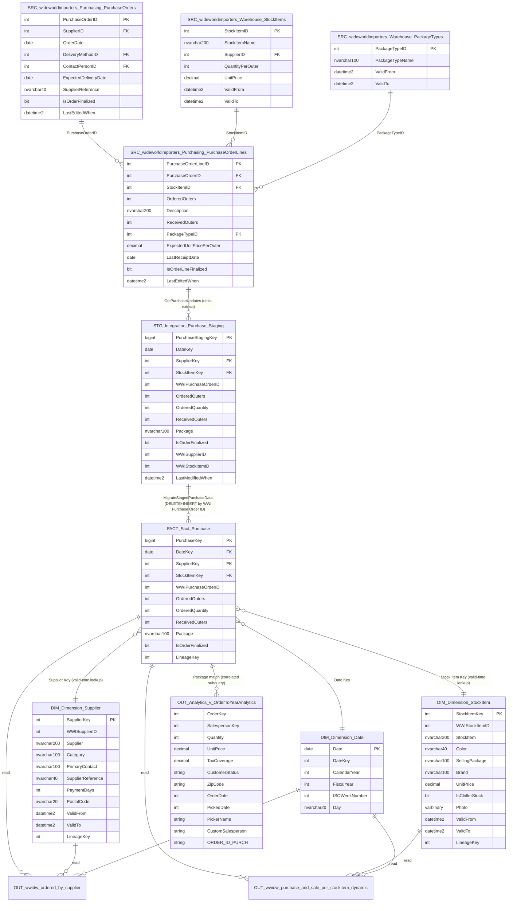
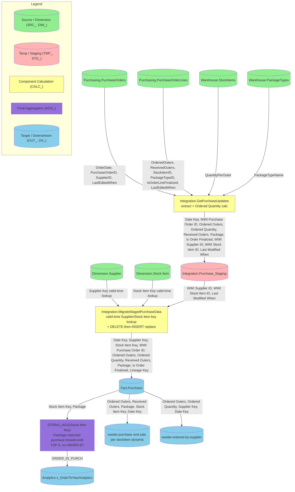

# As-Is Analysis — Purchases

## 1. Analytical Data Product Description
**Fragment target:** `.tmp/as-is/01_definition.md`
**Assembled into:** `current/as-is.md § 1. Definition`
**Purpose:** Establish the data product's identity, business purpose, and structured metadata in source-system terms. This is the primary input for all other as-is agents and the source for SDD boundary check at the SDM/SDD handoff.
**Written by:** `as-is-section-agent --section definition`
**Read by:** `as-is-section-agent --section consumers|model|lineage|calculations|sources`, `to-be-section-agent(01)`

---

### 1.1. Definition

The Purchases data product represents the supplier purchase order transaction fact (`wideworldimportersdw.fact.purchase`), capturing ordered versus received quantities by date, supplier, and stock item, sourced from the WideWorldImporters purchasing OLTP tables via an SSIS-orchestrated staging and load pipeline (`integration.getpurchaseupdates` → `integration.purchase_staging` → `integration.migratestagedpurchasedata`).

**Key Components:**

- Measures: `Ordered Outers`, `Ordered Quantity`, `Received Outers`
- Attributes: `Package`, `Is Order Finalized`
- Dimensions: Date (`dimension.date`), Supplier (`dimension.supplier`), Stock Item (`dimension.stock item`)
- Grain: one row per purchase order line as of the current load window (rows are deleted and re-inserted per `WWI Purchase Order ID` — not an append-only event log)

**Business Value:**

This data product supports monitoring of procurement/purchasing volume and fulfillment progress by comparing ordered quantities against received quantities per supplier and stock item, using dimension keys resolved through valid-time (SCD2-aware) lookups so historical reporting remains consistent with dimension versions at the time of the transaction. It also underpins two existing Sales_Orders-built analytical artifacts (`analytics.v_ordertoyearanalytics` and the "purchase and sale per stockitem dynamic" report) that already reference `fact.purchase` but currently run without this fact table present in the target lakehouse — closing that gap is a stated priority driver for this product (see `product-scope.md` §8).

---

### 1.2. Metadata Table

| # | Field | Description |
|---|---|---|
| 1 | Domain Name | Procurement / Supplier Purchase Order domain, within the WideWorldImporters data warehouse (`wideworldimportersdw`) |
| 2 | Business Process | Supplier purchase order fulfillment tracking — recording purchase order line activity (ordered vs. received quantities) as it is captured, staged, and conformed into the enterprise data warehouse |
| 3 | Process Type | [USER INPUT REQUIRED] |
| 4 | Business Entities | Purchase Order (`fact.purchase`), Supplier (`dimension.supplier`), Stock Item (`dimension.stock item`), Date (`dimension.date`) |
| 5 | Business Metric | `Ordered Outers`, `Ordered Quantity` (= `Ordered Outers` × `Quantity Per Outer`), `Received Outers`; qualifying attributes `Package`, `Is Order Finalized` |
| 6 | Description | Purchases is the supplier purchase order domain of the WideWorldImporters data warehouse: the `fact.purchase` fact table, the net-new `dimension.supplier` conformed dimension, and the SSIS-orchestrated integration staging layer that loads it. It reuses two conformed dimensions already migrated by Sales_Orders (`stock item`, `date`), and moves this domain from Microsoft SQL Server 2014 to the same Databricks Delta Lake lakehouse (`globalsales` catalog) established by Sales_Orders. |
| 7 | Impacted Analytical Reports | Downstream lineage traversal from `fact.purchase` (depth 3) returned no directly-linked reports — no purchase-exclusive BI reports exist in the lineage graph. Per `product-scope.md` §5/§9 (risk 4), two artifacts already built/deployed by Sales_Orders reference `fact.purchase` through indirect paths not captured as direct graph edges: (1) `analytics.v_ordertoyearanalytics` (deployed as `globalsales.mart.v_order_to_year_analytics`) — references `fact.purchase` via a `Package`-keyed subquery; (2) `wwidw purchase and sale per stockitem dynamic` (BI Report) — currently consumes migrated `fact.sale` and is expected to also consume `fact.purchase`. Both are owned by Sales_Orders and will need re-pointing/refresh once this product ships. |
| 8 | Data Access and Restrictions | [USER INPUT REQUIRED] |
| 9 | Data Sources | Primary: `wideworldimporters.purchasing.purchaseorders`, `wideworldimporters.purchasing.purchaseorderlines` (source OLTP, via `wideworldimporters.integration.getpurchaseupdates`). Staging: `wideworldimportersdw.integration.purchase_staging`. Reference: `wideworldimportersdw.dimension.supplier` (net new), `wideworldimportersdw.dimension.stock item` (reused), `wideworldimportersdw.dimension.date` (reused) |
| 10 | Filters Applied | 1. Incremental extraction — only purchase order lines whose most recent change timestamp (the later of the header's or line's "last edited when") falls after the prior ETL cutoff and up to the new ETL cutoff are extracted.<br>2. Inner-join completeness filter — only records with a matching purchase order header, line, stock item, and package type are extracted; unmatched records are excluded.<br>3. Reload/replace filter — for any purchase order appearing in the current staging batch, all existing fact rows for that `WWI Purchase Order ID` are deleted before the current staged rows are inserted (a delete-then-insert replace pattern, not a true incremental merge).<br>4. Dimension key validity window — Supplier and Stock Item surrogate keys are selected from the dimension version that was valid (per `Valid From`/`Valid To`) at the time of the record's last-modified timestamp; unresolved lookups fall back to the Unknown key (`0`). |
| 11 | Calculated Fields Added | 1. `Ordered Quantity` — computed during extraction as `Ordered Outers` × `Quantity Per Outer`; not present as-is in the OLTP source.<br>2. `Supplier Key` — surrogate key resolved from `dimension.supplier` via `WWI Supplier ID` plus a valid-time lookup, falling back to key `0` (Unknown) if unresolved.<br>3. `Stock Item Key` — surrogate key resolved from `dimension.stock item` via `WWI Stock Item ID` plus a valid-time lookup, falling back to key `0` (Unknown) if unresolved.<br>4. `Lineage Key` — administratively assigned value from the shared `sequences.lineagekey` infrastructure, tracking the ETL run/batch that loaded the row. |
| 12 | Business DQ Rules | [USER INPUT REQUIRED] |
| 13 | Technical DQ Rules | [USER INPUT REQUIRED] |
| 14 | Storage | Source: `wideworldimportersdw.fact.purchase` table, schema `fact`, on Microsoft SQL Server 2014. Target: Databricks Delta Lake, catalog `globalsales`, same lakehouse as Sales_Orders. |
| 15 | Internal Consumers | No exclusive internal consumers of `fact.purchase` were found via lineage traversal. Two shared dependents already owned/built by Sales_Orders reference this fact table (see Field 7): `analytics.v_ordertoyearanalytics` and `wwidw purchase and sale per stockitem dynamic`. |

---

**Stop condition:** Stop immediately after the metadata table (row 15). Do not generate Section 2 or any other content.

## 2. Consumers and Use Cases
**Fragment target:** `.tmp/as-is/02_consumers.md`
**Assembled into:** `current/as-is.md § 2. Consumers`
**Purpose:** Document who uses this data product, how they access it, and what business questions it answers, in source-system terms.
**Written by:** `as-is-section-agent --section consumers`
**Read by:** `to-be-section-agent(02)`

---

| Consumer Name | Use Cases | Business Questions Answered | Consumption Method |
|---|---|---|---|
| `wideworldimportersdw.analytics.v_ordertoyearanalytics` (deployed downstream as `globalsales.mart.v_order_to_year_analytics`; owned/built by Sales_Orders) | Year-over-year analytical rollup combining supplier purchase order data with sales order and sale transaction facts (joined to `dimension.customer`, `dimension.date`, `dimension.employee`) into a single cross-domain trend view | How do supplier purchase order volumes compare against sales orders and completed sales across years and reporting periods? | Direct query against analytical view — view definition reads `fact.purchase` directly (confirmed via `explore-neighbors`: READ edge from `v_ordertoyearanalytics` to `fact.purchase`, alongside READ edges to `fact.order`, `fact.sale`, `dimension.customer`, `dimension.date`, `dimension.employee`) |
| `wwidw purchase and sale per stockitem dynamic` (BI Report; owned/built by Sales_Orders) | Per-stock-item comparison of purchase order activity against sale activity, joined to `dimension.date` and `dimension.stock item` | For a given stock item, how much has been purchased from suppliers versus sold to customers, and how does that vary over time? | BI dashboard/report — direct read of `fact.purchase`, `fact.sale`, `dimension.date`, `dimension.stock item` (confirmed via `explore-neighbors`: READ edges from the report node to all four objects) |
| `wwidw-ordered-by-supplier` (BI Report — discovered via lineage graph traversal during this analysis; **not listed** in `product-scope.md` §5/§9 or in `01_definition.md` field 7/15) | Supplier-level purchase order reporting, joined to `dimension.date` and `dimension.supplier`; this report reads only `fact.purchase` (no `fact.sale` or `fact.order` join), making it the one purchase-exclusive consumer found in the lineage graph | What quantities/orders has each supplier been sent, and how has that varied by order date? | BI dashboard/report — direct read of `fact.purchase`, `dimension.date`, `dimension.supplier` (confirmed via `explore-neighbors`: READ edges from the report node to all three objects) |

---

**Stop condition:** Stop immediately after the consumers table. Do not generate Section 3 or any additional commentary.

## 3. Model Analytical Data Product
**Fragment target:** `.tmp/as-is/03_model.md`
**Assembled into:** `current/as-is.md § 3. Model`
**Purpose:** Document the data model — all tables, views, temporary objects, their columns, relationships, and architectural layering, in source-system terms.
**Written by:** `as-is-section-agent --section model`
**Read by:** `as-is-section-agent --section lineage|calculations`, `to-be-section-agent(03)`

---

### 3.1. ER Diagram



---

### 3.2. Textual Description

| Layer | Tables | Description |
|---|---|---|
| Primary Source | `wideworldimporters.Purchasing.PurchaseOrders`, `Purchasing.PurchaseOrderLines`, `Warehouse.StockItems`, `Warehouse.PackageTypes` | OLTP source tables in the `wideworldimporters` SQL Server 2014 database; `Integration.GetPurchaseUpdates` extracts purchase order header+line pairs delta-filtered on the later of `PurchaseOrders.LastEditedWhen` / `PurchaseOrderLines.LastEditedWhen` against a `@LastCutoff`/`@NewCutoff` watermark window, inner-joined to `Warehouse.StockItems` (for `QuantityPerOuter`, used to derive `Ordered Quantity`) and `Warehouse.PackageTypes` (for `PackageTypeName`) — unmatched rows are excluded (inner-join completeness filter) |
| Fact Tables | `Fact.Purchase` | 11 columns, IDENTITY `Purchase Key` + `Date Key` composite PK, FK constraints to `Dimension.Date`, `Dimension.Stock Item`, and `Dimension.Supplier`; supplier purchase order line grain (`Ordered Outers`, `Ordered Quantity`, `Received Outers`, `Package`, `Is Order Finalized`); loaded via a full DELETE-then-INSERT replace keyed on `WWI Purchase Order ID`, not an incremental MERGE |
| Dimension / Dictionary | `Dimension.Supplier` (net new), `Dimension.Stock Item` (reused, already migrated by Sales_Orders), `Dimension.Date` (reused, already migrated by Sales_Orders) | `Dimension.Supplier` and `Dimension.Stock Item` are SCD Type-2 dimensions with SEQUENCE-generated int surrogate keys (`Sequences.SupplierKey`, `Sequences.StockItemKey`) and `Valid From`/`Valid To` datetime2 columns; `Dimension.Date` is a static calendar table keyed on `Date`. `Dimension.Supplier` and `Dimension.Stock Item` are the only dimensions this fact joins to directly by FK — no FK edges were returned by the lineage graph for `Fact.Purchase`, so all dimension joins below were inferred from `MigrateStagedPurchaseData` source code (confirms product-scope.md §9 risk 3) |
| Processing | `Integration.Purchase_Staging`, `Integration.GetPurchaseUpdates`, `Integration.MigrateStagedPurchaseData`, `Integration.ETL Cutoff`, `Integration.Lineage`, `Sequences.LineageKey` | `Purchase_Staging` buffers inbound delta records with unresolved dimension IDs (`WWI Supplier ID`, `WWI Stock Item ID`) plus `Last Modified When`; `MigrateStagedPurchaseData` resolves `Supplier Key` and `Stock Item Key` via correlated `TOP(1)` subqueries matching `p.[Last Modified When] > Valid From AND <= Valid To` on the respective dimension (valid-time / temporal join pattern, same as the movement/stock-holding load procedures), falling back to key `0` (Unknown) when no valid-time window matches; assigns `Lineage Key` from `Integration.Lineage`; then deletes existing `Fact.Purchase` rows matching the staged `WWI Purchase Order ID` set and re-inserts from staging inside a single transaction; `Integration.ETL Cutoff` tracks the per-table watermark advanced after a successful run |
| Output | `Analytics.v_OrderToYearAnalytics`, `wwidw purchase and sale per stockitem dynamic` (report), `wwidw-ordered-by-supplier` (report) | No output view or report is owned/built by this product. All three are existing artifacts owned by Sales_Orders that read `Fact.Purchase` directly: `v_OrderToYearAnalytics` is built on `Fact.Order` and correlates to `Fact.Purchase` via a `Package`-name-matched `STRING_AGG` subquery (confirms product-scope.md §5/§9 risk 4); `wwidw purchase and sale per stockitem dynamic` reads `Fact.Purchase`, `Fact.Sale`, `Dimension.Stock Item`, and `Dimension.Date`; `wwidw-ordered-by-supplier` reads `Fact.Purchase`, `Dimension.Supplier`, and `Dimension.Date` — this third report was not listed in `product-scope.md` §5 and is a new consumer discovered via lineage exploration during this section; flag it for addition to product-scope.md §5/§9 |

---

**Stop condition:** Stop after the textual description (Section 3.2). Do not generate Section 4.

## 4. Column-Level Lineage
**Fragment target:** `.tmp/as-is/04_lineage.md`
**Assembled into:** `current/as-is.md § 4. Lineage`
**Purpose:** Document the complete data flow from source tables through transformations to output tables at column-level granularity, in source-system terms.
**Written by:** `as-is-section-agent --section lineage`
**Read by:** `as-is-section-agent --section calculations`, `to-be-section-agent(04)`

---

### 4.1. Key Columns / Metrics

| # | Column / Metric | Type | Description |
|---|---|---|---|
| 1 | `Date Key` | Pass-through | Cast of `Purchasing.PurchaseOrders.OrderDate` to `date` in `Integration.GetPurchaseUpdates`; arrives at `Fact.Purchase` pre-formed from staging (no dimension lookup performed in the load procedure — resolves `product-scope.md` §9 risk 3) |
| 2 | `Supplier Key` | Lookup | Surrogate key resolved in `Integration.MigrateStagedPurchaseData` via correlated `TOP(1)` subquery matching `WWI Supplier ID` against `Dimension.Supplier` valid-time window (`Valid From`/`Valid To`); falls back to `0` (Unknown) |
| 3 | `Stock Item Key` | Lookup | Surrogate key resolved the same way against `Dimension.Stock Item`'s valid-time window; falls back to `0` (Unknown) |
| 4 | `WWI Purchase Order ID` | Pass-through | `Purchasing.PurchaseOrders.PurchaseOrderID`, carried through staging unchanged; also the key used for the DELETE-then-INSERT replace pattern |
| 5 | `Ordered Outers` | Pass-through | `Purchasing.PurchaseOrderLines.OrderedOuters`, carried through staging unchanged |
| 6 | `Ordered Quantity` | Calculated | `Purchasing.PurchaseOrderLines.OrderedOuters × Warehouse.StockItems.QuantityPerOuter`, computed inside `Integration.GetPurchaseUpdates`'s extraction `SELECT` |
| 7 | `Received Outers` | Pass-through | `Purchasing.PurchaseOrderLines.ReceivedOuters`, carried through staging unchanged |
| 8 | `Package` | Lookup | `Warehouse.PackageTypes.PackageTypeName`, joined in during extraction via `Purchasing.PurchaseOrderLines.PackageTypeID` |
| 9 | `Is Order Finalized` | Pass-through | `Purchasing.PurchaseOrderLines.IsOrderLineFinalized`, carried through staging unchanged |
| 10 | `Lineage Key` | Derived | Administratively assigned from `Integration.Lineage` (`sequences.lineagekey`-backed) inside `Integration.MigrateStagedPurchaseData`; tracks the ETL batch that loaded the row |

*Column types: Calculated, Aggregated, Derived, Pass-through, Lookup*

---

### 4.2. Lineage Diagram



*Color coding: Green `#90EE90` = source tables; Red `#FFB3B3` = temp/CTE; Yellow `#FFFF99` = component calculations; Purple `#9370DB` = final aggregations; Blue `#87CEEB` = target tables. Every node requires a style declaration.*

---

### 4.3. Column-Level Lineage Table

| Target Table | Target Column | Source Table | Source Column | Intermediate Table / Column | Derived Metric |
|---|---|---|---|---|---|
| `Fact.Purchase` | `Date Key` | `Purchasing.PurchaseOrders` | `OrderDate` | `Integration.GetPurchaseUpdates` (CAST to date) → `Integration.Purchase_Staging.Date Key` | No |
| `Fact.Purchase` | `Supplier Key` | `Purchasing.PurchaseOrders` | `SupplierID` | `Purchase_Staging.WWI Supplier ID` → `MigrateStagedPurchaseData` valid-time lookup against `Dimension.Supplier` | No (lookup, not calculated) |
| `Fact.Purchase` | `Stock Item Key` | `Purchasing.PurchaseOrderLines` | `StockItemID` | `Purchase_Staging.WWI Stock Item ID` → `MigrateStagedPurchaseData` valid-time lookup against `Dimension.Stock Item` | No (lookup, not calculated) |
| `Fact.Purchase` | `WWI Purchase Order ID` | `Purchasing.PurchaseOrders` | `PurchaseOrderID` | `Purchase_Staging.WWI Purchase Order ID` | No |
| `Fact.Purchase` | `Ordered Outers` | `Purchasing.PurchaseOrderLines` | `OrderedOuters` | `Purchase_Staging.Ordered Outers` | No |
| `Fact.Purchase` | `Ordered Quantity` | `Purchasing.PurchaseOrderLines`, `Warehouse.StockItems` | `OrderedOuters`, `QuantityPerOuter` | `Integration.GetPurchaseUpdates` (`OrderedOuters * QuantityPerOuter`) → `Purchase_Staging.Ordered Quantity` | Yes — `Ordered Outers × Quantity Per Outer` |
| `Fact.Purchase` | `Received Outers` | `Purchasing.PurchaseOrderLines` | `ReceivedOuters` | `Purchase_Staging.Received Outers` | No |
| `Fact.Purchase` | `Package` | `Warehouse.PackageTypes` | `PackageTypeName` | `Integration.GetPurchaseUpdates` (join on `PackageTypeID`) → `Purchase_Staging.Package` | No |
| `Fact.Purchase` | `Is Order Finalized` | `Purchasing.PurchaseOrderLines` | `IsOrderLineFinalized` | `Purchase_Staging.Is Order Finalized` | No |
| `Fact.Purchase` | `Lineage Key` | `Integration.Lineage` | `Lineage Key` | `MigrateStagedPurchaseData` (`SELECT TOP(1) ... ORDER BY [Lineage Key] DESC`) | Yes — administrative batch-assignment, not business-calculated |
| `Analytics.v_OrderToYearAnalytics` | `ORDER_ID_PURCH` | `Fact.Purchase` | `Stock Item Key`, `Package` | Correlated subquery: `TOP 5` `Fact.Purchase` rows matching `fo.Package = p.Package` and `p.[Stock Item Key] < fo.[Stock Item Key]`, concatenated with `STRING_AGG(..., '\')` | Yes — package-matched "related purchases" breadcrumb list (non-deterministic; `Package` is not a unique/reliable join key — see step 7 note below) |
| `wwidw purchase and sale per stockitem dynamic` (report) | *(report-level, not column-resolvable)* | `Fact.Purchase`, `Fact.Sale`, `Dimension.Stock Item`, `Dimension.Date` | *(all Fact.Purchase measure columns)* | `[MCP UNAVAILABLE: get-source-code returned no source for report object f8751a7d/8db5c99c-class BI report artifacts]` | No |
| `wwidw-ordered-by-supplier` (report) | *(report-level, not column-resolvable)* | `Fact.Purchase`, `Dimension.Supplier`, `Dimension.Date` | *(all Fact.Purchase measure columns)* | `[MCP UNAVAILABLE: get-source-code returned no source for report object f8751a7d]` | No |

---

### 4.4. Step-by-Step Transformation Table

| Step | Layer | Object Name | Transformation | SQL Logic | Business Meaning |
|---|---|---|---|---|---|
| 1 | Primary Source | `Integration.GetPurchaseUpdates` | Delta extraction, join, calculation | `FROM Purchasing.PurchaseOrders po INNER JOIN Purchasing.PurchaseOrderLines pol ON po.PurchaseOrderID = pol.PurchaseOrderID INNER JOIN Warehouse.StockItems si ON pol.StockItemID = si.StockItemID INNER JOIN Warehouse.PackageTypes pt ON pol.PackageTypeID = pt.PackageTypeID WHERE CASE WHEN pol.LastEditedWhen > po.LastEditedWhen THEN pol.LastEditedWhen ELSE po.LastEditedWhen END > @LastCutoff AND ... <= @NewCutoff` | Pulls only purchase order header+line pairs changed since the last successful ETL run, enriches each line with its stock item's pack size (to compute `Ordered Quantity`) and its package type name; lines without a matching header, stock item, or package type are silently excluded (inner-join completeness filter) |
| 2 | Processing | `demo_ssis…pipeline_item_extract updated purchase data to staging` | Load (SSIS data flow) | `[MCP UNAVAILABLE: get-source-code returned no retrievable SQL for SSIS dataflow object 5b1ac205]` | Executes `GetPurchaseUpdates` with the current cutoff watermarks and writes the result set into `Integration.Purchase_Staging`, parameterized for the "purchase" table by the sibling `pipeline_item_set tablename to purchase` step |
| 3 | Processing | `Integration.MigrateStagedPurchaseData` (dimension key resolution) | Lookup (valid-time / temporal join) | `UPDATE p SET p.[Supplier Key] = COALESCE((SELECT TOP(1) s.[Supplier Key] FROM Dimension.Supplier s WHERE s.[WWI Supplier ID] = p.[WWI Supplier ID] AND p.[Last Modified When] > s.[Valid From] AND p.[Last Modified When] <= s.[Valid To] ORDER BY s.[Valid From]), 0), p.[Stock Item Key] = COALESCE(...similar against Dimension.[Stock Item]..., 0) FROM Integration.Purchase_Staging p` | Resolves each staged row's business-key supplier and stock item references to the surrogate dimension keys that were valid at the moment the source record was last modified (SCD Type-2 aware), so historical reporting stays consistent with dimension versions in effect at transaction time; unresolved matches silently fall back to the Unknown key (`0`) |
| 4 | Fact Table | `Integration.MigrateStagedPurchaseData` (delete phase) | Delete (replace pattern) | `DELETE p FROM Fact.Purchase p WHERE p.[WWI Purchase Order ID] IN (SELECT [WWI Purchase Order ID] FROM Integration.Purchase_Staging)` | Removes every existing fact row for any purchase order present in the current staging batch, ahead of reinserting its current state — this is a full replace-by-order-ID pattern, not an incremental MERGE (confirms `product-scope.md` §9 risk 1) |
| 5 | Fact Table | `Integration.MigrateStagedPurchaseData` (insert phase) | Insert | `INSERT Fact.Purchase ([Date Key], [Supplier Key], [Stock Item Key], [WWI Purchase Order ID], [Ordered Outers], [Ordered Quantity], [Received Outers], Package, [Is Order Finalized], [Lineage Key]) SELECT ... FROM Integration.Purchase_Staging` | Writes the fully key-resolved staging rows into `Fact.Purchase`, stamping every inserted row with the current ETL batch's `Lineage Key`; the DELETE (step 4) and this INSERT execute inside the same transaction (`BEGIN TRAN` / `COMMIT`), so the replace is atomic even though it is not a true MERGE |
| 6 | Processing | `Integration.MigrateStagedPurchaseData` (bookkeeping) | Administrative update | `UPDATE Integration.Lineage SET [Data Load Completed] = SYSDATETIME(), [Was Successful] = 1 WHERE [Lineage Key] = @LineageKey; UPDATE Integration.[ETL Cutoff] SET [Cutoff Time] = (SELECT [Source System Cutoff Time] FROM Integration.Lineage WHERE [Lineage Key] = @LineageKey) FROM Integration.[ETL Cutoff] WHERE [Table Name] = N'Purchase'` | Marks this ETL batch as successfully completed and advances the incremental-extraction watermark for the `Purchase` table so the next `GetPurchaseUpdates` run starts from where this one left off |
| 7 | Output | `Analytics.v_OrderToYearAnalytics` | Correlated aggregation | `(SELECT STRING_AGG(Order_Purch, '\') FROM (SELECT TOP 5 p.[Stock Item Key] Order_Purch FROM Fact.Purchase p WHERE fo.Package = p.Package) p WHERE p.Order_Purch < fo.[Stock Item Key]) AS ORDER_ID_PURCH` | For each sales order row, builds a backslash-delimited list of up to 5 `Fact.Purchase` stock-item keys sharing the same `Package` value with a lower key value — a "related purchases with the same packaging" breadcrumb attached to the order, used because there is no explicit purchase-order-to-sales-order key. Per `query-explainer-agent`: `Package` is not a unique identifier, so this association is fuzzy (fine for analytics, risky for audit-grade matching); the `TOP 5` has no `ORDER BY`, so results can be non-deterministic across runs |
| 8 | Output | `wwidw purchase and sale per stockitem dynamic` (report) | Direct read | `[MCP UNAVAILABLE: get-source-code returned no retrievable SQL/report definition for object 8db5c99c]` | Reads `Fact.Purchase` alongside `Fact.Sale`, `Dimension.Stock Item`, and `Dimension.Date` to present combined purchase-and-sale activity per stock item; owned by Sales_Orders (see `product-scope.md` §5/§9 risk 4) |
| 9 | Output | `wwidw-ordered-by-supplier` (report) | Direct read | `[MCP UNAVAILABLE: get-source-code returned no retrievable SQL/report definition for object f8751a7d]` | Reads `Fact.Purchase` alongside `Dimension.Supplier` and `Dimension.Date` to present purchase order activity grouped by supplier. This report was not listed in `product-scope.md` §5 — it was discovered via lineage traversal during `03_model.md` and confirmed again here; flag for addition to `product-scope.md` §5/§9 |

*Steps ordered chronologically by execution order. SQL Logic shows key clauses (WHERE, GROUP BY, CASE), not full statements.*

**Note on `product-scope.md` §9 risk 3:** `find-paths` and `get-source-code` confirm `Date Key` arrives at `Fact.Purchase` pre-resolved as a plain `CAST(po.OrderDate AS date)` performed inside `Integration.GetPurchaseUpdates` — no join or lookup against `Dimension.Date` occurs anywhere in the extraction or load path. `Dimension.Date` is a schema-level FK target for `Fact.Purchase.Date Key` (per `03_model.md` §3.1) but is not touched by any traced data-flow edge, so it is omitted from the Section 4.2 diagram's transformation flow.

**Note (out of scope, excluded from diagram):** `traverse-lineage` also surfaced `wideworldimportersdw.application.configuration_reseedetl` as a `MODIFY` edge into `Fact.Purchase`. Per `product-scope.md` §4, `application.configuration_*` procedures are project-level SQL Server administrative/reseed utilities, not product-specific ETL, and are excluded from this product's scope and lineage diagram.

---

### 4.5. Known Downstream Dependencies

| Dependent Object | Object Type | Relationship | Description |
|---|---|---|---|
| `Analytics.v_OrderToYearAnalytics` (deployed as `globalsales.mart.v_order_to_year_analytics`) | View | READ | Reads `Fact.Purchase.Stock Item Key` and `Package` via a correlated `STRING_AGG` subquery to populate its `ORDER_ID_PURCH` column; owned/built by Sales_Orders; needs re-point/refresh once `Fact.Purchase` lands in the target lakehouse (`product-scope.md` §9 risk 4) |
| `wwidw purchase and sale per stockitem dynamic` | BI Report | READ | Reads `Fact.Purchase` (pending target load) alongside already-migrated `Fact.Sale`, `Dimension.Stock Item`, `Dimension.Date`; owned by Sales_Orders; likely under-serves purchase-side data today (`product-scope.md` §5/§9 risk 4) |
| `wwidw-ordered-by-supplier` | BI Report | READ | Reads `Fact.Purchase`, `Dimension.Supplier`, `Dimension.Date`; newly discovered via lineage traversal (`traverse-lineage` from `Fact.Purchase`, confirmed in `03_model.md` §3.2 and again here) — not present in `product-scope.md` §5; flagged for addition there |

---

**Stop condition:** Stop after Section 4.5 (Known Downstream Dependencies). Do not generate Section 5.

## 5. Calculation Logic
**Fragment target:** `.tmp/as-is/05_calculations.md`
**Assembled into:** `current/as-is.md § 5. Calculations`
**Purpose:** Document every calculated metric in detail: business purpose, formula, input columns, SQL code, step-by-step walkthrough, and thresholds, in source-system terms.
**Written by:** `as-is-section-agent --section calculations`
**Read by:** `to-be-section-agent(05)`

---

### 5.1. Ordered Quantity

**Business Purpose:** Answers "how many individual units were ordered on a purchase order line, after converting from outer packs to base units?" — `Ordered Outers` alone cannot be compared or aggregated across stock items with different pack sizes, so this metric normalizes the order volume to a common base-unit measure for procurement volume reporting.

**Mathematical Formula:**
```
Ordered Quantity (units) = Ordered Outers (outer packs) × Quantity Per Outer (units per outer pack)
```

**Input Columns / Tables:**

| Input | Source Table | Description |
|---|---|---|
| `OrderedOuters` | `Purchasing.PurchaseOrderLines` | Number of outer packs ordered on the purchase order line |
| `QuantityPerOuter` | `Warehouse.StockItems` | Number of individual units contained in one outer pack, for the stock item on the line |

**SQL Code:**
```sql
CREATE PROCEDURE Integration.GetPurchaseUpdates
@LastCutoff datetime2(7),
@NewCutoff datetime2(7)
WITH EXECUTE AS OWNER
AS
BEGIN
    SET NOCOUNT ON;
    SET XACT_ABORT ON;


    SELECT CAST(po.OrderDate AS date) AS [Date Key],
           po.PurchaseOrderID AS [WWI Purchase Order ID],
           pol.OrderedOuters AS [Ordered Outers],
           pol.OrderedOuters * si.QuantityPerOuter AS [Ordered Quantity],
           pol.ReceivedOuters AS [Received Outers],
           pt.PackageTypeName AS Package,
           pol.IsOrderLineFinalized AS [Is Order Finalized],
           po.SupplierID AS [WWI Supplier ID],
           pol.StockItemID AS [WWI Stock Item ID],
           CASE WHEN pol.LastEditedWhen > po.LastEditedWhen THEN pol.LastEditedWhen ELSE po.LastEditedWhen END AS [Last Modified When]
    FROM Purchasing.PurchaseOrders AS po
    INNER JOIN Purchasing.PurchaseOrderLines AS pol
    ON po.PurchaseOrderID = pol.PurchaseOrderID
    INNER JOIN Warehouse.StockItems AS si
    ON pol.StockItemID = si.StockItemID
    INNER JOIN Warehouse.PackageTypes AS pt
    ON pol.PackageTypeID = pt.PackageTypeID
    WHERE CASE WHEN pol.LastEditedWhen > po.LastEditedWhen THEN pol.LastEditedWhen ELSE po.LastEditedWhen END > @LastCutoff
    AND CASE WHEN pol.LastEditedWhen > po.LastEditedWhen THEN pol.LastEditedWhen ELSE po.LastEditedWhen END <= @NewCutoff
    ORDER BY po.PurchaseOrderID;

    RETURN 0;
END;
```

**Step-by-Step Calculation:**
1. Take the number of outer packs ordered on the purchase order line (`Ordered Outers`, from `Purchasing.PurchaseOrderLines.OrderedOuters`).
2. Look up how many individual units are contained in one outer pack for that stock item (`Quantity Per Outer`, from `Warehouse.StockItems.QuantityPerOuter`, joined via `StockItemID`).
3. Multiply the two values to convert the order from outer packs to individual units, producing `Ordered Quantity`.
4. `Integration.GetPurchaseUpdates` returns the computed value in its result set for the current delta window; it is written into `Integration.Purchase_Staging.Ordered Quantity`.
5. `Integration.MigrateStagedPurchaseData` copies the value unchanged from staging into `Fact.Purchase.Ordered Quantity` during the INSERT phase.

**Thresholds and Categorization:**

| Condition | Category | Description |
|---|---|---|
| N/A | N/A | This metric does not use threshold-based categorization |

---

### 5.2. Supplier Key

**Business Purpose:** Ensures each purchase fact row is linked to the correct historical (Type-2, valid-time) version of the supplier dimension record as of when the purchase row was last modified, so historical procurement reporting reflects the supplier's category, contact, and payment-terms attributes as they were in effect at transaction time — rather than the supplier's current attributes.

**Mathematical Formula:**
```
Supplier Key = Dimension.Supplier.[Supplier Key]
               WHERE Dimension.Supplier.[WWI Supplier ID] = Purchase.[WWI Supplier ID]
               AND Purchase.[Last Modified When] > Dimension.Supplier.[Valid From]
               AND Purchase.[Last Modified When] <= Dimension.Supplier.[Valid To]
               (if multiple versions qualify, take the one with the earliest [Valid From])
               ELSE 0 (Unknown Supplier)
```

**Input Columns / Tables:**

| Input | Source Table | Description |
|---|---|---|
| `WWI Supplier ID` | `Integration.Purchase_Staging` (originally `Purchasing.PurchaseOrders.SupplierID`) | Source-system business key for the supplier on the purchase order |
| `Last Modified When` | `Integration.Purchase_Staging` | Later of the purchase order header's/line's last-edited timestamp; used as the as-of point for the valid-time lookup |
| `Supplier Key`, `Valid From`, `Valid To` | `Dimension.Supplier` | Surrogate key and SCD Type-2 validity window per supplier version |

**SQL Code:**
```sql
UPDATE p
    SET p.[Supplier Key] = COALESCE((SELECT TOP(1) s.[Supplier Key]
                                 FROM Dimension.Supplier AS s
                                 WHERE s.[WWI Supplier ID] = p.[WWI Supplier ID]
                                 AND p.[Last Modified When] > s.[Valid From]
                                 AND p.[Last Modified When] <= s.[Valid To]
								 ORDER BY s.[Valid From]), 0),
        p.[Stock Item Key] = COALESCE((SELECT TOP(1) si.[Stock Item Key]
                                       FROM Dimension.[Stock Item] AS si
                                       WHERE si.[WWI Stock Item ID] = p.[WWI Stock Item ID]
                                       AND p.[Last Modified When] > si.[Valid From]
                                       AND p.[Last Modified When] <= si.[Valid To]
									   ORDER BY si.[Valid From]), 0)
FROM Integration.Purchase_Staging AS p;
```
*(Verbatim from `Integration.MigrateStagedPurchaseData`. The `[Supplier Key]` SET clause is the logic for this metric; the statement is a single combined `UPDATE` that resolves `[Supplier Key]` and `[Stock Item Key]` together — see 5.3 for the companion metric.)*

**Step-by-Step Calculation:**
1. Take a purchase row from `Integration.Purchase_Staging`.
2. Look up rows in `Dimension.Supplier` where `WWI Supplier ID` equals the purchase row's `WWI Supplier ID`.
3. From those, keep only the dimension row whose validity window contains the purchase row's `Last Modified When` — strictly after `Valid From` and up to and including `Valid To`.
4. If more than one dimension version qualifies, pick the one with the earliest `Valid From`.
5. Write that row's `Supplier Key` back onto the staging row.
6. If no dimension row qualifies (unmatched ID or timestamp outside all validity windows), set `Supplier Key` to `0` (Unknown Supplier) via `COALESCE`.

**Thresholds and Categorization:**

| Condition | Category | Description |
|---|---|---|
| N/A | N/A | This metric does not use threshold-based categorization — its only non-lookup branch is the fallback to the Unknown sentinel key `0` when no valid-time match is found |

---

### 5.3. Stock Item Key

**Business Purpose:** Ensures each purchase fact row is linked to the correct historical (Type-2, valid-time) version of the stock item dimension record as of when the purchase row was last modified, so procurement reporting reflects the stock item's attributes (e.g., pack size, brand, unit price) as they were in effect at transaction time.

**Mathematical Formula:**
```
Stock Item Key = Dimension.[Stock Item].[Stock Item Key]
                  WHERE Dimension.[Stock Item].[WWI Stock Item ID] = Purchase.[WWI Stock Item ID]
                  AND Purchase.[Last Modified When] > Dimension.[Stock Item].[Valid From]
                  AND Purchase.[Last Modified When] <= Dimension.[Stock Item].[Valid To]
                  (if multiple versions qualify, take the one with the earliest [Valid From])
                  ELSE 0 (Unknown Stock Item)
```

**Input Columns / Tables:**

| Input | Source Table | Description |
|---|---|---|
| `WWI Stock Item ID` | `Integration.Purchase_Staging` (originally `Purchasing.PurchaseOrderLines.StockItemID`) | Source-system business key for the stock item on the purchase order line |
| `Last Modified When` | `Integration.Purchase_Staging` | Later of the purchase order header's/line's last-edited timestamp; used as the as-of point for the valid-time lookup |
| `Stock Item Key`, `Valid From`, `Valid To` | `Dimension.[Stock Item]` | Surrogate key and SCD Type-2 validity window per stock item version |

**SQL Code:**
```sql
UPDATE p
    SET p.[Supplier Key] = COALESCE((SELECT TOP(1) s.[Supplier Key]
                                 FROM Dimension.Supplier AS s
                                 WHERE s.[WWI Supplier ID] = p.[WWI Supplier ID]
                                 AND p.[Last Modified When] > s.[Valid From]
                                 AND p.[Last Modified When] <= s.[Valid To]
								 ORDER BY s.[Valid From]), 0),
        p.[Stock Item Key] = COALESCE((SELECT TOP(1) si.[Stock Item Key]
                                       FROM Dimension.[Stock Item] AS si
                                       WHERE si.[WWI Stock Item ID] = p.[WWI Stock Item ID]
                                       AND p.[Last Modified When] > si.[Valid From]
                                       AND p.[Last Modified When] <= si.[Valid To]
									   ORDER BY si.[Valid From]), 0)
FROM Integration.Purchase_Staging AS p;
```
*(Verbatim from `Integration.MigrateStagedPurchaseData`. The `[Stock Item Key]` SET clause is the logic for this metric; the statement is a single combined `UPDATE` that resolves `[Supplier Key]` and `[Stock Item Key]` together — see 5.2 for the companion metric.)*

**Step-by-Step Calculation:**
1. Take a purchase row from `Integration.Purchase_Staging`.
2. Look up rows in `Dimension.[Stock Item]` where `WWI Stock Item ID` equals the purchase row's `WWI Stock Item ID`.
3. From those, keep only the dimension row whose validity window contains the purchase row's `Last Modified When` — strictly after `Valid From` and up to and including `Valid To`.
4. If more than one dimension version qualifies, pick the one with the earliest `Valid From`.
5. Write that row's `Stock Item Key` back onto the staging row.
6. If no dimension row qualifies (unmatched ID or timestamp outside all validity windows), set `Stock Item Key` to `0` (Unknown Stock Item) via `COALESCE`.

**Thresholds and Categorization:**

| Condition | Category | Description |
|---|---|---|
| N/A | N/A | This metric does not use threshold-based categorization — its only non-lookup branch is the fallback to the Unknown sentinel key `0` when no valid-time match is found |

---

### 5.4. Lineage Key

**Business Purpose:** Serves as a load-batch identifier for auditing and traceability: it ties every row inserted into `Fact.Purchase` back to a specific ETL run's metadata in `Integration.Lineage` (start/completion time, success flag, and source-system cutoff time), supporting restartability and operational reporting of loads.

**Mathematical Formula:**
```
Lineage Key = [Lineage Key] of the most recent (highest-numbered) row in Integration.Lineage
              WHERE [Table Name] = 'Purchase'
              AND [Data Load Completed] IS NULL
              (i.e. the current still-open load batch for the Purchase dataset)
```

**Input Columns / Tables:**

| Input | Source Table | Description |
|---|---|---|
| `Lineage Key` | `Integration.Lineage` | Sequence-assigned identifier of a load batch (originates from `Sequences.LineageKey` administrative infrastructure) |
| `Table Name` | `Integration.Lineage` | Filters the lineage log to entries belonging to the `Purchase` dataset |
| `Data Load Completed` | `Integration.Lineage` | `NULL` marks a batch as still open/in-progress; used to select the current run |

**SQL Code:**
```sql
DECLARE @LineageKey int = (SELECT TOP(1) [Lineage Key]
                           FROM Integration.Lineage
                           WHERE [Table Name] = N'Purchase'
                           AND [Data Load Completed] IS NULL
                           ORDER BY [Lineage Key] DESC);

-- ... (dimension key resolution and DELETE+INSERT replace omitted here — see 5.2/5.3 and product-scope.md §9 risk 1)

    INSERT Fact.Purchase
        ([Date Key], [Supplier Key], [Stock Item Key], [WWI Purchase Order ID], [Ordered Outers], [Ordered Quantity],
         [Received Outers], Package, [Is Order Finalized], [Lineage Key])
    SELECT [Date Key], [Supplier Key], [Stock Item Key], [WWI Purchase Order ID], [Ordered Outers], [Ordered Quantity],
           [Received Outers], Package, [Is Order Finalized], @LineageKey
    FROM Integration.Purchase_Staging;

    UPDATE Integration.Lineage
        SET [Data Load Completed] = SYSDATETIME(),
            [Was Successful] = 1
    WHERE [Lineage Key] = @LineageKey;

    UPDATE Integration.[ETL Cutoff]
        SET [Cutoff Time] = (SELECT [Source System Cutoff Time]
                             FROM Integration.Lineage
                             WHERE [Lineage Key] = @LineageKey)
    FROM Integration.[ETL Cutoff]
    WHERE [Table Name] = N'Purchase';
```
*(Verbatim from `Integration.MigrateStagedPurchaseData`, showing the `@LineageKey` selection, its use in the `INSERT` column list, and the subsequent bookkeeping updates to `Integration.Lineage` and `Integration.[ETL Cutoff]`.)*

**Step-by-Step Calculation:**
1. Look in `Integration.Lineage` for entries where `Table Name = 'Purchase'` and `Data Load Completed IS NULL` (i.e., open/in-progress batches).
2. From those open entries, pick the one with the highest `Lineage Key` (the most recent).
3. Store that value in `@LineageKey` for the duration of this procedure run.
4. When inserting the resolved staging rows into `Fact.Purchase`, stamp every inserted row's `Lineage Key` column with `@LineageKey`.
5. After the insert completes, mark that `Integration.Lineage` entry as completed (`Data Load Completed = SYSDATETIME()`, `Was Successful = 1`).
6. Copy that lineage entry's `Source System Cutoff Time` into `Integration.[ETL Cutoff]` for `Table Name = 'Purchase'`, advancing the watermark for the next incremental run.

**Thresholds and Categorization:**

| Condition | Category | Description |
|---|---|---|
| N/A | N/A | This metric does not use threshold-based categorization |

---

*Repeat the above structure for each additional metric as Section 5.2, 5.3, etc.*

---

**Stop condition:** Stop after documenting all calculated metrics (all 5.N subsections). Do not generate Section 6.

## 6. Data Sources
**Fragment target:** `.tmp/as-is/06_sources.md`
**Assembled into:** `current/as-is.md § 6. Sources`
**Purpose:** Provide a complete inventory of input sources and output targets with platform, system, schema, object type, and key fields, in source-system terms.
**Written by:** `as-is-section-agent --section sources`
**Read by:** `to-be-section-agent(06)`

---

### 6.1. Input Source Tables

| Source Platform | Source System | Source Schema | Source Object | Source Object Type | Description | Key Fields Used |
|---|---|---|---|---|---|---|
| Microsoft SQL Server 2014 | WideWorldImporters (OLTP) | Purchasing | PurchaseOrders | Table | Purchase order header — one row per supplier purchase order; source of order date and supplier reference | `PurchaseOrderID`, `SupplierID`, `OrderDate`, `LastEditedWhen` |
| Microsoft SQL Server 2014 | WideWorldImporters (OLTP) | Purchasing | PurchaseOrderLines | Table | Purchase order line detail — one row per ordered/received stock item line within a purchase order | `PurchaseOrderID`, `StockItemID`, `PackageTypeID`, `OrderedOuters`, `ReceivedOuters`, `IsOrderLineFinalized`, `LastEditedWhen` |
| Microsoft SQL Server 2014 | WideWorldImporters (OLTP) | Warehouse | StockItems | Table | Stock item master, joined to derive the outer-to-unit conversion factor used to compute Ordered Quantity | `StockItemID`, `QuantityPerOuter` |
| Microsoft SQL Server 2014 | WideWorldImporters (OLTP) | Warehouse | PackageTypes | Table | Package type lookup, joined to resolve the human-readable package name carried onto the fact/staging row | `PackageTypeID`, `PackageTypeName` |
| Microsoft SQL Server 2014 | WideWorldImporters (OLTP) | Integration | GetPurchaseUpdates | Stored Procedure | Source-side incremental change-capture extractor. Joins PurchaseOrders, PurchaseOrderLines, StockItems, and PackageTypes; computes `Ordered Quantity` (`OrderedOuters × QuantityPerOuter`) and `Last Modified When` (greater of header/line `LastEditedWhen`); filters to rows whose `Last Modified When` falls between the prior and new ETL cutoff. Called by the SSIS dataflow `pipeline_item_extract updated purchase data to staging` to populate `Integration.Purchase_Staging` | `[Date Key]`, `[WWI Purchase Order ID]`, `[Ordered Outers]`, `[Ordered Quantity]`, `[Received Outers]`, `Package`, `[Is Order Finalized]`, `[WWI Supplier ID]`, `[WWI Stock Item ID]`, `[Last Modified When]` |
| Microsoft SQL Server 2014 | WideWorldImportersDW | Integration | Purchase_Staging | Table | Landing table for extracted purchase order changes; truncated and reloaded each ETL cycle by the SSIS pipeline, then read (and dimension-key-enriched in place) by `MigrateStagedPurchaseData` before the delete+insert into `Fact.Purchase` | `[Date Key]`, `[WWI Purchase Order ID]`, `[WWI Supplier ID]`, `[WWI Stock Item ID]`, `[Ordered Outers]`, `[Ordered Quantity]`, `[Received Outers]`, `Package`, `[Is Order Finalized]`, `[Last Modified When]` |
| Microsoft SQL Server 2014 | WideWorldImportersDW | Dimension | Supplier | Table (reference/lookup — net new, migrated by this product) | Conformed, valid-time (SCD2) supplier dimension. `MigrateStagedPurchaseData` resolves `[Supplier Key]` by matching `[WWI Supplier ID]` and validating the staged row's `[Last Modified When]` falls within `[Valid From]`/`[Valid To]`; unresolved matches fall back to key `0` | `[Supplier Key]`, `[WWI Supplier ID]`, `[Valid From]`, `[Valid To]` |
| Microsoft SQL Server 2014 | WideWorldImportersDW | Dimension | Stock Item | Table (reference/lookup — reused, already migrated by Sales_Orders) | Conformed, valid-time (SCD2) stock item dimension. `MigrateStagedPurchaseData` resolves `[Stock Item Key]` by matching `[WWI Stock Item ID]` and validating the staged row's `[Last Modified When]` falls within `[Valid From]`/`[Valid To]`; unresolved matches fall back to key `0` | `[Stock Item Key]`, `[WWI Stock Item ID]`, `[Valid From]`, `[Valid To]` |
| Microsoft SQL Server 2014 | WideWorldImportersDW | Dimension | Date | Table (reference/lookup — reused, already migrated by Sales_Orders) | Conformed date dimension. **Confirmed at as-is (resolves product-scope §9 risk 3):** `[Date Key]` is derived directly in the source extractor as `CAST(po.OrderDate AS date)` and carried through staging into `Fact.Purchase` unchanged — `MigrateStagedPurchaseData` performs no lookup against this dimension at load time. `Dimension.Date` is joined only as a declarative FK target (`Fact.Purchase.[Date Key] → Dimension.Date.Date`) for downstream reporting, not as an active load-time lookup | `Date` (join key; matches the pre-resolved `[Date Key]` value) |

---

### 6.2. Output Tables

| Target System | Target Object | Target Object Type | Description |
|---|---|---|---|
| WideWorldImportersDW | Fact.Purchase | Table | Primary output. Supplier purchase order transaction fact — one row per purchase order line as of the current load window. Loaded by `Integration.MigrateStagedPurchaseData` via a delete-then-insert pattern keyed on `[WWI Purchase Order ID]` (not a true incremental merge — see product-scope.md §9 risk 1); carries the dimension-resolved `[Supplier Key]` and `[Stock Item Key]`, the pre-resolved `[Date Key]`, and an administratively assigned `[Lineage Key]` |
| WideWorldImportersDW | Integration.Purchase_Staging | Table | Persistent intermediate. Receives extracted/incremental purchase data from `GetPurchaseUpdates` via the SSIS pipeline (`pipeline_item_truncate purchase_staging` → `pipeline_item_extract updated purchase data to staging`); subsequently updated in place by `MigrateStagedPurchaseData` to inject resolved `[Supplier Key]`/`[Stock Item Key]` values before being read as the insert source for `Fact.Purchase`. Truncated and repopulated each ETL cycle rather than accumulating history |

**Note:** `Integration.Lineage` and `Integration.[ETL Cutoff]` are also written by `MigrateStagedPurchaseData` (batch/lineage bookkeeping and cutoff-time advancement) but are shared ETL-infrastructure control tables at the project level, not product-owned analytical outputs — excluded from this table per product-scope.md §3.4/§9 risk 2 framing.

---

**Stop condition:** Stop after Section 6.2. This is the final section of the as-is specification.
