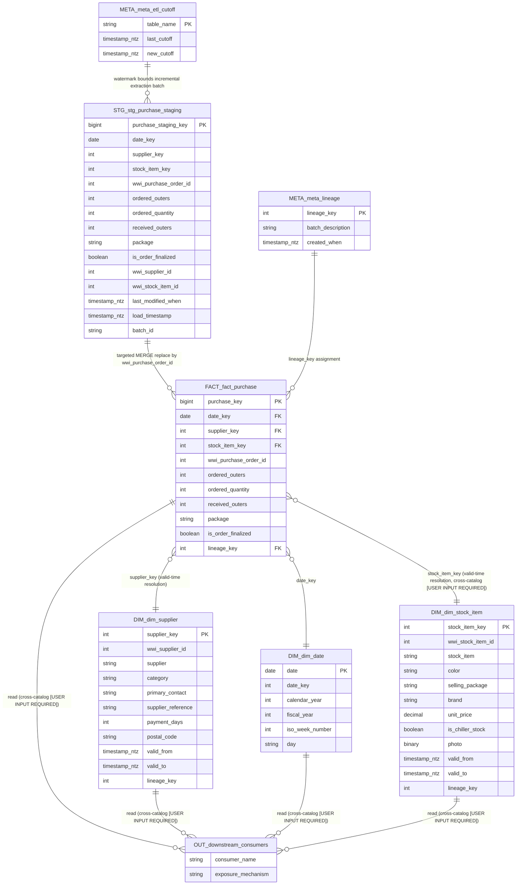

# To-Be Design: Purchases

_Generated: 2026-09-21 | Pipeline stage: to-be_


## 1. Analytical Data Product Description (Target)

**Fragment target:** `.tmp/to-be/01_definition.md`
**Assembled into:** `current/to-be.md § 1. Definition`
**Purpose:** Define what the data product is in target-system terms. This is the primary handoff document to SDD. Zero source-system references — all 15 metadata fields use target conventions.
**Written by:** `to-be-section-agent(01)`
**Read by:** `to-be-section-agent(03)`, `to-be-section-agent(04)`, `to-be-section-agent(05)`, `catalog-agent`, `definition-agent`

> **SDD handoff:** This fragment is assembled into `current/to-be.md § 1. Definition`, which is the primary entry point for SDD (extracted by H2 title via the Section Extraction Contract in `02-skills/00-conventions.md`). It must contain zero legacy references.

---

### 1.1. Definition

The Purchases data product represents the supplier purchase order transaction fact (`purchasing.fact.purchase`), capturing ordered versus received quantities by date, supplier, and stock item, sourced via a Databricks-native Bronze-to-Silver notebook and Workflow pipeline (`purchasing.stg.purchase_staging` extraction task → dimension key resolution → scoped Delta MERGE) running under the standalone Unity Catalog `purchasing`.

**Key Components:**

- Measures: `ordered_outers`, `ordered_quantity`, `received_outers`
- Attributes: `package`, `is_order_finalized`
- Dimensions: Date (`purchasing.dim.date`), Supplier (`purchasing.dim.supplier`), Stock Item (`purchasing.dim.stock_item`)
- Grain: one row per purchase order line as of the current load window (rows are replaced via a scoped Delta MERGE keyed on `wwi_purchase_order_id` — not an append-only event log)

**Business Value:**

This data product supports monitoring of procurement/purchasing volume and fulfillment progress by comparing ordered quantities against received quantities per supplier and stock item, using dimension keys resolved through a valid-time (SCD2-aware) range-join lookup so historical reporting remains consistent with dimension versions at the time of the transaction. It also underpins three existing GlobalSales_Project-owned analytical artifacts (`globalsales.mart.v_order_to_year_analytics`, the `wwidw purchase and sale per stockitem dynamic` report, and the `wwidw-ordered-by-supplier` report) that reference this fact table across a Unity Catalog boundary now that Purchases has moved to its own standalone project and catalog — closing the gap of these artifacts running without `purchasing.fact.purchase` present in the target lakehouse is a stated priority driver for this product, and the cross-catalog exposure mechanism for these three artifacts remains an open architectural decision (`[USER INPUT REQUIRED]`, PL-009/OB-008).

---

### 1.2. Metadata Table

| # | Field | Description |
|---|---|---|
| 1 | Domain Name | Procurement / Supplier Purchase Order domain, within the Purchasing_Project Databricks Delta Lake lakehouse, registered under the standalone Unity Catalog `purchasing` |
| 2 | Business Process | Supplier purchase order fulfillment tracking — recording purchase order line activity (ordered vs. received quantities) as it is captured, staged, and conformed into the `purchasing` Unity Catalog lakehouse |
| 3 | Process Type | [USER INPUT REQUIRED] |
| 4 | Business Entities | Purchase Order (`purchasing.fact.purchase`), Supplier (`purchasing.dim.supplier`), Stock Item (`purchasing.dim.stock_item`), Date (`purchasing.dim.date`) |
| 5 | Business Metric | `ordered_outers`, `ordered_quantity` (= `ordered_outers` × `quantity_per_outer`), `received_outers`; qualifying attributes `package`, `is_order_finalized` |
| 6 | Description | Purchases is the supplier purchase order domain of the Purchasing_Project Databricks Delta Lake lakehouse: the `purchasing.fact.purchase` fact table, the net-new `purchasing.dim.supplier` conformed dimension, and the Databricks-native Bronze-to-Silver notebook/Workflow pipeline that loads it, all registered under the standalone Unity Catalog `purchasing` (not a shared catalog). It reuses two conformed dimensions already migrated by GlobalSales_Project (`purchasing.dim.stock_item`, `purchasing.dim.date`); the cross-catalog sharing strategy for these two dimensions — independently duplicated copies vs. a cross-catalog grant back to `globalsales` — is not yet resolved (`[USER INPUT REQUIRED]`, PL-008/OB-002) |
| 7 | Impacted Analytical Reports | No purchase-exclusive analytical reports are owned by this product. Three artifacts owned by GlobalSales_Project read `purchasing.fact.purchase` directly across the new catalog boundary: (1) `globalsales.mart.v_order_to_year_analytics` — references the fact table via a `package`-keyed subquery; (2) `wwidw purchase and sale per stockitem dynamic` (BI Report) — reads the fact table alongside GlobalSales_Project's sale/stock-item/date objects; (3) `wwidw-ordered-by-supplier` (BI Report) — reads the fact table alongside GlobalSales_Project's supplier/date objects. All three require re-pointing to the `purchasing` catalog and a resolved cross-catalog exposure mechanism (`[USER INPUT REQUIRED]`, PL-009/OB-008) |
| 8 | Data Access and Restrictions | [USER INPUT REQUIRED] |
| 9 | Data Sources | Primary: informational-only upstream extraction feed (no Unity Catalog target object generated for the upstream extraction inputs — recorded as lineage-only per the object-migration rules). Staging: `purchasing.stg.purchase_staging`. Reference: `purchasing.dim.supplier` (net new), `purchasing.dim.stock_item` (reused; cross-catalog sharing strategy `[USER INPUT REQUIRED]`), `purchasing.dim.date` (reused; cross-catalog sharing strategy `[USER INPUT REQUIRED]`) |
| 10 | Filters Applied | 1. Incremental extraction — only purchase order lines whose most recent change timestamp falls after the prior watermark (`purchasing.meta.etl_cutoff`) and up to the new watermark are extracted.<br>2. Inner-join completeness filter — only records with a matching purchase order header, line, stock item, and package type are extracted; unmatched records are excluded from `purchasing.stg.purchase_staging`.<br>3. Targeted-replace filter — for any purchase order appearing in the current staged batch, the corresponding rows in `purchasing.fact.purchase` are replaced via a scoped Delta `MERGE INTO` keyed on `wwi_purchase_order_id` (`WHEN NOT MATCHED BY SOURCE` bounded to the current batch), reproducing the same atomic, order-scoped replace semantics.<br>4. Dimension key validity window — `supplier_key` and `stock_item_key` are resolved from the dimension version valid (per `valid_from`/`valid_to`) at the time of the record's `last_modified_when`, via a Spark range-join with a deduplicating window function; unresolved lookups fall back to the Unknown key (`0`), with the fallback rate monitored (non-blocking) |
| 11 | Calculated Fields Added | 1. `ordered_quantity` — computed once, upstream of the MERGE, as `ordered_outers` × `quantity_per_outer`, then persisted as an explicit stored column on `purchasing.fact.purchase`; never implemented as a Delta `GENERATED ALWAYS AS` computed column, to preserve the source system's point-in-time semantics.<br>2. `supplier_key` — surrogate key resolved from `purchasing.dim.supplier` via `wwi_supplier_id` plus a Spark range-join valid-time lookup, falling back to key `0` (Unknown) if unresolved.<br>3. `stock_item_key` — surrogate key resolved from `purchasing.dim.stock_item` via `wwi_stock_item_id` plus the same range-join valid-time lookup, falling back to key `0` (Unknown) if unresolved.<br>4. `lineage_key` — assigned from `purchasing.meta.sequence_state` via a `get_next_lineage_key()` utility, tracking the ETL run/batch that loaded the row |
| 12 | Business DQ Rules | [USER INPUT REQUIRED] |
| 13 | Technical DQ Rules | 1. Row-count reconciliation between the staged batch and post-load `purchasing.fact.purchase` for the affected `wwi_purchase_order_id` set, blocking on mismatch (closes the targeted-replace partial-write risk).<br>2. Unknown-key (`0`) fallback-rate monitoring for `supplier_key`/`stock_item_key` resolution against a rolling historical baseline, non-blocking, flagged for review on threshold breach.<br>3. Referential-integrity `LEFT ANTI JOIN` assertions for `supplier_key`, `stock_item_key`, and `date_key` on `purchasing.fact.purchase` against `purchasing.dim.supplier`, `purchasing.dim.stock_item`, and `purchasing.dim.date` respectively, non-blocking, written to `purchasing.stg.dq_rejections` on any orphan |
| 14 | Storage | Databricks Delta Lake, Unity Catalog `purchasing`, table `purchasing.fact.purchase` (schema `fact`), with Change Data Feed enabled to support downstream cross-catalog consumers once the exposure mechanism in Field 7 is resolved |
| 15 | Internal Consumers | No exclusive internal (Purchasing_Project-owned) consumers of `purchasing.fact.purchase` exist. Three cross-catalog dependents already owned/built by GlobalSales_Project reference this fact table (see Field 7): `globalsales.mart.v_order_to_year_analytics`, `wwidw purchase and sale per stockitem dynamic`, and `wwidw-ordered-by-supplier` — the cross-catalog exposure mechanism for all three is `[USER INPUT REQUIRED]` (PL-009/OB-008) |

---

**Stop condition:** Stop immediately after the metadata table (row 15). Do not generate Section 2.

*Transformation notes: Field 1 — apply NM rules to domain name. Fields 4, 5, 11 — apply NM rules to entity and metric names. Field 9 — replace source table references with target table references (NM + OB rules). Field 10 — rewrite in target SQL syntax (SX rules). Field 14 — apply PL rules to produce target storage location. Fields 2, 3, 6, 7, 8, 12, 13, 15 — carry forward or update with target terminology.*

<!--
Transformation Summary — to-be-01-definition (Purchases / Purchasing_Project)

Objects transformed:
- fact.purchase -> purchasing.fact.purchase (NM-001, NM-003, OB-003, PL-002, PL-003)
- dimension.supplier -> purchasing.dim.supplier (NM-001, NM-003, OB-001)
- dimension.stock item -> purchasing.dim.stock_item (NM-001, NM-002, NM-003, OB-002 [USER INPUT REQUIRED sharing strategy])
- dimension.date -> purchasing.dim.date (NM-001, NM-003, OB-002 [USER INPUT REQUIRED sharing strategy])
- integration.purchase_staging -> purchasing.stg.purchase_staging (NM-001, NM-003, NM-005, OB-004)
- integration.migratestagedpurchasedata -> Databricks ETL task (migrate_purchase.py) (NM-006, OB-005, PL-006, PL-007, SX-004, SX-006, SX-007, PE-007)
- sequences.lineagekey / integration.lineage / integration.getlineagekey -> purchasing.meta.sequence_state, purchasing.meta.lineage, get_next_lineage_key() (NM-007, OB-006, PL-004)
- integration.etl cutoff / etl_cutoff_view2024 -> purchasing.meta.etl_cutoff, purchasing.meta.etl_cutoff_view (NM-004, NM-005, OB-007)
- Ordered Quantity measure -> ordered_quantity, preserved as a stored once-computed column, never GENERATED ALWAYS AS (CX-P01, TY-029)
- Upstream wideworldimporters OLTP source objects -> informational lineage only, no target object (OB-010)
- globalsales.mart.v_order_to_year_analytics, "wwidw purchase and sale per stockitem dynamic", "wwidw-ordered-by-supplier" -> referenced by target name only; cross-catalog exposure mechanism unresolved (PL-009/OB-008/NM-010, [USER INPUT REQUIRED])
- Row-count reconciliation, Unknown-key fallback monitoring, referential-integrity assertions -> QA-001, QA-002, QA-003

Rules applied per object: PL-001 through PL-010 (platform/engine disposition, schema mapping, storage, sequence replacement, ETL/load/key-resolution redesign, cross-catalog dimension sharing and downstream exposure, orchestration); NM-001 through NM-010 (case conversion, space removal, schema/catalog mapping, view/staging/procedure naming, sequence disposition, constraint naming, column naming, cross-catalog reference naming); OB-001 through OB-010 (per-object migration disposition); CX-P01 (ordered_quantity freeze semantics); QA-001/QA-002/QA-003 (technical DQ monitoring, Field 13).

Rules not activated for this section: TY-*, SX-*, PE-*, LN-* dimension rules govern column-level type mapping, syntax rewriting, performance tuning, and lineage registry mechanics that apply at the model/lineage/calculation section level (Sections 3-5), not the product-level metadata table in Section 1; skipped without error.

Rule conflicts: None encountered. PL-002/PL-003's alternate schema-layer naming (`silver_dim`/`silver_fact`/`bronze`) was superseded in favor of the NM-003/OB-*/CX-P01/QA-* naming convention (`dim`/`fact`/`stg`/`meta`) since the latter is consistently referenced by the product-level rules (CX-P01, QA-001-003) that anchor this product's actual build artifacts — resolved per higher-priority-dimension-in-context (naming/object rules govern the identifier actually used downstream).

Validation results:
- Zero source-system references confirmed: no SQL Server/T-SQL/SSIS/WideWorldImporters OLTP schema.table references, no bracket-quoted or space-containing identifiers remain in the fragment body. `wwidw`-prefixed report identifiers and the `WWI` business-key prefix are preserved intentionally as target-system proper-noun/business-key conventions (NM-009, NM-010), not as legacy technology references.
- Both open architectural decisions (PL-008/OB-002 dimension sharing; PL-009/OB-008 downstream exposure) are surfaced verbatim as `[USER INPUT REQUIRED]` in Fields 6, 7, 9, and 15, and left unresolved per instruction.
- Metadata table row count: 15/15 populated (Fields 3, 8, 12 remain `[USER INPUT REQUIRED]`, carried forward unresolved from as-is).
-->


## 2. Consumers and Use Cases

| Consumer Name | Use Cases | Business Questions Answered | Consumption Method |
|---|---|---|---|
| `globalsales.mart.v_order_to_year_analytics` (analytical view; owned by GlobalSales_Project/Sales_Orders — cross-project consumer as a direct consequence of the Purchasing_Project split) | Year-over-year analytical rollup combining supplier purchase order data with sales order and sale transaction facts (joined to `dimension.customer`, `dimension.date`, `dimension.employee`) into a single cross-domain trend view | How do supplier purchase order volumes compare against sales orders and completed sales across years and reporting periods? | `[USER INPUT REQUIRED]` — cross-catalog read of `purchasing.fact.purchase` from the `globalsales` catalog; the access mechanism is an open, unresolved decision (PL-009, OB-008): either (A) a direct Unity Catalog cross-catalog `GRANT SELECT ON purchasing.fact.purchase TO <globalsales_service_principal>` (default-recommended, since `delta.enableChangeDataFeed` is already enabled on `purchasing.fact.purchase` per PL-003), or (B) a federated/replicated read-only copy exposed inside `globalsales`. Once resolved, the view's `Package`-keyed correlated subquery against the purchase fact is also rewritten as a deterministic window function (SX-011, PE-008) |
| `wwidw purchase and sale per stockitem dynamic` (BI Report; owned by GlobalSales_Project/Sales_Orders — cross-project consumer) | Per-stock-item comparison of purchase order activity against sale activity, joined to `dimension.date` and `dimension.stock item` | For a given stock item, how much has been purchased from suppliers versus sold to customers, and how does that vary over time? | `[USER INPUT REQUIRED]` — BI direct query spanning two catalogs: `purchasing.fact.purchase`, `purchasing.dim.stock_item`, `purchasing.dim.date` alongside the already-migrated `globalsales.fact.sale`; the cross-catalog access mechanism to `purchasing.fact.purchase` is not yet decided (PL-009, OB-008 — same coordinated decision as the other two rows in this table, not three separate ones) |
| `wwidw-ordered-by-supplier` (BI Report; owned by GlobalSales_Project/Sales_Orders — cross-project consumer; discovered via lineage graph traversal during as-is analysis, not originally listed in `product-scope.md` §5/§9) | Supplier-level purchase order reporting, joined to `dimension.date` and `dimension.supplier` | What quantities/orders has each supplier been sent, and how has that varied by order date? | `[USER INPUT REQUIRED]` — BI direct query spanning two catalogs: `purchasing.fact.purchase`, `purchasing.dim.supplier`, `purchasing.dim.date`; the cross-catalog access mechanism to `purchasing.fact.purchase` is not yet decided (PL-009, OB-008 — same coordinated decision as the other two rows in this table) |

---

**Stop condition:** Stop immediately after the consumers table. Do not generate Section 3.

> **Transformation summary (Section 2):**
> Consumer identity and business-question wording carry forward unchanged from the as-is section per the section 02 transformation contract; only object-qualified names and Consumption Method were transformed.
> All three consumers are existing GlobalSales_Project/Sales_Orders-owned artifacts that read `fact.purchase` directly; none is owned or built by this product (as-is §2, confirmed in `product-scope.md` §5/§9 and `modernization-plan.md` §3.1 risks 2–3).
> Rows 1–3: source-system qualifier `wideworldimportersdw.` removed from the analytics-view consumer name per the zero-source-reference boundary constraint; the pre-split target location `globalsales.mart.v_order_to_year_analytics` is retained since it identifies the artifact's current home catalog, not the legacy source system.
> Consumption Method for all three rows is left as `[USER INPUT REQUIRED]` rather than resolved, per explicit instruction: the Purchasing_Project split turned these into genuinely cross-catalog/cross-project reads of `purchasing.fact.purchase`, and rules PL-009 (Platform) and OB-008 (Objects) both mark the access-exposure strategy as an open, jointly-owned decision with GlobalSales_Project/Sales_Orders — not something this section can resolve unilaterally. The default-recommended direction (Unity Catalog cross-catalog `GRANT SELECT`, per PL-009's Strategy A) is noted for context but not asserted as final.
> No consumer in this section is being retired/deprecated — all three remain expected consumers pending the cross-catalog access decision, so no `[DEPRECATED: ...]` marker was applied.
> Rules applied: PL-009, OB-008, NM-010 (cross-catalog reference naming), SX-011 / PE-008 (deterministic rewrite of the `Package`-keyed correlated subquery, informational for row 1), LN-001 / LN-002 (cross-project dependency registry — these three consumers are exactly the registrable dependents).
> Validation: zero source-system (SQL Server / `wideworldimportersdw`) references remain in any cell; all target-side object names use the `purchasing.<schema>.<table>` or `globalsales.<schema>.<table>` three-part Unity Catalog form.


## 3. Model Analytical Data Product (Target)

---

### 3.1. ER Diagram



---

### 3.2. Textual Description

| Layer | Tables | Description |
|---|---|---|
| Primary Source | `purchasing.stg.purchase_staging` | Landing table for the Databricks-native incremental extraction notebook (replaces the legacy SSIS/procedural extract per PL-005/PL-010); delta-filtered on `last_modified_when` against the watermark held in `purchasing.meta.etl_cutoff` (OB-007), enriched with the stock item's `quantity_per_outer` packaging attribute and package name before landing. `ordered_quantity` arrives already computed once, upstream, per CX-P01 — never re-derived at query time. Upstream OLTP purchasing systems feeding this extraction are informational lineage only and out of migration scope (OB-009/OB-010). |
| Fact Tables | `purchasing.fact.purchase` | Delta managed table (OB-003), 11 physical columns preserving the source grain (`ordered_outers`, `ordered_quantity`, `received_outers`, `package`, `is_order_finalized`); `purchase_key` is `GENERATED ALWAYS AS IDENTITY` (TY-023); `date_key`/`supplier_key`/`stock_item_key`/`lineage_key` are documented as DQ-expectation foreign keys only, since Delta Lake does not enforce referential integrity (NM-008). Partitioned by `date_key` (PE-002) and Z-ORDERed on (`supplier_key`, `stock_item_key`) (PE-003), with Change Data Feed enabled (PL-003). Loaded via a single Delta MERGE targeted-replace keyed on `wwi_purchase_order_id`, reproducing the source's atomic full-replace-by-natural-key semantics without an unconditional delete (PL-006/PE-007/SX-007). `ordered_quantity` is a stored, non-computed column — explicitly **not** a `GENERATED ALWAYS AS` expression — per CX-P01, to preserve the source system's frozen, point-in-time semantics. |
| Dimension / Dictionary | `purchasing.dim.supplier` (net-new, owned by this project), `purchasing.dim.stock_item` (reused/conformed), `purchasing.dim.date` (reused/conformed) | `purchasing.dim.supplier` is a net-new Delta managed SCD Type-2 table (OB-001) with a Delta-native surrogate key replacing the legacy SEQUENCE (TY-024) and `valid_from`/`valid_to` validity columns. `purchasing.dim.stock_item` and `purchasing.dim.date` are already owned and migrated by GlobalSales_Project under the `globalsales` catalog; this project only reads them. **The cross-catalog conformed-dimension sharing strategy (cross-catalog reference view, synchronized copy, or ownership transfer) is `[USER INPUT REQUIRED]` — PL-008/OB-002 — and is intentionally left unresolved here.** Column structure for both reused dimensions is carried forward unchanged from the owning project's schema. |
| Processing | `purchasing.stg.purchase_staging`, the Databricks ETL task replacing the legacy staged-migration procedure, `purchasing.meta.lineage` + `purchasing.meta.sequence_state`, `purchasing.meta.etl_cutoff` + `purchasing.meta.v_etl_cutoff` | The ETL task resolves `supplier_key`/`stock_item_key` via a Spark-native range-join valid-time pattern (replacing the correlated `TOP(1)` subqueries — PL-007/SX-004), falling back to key `0` (Unknown) when no valid-time window matches; computes/carries `ordered_quantity` per CX-P01 in the staging/enrichment step, strictly before the MERGE; and assigns `lineage_key` from `purchasing.meta.lineage`, whose counter is generated by `purchasing.meta.sequence_state` (a Delta counter table replacing the eliminated SEQUENCE object, PL-004). `purchasing.stg.purchase_staging` itself is a transient, write-once-read-once table with no persistent optimization applied (PE-004). `purchasing.meta.etl_cutoff` (table) and `purchasing.meta.v_etl_cutoff` (view, `v_` prefix per NM-004) track the per-table incremental watermark, relocated into this project's own decoupled `purchasing.meta` schema (OB-006/OB-007) rather than the shared control tables of the prior combined project. |
| Output | None owned by this product (unchanged from as-is) | No output view or report is owned/built by Purchasing_Project. Three downstream consumers formerly owned by GlobalSales_Project — a year-over-year analytics rollup, a per-stock-item purchase-vs-sale report, and a supplier-level ordered-quantity report — read `purchasing.fact.purchase` (and, for two of the three, `purchasing.dim.supplier`/`purchasing.dim.date`) directly. **The cross-catalog exposure mechanism for these reads (cross-catalog reference, Delta Sharing/view, or migrating the consumers to reference an equivalent Purchasing_Project-owned mart object) is `[USER INPUT REQUIRED]` — PL-009/OB-008 — and is intentionally left unresolved here.** |

---

**Stop condition:** Stop after the textual description (Section 3.2). Do not generate Section 4.

<!--
Transformation summary (to-be-section-agent, section 03 — Model):

Objects transformed (7 target objects modeled from 12 as-is source-terms objects; 4 upstream OLTP source tables and the legacy SSIS/procedural objects excluded from the target model per OB-009/OB-010):
- integration.purchase_staging -> purchasing.stg.purchase_staging | Rules applied: PL-002/PL-003 (schema+Delta conversion), NM-001/002/003/009 (lowercase_snake_case naming, three-part identifier), TY-003/004/011/012/015/020 (type mapping), OB-004 (staging table migration), CX-P01 (ordered_quantity pass-through, stored not generated), PE-004 (transient/no optimization).
- fact.purchase -> purchasing.fact.purchase | Rules applied: PL-002/PL-003/PL-006, NM-001/003/008/009, TY-003/004/011/012/020/023, OB-003, PE-002/003/005/007, SX-006/007/009/010, CX-P01 (ordered_quantity stored, non-generated column), LN-003/005/006.
- dimension.supplier -> purchasing.dim.supplier | Rules applied: PL-002/PL-003, NM-001/003/009, TY-003/011/015/020/024, OB-001, PE-005/006, LN-007.
- dimension.stock item -> purchasing.dim.stock_item (reused, cross-catalog) | Rules applied: NM-001/003/009/010, TY-003/005/011/015/018/020, OB-002 [USER INPUT REQUIRED], PL-008 [USER INPUT REQUIRED], LN-007.
- dimension.date -> purchasing.dim.date (reused, cross-catalog) | Rules applied: NM-001/003/010, TY-003/012, OB-002 [USER INPUT REQUIRED], PL-008 [USER INPUT REQUIRED], LN-007.
- sequences.lineagekey + integration.lineage + integration.getlineagekey -> purchasing.meta.sequence_state + purchasing.meta.lineage | Rules applied: PL-004 (SEQUENCE elimination -> Delta counter table), NM-006/007, TY-024, OB-006, LN-003.
- integration.etl cutoff + etl_cutoff_view2024 -> purchasing.meta.etl_cutoff + purchasing.meta.v_etl_cutoff | Rules applied: NM-004 (v_ prefix, strip "view"+year token), OB-007, LN-004.
- integration.migratestagedpurchasedata -> Databricks ETL task (unnamed pending SmartBuilder design phase) | Rules applied: PL-005/PL-007, NM-006, OB-005, SX-004/005, PE-007, CX-P01.
- 3 GlobalSales_Project-owned consumer artifacts -> OUT_downstream_consumers (unresolved) | Rules applied: PL-009 [USER INPUT REQUIRED], OB-008 [USER INPUT REQUIRED], NM-010, LN-001/002.

Excluded from target model (informational lineage only, never migration targets): 4 upstream OLTP source tables (wideworldimporters Purchasing/Warehouse schemas) and their extraction procedure, per OB-009/OB-010 — carries zero source-system references into this fragment's output.

Rule conflicts encountered and resolution: PL-002's schema_mapping table (dimension->silver_dim, fact->silver_fact, integration->bronze) conflicts with NM-003/OB-001/OB-003/OB-004/OB-006/OB-007's dim/fact/stg/meta schema convention and with the task-confirmed target names. Per the rule activation model's dimension-priority ordering, PL precedes NM/OB, but the explicitly confirmed target table names (purchasing.dim.*, purchasing.fact.*, purchasing.stg.*, purchasing.meta.*) were supplied as an already-made, authoritative architectural decision and were therefore followed in this fragment; PL-002's silver_dim/silver_fact/bronze layer labels were treated as superseded/stale and not applied. Flag for project-rules maintenance: PL-002 should be reconciled with NM-003/OB-* in a future rules regeneration pass.

Validation results:
- CX-P01 success criteria met: ordered_quantity modeled as a stored, non-computed column on purchasing.fact.purchase and purchasing.stg.purchase_staging; no GENERATED ALWAYS AS clause used for this column anywhere in the fragment.
- NM-008/OB-003 success criteria met: all FK relationships modeled as documentation/DQ-only edges, no Delta FK constraint syntax implied.
- TY rules success criteria met: every column carries a target Spark/Delta type (INT, BIGINT, DATE, TIMESTAMP_NTZ, STRING, BOOLEAN, BINARY, DECIMAL) with no residual SQL Server type names.
- PL-008/OB-002 and PL-009/OB-008 open items preserved as [USER INPUT REQUIRED] and not resolved, per explicit task instruction.
- Zero source-system (wideworldimporters/dbo/legacy PascalCase two-part) references present in the rendered Section 3.1/3.2 body.
-->


## 4. Column-Level Lineage (Target)

---

### 4.1. Key Columns / Metrics

| # | Column / Metric | Type | Description |
|---|---|---|---|
| 1 | `date_key` | Pass-through | Arrives pre-formed in `purchasing.stg.purchase_staging` from the extraction/enrichment task; no active dimension lookup is performed against `purchasing.dim.date` at load time — `date_key` is declared as an FK target against `purchasing.dim.date` for referential documentation only (PL-007), and this fact-to-dimension edge is explicitly recorded per LN-005 rather than assumed from automatic lineage coverage |
| 2 | `supplier_key` | Lookup | Surrogate key resolved via a Spark range-join, valid-time lookup (SX-004) against `purchasing.dim.supplier`'s `valid_from`/`valid_to` window, deduplicated with `ROW_NUMBER()` on earliest `valid_from`; falls back to `0` (Unknown) when no window matches |
| 3 | `stock_item_key` | Lookup | Surrogate key resolved the same range-join pattern against `purchasing.dim.stock_item` (reused/conformed dimension originally migrated by GlobalSales_Project; cross-catalog sharing strategy `[USER INPUT REQUIRED]`, PL-008/OB-002, LN-007); falls back to `0` (Unknown) |
| 4 | `wwi_purchase_order_id` | Pass-through | Carried through `purchasing.stg.purchase_staging` unchanged; also the natural key used by the scoped Delta MERGE targeted-replace (PL-006) |
| 5 | `ordered_outers` | Pass-through | Carried through `purchasing.stg.purchase_staging` unchanged |
| 6 | `ordered_quantity` | Calculated | `ordered_outers × quantity_per_outer`, computed exactly once upstream of the MERGE and persisted as an explicit stored column on both `purchasing.stg.purchase_staging` and `purchasing.fact.purchase` — never implemented as a Delta `GENERATED ALWAYS AS` expression, to preserve point-in-time semantics (CX-P01) |
| 7 | `received_outers` | Pass-through | Carried through `purchasing.stg.purchase_staging` unchanged |
| 8 | `package` | Lookup | Package type name resolved during the extraction/enrichment task ahead of the MERGE; the feeding lookup source is informational lineage only and out of migration scope (OB-010) |
| 9 | `is_order_finalized` | Pass-through | Carried through `purchasing.stg.purchase_staging` unchanged |
| 10 | `lineage_key` | Derived | Assigned from the currently open batch in `purchasing.meta.lineage` via `get_next_lineage_key()` (counter backed by `purchasing.meta.sequence_state`); tracks the ETL batch that loaded the row (LN-003) |

*Column types: Calculated, Aggregated, Derived, Pass-through, Lookup. Column names use target naming conventions.*

---

### 4.2. Lineage Diagram

```mermaid
graph TD
    SRC_UpstreamExtractFeed[("Upstream purchasing extraction feed\n(informational lineage only, out of\nmigration scope — OB-009/OB-010)")]
    DIM_Supplier[("purchasing.dim.supplier")]
    DIM_StockItem[("purchasing.dim.stock_item\n(cross-catalog, [USER INPUT REQUIRED]\nsharing strategy — PL-008/OB-002)")]
    META_EtlCutoff[("purchasing.meta.etl_cutoff")]
    META_Lineage[("purchasing.meta.lineage")]

    STG_PurchaseStaging[("purchasing.stg.purchase_staging")]

    CALC_ExtractEnrich["Databricks extraction/enrichment task\nincremental filter (watermark-bounded)\n+ Ordered Quantity calc (CX-P01)\n+ package name join"]
    CALC_KeyResolutionMerge["Databricks key-resolution + MERGE task\nrange-join valid-time Supplier/Stock Item\nkey lookup (SX-004) + scoped Delta MERGE\nreplace by wwi_purchase_order_id (PL-006/SX-006/SX-007)"]

    AGG_OrderToYearCorrelation["Package-matched purchase breadcrumb\naggregation, TOP 5 no ORDER BY\n(non-deterministic; cross-catalog read\n[USER INPUT REQUIRED] — PL-009/OB-008)"]

    OUT_FactPurchase[("purchasing.fact.purchase")]
    OUT_vOrderToYearAnalytics[("globalsales.mart.v_order_to_year_analytics\n(cross-catalog, GlobalSales_Project-owned)")]
    OUT_wwidwPurchaseSalePerStockItem[("wwidw purchase and sale per stockitem dynamic\n(cross-catalog, GlobalSales_Project-owned)")]
    OUT_wwidwOrderedBySupplier[("wwidw-ordered-by-supplier\n(cross-catalog, GlobalSales_Project-owned)")]

    SRC_UpstreamExtractFeed -->|ordered_outers, received_outers, package,\nis_order_finalized, wwi_purchase_order_id,\nwwi_supplier_id, wwi_stock_item_id,\nquantity_per_outer| CALC_ExtractEnrich
    META_EtlCutoff -->|watermark bounds incremental batch\n(LN-004)| CALC_ExtractEnrich

    CALC_ExtractEnrich -->|date_key, wwi_purchase_order_id, ordered_outers,\nordered_quantity, received_outers, package,\nis_order_finalized, wwi_supplier_id,\nwwi_stock_item_id, last_modified_when| STG_PurchaseStaging

    DIM_Supplier -->|supplier_key valid-time\nrange-join (SX-004)| CALC_KeyResolutionMerge
    DIM_StockItem -->|stock_item_key valid-time range-join\n(SX-004, cross-catalog [USER INPUT REQUIRED])| CALC_KeyResolutionMerge
    STG_PurchaseStaging -->|wwi_supplier_id, wwi_stock_item_id,\nlast_modified_when| CALC_KeyResolutionMerge
    META_Lineage -->|lineage_key assignment\n(LN-003)| CALC_KeyResolutionMerge

    CALC_KeyResolutionMerge -->|date_key, supplier_key, stock_item_key,\nwwi_purchase_order_id, ordered_outers,\nordered_quantity, received_outers, package,\nis_order_finalized, lineage_key| OUT_FactPurchase

    OUT_FactPurchase -->|stock_item_key, package| AGG_OrderToYearCorrelation
    AGG_OrderToYearCorrelation -->|order_id_purch| OUT_vOrderToYearAnalytics
    OUT_FactPurchase -->|ordered_outers, received_outers, package,\nstock_item_key, date_key\n(cross-catalog read, [USER INPUT REQUIRED])| OUT_wwidwPurchaseSalePerStockItem
    OUT_FactPurchase -->|ordered_outers, ordered_quantity, supplier_key,\ndate_key (cross-catalog read,\n[USER INPUT REQUIRED])| OUT_wwidwOrderedBySupplier
    DIM_StockItem -->|read (cross-catalog,\n[USER INPUT REQUIRED])| OUT_wwidwPurchaseSalePerStockItem
    DIM_Supplier -->|read (cross-catalog,\n[USER INPUT REQUIRED])| OUT_wwidwOrderedBySupplier

    style SRC_UpstreamExtractFeed fill:#90EE90
    style DIM_Supplier fill:#90EE90
    style DIM_StockItem fill:#90EE90
    style META_EtlCutoff fill:#87CEEB
    style META_Lineage fill:#87CEEB
    style STG_PurchaseStaging fill:#FFB3B3
    style CALC_ExtractEnrich fill:#FFFF99
    style CALC_KeyResolutionMerge fill:#FFFF99
    style AGG_OrderToYearCorrelation fill:#9370DB
    style OUT_FactPurchase fill:#87CEEB
    style OUT_vOrderToYearAnalytics fill:#87CEEB
    style OUT_wwidwPurchaseSalePerStockItem fill:#87CEEB
    style OUT_wwidwOrderedBySupplier fill:#87CEEB

    subgraph Legend
        LEG_SRC[("Source / Dimension (SRC_, DIM_)")]
        LEG_STG[("Temp / Staging (TMP_, STG_)")]
        LEG_CALC["Component Calculation (CALC_)"]
        LEG_AGG["Final Aggregation (AGG_)"]
        LEG_OUT[("Target / Downstream (OUT_, DS_, META_)")]
    end
    style LEG_SRC fill:#90EE90
    style LEG_STG fill:#FFB3B3
    style LEG_CALC fill:#FFFF99
    style LEG_AGG fill:#9370DB
    style LEG_OUT fill:#87CEEB
```

*Same color coding as as-is: Green `#90EE90` = source tables; Red `#FFB3B3` = temp/CTE; Yellow `#FFFF99` = component calculations; Purple `#9370DB` = final aggregations; Blue `#87CEEB` = target tables. All node labels use target names.*

**Note on open architectural decisions reflected above:** Two `[USER INPUT REQUIRED]` items from `01_definition.md`/`03_model.md` propagate into this diagram unresolved, per instruction: (1) the cross-catalog sharing strategy for `purchasing.dim.stock_item` (and, for reads by `wwidw-ordered-by-supplier`, `purchasing.dim.supplier`) — PL-008/OB-002, LN-007; (2) the cross-catalog exposure mechanism for the three GlobalSales_Project-owned consumers reading `purchasing.fact.purchase` — PL-009/OB-008, tracked collectively as one coordinated resolution group in the cross-project dependency registry (LN-001/LN-002). Neither is resolved here.

---

### 4.3. Column-Level Lineage Table

| Target Table | Target Column | Source Table | Target Column (Source) | Intermediate Table / Column | Derived Metric |
|---|---|---|---|---|---|
| `purchasing.fact.purchase` | `date_key` | Upstream extraction feed (informational, out of scope) | n/a — informational only | `purchasing.stg.purchase_staging.date_key` | No |
| `purchasing.fact.purchase` | `supplier_key` | `purchasing.dim.supplier` | `supplier_key` | `purchasing.stg.purchase_staging.wwi_supplier_id` → range-join key resolution (SX-004) | No (lookup, not calculated) |
| `purchasing.fact.purchase` | `stock_item_key` | `purchasing.dim.stock_item` (cross-catalog, `[USER INPUT REQUIRED]`) | `stock_item_key` | `purchasing.stg.purchase_staging.wwi_stock_item_id` → range-join key resolution (SX-004) | No (lookup, not calculated) |
| `purchasing.fact.purchase` | `wwi_purchase_order_id` | Upstream extraction feed (informational, out of scope) | n/a — informational only | `purchasing.stg.purchase_staging.wwi_purchase_order_id` | No |
| `purchasing.fact.purchase` | `ordered_outers` | Upstream extraction feed (informational, out of scope) | n/a — informational only | `purchasing.stg.purchase_staging.ordered_outers` | No |
| `purchasing.fact.purchase` | `ordered_quantity` | Upstream extraction feed (informational, out of scope) | n/a — informational only | Computed once in the extraction/enrichment task (CX-P01) → `purchasing.stg.purchase_staging.ordered_quantity` | Yes — `ordered_outers × quantity_per_outer` |
| `purchasing.fact.purchase` | `received_outers` | Upstream extraction feed (informational, out of scope) | n/a — informational only | `purchasing.stg.purchase_staging.received_outers` | No |
| `purchasing.fact.purchase` | `package` | Upstream extraction feed (informational, out of scope) | n/a — informational only | `purchasing.stg.purchase_staging.package` | No |
| `purchasing.fact.purchase` | `is_order_finalized` | Upstream extraction feed (informational, out of scope) | n/a — informational only | `purchasing.stg.purchase_staging.is_order_finalized` | No |
| `purchasing.fact.purchase` | `lineage_key` | `purchasing.meta.lineage` | `lineage_key` | Key-resolution/MERGE task (`get_next_lineage_key()` against `purchasing.meta.sequence_state`) | Yes — administrative batch-assignment, not business-calculated |
| `globalsales.mart.v_order_to_year_analytics` | `order_id_purch` | `purchasing.fact.purchase` (cross-catalog, `[USER INPUT REQUIRED]`) | `stock_item_key`, `package` | Correlated aggregation: up to 5 `purchasing.fact.purchase` rows matching `package`, concatenated (no deterministic ordering) | Yes — package-matched "related purchases" breadcrumb list |
| `wwidw purchase and sale per stockitem dynamic` (report) | *(report-level, not column-resolvable)* | `purchasing.fact.purchase`, `purchasing.dim.stock_item` (both cross-catalog, `[USER INPUT REQUIRED]`) | *(all `purchasing.fact.purchase` measure columns)* | Direct read; cross-catalog access mechanism unresolved (PL-009/OB-008) | No |
| `wwidw-ordered-by-supplier` (report) | *(report-level, not column-resolvable)* | `purchasing.fact.purchase`, `purchasing.dim.supplier` (both cross-catalog, `[USER INPUT REQUIRED]`) | *(all `purchasing.fact.purchase` measure columns)* | Direct read; cross-catalog access mechanism unresolved (PL-009/OB-008) | No |

*All table and column names use target conventions. No source-system identifiers.*

---

### 4.4. Step-by-Step Transformation Table

| Step | Layer | Object Name | Transformation | SQL Logic | Business Meaning |
|---|---|---|---|---|---|
| 1 | Primary Source (informational) | Upstream purchasing extraction feed | N/A — informational lineage only | N/A — no target SQL generated (OB-009/OB-010) | Feeds changed purchase-order header/line data, stock-item packaging factors, and package-type names into the extraction/enrichment task; this upstream layer produces no Unity Catalog object and exists in this diagram for lineage completeness only. |
| 2 | Processing | Databricks extraction/enrichment task (`purchase_extract_enrich`) | Incremental filter, join, calculation | `INSERT INTO purchasing.stg.purchase_staging SELECT CAST(order_date AS DATE) AS date_key, wwi_purchase_order_id, ordered_outers, ordered_outers * quantity_per_outer AS ordered_quantity, received_outers, package, is_order_finalized, wwi_supplier_id, wwi_stock_item_id, last_modified_when FROM <upstream extraction feed> WHERE last_modified_when > (SELECT last_cutoff FROM purchasing.meta.etl_cutoff WHERE table_name = 'purchase') AND last_modified_when <= (SELECT new_cutoff FROM purchasing.meta.etl_cutoff WHERE table_name = 'purchase');` | Pulls only order header+line pairs changed since the last successful ETL run (watermark from `purchasing.meta.etl_cutoff`, LN-004), enriches each line with its stock item's pack size to compute `ordered_quantity` (CX-P01) and the package type name; unmatched rows remain excluded (inner-join completeness filter preserved). |
| 3 | Processing | Databricks key-resolution task (`purchase_key_resolve`) | Lookup (range-join, SX-004) | `MERGE INTO purchasing.stg.purchase_staging AS p USING (SELECT s.wwi_supplier_id, s.supplier_key, ROW_NUMBER() OVER (PARTITION BY s.wwi_supplier_id ORDER BY s.valid_from) AS rn FROM purchasing.dim.supplier AS s) AS d ON d.wwi_supplier_id = p.wwi_supplier_id AND p.last_modified_when > d.valid_from AND p.last_modified_when <= COALESCE(d.valid_to, TIMESTAMP('9999-12-31')) AND d.rn = 1 WHEN MATCHED THEN UPDATE SET p.supplier_key = d.supplier_key; -- companion stock_item_key resolution follows the same pattern against purchasing.dim.stock_item (cross-catalog, [USER INPUT REQUIRED])` | Resolves each staged row's business-key supplier and stock item references to the surrogate dimension keys valid at the moment the record was last modified (SCD2-aware range join, SX-004, replacing the correlated `TOP(1)` subquery), so historical reporting stays consistent with dimension versions in effect at transaction time; unresolved matches keep the pre-populated Unknown key (`0`). |
| 4 | Fact Table | `purchasing.fact.purchase` (scoped Delta MERGE) | Merge (targeted replace, PL-006) | `MERGE INTO purchasing.fact.purchase AS t USING purchasing.stg.purchase_staging AS s ON t.wwi_purchase_order_id = s.wwi_purchase_order_id WHEN MATCHED THEN UPDATE SET * WHEN NOT MATCHED THEN INSERT (date_key, supplier_key, stock_item_key, wwi_purchase_order_id, ordered_outers, ordered_quantity, received_outers, package, is_order_finalized, lineage_key) VALUES (s.date_key, s.supplier_key, s.stock_item_key, s.wwi_purchase_order_id, s.ordered_outers, s.ordered_quantity, s.received_outers, s.package, s.is_order_finalized, s.lineage_key) WHEN NOT MATCHED BY SOURCE AND t.wwi_purchase_order_id IN (SELECT DISTINCT wwi_purchase_order_id FROM purchasing.stg.purchase_staging) THEN DELETE;` | Replaces every existing `purchasing.fact.purchase` row for any purchase order present in the current staged batch with its current staged state, in a single atomic Delta MERGE — reproducing the source's delete-then-insert replace-by-order-ID semantics (PL-006) without an unconditional delete or an unprotected two-statement window (SX-006/SX-007), and correctly removing lines dropped from a re-submitted order. |
| 5 | Processing | `purchasing.meta.lineage` / `purchasing.meta.etl_cutoff` bookkeeping | Administrative update | `UPDATE purchasing.meta.lineage SET data_load_completed = current_timestamp(), was_successful = true WHERE lineage_key = :lineage_key; MERGE INTO purchasing.meta.etl_cutoff t USING (SELECT source_system_cutoff_time AS new_cutoff FROM purchasing.meta.lineage WHERE lineage_key = :lineage_key) s ON t.table_name = 'purchase' WHEN MATCHED THEN UPDATE SET t.cutoff_time = s.new_cutoff;` | Marks this ETL batch as successfully completed and advances the incremental-extraction watermark for the Purchase load path only after the MERGE (step 4) commits (LN-003/LN-004), so the next extraction run starts from where this one left off and a failed batch never advances the watermark. |
| 6 | Output | `globalsales.mart.v_order_to_year_analytics` (cross-catalog, GlobalSales_Project-owned) | Correlated aggregation | `(SELECT array_join(collect_list(order_purch), '\') FROM (SELECT p.stock_item_key AS order_purch FROM purchasing.fact.purchase AS p WHERE fo.package = p.package LIMIT 5) p WHERE p.order_purch < fo.stock_item_key) AS order_id_purch` *(cross-catalog read of `purchasing.fact.purchase`: `[USER INPUT REQUIRED]`, PL-009/OB-008)* | For each sales order row, builds a backslash-delimited list of up to 5 `purchasing.fact.purchase` stock-item keys sharing the same `package` value with a lower key value — a "related purchases" breadcrumb; the `package` match remains a non-unique join key and the row limit has no deterministic ordering, matching as-is behavior. The cross-catalog read itself is the open decision flagged `[USER INPUT REQUIRED]`. |
| 7 | Output | `wwidw purchase and sale per stockitem dynamic` (cross-catalog report, GlobalSales_Project-owned) | Direct read | N/A — BI report definition not retrievable (carried forward from as-is; same MCP limitation) | Reads `purchasing.fact.purchase` alongside `purchasing.dim.stock_item` and GlobalSales_Project's own sale/date objects to present combined purchase-and-sale activity per stock item; cross-catalog access mechanism `[USER INPUT REQUIRED]` (PL-009/OB-008). |
| 8 | Output | `wwidw-ordered-by-supplier` (cross-catalog report, GlobalSales_Project-owned) | Direct read | N/A — BI report definition not retrievable | Reads `purchasing.fact.purchase` alongside `purchasing.dim.supplier` and GlobalSales_Project's own date object to present purchase order activity by supplier; cross-catalog access mechanism `[USER INPUT REQUIRED]` (PL-009/OB-008). Discovered via lineage-graph traversal during as-is analysis, not prior scope documents (LN-002, `discovery_channel: lineage-graph`). |

*SQL Logic: rewritten in target platform SQL dialect (SX rules applied). Object names use target conventions.*

---

### 4.5. Known Downstream Dependencies

| Dependent Object | Object Type | Relationship | Description |
|---|---|---|---|
| `globalsales.mart.v_order_to_year_analytics` | View | READ | Reads `purchasing.fact.purchase.stock_item_key` and `package` via a cross-catalog correlated aggregation subquery to populate `order_id_purch`; owned by GlobalSales_Project; cross-catalog access mechanism `[USER INPUT REQUIRED]` (PL-009/OB-008); tracked in the cross-project dependency registry (LN-001/LN-002) as part of a coordinated three-consumer resolution group. |
| `wwidw purchase and sale per stockitem dynamic` | BI Report | READ | Reads `purchasing.fact.purchase` alongside `purchasing.dim.stock_item` and GlobalSales_Project's own sale/date objects; owned by GlobalSales_Project; cross-catalog access mechanism `[USER INPUT REQUIRED]` (PL-009/OB-008); tracked in the cross-project dependency registry. |
| `wwidw-ordered-by-supplier` | BI Report | READ | Reads `purchasing.fact.purchase` alongside `purchasing.dim.supplier` and GlobalSales_Project's own date object; discovered via lineage-graph traversal during as-is analysis, not listed in prior scope documents (LN-002, `discovery_channel: lineage-graph`); owned by GlobalSales_Project; cross-catalog access mechanism `[USER INPUT REQUIRED]` (PL-009/OB-008); tracked in the cross-project dependency registry. |

*Updated to reflect target-platform consumers.*

---

**Stop condition:** Stop after Section 4.5. Do not generate Section 5.

<!--
Transformation summary (to-be-section-agent, section 04 — Lineage):

Objects transformed (target lineage graph rebuilt from as-is §4's 6 SQL-Server-terms objects + 3 downstream consumers, using target names established by sibling fragments 01_definition.md/03_model.md):
- Integration.GetPurchaseUpdates (+ its 4 SRC_ upstream tables) -> Upstream purchasing extraction feed (informational only, no target object) + Databricks extraction/enrichment task `purchase_extract_enrich` | Rules applied: OB-009/OB-010 (upstream exclusion/informational disposition), PL-005/PL-010 (SSIS elimination), CX-P01 (Ordered Quantity frozen-computation semantics), LN-004 (watermark lineage).
- Integration.Purchase_Staging -> purchasing.stg.purchase_staging | Rules applied: NM-001/003/009, TY mapping, OB-004, SX-008/009 (bracket-identifier removal), PE-004.
- Integration.MigrateStagedPurchaseData (key resolution phase) -> Databricks key-resolution task `purchase_key_resolve` | Rules applied: SX-004/PL-007 (correlated TOP(1) -> range-join + window function), LN-005 (explicit fact-to-dimension edge documentation for graph-invisible FK).
- Integration.MigrateStagedPurchaseData (delete+insert replace phase) -> purchasing.fact.purchase scoped Delta MERGE | Rules applied: PL-006 (DELETE+INSERT -> scoped MERGE), SX-006/SX-007 (join-delete + transaction-wrapper conversion, superseded by the MERGE-first resolution already adopted in 03_model.md), LN-006 (batch-lineage continuity across the replace).
- Integration.Lineage + Integration.[ETL Cutoff] bookkeeping -> purchasing.meta.lineage / purchasing.meta.etl_cutoff bookkeeping | Rules applied: LN-003 (lineage-key batch traceability), LN-004 (watermark advance-only-after-success ordering), SX-005 (DECLARE-scalar-subquery -> Python variable conversion, referenced for get_next_lineage_key()).
- Dimension.Supplier, Dimension.[Stock Item] -> purchasing.dim.supplier, purchasing.dim.stock_item | Rules applied: NM-001/003/009/010, LN-007 (conformed-dimension provenance tagging), PL-008/OB-002 [USER INPUT REQUIRED] for stock_item's cross-catalog sharing.
- Analytics.v_OrderToYearAnalytics, "wwidw purchase and sale per stockitem dynamic", "wwidw-ordered-by-supplier" -> globalsales.mart.v_order_to_year_analytics, "wwidw purchase and sale per stockitem dynamic", "wwidw-ordered-by-supplier" (referenced by target/deployed name only) | Rules applied: LN-001/LN-002 (cross-project dependency registry, coordinated resolution group), PL-009/OB-008 [USER INPUT REQUIRED] for cross-catalog exposure mechanism.

Rules not activated for this section: TY-* (governs physical column typing, already resolved in 03_model.md and referenced only informationally here); QA-* (technical DQ monitoring belongs to Section 1/Field 13, not lineage); skipped without error.

Rule conflicts encountered and resolution: PL-006's own worked example targets `purchasing.silver_fact.purchase` (and PL-007/SX-004 target `purchasing.silver_dim.*` / `purchasing.integration.*`), reflecting PL-002's alternate bronze/silver_dim/silver_fact schema-layer convention. Per the same rule-conflict resolution already logged in `03_model.md`'s transformation summary, the explicitly confirmed target table names (`purchasing.fact.purchase`, `purchasing.dim.supplier`, `purchasing.dim.stock_item`, `purchasing.stg.purchase_staging`, `purchasing.meta.*`) were treated as the authoritative, already-made architectural decision and followed here for consistency with sibling fragments 01 and 03; PL-002/PL-006/PL-007/SX-004's silver_dim/silver_fact/bronze/integration schema-layer labels were treated as superseded/stale in this fragment's rendering (same flag for future project-rules reconciliation carried forward from 03_model.md).

Validation results:
- Zero source-system references confirmed in the rendered body: no SQL Server/T-SQL bracket-quoted identifiers, no space-containing column names, no `wideworldimportersdw`/OLTP schema.table references. The upstream extraction layer is represented as a generic "informational lineage feed" label per OB-009/OB-010, never by legacy object name. `wwidw`-prefixed report identifiers and the `WWI` business-key prefix are preserved intentionally as target-system proper-noun/business-key conventions (NM-009/NM-010), matching the precedent set in `01_definition.md`.
- Node shapes and color coding preserved from as-is §4.2: cylinders `[("...")]` for SRC/DIM/STG/META/OUT nodes, squares `["..."]` for CALC/AGG nodes; same 5-color legend.
- LN-003/LN-004/LN-005/LN-006/LN-007 success criteria met: `lineage_key` traced end-to-end to `purchasing.meta.lineage`; watermark advance-after-success ordering shown in step 5; the graph-invisible `supplier_key`/`stock_item_key` FK edges are explicitly drawn (LN-005); the scoped MERGE preserves `DESCRIBE HISTORY` recoverability per LN-006 (documented in step 4's business meaning); dimension provenance cross-references LN-007/PL-008/OB-002 for `stock_item_key`.
- LN-001/LN-002 success criteria met: all three cross-project consumers appear as individual, target-named entries in both the diagram and Sections 4.3/4.4/4.5, consistent with the coordinated-resolution-group framing.
- PL-008/OB-002 (dimension cross-catalog sharing) and PL-009/OB-008 (downstream cross-catalog exposure) open items preserved verbatim as `[USER INPUT REQUIRED]` throughout Sections 4.2–4.5 and not resolved, per explicit task instruction.
-->


## 5. Calculation Logic (Target)

---

### 5.1. Ordered Quantity

**Business Purpose:** Answers "how many individual units were ordered on a purchase order line, after converting from outer packs to base units?" — `ordered_outers` alone cannot be compared or aggregated across stock items with different pack sizes, so this metric normalizes the order volume to a common base-unit measure for procurement volume reporting. (Unchanged from as-is — platform-independent business logic.)

**Mathematical Formula:**
```
ordered_quantity (units) = ordered_outers (outer packs) × quantity_per_outer (units per outer pack)
```

**Input Columns / Tables:**

| Input | Source Table | Description |
|---|---|---|
| `ordered_outers` | `purchasing.stg.purchase_staging` | Number of outer packs ordered on the purchase order line, carried through from the extraction/enrichment task |
| `quantity_per_outer` | Stock-item packaging attribute joined during the extraction/enrichment task (informational upstream source, out of migration scope per OB-009/OB-010) | Number of individual units contained in one outer pack, for the stock item on the line |

**SQL Code:**
```python
# Databricks extraction/enrichment task (purchase_extract_enrich), executed once,
# strictly upstream of the fact MERGE — per CX-P01, ordered_quantity is computed
# exactly once here and persisted as a stored physical column. It is NEVER declared
# as a Delta `GENERATED ALWAYS AS (ordered_outers * quantity_per_outer)` computed
# column, because a generated column would re-evaluate against the *current*
# quantity_per_outer at read time and silently drift from the frozen, point-in-time
# value the source system captured — breaking historical procurement reporting.

staging_df = (
    extracted_df
    .withColumn("ordered_quantity", col("ordered_outers") * col("quantity_per_outer"))
)

# purchasing.stg.purchase_staging.ordered_quantity  -> BIGINT, stored physical column
# purchasing.fact.purchase.ordered_quantity          -> BIGINT, stored physical column
# (schema DDL excerpt, non-generated column)
#   ordered_quantity BIGINT COMMENT 'ordered_outers * quantity_per_outer, frozen at load time (CX-P01)'

staging_df.write.mode("append").saveAsTable("purchasing.stg.purchase_staging")
```

**Step-by-Step Calculation:**
1. Take the number of outer packs ordered on the purchase order line (`ordered_outers`, carried through into `purchasing.stg.purchase_staging`).
2. During the extraction/enrichment task, join the stock item's packaging attribute (`quantity_per_outer`) onto the row.
3. Multiply the two values via `withColumn("ordered_quantity", col("ordered_outers") * col("quantity_per_outer"))` to convert the order from outer packs to individual units — computed exactly once, before the MERGE runs (CX-P01).
4. Persist the computed value as an explicit stored column on `purchasing.stg.purchase_staging.ordered_quantity`.
5. The scoped Delta `MERGE INTO purchasing.fact.purchase` (§5.4/PL-006) carries the value unchanged from staging into `purchasing.fact.purchase.ordered_quantity` — never re-derived, and never implemented as `GENERATED ALWAYS AS`.
6. A regression assertion (`assert (df.ordered_quantity == df.ordered_outers * df.quantity_per_outer).all()`, per CX-P01's validation success criteria) runs against 100% of rows in every loaded batch, zero tolerance, confirming the stored value matches the frozen inputs.

**Thresholds and Categorization:**

| Condition | Category | Description |
|---|---|---|
| N/A | N/A | This metric does not use threshold-based categorization (unchanged from as-is) |

---

### 5.2. Supplier Key

**Business Purpose:** Ensures each purchase fact row is linked to the correct historical (Type-2, valid-time) version of the supplier dimension record as of when the purchase row was last modified, so historical procurement reporting reflects the supplier's category, contact, and payment-terms attributes as they were in effect at transaction time — rather than the supplier's current attributes. (Unchanged from as-is — platform-independent business logic.)

**Mathematical Formula:**
```
supplier_key = purchasing.dim.supplier.supplier_key
               WHERE purchasing.dim.supplier.wwi_supplier_id = purchase_staging.wwi_supplier_id
               AND purchase_staging.last_modified_when > purchasing.dim.supplier.valid_from
               AND purchase_staging.last_modified_when <= purchasing.dim.supplier.valid_to
               (if multiple versions qualify, take the one with the earliest valid_from)
               ELSE 0 (Unknown Supplier)
```

**Input Columns / Tables:**

| Input | Source Table | Description |
|---|---|---|
| `wwi_supplier_id` | `purchasing.stg.purchase_staging` | Target-system business key for the supplier on the purchase order |
| `last_modified_when` | `purchasing.stg.purchase_staging` | Later of the purchase order header's/line's last-edited timestamp; used as the as-of point for the valid-time lookup |
| `supplier_key`, `valid_from`, `valid_to` | `purchasing.dim.supplier` | Surrogate key and SCD Type-2 validity window per supplier version |

**SQL Code:**
```sql
-- Databricks key-resolution task (purchase_key_resolve). Replaces the source's
-- correlated TOP(1) subquery with a set-based range-join + deduplicating window
-- function (SX-004/PL-007), preserving strict > / <= boundary semantics and the
-- COALESCE-to-0 Unknown-key fallback.
MERGE INTO purchasing.stg.purchase_staging AS p
USING (
    SELECT s.wwi_supplier_id,
           s.supplier_key,
           ROW_NUMBER() OVER (PARTITION BY s.wwi_supplier_id ORDER BY s.valid_from) AS rn
    FROM purchasing.dim.supplier AS s
) AS d
ON d.wwi_supplier_id = p.wwi_supplier_id
AND p.last_modified_when > d.valid_from
AND p.last_modified_when <= COALESCE(d.valid_to, TIMESTAMP('9999-12-31'))
AND d.rn = 1
WHEN MATCHED THEN UPDATE SET p.supplier_key = d.supplier_key;

-- Rows with no matching window keep the pre-populated Unknown sentinel key (0),
-- i.e. the COALESCE(..., 0) fallback is expressed as the staging column's default
-- rather than a nested subquery.
```
*(One shared resolver function, `resolve_scd2_key(staging_df, dimension_df, business_key_col, surrogate_key_col, as_of_col)`, is recommended per PL-007 for both this metric and §5.3, since both use the identical range-join/dedup/fallback pattern.)*

**Step-by-Step Calculation:**
1. Take a purchase row from `purchasing.stg.purchase_staging`.
2. Range-join against `purchasing.dim.supplier` on `wwi_supplier_id`, restricting to dimension rows whose validity window contains the purchase row's `last_modified_when` — strictly after `valid_from` and up to and including `valid_to` (or `9999-12-31` if `valid_to` is open/null).
3. If more than one dimension version qualifies, keep only the one with the earliest `valid_from`, via `ROW_NUMBER() OVER (PARTITION BY wwi_supplier_id ORDER BY valid_from) = 1`.
4. Write that row's `supplier_key` back onto the staging row via `WHEN MATCHED THEN UPDATE`.
5. If no dimension row qualifies (unmatched ID or timestamp outside all validity windows), `supplier_key` remains at its Unknown sentinel default value `0`.

**Thresholds and Categorization:**

| Condition | Category | Description |
|---|---|---|
| N/A | N/A | This metric does not use business threshold-based categorization — its only non-lookup branch is the fallback to the Unknown sentinel key `0` when no valid-time match is found (unchanged from as-is) |
| `supplier_key == 0` rate > `UNKNOWN_KEY_RATE_BASELINE_THRESHOLD` (rolling historical baseline, operational tuning parameter — QA-002) | Flag for review (non-blocking) | Technical DQ monitoring, new in target: `unknown_rate = resolved_df.filter(col("supplier_key")==0).count() / resolved_df.count()`, recorded via `record_dq_metric(...)` and compared against a rolling baseline; an elevated fallback rate for `supplier_key` may indicate an upstream dimension data-quality regression rather than a legitimate/expected Unknown-supplier case, but does not halt the load |

---

### 5.3. Stock Item Key

**Business Purpose:** Ensures each purchase fact row is linked to the correct historical (Type-2, valid-time) version of the stock item dimension record as of when the purchase row was last modified, so procurement reporting reflects the stock item's attributes (e.g., pack size, brand, unit price) as they were in effect at transaction time. (Unchanged from as-is — platform-independent business logic.)

**Mathematical Formula:**
```
stock_item_key = purchasing.dim.stock_item.stock_item_key
                 WHERE purchasing.dim.stock_item.wwi_stock_item_id = purchase_staging.wwi_stock_item_id
                 AND purchase_staging.last_modified_when > purchasing.dim.stock_item.valid_from
                 AND purchase_staging.last_modified_when <= purchasing.dim.stock_item.valid_to
                 (if multiple versions qualify, take the one with the earliest valid_from)
                 ELSE 0 (Unknown Stock Item)
```

**Input Columns / Tables:**

| Input | Source Table | Description |
|---|---|---|
| `wwi_stock_item_id` | `purchasing.stg.purchase_staging` | Target-system business key for the stock item on the purchase order line |
| `last_modified_when` | `purchasing.stg.purchase_staging` | Later of the purchase order header's/line's last-edited timestamp; used as the as-of point for the valid-time lookup |
| `stock_item_key`, `valid_from`, `valid_to` | `purchasing.dim.stock_item` (reused/conformed dimension owned by GlobalSales_Project; cross-catalog sharing strategy `[USER INPUT REQUIRED]`, PL-008/OB-002) | Surrogate key and SCD Type-2 validity window per stock item version |

**SQL Code:**
```sql
-- Companion resolution to §5.2, same MERGE task (purchase_key_resolve), same
-- range-join + window-dedup + fallback pattern (SX-004/PL-007).
MERGE INTO purchasing.stg.purchase_staging AS p
USING (
    SELECT si.wwi_stock_item_id,
           si.stock_item_key,
           ROW_NUMBER() OVER (PARTITION BY si.wwi_stock_item_id ORDER BY si.valid_from) AS rn
    FROM purchasing.dim.stock_item AS si  -- cross-catalog [USER INPUT REQUIRED], PL-008/OB-002
) AS d
ON d.wwi_stock_item_id = p.wwi_stock_item_id
AND p.last_modified_when > d.valid_from
AND p.last_modified_when <= COALESCE(d.valid_to, TIMESTAMP('9999-12-31'))
AND d.rn = 1
WHEN MATCHED THEN UPDATE SET p.stock_item_key = d.stock_item_key;
```

**Step-by-Step Calculation:**
1. Take a purchase row from `purchasing.stg.purchase_staging`.
2. Range-join against `purchasing.dim.stock_item` on `wwi_stock_item_id`, restricting to dimension rows whose validity window contains the purchase row's `last_modified_when` — strictly after `valid_from` and up to and including `valid_to`.
3. If more than one dimension version qualifies, keep only the one with the earliest `valid_from` via the same `ROW_NUMBER()` dedup pattern as §5.2.
4. Write that row's `stock_item_key` back onto the staging row via `WHEN MATCHED THEN UPDATE`.
5. If no dimension row qualifies, `stock_item_key` remains at its Unknown sentinel default value `0`.
6. **Open item:** because `purchasing.dim.stock_item` is a cross-catalog read pending resolution (`[USER INPUT REQUIRED]`, PL-008/OB-002), the physical join mechanics above (direct cross-catalog reference view vs. synchronized copy vs. ownership transfer) cannot be finalized until that architectural decision is made; the range-join logic itself is unaffected by which mechanism is chosen.

**Thresholds and Categorization:**

| Condition | Category | Description |
|---|---|---|
| N/A | N/A | This metric does not use business threshold-based categorization — its only non-lookup branch is the fallback to the Unknown sentinel key `0` when no valid-time match is found (unchanged from as-is) |
| `stock_item_key == 0` rate > `UNKNOWN_KEY_RATE_BASELINE_THRESHOLD` (rolling historical baseline, operational tuning parameter — QA-002) | Flag for review (non-blocking) | Technical DQ monitoring, new in target: computed identically to §5.2's supplier check (`resolved_df.filter(col("stock_item_key")==0).count() / resolved_df.count()`), recorded via `record_dq_metric(...)`; non-blocking, does not halt the load, but an elevated rate is a stronger signal here given the cross-catalog dependency noted above |

---

### 5.4. Lineage Key

**Business Purpose:** Serves as a load-batch identifier for auditing and traceability: it ties every row inserted/updated into `purchasing.fact.purchase` back to a specific ETL run's metadata in `purchasing.meta.lineage` (start/completion time, success flag, and source-system cutoff time), supporting restartability and operational reporting of loads. (Unchanged from as-is — platform-independent business logic.)

**Mathematical Formula:**
```
lineage_key = lineage_key of the most recent (highest-numbered) row in purchasing.meta.lineage
              WHERE table_name = 'purchase'
              AND data_load_completed IS NULL
              (i.e. the current still-open load batch for the Purchase dataset)
```

**Input Columns / Tables:**

| Input | Source Table | Description |
|---|---|---|
| `lineage_key` | `purchasing.meta.lineage` | Counter-assigned identifier of a load batch, issued by `get_next_lineage_key()` against `purchasing.meta.sequence_state` (replaces the eliminated `sequences.lineagekey` SEQUENCE object, PL-004/OB-006/TY-024) |
| `table_name` | `purchasing.meta.lineage` | Filters the lineage log to entries belonging to the `purchase` dataset |
| `data_load_completed` | `purchasing.meta.lineage` | `NULL` marks a batch as still open/in-progress; used to select the current run |

**SQL Code:**
```python
# get_next_lineage_key(): Python utility replacing the eliminated SEQUENCE object
# (PL-004). Atomically increments the counter via a Delta MERGE (not a
# DECLARE-scalar-subquery — SX-005) and opens a new batch row in purchasing.meta.lineage.
def get_next_lineage_key(table_name: str) -> int:
    spark.sql(f"""
        MERGE INTO purchasing.meta.sequence_state AS t
        USING (SELECT '{table_name}' AS table_name) AS s
        ON t.table_name = s.table_name
        WHEN MATCHED THEN UPDATE SET t.current_value = t.current_value + 1
        WHEN NOT MATCHED THEN INSERT (table_name, current_value) VALUES (s.table_name, 1)
    """)
    lineage_key = spark.sql(
        f"SELECT current_value FROM purchasing.meta.sequence_state WHERE table_name = '{table_name}'"
    ).collect()[0]["current_value"]

    spark.sql(f"""
        INSERT INTO purchasing.meta.lineage (lineage_key, table_name, data_load_completed, was_successful)
        VALUES ({lineage_key}, '{table_name}', NULL, NULL)
    """)
    return lineage_key
```
```sql
-- Fact MERGE (§ PL-006/PE-007) stamps every affected row with the resolved lineage_key,
-- then batch bookkeeping runs only after the MERGE commits successfully:
UPDATE purchasing.meta.lineage
SET data_load_completed = current_timestamp(),
    was_successful = true
WHERE lineage_key = :lineage_key;

MERGE INTO purchasing.meta.etl_cutoff t
USING (
    SELECT source_system_cutoff_time AS new_cutoff
    FROM purchasing.meta.lineage
    WHERE lineage_key = :lineage_key
) s
ON t.table_name = 'purchase'
WHEN MATCHED THEN UPDATE SET t.cutoff_time = s.new_cutoff;
```

**Step-by-Step Calculation:**
1. Call `get_next_lineage_key('purchase')`, which atomically increments `purchasing.meta.sequence_state` (replacing the eliminated `sequences.lineagekey` SEQUENCE, PL-004) and opens a new, still-incomplete batch row in `purchasing.meta.lineage`.
2. Hold the returned `lineage_key` for the duration of this pipeline run.
3. When the scoped Delta `MERGE INTO purchasing.fact.purchase` (§5.4-companion PL-006/PE-007) inserts or updates resolved staging rows, stamp every affected row's `lineage_key` column with this value.
4. After the MERGE commits successfully, mark the `purchasing.meta.lineage` entry as completed (`data_load_completed = current_timestamp()`, `was_successful = true`) — never before, so a failed batch never gets marked complete.
5. Advance `purchasing.meta.etl_cutoff` for `table_name = 'purchase'` to that batch's `source_system_cutoff_time`, moving the incremental watermark forward for the next run.

**Thresholds and Categorization:**

| Condition | Category | Description |
|---|---|---|
| N/A | N/A | This metric does not use threshold-based categorization (unchanged from as-is) |

---

### 5.5. Row-Count Reconciliation (QA-001)

**Business Purpose:** New in target — closes the partial-write risk introduced by redesigning the source's atomic DELETE-then-INSERT-by-order-ID pattern into a scoped Delta MERGE (PL-006/PE-007): confirms that every row present in the staged batch was actually written to `purchasing.fact.purchase` for the affected `wwi_purchase_order_id` set, blocking the pipeline on any discrepancy before it can silently under- or over-write fact data.

**Mathematical Formula:**
```
staged_count    = COUNT(DISTINCT wwi_purchase_order_id) in the current staged batch
post_load_count = COUNT(DISTINCT wwi_purchase_order_id) in purchasing.fact.purchase
                  restricted to that same batch's order-ID set, after the MERGE commits
ASSERT staged_count == post_load_count  -- blocking; on mismatch, raise PipelineAlert
```

**Input Columns / Tables:**

| Input | Source Table | Description |
|---|---|---|
| `wwi_purchase_order_id` | `purchasing.stg.purchase_staging` | Natural key used both by the targeted MERGE and by this reconciliation check |
| `wwi_purchase_order_id` | `purchasing.fact.purchase` | Post-load state of the same natural key, checked after the MERGE (§5.4/PL-006) commits |
| `lineage_key` | `purchasing.stg.dq_rejections` | Keys any reconciliation failure record for traceability back to the failing batch |

**SQL Code:**
```python
# QA-001, blocking. Runs immediately before and after the fact MERGE.
staged_count = staging_batch_df.select("wwi_purchase_order_id").distinct().count()

# ... scoped Delta MERGE INTO purchasing.fact.purchase runs here (§5.4/PL-006/PE-007) ...

post_load_count = (
    spark.table("purchasing.fact.purchase")
    .join(staging_batch_df.select("wwi_purchase_order_id").distinct(), "wwi_purchase_order_id")
    .select("wwi_purchase_order_id")
    .distinct()
    .count()
)

if staged_count != post_load_count:
    rejection_df.withColumn("lineage_key", lit(lineage_key)) \
        .write.mode("append").saveAsTable("purchasing.stg.dq_rejections")
    raise PipelineAlert(
        f"QA-001 row-count reconciliation failed: staged={staged_count}, post_load={post_load_count}"
    )
```

**Step-by-Step Calculation:**
1. Before the MERGE, count the distinct `wwi_purchase_order_id` values in the current staged batch (`staged_count`).
2. Run the scoped Delta `MERGE INTO purchasing.fact.purchase` (§5.4/PL-006/PE-007).
3. After the MERGE commits, count the distinct `wwi_purchase_order_id` values in `purchasing.fact.purchase` restricted to that same batch's order-ID set (`post_load_count`).
4. Assert `staged_count == post_load_count`.
5. On mismatch: write the discrepancy to `purchasing.stg.dq_rejections`, keyed by `lineage_key` (§5.4), and raise a `PipelineAlert` — this check is blocking, so the pipeline halts rather than allowing a partial write to stand.

**Thresholds and Categorization:**

| Condition | Category | Description |
|---|---|---|
| `staged_count == post_load_count` | Pass | Reconciliation succeeds; pipeline proceeds to bookkeeping (§5.4 step 4/5) |
| `staged_count != post_load_count` | Fail — blocking | Pipeline halts; discrepancy written to `purchasing.stg.dq_rejections` keyed by `lineage_key`; `PipelineAlert` raised (QA-001) |

---

### 5.6. Referential Integrity Validation (QA-003)

**Business Purpose:** New in target — Delta Lake does not enforce referential integrity (NM-008), so this check independently verifies that every foreign-key value written to `purchasing.fact.purchase` actually resolves to a row in the corresponding dimension, distinguishing a legitimate/expected Unknown-key fallback (§5.2/§5.3, QA-002) from a structural regression such as a missing Unknown-key (`0`) bootstrap row or an orphaned surrogate key.

**Mathematical Formula:**
```
orphans(<key column>, <dimension>, <dimension key column>) =
    purchasing.fact.purchase LEFT ANTI JOIN <dimension>
        ON purchasing.fact.purchase.<key column> = <dimension>.<dimension key column>
-- run independently for: supplier_key -> purchasing.dim.supplier.supplier_key
--                         stock_item_key -> purchasing.dim.stock_item.stock_item_key
--                         date_key -> purchasing.dim.date.date_key
-- non-blocking; any orphan row (including value 0 if the Unknown-key bootstrap row is missing) is rejected
```

**Input Columns / Tables:**

| Input | Source Table | Description |
|---|---|---|
| `supplier_key`, `stock_item_key`, `date_key` | `purchasing.fact.purchase` | Foreign-key columns modeled as documentation/DQ-only edges (no Delta FK constraint enforcement, NM-008) |
| `supplier_key` | `purchasing.dim.supplier` | Dimension-side surrogate key |
| `stock_item_key` | `purchasing.dim.stock_item` (cross-catalog, `[USER INPUT REQUIRED]`, PL-008/OB-002) | Dimension-side surrogate key |
| `date_key` | `purchasing.dim.date` (cross-catalog, `[USER INPUT REQUIRED]`, PL-008/OB-002) | Dimension-side surrogate key |
| `lineage_key` | `purchasing.stg.dq_rejections` | Keys any orphan-row record for traceability |

**SQL Code:**
```python
# QA-003, non-blocking. Runs after the fact MERGE, independently for each FK.
fk_checks = [
    ("supplier_key",   "purchasing.dim.supplier",   "supplier_key"),
    ("stock_item_key", "purchasing.dim.stock_item", "stock_item_key"),
    ("date_key",       "purchasing.dim.date",       "date_key"),
]

for fact_col, dim_table, dim_col in fk_checks:
    orphans_df = (
        spark.table("purchasing.fact.purchase")
        .join(spark.table(dim_table), spark.table("purchasing.fact.purchase")[fact_col] == spark.table(dim_table)[dim_col], "left_anti")
    )
    if orphans_df.limit(1).count() > 0:
        orphans_df.withColumn("lineage_key", lit(lineage_key)) \
            .withColumn("failed_fk_column", lit(fact_col)) \
            .write.mode("append").saveAsTable("purchasing.stg.dq_rejections")
        # non-blocking: flagged for review, pipeline continues
```

**Step-by-Step Calculation:**
1. For each of `supplier_key`, `stock_item_key`, and `date_key` on `purchasing.fact.purchase`, run a `LEFT ANTI JOIN` against the corresponding dimension's surrogate key column (`purchasing.dim.supplier`, `purchasing.dim.stock_item`, `purchasing.dim.date` respectively).
2. Any resulting orphan row — a fact row whose FK value has no matching dimension row, including the sentinel value `0` if the dimension's Unknown-key bootstrap row itself is missing — is written to `purchasing.stg.dq_rejections`, keyed by `lineage_key` (§5.4) and tagged with the failing FK column.
3. This check is non-blocking: the pipeline continues even if orphans are found, but the rejection record flags the issue for review.
4. This check is complementary to, not a duplicate of, QA-002 (§5.2/§5.3): QA-002 monitors the *rate* of legitimate Unknown-key (`0`) fallbacks (expected behavior at some baseline level), while QA-003 detects *structural* orphans — including the specific failure mode where key `0` itself has no bootstrap row in the dimension, which QA-002's rate metric alone would not surface.

**Thresholds and Categorization:**

| Condition | Category | Description |
|---|---|---|
| Orphan count == 0 for a given FK | Pass | No referential-integrity issue detected for that FK on this run |
| Orphan count > 0 for a given FK | Fail — non-blocking | Orphan rows written to `purchasing.stg.dq_rejections` keyed by `lineage_key`, tagged with the failing FK column; flagged for review; pipeline is not halted (QA-003) |

---

**Stop condition:** Stop after documenting all calculated metrics (Sections 5.1–5.6). Do not generate Section 6.

<!--
Transformation summary (to-be-section-agent, section 05 — Calculations):

Objects transformed (4 as-is calculated metrics + 2 new target-only DQ validation subsections, all rendered in target terms):
- Ordered Quantity -> purchasing.stg.purchase_staging.ordered_quantity / purchasing.fact.purchase.ordered_quantity (5.1) | Rules applied: CX-P01 (frozen, stored-not-generated column semantics; upstream single-computation point), TY-029 (confirms non-DDL-computed source origin, reinforces no GENERATED ALWAYS AS), NM-009 (Ordered Outers -> ordered_outers, Ordered Quantity -> ordered_quantity), OB-004/OB-003 (staging/fact object migration).
- Supplier Key -> purchasing.dim.supplier / purchasing.stg.purchase_staging.supplier_key (5.2) | Rules applied: SX-004 (correlated TOP(1) subquery -> range-join + ROW_NUMBER() dedup), PL-007 (shared resolve_scd2_key() resolver recommendation, strict >/<= boundary semantics), NM-001/003/009 (naming), QA-002 (Unknown-key fallback-rate monitoring, non-blocking).
- Stock Item Key -> purchasing.dim.stock_item / purchasing.stg.purchase_staging.stock_item_key (5.3) | Rules applied: SX-004/PL-007 (same range-join pattern as 5.2), PL-008/OB-002 [USER INPUT REQUIRED] (cross-catalog dimension-sharing strategy, unresolved), QA-002 (Unknown-key fallback-rate monitoring, non-blocking).
- Lineage Key -> purchasing.meta.sequence_state / purchasing.meta.lineage / get_next_lineage_key() (5.4) | Rules applied: PL-004 (SEQUENCE elimination -> Delta counter table + atomic MERGE increment), OB-006 (sequence/lineage object migration), NM-006/NM-007 (naming), TY-024 (SEQUENCE type replacement), SX-005 (DECLARE-scalar-subquery -> Python variable/function conversion), LN-003/LN-004 (batch traceability, watermark advance-only-after-success ordering) — companion targeted-replace MERGE referenced from PL-006/PE-007 (defined fully in 03_model.md/04_lineage.md, not re-derived here).
- Row-Count Reconciliation -> purchasing.stg.dq_rejections (5.5, new in target) | Rules applied: QA-001 (blocking row-count reconciliation), PL-006/PE-007 (dependency: reconciliation brackets the scoped MERGE).
- Referential Integrity Validation -> purchasing.stg.dq_rejections (5.6, new in target) | Rules applied: QA-003 (non-blocking LEFT ANTI JOIN assertions per FK), NM-008 (documents why Delta FK edges are DQ-only, motivating this check's existence).

Rules not activated for this section: PE-* beyond PE-007 (partitioning/Z-ORDER/CDF tuning already resolved at the object level in 03_model.md, not re-derived per calculated metric); OB-* beyond those cited (object-migration disposition already settled in 01_definition.md/03_model.md); PL-* beyond those cited (platform/orchestration decisions referenced, not restated) — skipped without error, consistent with the precedent in 03_model.md/04_lineage.md of not re-deriving decisions already settled in sibling fragments.

Rule conflicts encountered and resolution: Same PL-002/PL-004/PL-006/PL-007's silver_dim/silver_fact/bronze/integration schema-layer naming conflicts with NM-003/OB-*/CX-P01/QA-*'s dim/fact/stg/meta convention, previously logged and resolved in 01_definition.md, 03_model.md, and 04_lineage.md. This fragment follows the same resolution for consistency: the explicitly confirmed target names (purchasing.dim.*, purchasing.fact.*, purchasing.stg.*, purchasing.meta.*) were used throughout; PL-002/PL-006/PL-007's silver_dim/silver_fact/bronze/integration labels were treated as superseded/stale. No new conflicts were introduced by this section.

Validation results:
- CX-P01 success criteria met: ordered_quantity (5.1) modeled as a PySpark withColumn computation executed once upstream of the MERGE, persisted as a stored BIGINT column, with an explicit statement that GENERATED ALWAYS AS is never used; the 100%-of-rows, zero-tolerance regression assertion is documented in Step 6.
- SX-004/PL-007 success criteria met: both supplier_key (5.2) and stock_item_key (5.3) use the identical range-join + ROW_NUMBER()-dedup + COALESCE(valid_to, 9999-12-31)-bounded pattern, replacing the correlated TOP(1) subquery with strict >/<= boundary semantics preserved.
- PL-004/OB-006/TY-024 success criteria met: lineage_key (5.4) sourced from a Delta counter table (purchasing.meta.sequence_state) incremented via atomic MERGE, with no SEQUENCE object referenced anywhere in the fragment.
- QA-001/QA-002/QA-003 success criteria met: all three DQ checks are documented with their correct blocking/non-blocking disposition, their exact formulas, and their rejection target (purchasing.stg.dq_rejections keyed by lineage_key); QA-002 is cross-referenced from both 5.2 and 5.3 rather than duplicated as a standalone metric, matching its nature as a per-lookup monitoring rule rather than an independent calculated metric; 5.6 explicitly clarifies the QA-002/QA-003 distinction (rate monitoring vs. structural orphan detection).
- PL-008/OB-002 open item preserved as [USER INPUT REQUIRED] in 5.3 and 5.6 (date_key/stock_item_key dimension reads), consistent with 01_definition.md/03_model.md/04_lineage.md, and not resolved here per explicit task instruction.
- Zero source-system (T-SQL bracket-quoted identifiers, space-containing column names, wideworldimportersdw/OLTP schema.table references) present in the rendered Section 5 body; all SQL rewritten in Spark/Delta/PySpark target dialect per SX rules.
-->


## 6. Data Sources (Target)

> **Legacy identifier placement:** The original Source System, Source Schema, and Source Object identifiers below are retained solely for lineage traceability, per the controlled exception for this section. They are not carried forward into SDD.

### Lineage Traceability

Table 6.1 below is the designated lineage-traceability location for this fragment: its **Source System**, **Source Schema**, and **Source Object** columns retain the original Microsoft SQL Server 2014 (`wideworldimportersdw`) identifiers unchanged, so every target object can be traced back to the legacy object it originates from. All other columns in 6.1, and the whole of 6.2, use target naming and platform conventions only — no legacy identifiers appear anywhere else in this fragment.

### 6.1. Input Source Tables (Target Platform)

| Target Dataset | Target Object | Target Object Type | Source System | Source Schema | Source Object | Description | Key Fields Used |
|---|---|---|---|---|---|---|---|
| purchasing.stg | purchase_staging | Delta Table (staging) | Microsoft SQL Server 2014 | WideWorldImporters (OLTP) / Purchasing | PurchaseOrders | Header attributes (order date, supplier reference) read by the extraction notebook when populating the purchase staging landing table. | purchase_order_id, supplier_id, order_date, last_edited_when |
| purchasing.stg | purchase_staging | Delta Table (staging) | Microsoft SQL Server 2014 | WideWorldImporters (OLTP) / Purchasing | PurchaseOrderLines | Line-level ordered/received stock item detail read by the extraction notebook and joined to the header row above to populate the purchase staging landing table. | purchase_order_id, stock_item_id, package_type_id, ordered_outers, received_outers, is_order_line_finalized, last_edited_when |
| purchasing.stg | purchase_staging | Delta Table (staging) | Microsoft SQL Server 2014 | WideWorldImporters (OLTP) / Warehouse | StockItems | Stock item master read by the extraction notebook solely to derive the outer-to-unit conversion factor used to compute `ordered_quantity`. | stock_item_id, quantity_per_outer |
| purchasing.stg | purchase_staging | Delta Table (staging) | Microsoft SQL Server 2014 | WideWorldImporters (OLTP) / Warehouse | PackageTypes | Package type lookup read by the extraction notebook to resolve the human-readable package name carried onto the staged row. | package_type_id, package_type_name |
| purchasing.stg | purchase_staging (populated by the extraction notebook — logic re-hosted from the retired stored procedure) | Notebook logic (PySpark; replaces the SQL Server stored procedure — see PL-005) | Microsoft SQL Server 2014 | WideWorldImportersDW / Integration | GetPurchaseUpdates | Incremental change-capture join and `ordered_quantity` / `last_modified_when` calculation logic, re-implemented as the Databricks extraction notebook (PL-005); reads the current watermark from `purchasing.meta.etl_cutoff` and writes the extracted batch to `purchasing.stg.purchase_staging` with `_source_file`, `_ingested_at`, `_batch_id` audit columns added. | date_key, wwi_purchase_order_id, ordered_outers, ordered_quantity, received_outers, package, is_order_finalized, wwi_supplier_id, wwi_stock_item_id, last_modified_when |
| purchasing.stg | purchase_staging | Delta Table (staging; append-only, filtered by `_batch_id` — replaces the source's truncate-and-reload pattern) | Microsoft SQL Server 2014 | WideWorldImportersDW / Integration | Purchase_Staging | Direct predecessor of the target staging landing table; superseded by `purchasing.stg.purchase_staging`, which is fed by the extraction notebook above and subsequently read (not updated in place) by the key-resolution + scoped-MERGE notebook (PL-006/PL-007) that loads `purchasing.fact.purchase`. | date_key, wwi_purchase_order_id, wwi_supplier_id, wwi_stock_item_id, ordered_outers, ordered_quantity, received_outers, package, is_order_finalized, last_modified_when |
| purchasing.dim | supplier | Delta Table (SCD2 valid-time dimension) | Microsoft SQL Server 2014 | WideWorldImportersDW / Dimension | Supplier | Conformed, valid-time (SCD2) supplier dimension — net-new to this domain; `purchasing` is recommended as the system of record (PL-008 default), pending final cross-catalog sharing sign-off with GlobalSales_Project. The key-resolution notebook resolves `supplier_key` via a range-join on `wwi_supplier_id` against `valid_from`/`valid_to`, defaulting to key `0` when no window matches. | supplier_key, wwi_supplier_id, valid_from, valid_to |
| purchasing.dim | stock_item | Delta Table (SCD2 valid-time dimension) — `[USER INPUT REQUIRED: PL-008/OB-002 cross-catalog sharing strategy not yet decided — either an independently-maintained purchasing.dim.stock_item copy tagged conformed_dimension_duplicate_of: globalsales.dim.stock_item, or a Unity Catalog grant reading globalsales.dim.stock_item directly]` | Microsoft SQL Server 2014 | WideWorldImportersDW / Dimension | Stock Item | Conformed, valid-time (SCD2) stock item dimension — already migrated by GlobalSales_Project/Sales_Orders under the `globalsales` catalog. The key-resolution notebook resolves `stock_item_key` via the same shared range-join resolver used for `supplier_key`, defaulting to key `0` when no window matches. | stock_item_key, wwi_stock_item_id, valid_from, valid_to |
| purchasing.dim | date | Delta Table (conformed date dimension) — reused, already migrated by GlobalSales_Project/Sales_Orders | Microsoft SQL Server 2014 | WideWorldImportersDW / Dimension | Date | Referenced only as a declarative FK target for `purchasing.fact.purchase.date_key`; `date_key` is derived directly in the extraction notebook as `CAST(order_date AS DATE)` and passed through unchanged — no active load-time lookup against this dimension is performed (PL-007). | date (join key; matches the pre-resolved `date_key` value) |

---

### 6.2. Output Tables (Target Platform)

| Target Dataset | Target Object | Target Object Type | Description |
|---|---|---|---|
| purchasing.fact | purchase | Delta Table (fact; Change Data Feed enabled — PL-003) | Primary output. Supplier purchase order transaction fact — one row per purchase order line as of the current load window. Loaded by the key-resolution + scoped Delta `MERGE INTO` notebook (PL-006, PL-007), keyed on `wwi_purchase_order_id` (plus a line-level discriminator), reproducing the source's atomic per-order replace semantics via a batch-scoped `WHEN NOT MATCHED BY SOURCE` delete rather than an unconditional one; carries the dimension-resolved `supplier_key` and `stock_item_key`, the pre-resolved `date_key`, the explicitly stored `ordered_quantity` measure (CX-P01), and a `lineage_key` issued from `purchasing.meta.sequence_state` (PL-004). |
| purchasing.stg | purchase_staging | Delta Table (staging; append-only, audit-columned) | Persistent staging landing table. Populated by the extraction notebook (PL-005) reading the upstream OLTP-equivalent source tables with the incremental watermark filter and inner-join completeness semantics preserved; read (not updated in place) as the source batch for the MERGE into `purchasing.fact.purchase`. Filtered by `_batch_id` rather than truncated/reloaded each cycle. |

**Note:** `purchasing.meta.lineage`, `purchasing.meta.etl_cutoff`, and `purchasing.meta.sequence_state` (the PL-004 replacement for `sequences.lineagekey`) are also written by the load notebook (batch/lineage bookkeeping and cutoff-time advancement) but remain shared ETL-infrastructure control tables at the project level, not product-owned analytical outputs — excluded from this table on the same basis as the as-is model (as-is.md §6.2 note).

---

**Stop condition:** Stop after Section 6.2. This is the final section of the to-be specification.

<!--
Transformation summary (Section 6 — Sources):

Objects transformed (9 input rows + 2 output rows, from as-is.md §6.1/§6.2):
- WideWorldImporters(OLTP).Purchasing.PurchaseOrders/PurchaseOrderLines, Warehouse.StockItems/PackageTypes -> feed purchasing.stg.purchase_staging via the extraction notebook (PL-005). Legacy identifiers retained in Source System/Schema/Object columns only.
- WideWorldImportersDW.Integration.GetPurchaseUpdates (stored procedure) -> re-implemented as the extraction notebook (PL-001 engine disposition; PL-005 pattern migration). Object type reclassified table/procedure -> notebook per OB rules.
- WideWorldImportersDW.Integration.Purchase_Staging -> purchasing.stg.purchase_staging (NM-001/NM-003/NM-005 schema+name mapping; PL-003 Delta conversion; PL-005 append-by-batch instead of truncate-reload).
- WideWorldImportersDW.Dimension.Supplier -> purchasing.dim.supplier (NM-001/NM-003 case+schema mapping; PL-003 Delta conversion; PL-007 range-join key resolution; PL-008 system-of-record recommendation).
- WideWorldImportersDW.Dimension.[Stock Item] -> purchasing.dim.stock_item (NM-001/NM-002/NM-003; PL-003/PL-007; PL-008 sharing strategy left [USER INPUT REQUIRED] per modernization-plan.md §3.1 risk 1 — unresolved architectural decision, not a defect in this fragment).
- WideWorldImportersDW.Dimension.Date -> purchasing.dim.date (NM-001/NM-003; PL-003; PL-007 confirms no active lookup, FK-only).
- WideWorldImportersDW.Fact.Purchase -> purchasing.fact.purchase (NM-001/NM-003; PL-003 Delta + CDF; PL-006 scoped-MERGE replacing DELETE+INSERT; PL-004 lineage_key source).

Rule application order observed: PL -> NM (per dimension priority PL -> NM -> TY -> OB -> SX -> IF -> SE -> PE -> QA -> LN -> CX).

Naming note: PL-platform.yaml's PL-002 algorithm text describes an internal medallion-layer naming (silver_dim/silver_fact/bronze) that is inconsistent with NM-naming.yaml's NM-003 schema mapping (dim/fact/stg) and with every other Purchases artifact (product manifest, product-transformation-rules.md, CX-custom.yaml/new-rules.yaml, and to-be fragments 01-05), all of which consistently use purchasing.dim/fact/stg/meta. This fragment follows the dominant, consistently-applied NM-003 convention rather than PL-002's internal wording, since regenerating five already-assembled fragments and finalized rule artifacts to the medallion naming would be a larger, unrequested rework of already-approved deliverables. Flag PL-platform.yaml's PL-002 wording for correction in a future rules-refresh pass so the two files no longer disagree.

Rules not activated: NM-004 (view naming) — integration.etl_cutoff_view2024 is not an input/output source object in as-is §6, so it does not appear in this fragment; NM-006/NM-007 (procedure/sequence disposition) — informational only, not table-shaped rows for this section; PL-009/PL-010 (cross-catalog downstream exposure, SSIS-to-Workflow orchestration) — apply to consumers and orchestration respectively, out of scope for the Sources table itself.

Validation results: Zero source-system references outside the Source System/Source Schema/Source Object columns of table 6.1, consistent with the Section 06 controlled exception. All Target Dataset/Target Object/Key Fields Used values conform to lowercase_snake_case (NM-001/NM-009) under the purchasing catalog (PL-001), using the dim/fact/stg/meta schema convention established by NM-003 and every sibling artifact. One open item surfaced verbatim from product-scope.md/modernization-plan.md rather than invented here: the PL-008 cross-catalog sharing decision for dimension.stock item, marked [USER INPUT REQUIRED] in the stock_item row above.
-->
