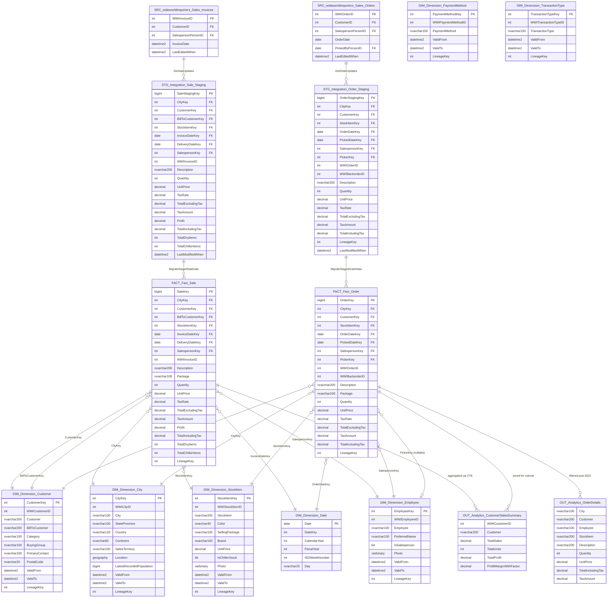

# As-Is Analysis — Sales_Orders

## 1. Analytical Data Product Description
**Fragment target:** `.tmp/as-is/01_definition.md`
**Assembled into:** `current/as-is.md § 1. Definition`
**Purpose:** Establish the data product's identity, business purpose, and structured metadata in source-system terms. This is the primary input for all other as-is agents and the source for SDD boundary check at the SDM/SDD handoff.
**Written by:** `as-is-section-agent --section definition`
**Read by:** `as-is-section-agent --section consumers|model|lineage|calculations|sources`, `to-be-section-agent(01)`

---

### 1.1. Definition

Sales_Orders is the primary analytical data product for the GlobalSales_Project, delivering a complete order-to-cash view of Wide World Importers' wholesale distribution operations by combining order-line demand data (`Fact.Order`) with invoiced revenue data (`Fact.Sale`) in a star-schema data warehouse on Microsoft SQL Server 2014.

**Key Components:**

- `Fact.Order` — order line-item fact (19 columns, IDENTITY surrogate PK, rowstore) capturing demand: quantity ordered, unit price, tax, backorder tracking, salesperson and picker assignments
- `Fact.Sale` — invoice line-item fact (21 columns, clustered columnstore index `CCX_Fact_Sale`) capturing revenue: quantity sold, profit, dry/chiller item counts, bill-to customer separation
- Seven conformed SCD Type-2 dimensions: `Dimension.Customer`, `Dimension.City`, `Dimension.Stock Item`, `Dimension.Date`, `Dimension.Employee`, `Dimension.Payment Method`, `Dimension.Transaction Type`
- Five integration staging tables and corresponding `MigrateStaged*Data` stored procedures orchestrating daily ETL
- SSIS `dailyetlmain` nightly batch pipeline with watermark-based incremental extraction
- Four analytics views: `Analytics.CustomerSalesSummary`, `Analytics.OrderDetails`, `Analytics.v_OrderToSupplyAnalytics`, `Analytics.v_OrderToYearAnalytics`
- Two scalar functions: `Fact.GetTotalQuantitySold1`, `Fact.GetTotalQuantitySold2`
- Nine Power BI reports and one dashboard consuming `Fact.Sale` and `Fact.Order`

**Business Value:**

Sales_Orders enables sales management to monitor order fulfilment pipelines, track backorders, and assess salesperson performance; finance to analyse profitability and margins (the sole source of `Profit` in the warehouse); supply chain to cross-analyse order and sales coverage against location and financial data; and regional management to track provincial order volumes. It is the primary data asset for all customer-facing revenue reporting at Wide World Importers.

---

### 1.2. Metadata Table

| # | Field | Description |
|---|---|---|
| 1 | Domain Name | Sales and Order Management |
| 2 | Business Process | Order-to-Cash — from customer order through picking, invoicing, and delivery |
| 3 | Process Type | [USER INPUT REQUIRED] |
| 4 | Business Entities | Customer, City, Stock Item, Employee (Salesperson / Picker), Date, Payment Method, Transaction Type |
| 5 | Business Metric | Total Sales, Total Units Sold, Profit, Profit Margin (with 1.05 business factor), Tax Amount, Total Dry Items, Total Chiller Items, Quantity Ordered, Backorder Count (WWI Backorder ID), Pick-time SLA (Order Date → Picked Date) |
| 6 | Description | Sales_Orders covers the sales and order transaction domain of `WideWorldImportersDW`. It ingests daily deltas from the `wideworldimporters` OLTP via SSIS, stages in `Integration` schema tables, resolves SCD2 dimension keys, and loads star-schema facts. Analytics views denormalize the facts for BI consumption. History baseline from 2013-01-01; production volumes approximately 12 million rows per year on `Fact.Sale`. |
| 7 | Impacted Analytical Reports | wwidw-sales, wwidw-sales-nofilter, wwidw dynamic of product basket per customer, wwidw dynamic of product basket per customer previous year, wwidw purchase and sale per stockitem dynamic, wwidw-orderdetails, wwidw-orderdetails-by-employee-2024, wwidw-orderitemsrankings, wwidw-total-orders-summary-march-per province, dae – global – demos / wwi sales orders |
| 8 | Data Access and Restrictions | [USER INPUT REQUIRED] |
| 9 | Data Sources | `wideworldimporters` OLTP (Microsoft SQL Server 2014) — schemas: `Sales`, `Warehouse`, `Application`; Azure Blob Storage via PolyBase (`dbo.CityPopulationStatistics` — ad hoc, not part of daily ETL) |
| 10 | Filters Applied | 1. Incremental load window: only rows modified since the last ETL cutoff timestamp and up to five minutes before the current run time are extracted. 2. Order details view: hard-coded restriction to orders dated after 1 January 2023 only. 3. Year analytics view: rolling 100-day window — only the most recent 100 days of order data are included. 4. Supply analytics view: financial coverage code must fall between 10,000 and 900,000, and order date must be after 31 December 2013. |
| 11 | Calculated Fields Added | 1. Total Excluding Tax — net line revenue before tax, computed by subtracting tax amount from extended price (Sale) or by multiplying quantity by unit price rounded to two decimals (Order). 2. Tax Amount — tax charged on the line, passed through directly for Sale lines or computed from quantity, unit price, and tax rate for Order lines. 3. Total Including Tax — gross line revenue inclusive of tax, using the stored extended price for Sale lines or summing the two rounded components for Order lines. 4. Profit — passed through unchanged from the OLTP invoice line profit column. 5. Total Dry Items — quantity on the invoice line when the stock item is an ambient (non-chiller) product, otherwise zero. 6. Total Chiller Items — quantity on the invoice line when the stock item requires refrigeration, otherwise zero. 7. Profit Margin with Factor — customer-level metric computed at the analytics view layer as the ratio of total profit to total sales revenue, multiplied by 100 and then by an undocumented 1.05 business adjustment factor. |
| 12 | Business DQ Rules | [USER INPUT REQUIRED] |
| 13 | Technical DQ Rules | [USER INPUT REQUIRED] |
| 14 | Storage | `wideworldimportersdw` on Microsoft SQL Server 2014 — `Fact.Order` (rowstore, B-tree PK), `Fact.Sale` (clustered columnstore index `CCX_Fact_Sale`), `Integration.*_Staging` (staging tables), `Analytics.*` (non-materialized views) |
| 15 | Internal Consumers | `Analytics.CustomerSalesSummary`, `Analytics.OrderDetails`, `Analytics.v_OrderToSupplyAnalytics`, `Analytics.v_OrderToYearAnalytics`, `dbo.OrderDetails`, `Fact.GetTotalQuantitySold1`, `Fact.GetTotalQuantitySold2` |

---

**Stop condition:** Stop immediately after the metadata table (row 15). Do not generate Section 2 or any other content.

## 2. Consumers and Use Cases
**Fragment target:** `.tmp/as-is/02_consumers.md`
**Assembled into:** `current/as-is.md § 2. Consumers`
**Purpose:** Document who uses this data product, how they access it, and what business questions it answers, in source-system terms.
**Written by:** `as-is-section-agent --section consumers`
**Read by:** `to-be-section-agent(02)`

---

| Consumer Name | Use Cases | Business Questions Answered | Consumption Method |
|---|---|---|---|
| wwidw-sales | Core revenue reporting on invoiced sales | What is total revenue by customer, stock item, city, and salesperson? What are monthly and annual sales trends? | Power BI report — direct connection to `Fact.Sale` |
| wwidw-sales-nofilter | Unrestricted sales analysis; data validation and executive views | What is the full unfiltered sales volume? Are there anomalies in the complete sales dataset? | Power BI report — direct connection to `Fact.Sale` |
| wwidw dynamic of product basket per customer | Current-year product basket mix analysis per customer | Which products does each customer buy together? What is the current-year basket composition by customer segment? | Power BI report — direct connection to `Fact.Sale` |
| wwidw dynamic of product basket per customer previous year | Prior-year basket comparison | How has each customer's product basket changed year over year? Which products have been added or dropped? | Power BI report — direct connection to `Fact.Sale` |
| wwidw purchase and sale per stockitem dynamic | Per-product sales vs. procurement performance | What is the sell-through rate per stock item? Which items have high purchase volume but low sales? | Power BI report — direct connection to `Fact.Sale` |
| wwidw-orderdetails | Order line-item drill-through reporting | What are the detailed order lines for a given customer, city, employee, or stock item? What is the tax and total per order line post-2023? | Power BI report — via `Analytics.OrderDetails` view on `Fact.Order` |
| wwidw-orderdetails-by-employee-2024 | Employee-scoped order performance for 2024 | Which orders did each salesperson handle in 2024? What is the order volume and total value per employee? | Power BI report — via `Analytics.OrderDetails` view on `Fact.Order` |
| wwidw-orderitemsrankings | Order item demand rankings | Which stock items are most frequently ordered? What is the demand-side leaderboard by quantity or value? | Power BI report — direct connection to `Fact.Order` |
| wwidw-total-orders-summary-march-per province | Provincial order volume for March | What is the total order volume per province for the March reporting period? | Power BI report — direct connection to `Fact.Order` |
| dae – global – demos / wwi sales orders | Near-real-time operational order tracking | What are the current open orders with delivery location, salesperson, and customer contact details? | Power BI report — OLTP-direct via `WebApi.SalesOrders` view on `wideworldimporters` (bypasses DW ETL) |
| Analytics.CustomerSalesSummary | Customer-level sales aggregation for ad-hoc analysis | What is total sales, units, profit, and profit margin per customer? How does margin compare across the customer base? | SQL view — consumed by ad-hoc queries and downstream analytical processes; indirect source via `wwi_localbrasales_orders` dataset |
| Analytics.OrderDetails | Flattened order detail access | What are enriched order line records (city, customer, employee, stock item) filtered to recent orders? | SQL view — consumed by two Power BI order-detail reports |
| Analytics.v_OrderToSupplyAnalytics | Supply chain cross-domain analysis | How do order and sale patterns relate to supply coverage codes, location partitions, and financial coverage metrics? | SQL view — consumed by supply chain tooling or processes; no Power BI consumer captured in current lineage graph |
| Analytics.v_OrderToYearAnalytics | Year-dimensioned order trending | What are order trends across calendar and fiscal years? How do order volumes compare to purchase volumes by year and picker? | SQL view — consumed by year-level analytical queries and reporting; no direct Power BI consumer captured |
| Integration.MigrateStaged*Data procedures (ETL) | ETL orchestration — reads `Fact.Order` for cutoff watermark management | Has the fact data been successfully loaded for this run? What is the last processed cutoff timestamp for each entity? | Internal stored procedure call — part of nightly SSIS `dailyetlmain` batch pipeline |

---

**Stop condition:** Stop immediately after the consumers table. Do not generate Section 3 or any additional commentary.

## 3. Model Analytical Data Product
**Fragment target:** `.tmp/as-is/03_model.md`
**Assembled into:** `current/as-is.md § 3. Model`
**Purpose:** Document the data model — all tables, views, temporary objects, their columns, relationships, and architectural layering, in source-system terms.
**Written by:** `as-is-section-agent --section model`
**Read by:** `as-is-section-agent --section lineage|calculations`, `to-be-section-agent(03)`

---

### 3.1. ER Diagram



---

### 3.2. Textual Description

| Layer | Tables | Description |
|---|---|---|
| Primary Source | `wideworldimporters.Sales.Invoices`, `Sales.InvoiceLines`, `Sales.Orders`, `Sales.OrderLines`, `Warehouse.StockItems`, `Warehouse.PackageTypes`, `Sales.Customers`, `Application.Cities`, `Application.StateProvinces`, `Application.Countries`, `Application.People` (and `_Archive` variants) | OLTP source tables in `wideworldimporters` SQL Server 2014 database; delta-extracted using `LastEditedWhen` watermark for facts and `FOR SYSTEM_TIME AS OF` temporal queries for SCD2 dimensions |
| Fact Tables | `Fact.Order`, `Fact.Sale` | `Fact.Order`: 19 columns, IDENTITY PK, rowstore B-tree, order line-item demand fact (quantity, unit price, tax, backorder tracking, dual employee keys); `Fact.Sale`: 21 columns, IDENTITY PK, clustered columnstore index `CCX_Fact_Sale`, invoice line-item revenue fact (quantity, profit, dry/chiller items, bill-to customer separation) |
| Dimension / Dictionary | `Dimension.Customer`, `Dimension.City`, `Dimension.Stock Item`, `Dimension.Date`, `Dimension.Employee`, `Dimension.Payment Method`, `Dimension.Transaction Type` | Seven conformed SCD Type-2 dimensions (except `Dimension.Date` which is a static calendar table); all non-date dimensions use SEQUENCE-generated int surrogate keys and `Valid From`/`Valid To` datetime2 columns; `Dimension.City` has `geography` Location column; `Dimension.Payment Method` and `Dimension.Transaction Type` have no FK bindings to either fact table |
| Processing | `Integration.Order_Staging`, `Integration.Sale_Staging`, `Integration.Customer_Staging`, `Integration.Employee_Staging`, `Integration.City_Staging`, `Integration.MigrateStagedOrderData`, `Integration.MigrateStagedSaleData`, `Integration.MigrateStagedCustomerData`, `Integration.MigrateStagedEmployeeData`, `Integration.MigrateStagedCityData`, `Integration.ETL Cutoff`, `Integration.Lineage`, `Sequences.LineageKey` | Staging tables buffer inbound delta records; `MigrateStaged*Data` procedures resolve SCD2 dimension keys via TOP(1) correlated subqueries, assign lineage keys from `Sequences.LineageKey`, and perform MERGE/INSERT into dimension and fact tables; `Integration.ETL Cutoff` tracks per-entity watermarks; `Integration.Lineage` provides per-run audit records |
| Output | `Analytics.CustomerSalesSummary`, `Analytics.OrderDetails`, `Analytics.v_OrderToSupplyAnalytics`, `Analytics.v_OrderToYearAnalytics`, `dbo.OrderDetails`, `Fact.GetTotalQuantitySold1`, `Fact.GetTotalQuantitySold2` | Non-materialized SQL views that join fact and dimension tables for BI consumption; `CustomerSalesSummary` aggregates both facts with hardcoded 1.05 profit margin factor; `OrderDetails` flattens orders with post-2023 filter; `v_OrderToSupplyAnalytics` cross-joins both facts with five auxiliary analytics tables using NOLOCK hints; `v_OrderToYearAnalytics` uses rolling 100-day window and references `Fact.Purchase`; scalar UDFs return SUM(Quantity) from `Fact.Sale` by stock item |

---

**Stop condition:** Stop after the textual description (Section 3.2). Do not generate Section 4.

## 4. Column-Level Lineage
**Fragment target:** `.tmp/as-is/04_lineage.md`
**Assembled into:** `current/as-is.md § 4. Column-Level Lineage`
**Purpose:** Document the complete data flow from source tables through transformations to output tables at column-level granularity, in source-system terms.
**Written by:** `as-is-section-agent --section lineage`
**Read by:** `as-is-section-agent --section calculations`, `to-be-section-agent(04)`

**Product:** Sales_Orders
**Project:** GlobalSales_Project
**Fact tables:** `Fact.Sale` (21 columns, columnstore index) · `Fact.Order` (19 columns, rowstore)
**ETL engine:** SSIS — `pipeline_dailyetlmain` (daily batch)
**Lineage scope:** OLTP source → staging → dimension key resolution → fact load → analytics views → BI reports

---

### 4.1. Key Columns / Metrics

| # | Column / Metric | Type | Description |
|---|---|---|---|
| 1 | `Fact.Sale.[Total Excluding Tax]` | Derived | Computed in `Integration.GetSaleUpdates` as `InvoiceLines.ExtendedPrice − InvoiceLines.TaxAmount`; represents net invoice line revenue before tax |
| 2 | `Fact.Sale.[Tax Amount]` | Pass-through | Sourced directly from `Sales.InvoiceLines.TaxAmount`; passed through staging unchanged |
| 3 | `Fact.Sale.[Total Including Tax]` | Pass-through | Sourced directly from `Sales.InvoiceLines.ExtendedPrice`; represents gross invoice line revenue |
| 4 | `Fact.Sale.Profit` | Pass-through | Sourced from `Sales.InvoiceLines.LineProfit`; passed through staging into the fact without modification |
| 5 | `Analytics.CustomerSalesSummary.ProfitMarginWithFactor` | Calculated | Computed only at the analytics view layer: `(SUM(Profit) / SUM(Total Including Tax) × 100) × 1.05`; the 1.05 factor is an undocumented business rule |
| 6 | `Fact.Sale.[Total Dry Items]` | Derived | CASE-expression in `GetSaleUpdates`: `Quantity` where `Warehouse.StockItems.IsChillerStock = 0`, else 0; count of non-chiller units on the invoice line |
| 7 | `Fact.Sale.[Total Chiller Items]` | Derived | CASE-expression in `GetSaleUpdates`: `Quantity` where `Warehouse.StockItems.IsChillerStock <> 0`, else 0; count of chiller units on the invoice line |
| 8 | `Fact.Sale.Quantity` | Pass-through | Sourced from `Sales.InvoiceLines.Quantity`; total units sold on the invoice line |
| 9 | `Fact.Order.[Total Excluding Tax]` | Calculated | Computed in `Integration.GetOrderUpdates` as `ROUND(Quantity × UnitPrice, 2)`; re-derived from components (no pre-computed source column) |
| 10 | `Fact.Order.[Tax Amount]` | Calculated | Computed as `ROUND(Quantity × UnitPrice × TaxRate / 100.0, 2)` in `GetOrderUpdates` |
| 11 | `Fact.Order.[Total Including Tax]` | Calculated | `[Total Excluding Tax] + [Tax Amount]` — sum of the two computed order measures |
| 12 | `Fact.Order.[WWI Backorder ID]` | Pass-through | Sourced from `Sales.Orders.BackorderOrderID`; nullable — NULL when no backorder exists |
| 13 | `Fact.Order.[Picked Date Key]` | Derived | Cast from `Sales.OrderLines.PickingCompletedWhen` to `date`; line-level pick timestamp, not an order-header date |
| 14 | `Analytics.CustomerSalesSummary.TotalSales` | Aggregated | `SUM(Fact.Order.[Total Including Tax])` grouped by `[Customer Key]` in the `CustomerTotals` CTE of `Analytics.CustomerSalesSummary` |
| 15 | `Fact.getTotalQuantitySold` | Aggregated | `SUM(Fact.Sale.Quantity)` filtered by `[Stock Item Key]` — implemented as two functionally identical scalar functions (`getTotalQuantitySold1`, `getTotalQuantitySold2`) |

*Column types: Calculated, Aggregated, Derived, Pass-through, Lookup*

---

### 4.2. Lineage Diagram

```mermaid
graph TD

    subgraph legend["Legend"]
        L1[("Source OLTP")]
        L2[("Staging / CTE")]
        L3["Calculation"]
        L4["Final Aggregation"]
        L5[("Target Fact")]
    end

    subgraph oltp["OLTP — wideworldimporters"]
        SI[("Sales.Invoices")]
        SIL[("Sales.InvoiceLines")]
        SO[("Sales.Orders")]
        SOL[("Sales.OrderLines")]
        WS[("Warehouse.StockItems")]
        WP[("Warehouse.PackageTypes")]
        SC[("Sales.Customers")]
    end

    subgraph extract["Extract — Integration procedures"]
        GSU["GetSaleUpdates"]
        GOU["GetOrderUpdates"]
    end

    subgraph staging["Staging — Integration schema"]
        SS[("Sale_Staging")]
        OS[("Order_Staging")]
    end

    subgraph dimres["Dimension Key Resolution"]
        MSSD["MigrateStagedSaleData"]
        MSOD["MigrateStagedOrderData"]
        DC[("Dimension.City SCD2")]
        DCU[("Dimension.Customer SCD2")]
        DE[("Dimension.Employee SCD2")]
        DSI[("Dimension.StockItem SCD2")]
    end

    subgraph facts["Fact Tables — wideworldimportersdw"]
        FS[("Fact.Sale")]
        FO[("Fact.Order")]
    end

    subgraph analytics["Analytics Layer"]
        CSS["CustomerSalesSummary"]
        ODA["Analytics.OrderDetails"]
        ODDB["dbo.OrderDetails"]
        OTSA["v_OrderToSupplyAnalytics"]
        OTYA["v_OrderToYearAnalytics"]
        FN1["getTotalQuantitySold1"]
        FN2["getTotalQuantitySold2"]
    end

    subgraph reports["BI Reports — Power BI"]
        R1["wwidw-sales"]
        R2["wwidw-sales-nofilter"]
        R3["wwidw dynamic product basket\nper customer"]
        R4["wwidw dynamic product basket\nprevious year"]
        R5["wwidw purchase and sale\nper stockitem dynamic"]
        R6["wwidw-orderitemsrankings"]
        R7["wwidw-total-orders-summary\nmarch-per province"]
        R8["wwidw-orderdetails"]
        R9["wwidw-orderdetails-by-employee-2024"]
    end

    SI --> GSU
    SIL --> GSU
    WS --> GSU
    WP --> GSU
    SC --> GSU
    GSU --> SS

    SO --> GOU
    SOL --> GOU
    WP --> GOU
    SC --> GOU
    GOU --> OS

    SS --> MSSD
    DC --> MSSD
    DCU --> MSSD
    DE --> MSSD
    DSI --> MSSD
    MSSD --> FS

    OS --> MSOD
    DC --> MSOD
    DCU --> MSOD
    DE --> MSOD
    DSI --> MSOD
    MSOD --> FO

    FS --> CSS
    FO --> CSS
    FO --> ODA
    FO --> ODDB
    FS --> OTSA
    FO --> OTSA
    FO --> OTYA
    FS --> OTYA
    FS --> FN1
    FS --> FN2

    FS --> R1
    FS --> R2
    FS --> R3
    FS --> R4
    FS --> R5
    FO --> R6
    FO --> R7
    ODA --> R8
    ODDB --> R8
    ODA --> R9
    ODDB --> R9

    style L1 fill:#90EE90,stroke:#2E8B57,color:#000
    style L2 fill:#FFB3B3,stroke:#CC0000,color:#000
    style L3 fill:#FFFF99,stroke:#B8860B,color:#000
    style L4 fill:#9370DB,stroke:#4B0082,color:#fff
    style L5 fill:#87CEEB,stroke:#1E90FF,color:#000
    style SI fill:#90EE90,stroke:#2E8B57,color:#000
    style SIL fill:#90EE90,stroke:#2E8B57,color:#000
    style SO fill:#90EE90,stroke:#2E8B57,color:#000
    style SOL fill:#90EE90,stroke:#2E8B57,color:#000
    style WS fill:#90EE90,stroke:#2E8B57,color:#000
    style WP fill:#90EE90,stroke:#2E8B57,color:#000
    style SC fill:#90EE90,stroke:#2E8B57,color:#000
    style GSU fill:#FFFF99,stroke:#B8860B,color:#000
    style GOU fill:#FFFF99,stroke:#B8860B,color:#000
    style SS fill:#FFB3B3,stroke:#CC0000,color:#000
    style OS fill:#FFB3B3,stroke:#CC0000,color:#000
    style MSSD fill:#FFFF99,stroke:#B8860B,color:#000
    style MSOD fill:#FFFF99,stroke:#B8860B,color:#000
    style DC fill:#FFB3B3,stroke:#CC0000,color:#000
    style DCU fill:#FFB3B3,stroke:#CC0000,color:#000
    style DE fill:#FFB3B3,stroke:#CC0000,color:#000
    style DSI fill:#FFB3B3,stroke:#CC0000,color:#000
    style FS fill:#87CEEB,stroke:#1E90FF,color:#000
    style FO fill:#87CEEB,stroke:#1E90FF,color:#000
    style CSS fill:#9370DB,stroke:#4B0082,color:#fff
    style ODA fill:#9370DB,stroke:#4B0082,color:#fff
    style ODDB fill:#9370DB,stroke:#4B0082,color:#fff
    style OTSA fill:#9370DB,stroke:#4B0082,color:#fff
    style OTYA fill:#9370DB,stroke:#4B0082,color:#fff
    style FN1 fill:#9370DB,stroke:#4B0082,color:#fff
    style FN2 fill:#9370DB,stroke:#4B0082,color:#fff
    style R1 fill:#9370DB,stroke:#4B0082,color:#fff
    style R2 fill:#9370DB,stroke:#4B0082,color:#fff
    style R3 fill:#9370DB,stroke:#4B0082,color:#fff
    style R4 fill:#9370DB,stroke:#4B0082,color:#fff
    style R5 fill:#9370DB,stroke:#4B0082,color:#fff
    style R6 fill:#9370DB,stroke:#4B0082,color:#fff
    style R7 fill:#9370DB,stroke:#4B0082,color:#fff
    style R8 fill:#9370DB,stroke:#4B0082,color:#fff
    style R9 fill:#9370DB,stroke:#4B0082,color:#fff
```



*Color coding: Green `#90EE90` = source tables (OLTP); Red `#FFB3B3` = temp/CTE/staging tables; Yellow `#FFFF99` = component calculations/procedures; Purple `#9370DB` = final aggregations and BI reports; Blue `#87CEEB` = target fact tables. Every node has a style declaration.*

---

### 4.3. Column-Level Lineage Table

| Target Table | Target Column | Source Table | Source Column | Intermediate Table / Column | Derived Metric |
|---|---|---|---|---|---|
| `Fact.Sale` | `[Invoice Date Key]` | `Sales.Invoices` | `InvoiceDate` | `Sale_Staging.[Invoice Date Key]` | `CAST(InvoiceDate AS date)` |
| `Fact.Sale` | `[Delivery Date Key]` | `Sales.Invoices` | `ConfirmedDeliveryTime` | `Sale_Staging.[Delivery Date Key]` | `CAST(ConfirmedDeliveryTime AS date)` |
| `Fact.Sale` | `[WWI Invoice ID]` | `Sales.Invoices` | `InvoiceID` | `Sale_Staging.[WWI Invoice ID]` | Pass-through |
| `Fact.Sale` | `Quantity` | `Sales.InvoiceLines` | `Quantity` | `Sale_Staging.Quantity` | Pass-through |
| `Fact.Sale` | `[Unit Price]` | `Sales.InvoiceLines` | `UnitPrice` | `Sale_Staging.[Unit Price]` | Pass-through |
| `Fact.Sale` | `[Tax Rate]` | `Sales.InvoiceLines` | `TaxRate` | `Sale_Staging.[Tax Rate]` | Pass-through |
| `Fact.Sale` | `[Total Excluding Tax]` | `Sales.InvoiceLines` | `ExtendedPrice`, `TaxAmount` | `Sale_Staging.[Total Excluding Tax]` | `ExtendedPrice − TaxAmount` |
| `Fact.Sale` | `[Tax Amount]` | `Sales.InvoiceLines` | `TaxAmount` | `Sale_Staging.[Tax Amount]` | Pass-through |
| `Fact.Sale` | `[Total Including Tax]` | `Sales.InvoiceLines` | `ExtendedPrice` | `Sale_Staging.[Total Including Tax]` | Pass-through (`ExtendedPrice`) |
| `Fact.Sale` | `Profit` | `Sales.InvoiceLines` | `LineProfit` | `Sale_Staging.Profit` | Pass-through |
| `Fact.Sale` | `[Total Dry Items]` | `Sales.InvoiceLines` + `Warehouse.StockItems` | `Quantity`, `IsChillerStock` | `Sale_Staging.[Total Dry Items]` | `CASE WHEN IsChillerStock = 0 THEN Quantity ELSE 0 END` |
| `Fact.Sale` | `[Total Chiller Items]` | `Sales.InvoiceLines` + `Warehouse.StockItems` | `Quantity`, `IsChillerStock` | `Sale_Staging.[Total Chiller Items]` | `CASE WHEN IsChillerStock <> 0 THEN Quantity ELSE 0 END` |
| `Fact.Sale` | `Package` | `Warehouse.PackageTypes` | `PackageTypeName` | `Sale_Staging.Package` | Pass-through |
| `Fact.Sale` | `[City Key]` | `Dimension.City` | `[City Key]` (SCD2 lookup on `WWI City ID`) | `Sale_Staging.[City Key]` (resolved by `MigrateStagedSaleData`) | SCD2 `Valid From`/`Valid To` range lookup; fallback = 0 |
| `Fact.Sale` | `[Customer Key]` | `Dimension.Customer` | `[Customer Key]` (SCD2 lookup on `WWI Customer ID`) | `Sale_Staging.[Customer Key]` | SCD2 range lookup; fallback = 0 |
| `Fact.Sale` | `[Bill To Customer Key]` | `Dimension.Customer` | `[Customer Key]` (SCD2 lookup on `WWI Bill To Customer ID`) | `Sale_Staging.[Bill To Customer Key]` | SCD2 range lookup on billing customer; fallback = 0 |
| `Fact.Sale` | `[Salesperson Key]` | `Dimension.Employee` | `[Employee Key]` (SCD2 lookup on `WWI Salesperson ID`) | `Sale_Staging.[Salesperson Key]` | SCD2 range lookup; fallback = 0 |
| `Fact.Order` | `[Order Date Key]` | `Sales.Orders` | `OrderDate` | `Order_Staging.[Order Date Key]` | `CAST(OrderDate AS date)` |
| `Fact.Order` | `[Picked Date Key]` | `Sales.OrderLines` | `PickingCompletedWhen` | `Order_Staging.[Picked Date Key]` | `CAST(PickingCompletedWhen AS date)` — line-level timestamp |
| `Fact.Order` | `[WWI Order ID]` | `Sales.Orders` | `OrderID` | `Order_Staging.[WWI Order ID]` | Pass-through |
| `Fact.Order` | `[WWI Backorder ID]` | `Sales.Orders` | `BackorderOrderID` | `Order_Staging.[WWI Backorder ID]` | Pass-through; nullable |
| `Fact.Order` | `[Total Excluding Tax]` | `Sales.OrderLines` | `Quantity`, `UnitPrice` | `Order_Staging.[Total Excluding Tax]` | `ROUND(Quantity × UnitPrice, 2)` — re-derived from components |
| `Fact.Order` | `[Tax Amount]` | `Sales.OrderLines` | `Quantity`, `UnitPrice`, `TaxRate` | `Order_Staging.[Tax Amount]` | `ROUND(Quantity × UnitPrice × TaxRate / 100.0, 2)` |
| `Fact.Order` | `[Total Including Tax]` | `Sales.OrderLines` | computed | `Order_Staging.[Total Including Tax]` | `[Total Excluding Tax] + [Tax Amount]` |
| `Fact.Order` | `[Picker Key]` | `Dimension.Employee` | `[Employee Key]` (SCD2 lookup on `WWI Picker ID`) | `Order_Staging.[Picker Key]` | SCD2 range lookup; nullable — NULL if not yet picked |
| `Analytics.CustomerSalesSummary` | `ProfitMarginWithFactor` | `Fact.Sale` | `Profit`, `[Total Including Tax]` | `ProfitMargins` CTE | `(SUM(Profit) / SUM([Total Including Tax]) × 100) × 1.05` |
| `Analytics.CustomerSalesSummary` | `TotalSales` | `Fact.Order` | `[Total Including Tax]` | `CustomerTotals` CTE | `SUM([Total Including Tax])` grouped by `[Customer Key]` |

---

### 4.4. Step-by-Step Transformation Table

| Step | Layer | Object Name | Transformation | SQL Logic | Business Meaning |
|---|---|---|---|---|---|
| 1 | Orchestration | `pipeline_dailyetlmain` (SSIS workflow) | Executes the daily ETL sequence in order: Truncate → Extract → Migrate for both Sale and Order branches | `EXEC pipeline_item_truncate_sale_staging` → `pipeline_item_extract_sale` → `pipeline_item_migrate_sale` (parallel branch for Order) | Ensures a clean, idempotent daily load cycle for both fact tables |
| 2 | Staging — Truncate | `Sale_Staging` / `Order_Staging` | Truncates both staging tables before each run | `TRUNCATE TABLE Integration.Sale_Staging; TRUNCATE TABLE Integration.Order_Staging;` | Prevents stale staging rows from contaminating the current load window |
| 3 | Extract — Sale | `Integration.GetSaleUpdates` | Joins OLTP Invoice + InvoiceLine + StockItems + PackageTypes + Customers; computes derived columns; inserts into `Sale_Staging` | `INSERT Sale_Staging SELECT ..., ExtendedPrice - TaxAmount AS [Total Excluding Tax], CASE WHEN IsChillerStock=0 THEN Quantity ELSE 0 END AS [Total Dry Items], ...` | Flattens the OLTP invoice model into a single staging row per invoice line; computes dry/chiller split and net/gross amounts |
| 4 | Extract — Order | `Integration.GetOrderUpdates` | Joins OLTP Orders + OrderLines + PackageTypes + Customers; re-derives all monetary measures from Quantity × UnitPrice × TaxRate components | `INSERT Order_Staging SELECT ..., ROUND(Quantity*[Unit Price],2) AS [Total Excluding Tax], ROUND(Quantity*[Unit Price]*[Tax Rate]/100.0,2) AS [Tax Amount], ...` | Produces a per-order-line staging row with fully recomputed monetary measures |
| 5 | Key Resolution — Sale | `Integration.MigrateStagedSaleData` | Updates `Sale_Staging` in place: resolves 5 WWI surrogate IDs to DW dimension keys via SCD2 range lookups against City, Customer (×2), StockItem, Employee | `UPDATE s SET s.[City Key] = COALESCE((SELECT TOP(1) c.[City Key] FROM Dimension.City c WHERE c.[WWI City ID]=s.[WWI City ID] AND s.[Last Modified When] > c.[Valid From] AND s.[Last Modified When] <= c.[Valid To] ORDER BY c.[Valid From]),0)` | Anchors each staging row to the correct SCD2 dimension version effective at the time of the invoice edit; defaults to "Unknown" member (key=0) on no-match |
| 6 | Key Resolution — Order | `Integration.MigrateStagedOrderData` | Updates `Order_Staging` in place: resolves 5 WWI IDs (City, Customer, StockItem, Salesperson, Picker) to DW keys via SCD2 range lookups | Same SCD2 pattern as Step 5; additionally resolves `[WWI Picker ID]` → `[Picker Key]` via `Dimension.Employee` | Ensures order facts carry the SCD2-correct dimension keys for the date the order was last modified |
| 7 | Load — Sale | `Integration.MigrateStagedSaleData` (continued) | Deletes existing `Fact.Sale` rows matching `WWI Invoice ID`, then bulk-inserts all resolved staging rows; stamps `[Lineage Key]` | `DELETE FROM Fact.Sale WHERE [WWI Invoice ID] IN (SELECT [WWI Invoice ID] FROM Sale_Staging); INSERT Fact.Sale (..., @LineageKey) SELECT ..., @LineageKey FROM Integration.Sale_Staging;` | Full invoice re-load pattern — handles updates/corrections to invoice lines by replacing the entire invoice's fact rows atomically |
| 8 | Load — Order | `Integration.MigrateStagedOrderData` (continued) | Deletes existing `Fact.Order` rows for matching `WWI Order ID`, then inserts all resolved staging rows | `DELETE FROM Fact.[Order] WHERE [WWI Order ID] IN (SELECT [WWI Order ID] FROM Order_Staging); INSERT Fact.[Order] (..., @LineageKey) SELECT ... FROM Integration.Order_Staging;` | Same full re-load pattern as Sale; wraps entire operation in a single transaction with `XACT_ABORT ON` |
| 9 | ETL Metadata | `Integration.Lineage` / `Integration.[ETL Cutoff]` | Updates `Lineage` to mark the load complete and advances `ETL Cutoff` to the source system cutoff time | `UPDATE Integration.Lineage SET [Data Load Completed]=SYSDATETIME(), [Was Successful]=1 WHERE [Lineage Key]=@LineageKey; UPDATE Integration.[ETL Cutoff] SET [Cutoff Time]=...` | Maintains incremental load watermark for both Sale and Order tables; controls the next extraction window |
| 10 | Analytics — Order Detail | `Analytics.OrderDetails` / `dbo.OrderDetails` | Joins `Fact.Order` with four dimension tables; hard-coded date filter restricts to post-2023 orders | `SELECT c.City, cc.Customer, e.Employee, s.[Stock Item], o.Description, o.Quantity, o.[Unit Price], o.[Total Including Tax], o.[Tax Amount] FROM Fact.[Order] o ... WHERE o.[Order Date Key] > '20230101'` | Presents a human-readable order detail rowset enriched with dimension labels for report consumption |
| 11 | Analytics — Customer Summary | `Analytics.CustomerSalesSummary` | Two CTEs: `OrderDetails` (order totals per customer from `Fact.Order`) and `ProfitMargins` (profit margin from `Fact.Sale`); joined to produce combined customer summary | `ProfitMarginWithFactor = CASE WHEN SUM([Total Including Tax])<>0 THEN (SUM(Profit)/SUM([Total Including Tax])*100)*1.05 ELSE NULL END` | Cross-fact aggregation combining transactional order volume with invoice-level profitability; the ×1.05 factor is a business-rule adjustment applied only at this layer |
| 12 | Analytics — Supply Analytics | `Analytics.v_OrderToSupplyAnalytics` | Joins `Fact.Sale` and `Fact.Order` via `[Stock Item Key]` + `[Salesperson Key]`; enriches with 5 auxiliary analytics tables | `JOIN Fact.[Order] o ON o.[Stock Item Key]=sales.ItemKey AND o.[Salesperson Key]=sales.ClientRep AND o.[Order Date Key]>'2013-12-31'` | Bridges sales performance data with supply/coverage analytics using external reference tables outside the standard DW schema |
| 13 | Analytics — Year Analytics | `Analytics.v_OrderToYearAnalytics` | Joins `Fact.Order` with `Dimension.Date` (twice), `Dimension.Customer`, `Dimension.Employee`; correlated subquery resolves `CustomSalesperson` from both fact tables | `([Total Excluding Tax] - [Tax Amount]) * [Tax Rate] AS [Tax Coverage]`; `CAST(CONVERT(varchar, dod.[DateKey], 112) AS INT)` for integer date keys | Provides year-based order analytics with tax-balancing coverage metric and integer-format date keys |
| 14 | Aggregation — Quantity Function | `Fact.getTotalQuantitySold1` / `Fact.getTotalQuantitySold2` | Each accepts a `@StockItemKey` parameter and returns `SUM(Quantity)` from `Fact.Sale` | `SELECT @TotalQuantity = SUM(Quantity) FROM Fact.Sale WHERE [Stock Item Key] = @StockItemKey` | Provides a callable total-quantity-sold metric per stock item; functionally duplicated across two identically-structured functions |

*Steps ordered chronologically by execution order. SQL Logic shows key clauses (WHERE, GROUP BY, CASE), not full statements.*

---

### 4.5. Known Downstream Dependencies

| Dependent Object | Object Type | Relationship | Description |
|---|---|---|---|
| `Analytics.CustomerSalesSummary` | View | Reads `Fact.Sale` + `Fact.Order` | Cross-fact customer summary combining order volume with sale-based profit margin; computes `ProfitMarginWithFactor` with the ×1.05 undocumented business-rule multiplier |
| `Analytics.OrderDetails` | View | Reads `Fact.Order` | Order detail view enriched with City, Customer, Employee, and StockItem dimension names; hard-coded date filter `> '20230101'` restricts historical visibility |
| `dbo.OrderDetails` | View | Reads `Fact.Order` | Structurally identical duplicate of `Analytics.OrderDetails` in the `dbo` schema; consolidation candidate |
| `Analytics.v_OrderToSupplyAnalytics` | View | Reads `Fact.Sale` + `Fact.Order` | Complex supply analytics view joining both facts via StockItem + Salesperson; references 5 external auxiliary analytics tables outside the standard DW schema |
| `Analytics.v_OrderToYearAnalytics` | View | Reads `Fact.Order` + `Fact.Sale` (subquery) | Year-based order analytics with date-dimension integer conversions; correlated subquery into both fact tables |
| `Fact.getTotalQuantitySold1` | Scalar Function | Reads `Fact.Sale` | Returns `SUM(Quantity)` for a given `[Stock Item Key]`; one of two functionally identical functions |
| `Fact.getTotalQuantitySold2` | Scalar Function | Reads `Fact.Sale` | Returns `SUM(Quantity)` for a given `[Stock Item Key]` under a different parameter name; functionally identical to `getTotalQuantitySold1` |
| `wwidw-sales` | BI Report (Power BI) | Reads `Fact.Sale` directly | Sales performance reporting; direct fact table consumer |
| `wwidw-sales-nofilter` | BI Report (Power BI) | Reads `Fact.Sale` directly | Sales reporting variant with no pre-applied date or category filters |
| `wwidw dynamic of product basket per customer` | BI Report (Power BI) | Reads `Fact.Sale` directly | Product basket composition analysis per customer |
| `wwidw dynamic of product basket per customer previous year` | BI Report (Power BI) | Reads `Fact.Sale` directly | Year-over-year product basket comparison |
| `wwidw purchase and sale per stockitem dynamic` | BI Report (Power BI) | Reads `Fact.Sale` directly | Stock item-level purchase vs. sale performance analysis |
| `wwidw-orderitemsrankings` | BI Report (Power BI) | Reads `Fact.Order` directly | Order item rankings by Quantity or Total Including Tax |
| `wwidw-total-orders-summary-march-per province` | BI Report (Power BI) | Reads `Fact.Order` directly | Geographically aggregated order summary scoped to March; uses City/province dimension |
| `wwidw-orderdetails` | BI Report (Power BI) | Reads via `Analytics.OrderDetails` + `dbo.OrderDetails` | Detailed order report consuming both the analytics-schema and dbo-schema order detail views |
| `wwidw-orderdetails-by-employee-2024` | BI Report (Power BI) | Reads via `Analytics.OrderDetails` + `dbo.OrderDetails` | Employee-filtered order detail report for 2024 |

---

**Stop condition:** Stop after Section 4.5 (Known Downstream Dependencies). Do not generate Section 5.

## 5. Calculation Logic
**Fragment target:** `.tmp/as-is/05_calculations.md`
**Assembled into:** `current/as-is.md § 5. Calculations`
**Purpose:** Document every calculated metric in detail: business purpose, formula, input columns, SQL code, step-by-step walkthrough, and thresholds, in source-system terms.
**Written by:** `as-is-section-agent --section calculations`
**Read by:** `to-be-section-agent(05)`

**Product:** Sales_Orders
**Project:** GlobalSales_Project
**Scope:** Covers all seven derived and computed metrics used in the Sales_Orders fact layer and analytics views: monetary line-level amounts (excluding tax, tax, including tax), item classification counts (dry/chiller), the analytics profit margin factor, and the scalar UDF for total quantity sold.

---

### 5.1. Total Excluding Tax

**Business Purpose:** Represents the net revenue value of a line item before any tax is applied. Used as the primary pre-tax revenue measure in both the Sale and Order fact tables. The computation differs between the two fact tables because Sale lines carry pre-stored monetary values while Order lines derive amounts on the fly from unit economics.

**Mathematical Formula:**
```
-- Sale variant (passed through from stored OLTP values):
Total Excluding Tax (Sale) = ExtendedPrice - TaxAmount

-- Order variant (computed from unit economics):
Total Excluding Tax (Order) = ROUND(Quantity × UnitPrice, 2)
```

**Input Columns / Tables:**

| Input | Source Table | Description |
|---|---|---|
| `ExtendedPrice` | `Sales.InvoiceLines` (WideWorldImporters OLTP) | Pre-calculated extended line price stored at invoice creation; includes no tax |
| `TaxAmount` | `Sales.InvoiceLines` (WideWorldImporters OLTP) | Pre-calculated tax amount stored at invoice creation |
| `Quantity` | `Sales.OrderLines` (WideWorldImporters OLTP) | Number of units ordered on a single order line |
| `UnitPrice` | `Sales.OrderLines` (WideWorldImporters OLTP) | Per-unit selling price at time of order |

**SQL Code:**
```sql
-- Sale variant — from Integration.GetSaleUpdates (WideWorldImporters OLTP):
il.ExtendedPrice - il.TaxAmount AS [Total Excluding Tax]

-- Order variant — from Integration.GetOrderUpdates (WideWorldImporters OLTP):
ROUND(ol.Quantity * ol.UnitPrice, 2) AS [Total Excluding Tax]

-- DW load — Integration.MigrateStagedSaleData passes the staged value through:
INSERT Fact.Sale ([Total Excluding Tax], ...)
SELECT [Total Excluding Tax], ...
FROM Integration.Sale_Staging;

-- DW load — Integration.MigrateStagedOrderData passes the staged value through:
INSERT Fact.[Order] ([Total Excluding Tax], ...)
SELECT [Total Excluding Tax], ...
FROM Integration.Order_Staging;
```

**Step-by-Step Calculation:**
1. **Sale path:** `Integration.GetSaleUpdates` joins `Sales.InvoiceLines` to `Sales.Invoices`, `Warehouse.StockItems`, `Warehouse.PackageTypes`, and `Sales.Customers`. It reads the pre-stored `ExtendedPrice` and `TaxAmount` and subtracts to produce `[Total Excluding Tax]`.
2. **Order path:** `Integration.GetOrderUpdates` joins `Sales.OrderLines` to `Sales.Orders`, `Warehouse.PackageTypes`, and `Sales.Customers`. It multiplies `Quantity × UnitPrice` and applies `ROUND(..., 2)`.
3. Both procedures load output into staging tables within the ETL cutoff window (`@LastCutoff` to `@NewCutoff`).
4. `MigrateStagedSaleData` and `MigrateStagedOrderData` perform dimension-key resolution then insert staging rows — including `[Total Excluding Tax]` verbatim — into the respective DW fact tables.

**Thresholds and Categorization:**

| Condition | Category | Description |
|---|---|---|
| N/A | N/A | This metric does not use threshold-based categorization |

---

### 5.2. Tax Amount

**Business Purpose:** Captures the monetary value of tax charged on a line item. For Sale lines, this is the authoritative stored tax figure from the OLTP invoice. For Order lines, it is computed from the tax rate because no stored tax amount exists on order lines in the source system.

**Mathematical Formula:**
```
-- Sale variant (stored OLTP value passed through):
Tax Amount (Sale) = TaxAmount  [stored column on Sales.InvoiceLines]

-- Order variant (computed from unit economics and tax rate):
Tax Amount (Order) = ROUND(Quantity × UnitPrice × TaxRate / 100.0, 2)
```

**Input Columns / Tables:**

| Input | Source Table | Description |
|---|---|---|
| `TaxAmount` | `Sales.InvoiceLines` (WideWorldImporters OLTP) | Pre-stored tax amount per invoice line; authoritative for Sale facts |
| `Quantity` | `Sales.OrderLines` (WideWorldImporters OLTP) | Number of units on the order line |
| `UnitPrice` | `Sales.OrderLines` (WideWorldImporters OLTP) | Per-unit selling price |
| `TaxRate` | `Sales.OrderLines` (WideWorldImporters OLTP) | Tax rate expressed as a percentage (e.g., 15.0 for 15%) |

**SQL Code:**
```sql
-- Sale variant — from Integration.GetSaleUpdates:
il.TaxAmount AS [Tax Amount]

-- Order variant — from Integration.GetOrderUpdates:
ROUND(ol.Quantity * ol.UnitPrice * ol.TaxRate / 100.0, 2) AS [Tax Amount]

-- DW load — MigrateStagedSaleData:
INSERT Fact.Sale ([Tax Amount], ...)
SELECT [Tax Amount], ... FROM Integration.Sale_Staging;

-- DW load — MigrateStagedOrderData:
INSERT Fact.[Order] ([Tax Amount], ...)
SELECT [Tax Amount], ... FROM Integration.Order_Staging;
```

**Step-by-Step Calculation:**
1. **Sale path:** `GetSaleUpdates` reads `il.TaxAmount` directly from `Sales.InvoiceLines` — no arithmetic is performed; the value was stored when the invoice was raised.
2. **Order path:** `GetOrderUpdates` has no stored tax amount column on `Sales.OrderLines`. It computes tax by multiplying `Quantity × UnitPrice` to get the line net value, then multiplies by `TaxRate / 100.0` and applies `ROUND(..., 2)`.
3. Both computed/read values flow through staging and are inserted into the respective DW fact tables by the `Migrate*` procedures without further transformation.

**Thresholds and Categorization:**

| Condition | Category | Description |
|---|---|---|
| N/A | N/A | This metric does not use threshold-based categorization |

---

### 5.3. Total Including Tax

**Business Purpose:** The gross line value inclusive of all applicable taxes. For Sale lines, this equals the pre-stored `ExtendedPrice` from the OLTP invoice (which already embeds tax). For Order lines, it is the sum of the two independently rounded components.

**Mathematical Formula:**
```
-- Sale variant (stored OLTP value used directly):
Total Including Tax (Sale) = ExtendedPrice  [stored column on Sales.InvoiceLines]

-- Order variant (sum of two independently rounded values):
Total Including Tax (Order) =
    ROUND(Quantity × UnitPrice, 2)
  + ROUND(Quantity × UnitPrice × TaxRate / 100.0, 2)
```

**Input Columns / Tables:**

| Input | Source Table | Description |
|---|---|---|
| `ExtendedPrice` | `Sales.InvoiceLines` (WideWorldImporters OLTP) | Pre-stored extended price inclusive of tax at invoice line level |
| `Quantity` | `Sales.OrderLines` (WideWorldImporters OLTP) | Number of units on the order line |
| `UnitPrice` | `Sales.OrderLines` (WideWorldImporters OLTP) | Per-unit selling price |
| `TaxRate` | `Sales.OrderLines` (WideWorldImporters OLTP) | Tax rate expressed as a percentage |

**SQL Code:**
```sql
-- Sale variant — from Integration.GetSaleUpdates:
il.ExtendedPrice AS [Total Including Tax]

-- Order variant — from Integration.GetOrderUpdates:
ROUND(ol.Quantity * ol.UnitPrice, 2)
    + ROUND(ol.Quantity * ol.UnitPrice * ol.TaxRate / 100.0, 2)
    AS [Total Including Tax]

-- DW load — MigrateStagedSaleData:
INSERT Fact.Sale ([Total Including Tax], ...)
SELECT [Total Including Tax], ... FROM Integration.Sale_Staging;

-- DW load — MigrateStagedOrderData:
INSERT Fact.[Order] ([Total Including Tax], ...)
SELECT [Total Including Tax], ... FROM Integration.Order_Staging;
```

**Step-by-Step Calculation:**
1. **Sale path:** `GetSaleUpdates` reads `il.ExtendedPrice` as `[Total Including Tax]`. No arithmetic is applied; the value was persisted at invoice creation and already includes tax.
2. **Order path:** `GetOrderUpdates` adds the independently rounded `[Total Excluding Tax]` and `[Tax Amount]` components. Because each component is rounded separately before addition, the result may differ by ±0.01 from a single-expression calculation.
3. Values pass through staging and are inserted verbatim into `Fact.Sale` and `Fact.[Order]` by the `Migrate*` procedures.

**Thresholds and Categorization:**

| Condition | Category | Description |
|---|---|---|
| N/A | N/A | This metric does not use threshold-based categorization |

---

### 5.4. Total Dry Items

**Business Purpose:** Counts the quantity of invoice line units that belong to ambient (non-refrigerated) stock. Supports logistics and fulfilment planning by separating dry-goods volume from cold-chain volume on each sale line. Exists only on `Fact.Sale` — the Order fact table does not carry this attribute.

**Mathematical Formula:**
```
Total Dry Items = CASE WHEN IsChillerStock = 0 THEN Quantity ELSE 0 END
```

**Input Columns / Tables:**

| Input | Source Table | Description |
|---|---|---|
| `IsChillerStock` | `Warehouse.StockItems` (WideWorldImporters OLTP) | Bit flag: 0 = ambient/dry stock, 1 = refrigerated/chiller stock |
| `Quantity` | `Sales.InvoiceLines` (WideWorldImporters OLTP) | Number of units on the invoice line |

**SQL Code:**
```sql
-- Derivation — from Integration.GetSaleUpdates:
CASE WHEN si.IsChillerStock = 0
     THEN il.Quantity
     ELSE 0
END AS [Total Dry Items]
-- si = Warehouse.StockItems joined on il.StockItemID = si.StockItemID
-- il = Sales.InvoiceLines

-- DW load — MigrateStagedSaleData:
INSERT Fact.Sale ([Total Dry Items], ...)
SELECT [Total Dry Items], ... FROM Integration.Sale_Staging;
```

**Step-by-Step Calculation:**
1. `GetSaleUpdates` joins `Sales.InvoiceLines` to `Warehouse.StockItems` on `StockItemID`.
2. For each invoice line, `IsChillerStock` is evaluated: if `0` (dry/ambient), the full line `Quantity` is assigned; otherwise `0` is assigned.
3. The derived value flows into `Integration.Sale_Staging`.
4. `MigrateStagedSaleData` inserts the staged value verbatim into `Fact.Sale.[Total Dry Items]` (INT NOT NULL) after dimension-key resolution.

**Thresholds and Categorization:**

| Condition | Category | Description |
|---|---|---|
| `IsChillerStock = 0` | Dry Item | Line quantity is counted as dry; assigned full Quantity value |
| `IsChillerStock <> 0` | Chiller Item | Line is a chiller item; Total Dry Items is set to 0 |

---

### 5.5. Total Chiller Items

**Business Purpose:** Counts the quantity of invoice line units that require refrigeration (cold-chain stock). Complements `Total Dry Items` as the mutually exclusive partner metric. For any given invoice line, exactly one of `Total Dry Items` or `Total Chiller Items` carries the line `Quantity`; the other is zero.

**Mathematical Formula:**
```
Total Chiller Items = CASE WHEN IsChillerStock <> 0 THEN Quantity ELSE 0 END
```

**Input Columns / Tables:**

| Input | Source Table | Description |
|---|---|---|
| `IsChillerStock` | `Warehouse.StockItems` (WideWorldImporters OLTP) | Bit flag: 0 = ambient/dry, non-zero = refrigerated/chiller |
| `Quantity` | `Sales.InvoiceLines` (WideWorldImporters OLTP) | Number of units on the invoice line |

**SQL Code:**
```sql
-- Derivation — from Integration.GetSaleUpdates:
CASE WHEN si.IsChillerStock <> 0
     THEN il.Quantity
     ELSE 0
END AS [Total Chiller Items]
-- si = Warehouse.StockItems joined on il.StockItemID = si.StockItemID
-- il = Sales.InvoiceLines

-- DW load — MigrateStagedSaleData:
INSERT Fact.Sale ([Total Chiller Items], ...)
SELECT [Total Chiller Items], ... FROM Integration.Sale_Staging;
```

**Step-by-Step Calculation:**
1. `GetSaleUpdates` joins `Sales.InvoiceLines` to `Warehouse.StockItems` on `StockItemID`.
2. For each invoice line, `IsChillerStock` is evaluated: if non-zero (chiller/refrigerated), the full line `Quantity` is assigned; otherwise `0` is assigned.
3. The value flows into `Integration.Sale_Staging` alongside `Total Dry Items`.
4. `MigrateStagedSaleData` inserts the staged value verbatim into `Fact.Sale.[Total Chiller Items]` (INT NOT NULL) after dimension-key resolution.

**Thresholds and Categorization:**

| Condition | Category | Description |
|---|---|---|
| `IsChillerStock <> 0` | Chiller Item | Line quantity is counted as a chiller item; assigned full Quantity value |
| `IsChillerStock = 0` | Dry Item | Line is a dry item; Total Chiller Items is set to 0 |

---

### 5.6. Profit Margin with Factor

**Business Purpose:** A customer-level profitability KPI exposed in the `Analytics.CustomerSalesSummary` view. It calculates each customer's profit margin as a percentage of sales revenue and applies a **1.05 uplift factor**, producing an adjusted margin figure used for customer profitability scoring and segmentation in reporting.

**Mathematical Formula:**
```
ProfitMarginWithFactor =
    CASE
        WHEN SUM(Total Including Tax) <> 0
        THEN ( SUM(Profit) / SUM(Total Including Tax) ) × 100 × 1.05
        ELSE NULL
    END
```

**Input Columns / Tables:**

| Input | Source Table | Description |
|---|---|---|
| `Profit` | `Fact.Sale` (WideWorldImportersDW) | Per-line profit amount stored at invoice load time (sourced from `Sales.InvoiceLines.LineProfit`) |
| `[Total Including Tax]` | `Fact.Sale` (WideWorldImportersDW) | Gross line value inclusive of tax |
| `[Customer Key]` | `Fact.Sale` (WideWorldImportersDW) | Surrogate key grouping dimension for the per-customer aggregation |

**SQL Code:**
```sql
-- Analytics.CustomerSalesSummary (WideWorldImportersDW):
WITH OrderDetails AS (
    SELECT
        o.[Order Key], o.[City Key], o.[Customer Key], o.[Salesperson Key],
        o.[Quantity], o.[Unit Price], o.[Tax Amount], o.[Total Including Tax],
        c.City, cust.Customer, cust.[WWI Customer ID], emp.Employee,
        (o.[Tax Amount] / NULLIF(o.[Total Including Tax], 0)) * 100 AS [TaxPercent]
    FROM Fact.[Order] AS o
    INNER JOIN Dimension.City AS c ON c.[City Key] = o.[City Key]
    INNER JOIN Dimension.Customer AS cust ON cust.[Customer Key] = o.[Customer Key]
    INNER JOIN Dimension.Employee AS emp ON emp.[Employee Key] = o.[Salesperson Key]
),
CustomerTotals AS (
    SELECT
        [Customer Key], [WWI Customer ID], Customer,
        SUM([Total Including Tax]) AS TotalSales,
        SUM([Quantity]) AS TotalUnits
    FROM OrderDetails
    GROUP BY [Customer Key], [WWI Customer ID], Customer
),
ProfitMargins AS (
    SELECT
        s.[Customer Key],
        SUM(s.[Profit]) AS TotalProfit,
        SUM(s.[Total Including Tax]) AS SalesWithTax,
        CASE
            WHEN SUM(s.[Total Including Tax]) <> 0
            THEN ((SUM(s.[Profit]) / SUM(s.[Total Including Tax])) * 100) * 1.05
            ELSE NULL
        END AS ProfitMarginWithFactor
    FROM Fact.Sale AS s
    GROUP BY s.[Customer Key]
)
SELECT
    ct.[WWI Customer ID], ct.Customer, ct.TotalSales, ct.TotalUnits,
    pm.TotalProfit, pm.ProfitMarginWithFactor
FROM CustomerTotals AS ct
LEFT JOIN ProfitMargins AS pm ON ct.[Customer Key] = pm.[Customer Key];
```

**Step-by-Step Calculation:**
1. The `ProfitMargins` CTE aggregates `Fact.Sale` at the `[Customer Key]` level, summing `[Profit]` and `[Total Including Tax]` across all invoice lines per customer.
2. If the customer's `SUM([Total Including Tax])` is non-zero, the raw profit margin percentage is computed as `(SUM(Profit) / SUM(Total Including Tax)) × 100`.
3. The 1.05 uplift factor is applied as a multiplier to the raw percentage, producing `ProfitMarginWithFactor`.
4. If the customer's total sales sum to zero, `ProfitMarginWithFactor` returns `NULL` to avoid division-by-zero and exclude non-selling customers.
5. The `CustomerTotals` CTE independently aggregates `Fact.[Order]` to produce `TotalSales` and `TotalUnits` from the order side.
6. The final `SELECT` left-joins `CustomerTotals` to `ProfitMargins` on `[Customer Key]`, so all customers with order history appear even if they have no sale facts.

**Thresholds and Categorization:**

| Condition | Category | Description |
|---|---|---|
| `SUM(Total Including Tax) <> 0` | Valid margin | Profit margin percentage computed and multiplied by 1.05 factor |
| `SUM(Total Including Tax) = 0` | Null / excluded | Returns NULL; customer excluded from margin-based ranking |

---

### 5.7. GetTotalQuantitySold (UDF)

**Business Purpose:** A scalar user-defined function that returns the total historical quantity sold for a given stock item across all records in `Fact.Sale`. Two variants exist (`getTotalQuantitySold1` and `getTotalQuantitySold2`) with identical logic but different parameter names, reflecting parallel development. Used to support item-level inventory analysis and stock replenishment reporting.

**Mathematical Formula:**
```
GetTotalQuantitySold(@StockItemKey) = SUM(Quantity)
    WHERE [Stock Item Key] = @StockItemKey
    FROM Fact.Sale
```

**Input Columns / Tables:**

| Input | Source Table | Description |
|---|---|---|
| `Quantity` | `Fact.Sale` (WideWorldImportersDW) | Per-line quantity sold; summed across all historical sale records for the given stock item key |
| `[Stock Item Key]` | `Fact.Sale` (WideWorldImportersDW) | Surrogate key used to filter sale records to the requested stock item |
| `@StockItemKey` / `@ItemKey` | Function parameter | Caller-supplied surrogate key for the stock item of interest |

**SQL Code:**
```sql
-- Variant 1 — Fact.getTotalQuantitySold1 (WideWorldImportersDW):
CREATE FUNCTION [Fact].getTotalQuantitySold1 (@StockItemKey INT)
RETURNS INT
AS
BEGIN
    DECLARE @TotalQuantity INT;
    SELECT @TotalQuantity = SUM(Quantity)
    FROM WideWorldImportersDW.Fact.Sale
    WHERE [Stock Item Key] = @StockItemKey;
    RETURN @TotalQuantity;
END;

-- Variant 2 — Fact.getTotalQuantitySold2 (WideWorldImportersDW):
CREATE FUNCTION [Fact].getTotalQuantitySold2 (@ItemKey INT)
RETURNS INT
AS
BEGIN
    DECLARE @TotalQuantity INT;
    SELECT @TotalQuantity = SUM(Quantity)
    FROM WideWorldImportersDW.Fact.Sale
    WHERE [Stock Item Key] = @ItemKey;
    RETURN @TotalQuantity;
END;
```

**Step-by-Step Calculation:**
1. The calling context passes a single integer `@StockItemKey` (or `@ItemKey` in variant 2) representing the DW surrogate key for the stock item.
2. The function executes a scalar aggregation: `SUM(Quantity)` over all rows in `WideWorldImportersDW.Fact.Sale` where `[Stock Item Key]` matches the parameter.
3. The aggregated integer is assigned to `@TotalQuantity` and returned.
4. If no rows match, `SUM` returns `NULL` — there is no explicit `ISNULL`/`COALESCE` guard in either variant.
5. Both variants produce identical results for the same input; the only difference is the parameter name.

**Thresholds and Categorization:**

| Condition | Category | Description |
|---|---|---|
| Matching rows found in `Fact.Sale` | Valid quantity | Returns SUM(Quantity) as INT for the stock item |
| No matching rows (stock item never sold) | NULL return | SUM returns NULL; no COALESCE guard — callers must handle NULL |

---

**Stop condition:** Stop after documenting all calculated metrics (all 5.N subsections). Do not generate Section 6.

## 6. Data Sources
**Fragment target:** `.tmp/as-is/06_sources.md`
**Assembled into:** `current/as-is.md § 6. Sources`
**Purpose:** Provide a complete inventory of input sources and output targets with platform, system, schema, object type, and key fields, in source-system terms.
**Written by:** `as-is-section-agent --section sources`
**Read by:** `to-be-section-agent(06)`

---

### 6.1. Input Source Tables

| Source Platform | Source System | Source Schema | Source Object | Source Object Type | Description | Key Fields Used |
|---|---|---|---|---|---|---|
| Microsoft SQL Server 2014 | wideworldimporters | Sales | Invoices | Table | Invoice header records for completed sales; temporal table with `_Archive` variant | InvoiceID, CustomerID, BillToCustomerID, SalespersonPersonID, InvoiceDate, LastEditedWhen |
| Microsoft SQL Server 2014 | wideworldimporters | Sales | InvoiceLines | Table | Invoice line items; one row per stock item per invoice | InvoiceLineID, InvoiceID, StockItemID, PackageTypeID, Quantity, UnitPrice, TaxRate, LineProfit, ExtendedPrice, TaxAmount, IsChillerStock, LastEditedWhen |
| Microsoft SQL Server 2014 | wideworldimporters | Sales | Orders | Table | Order header records; temporal table with `_Archive` variant | OrderID, CustomerID, SalespersonPersonID, PickedByPersonID, OrderDate, PickingCompletedWhen, LastEditedWhen |
| Microsoft SQL Server 2014 | wideworldimporters | Sales | OrderLines | Table | Order line items; one row per stock item per order | OrderLineID, OrderID, StockItemID, PackageTypeID, Quantity, UnitPrice, TaxRate, PickedQuantity, LastEditedWhen |
| Microsoft SQL Server 2014 | wideworldimporters | Warehouse | StockItems | Table | Product master; temporal table | StockItemID, StockItemName, IsChillerStock |
| Microsoft SQL Server 2014 | wideworldimporters | Warehouse | PackageTypes | Table | Packaging type lookup | PackageTypeID, PackageTypeName |
| Microsoft SQL Server 2014 | wideworldimporters | Sales | Customers | Table | Customer master; temporal table with `_Archive` variant | CustomerID, CustomerName, BillToCustomerID, CustomerCategoryID, BuyingGroupID, PostalCode |
| Microsoft SQL Server 2014 | wideworldimporters | Sales | CustomerCategories | Table | Customer category lookup; temporal with `_Archive` | CustomerCategoryID, CustomerCategoryName |
| Microsoft SQL Server 2014 | wideworldimporters | Sales | BuyingGroups | Table | Buying group lookup; temporal with `_Archive` | BuyingGroupID, BuyingGroupName |
| Microsoft SQL Server 2014 | wideworldimporters | Application | People | Table | Employee and person master; temporal with `_Archive` | PersonID, FullName, PreferredName, IsEmployee, Photo |
| Microsoft SQL Server 2014 | wideworldimporters | Application | Cities | Table | City master; temporal with `_Archive` | CityID, CityName, StateProvinceID |
| Microsoft SQL Server 2014 | wideworldimporters | Application | StateProvinces | Table | State/province master; temporal with `_Archive` | StateProvinceID, StateProvinceName, CountryID, SalesTerritory |
| Microsoft SQL Server 2014 | wideworldimporters | Application | Countries | Table | Country master; temporal with `_Archive` | CountryID, CountryName, Continent, Region, Subregion |
| Microsoft SQL Server 2014 | wideworldimportersdw | Integration | ETL Cutoff | Table (control) | Per-entity ETL watermark store; one row per tracked entity | Table Name (PK), Cutoff Time |
| Microsoft SQL Server 2014 | wideworldimportersdw | Integration | Lineage | Table (control) | ETL run audit log; tracks start/end/success per entity per run | Lineage Key (PK, SEQUENCE), Data Load Started, Table Name, Data Load Completed, Was Successful, Source System Cutoff Time |
| Microsoft SQL Server 2014 | wideworldimportersdw | Sequences | LineageKey | Sequence object | SQL Server SEQUENCE generating monotonically increasing lineage run identifiers | NEXT VALUE FOR Sequences.LineageKey |
| Microsoft SQL Server 2014 | wideworldimportersdw | Dimension | Date | Table (reference) | Static calendar dimension pre-populated by `Integration.PopulateDateDimensionForYear`; no SCD2 | Date (PK), DateKey, CalendarYear, FiscalYear, ISO Week Number |
| Azure Blob Storage (via PolyBase) | sqldwdatasets.blob.core.windows.net | dbo | CityPopulationStatistics | External Table (ad hoc) | City population statistics sourced from Azure Blob Storage; comma-delimited text format; applied on demand via `Application.Configuration_ApplyPolybase`, not part of daily ETL | CityID, StateProvinceCode, CityName, YearNumber, LatestRecordedPopulation |
| Microsoft SQL Server 2014 | wideworldimporters | WebApi | SalesOrders | View (OLTP-direct) | Real-time order view with GeoJSON delivery location and salesperson details; consumed by the `dae – global – demos` BI report bypassing the DW ETL pipeline | OrderID, CustomerName, SalespersonName, DeliveryLocation (GeoJSON), DeliveryMethodName, PhoneNumber |

---

### 6.2. Output Tables

| Target System | Target Object | Target Object Type | Description |
|---|---|---|---|
| wideworldimportersdw (SQL Server 2014) | Fact.Sale | Table (fact, columnstore) | Invoice line-item revenue fact; 21 columns; composite PK (Sale Key, Invoice Date Key); clustered columnstore index CCX_Fact_Sale; approx. 12M rows/year |
| wideworldimportersdw (SQL Server 2014) | Fact.Order | Table (fact, rowstore) | Order line-item demand fact; 19 columns; composite PK (Order Key, Order Date Key); rowstore B-tree index; tracks backorders and picker assignments |
| wideworldimportersdw (SQL Server 2014) | Dimension.Customer | Table (SCD2 dimension) | Customer conformed dimension; SCD Type-2; surrogate key via Sequences.CustomerKey; 11 columns |
| wideworldimportersdw (SQL Server 2014) | Dimension.City | Table (SCD2 dimension) | City conformed dimension; SCD Type-2; geography Location column; surrogate key via Sequences.CityKey; 14 columns |
| wideworldimportersdw (SQL Server 2014) | Dimension.Stock Item | Table (SCD2 dimension) | Stock item conformed dimension; SCD Type-2; varbinary Photo column; surrogate key via Sequences.StockItemKey; 20 columns |
| wideworldimportersdw (SQL Server 2014) | Dimension.Employee | Table (SCD2 dimension) | Employee conformed dimension; SCD Type-2; varbinary Photo column; dual-role FK in Fact.Order (Salesperson + Picker); surrogate key via Sequences.EmployeeKey; 9 columns |
| wideworldimportersdw (SQL Server 2014) | Dimension.Date | Table (static calendar) | Date calendar dimension; 62 columns; populated by Integration.PopulateDateDimensionForYear; no SCD2; FK target is date-typed Date column (not integer key) |
| wideworldimportersdw (SQL Server 2014) | Dimension.Payment Method | Table (SCD2 dimension) | Payment method dimension; SCD Type-2; no FK binding to Fact.Order or Fact.Sale in current schema |
| wideworldimportersdw (SQL Server 2014) | Dimension.Transaction Type | Table (SCD2 dimension) | Transaction type dimension; SCD Type-2; no FK binding to Fact.Order or Fact.Sale in current schema |
| wideworldimportersdw (SQL Server 2014) | Integration.Order_Staging | Table (persistent staging) | Staging buffer for order data; truncated and reloaded each ETL run; 25 columns including both WWI source IDs and resolved dimension keys; carries Lineage Key |
| wideworldimportersdw (SQL Server 2014) | Integration.Sale_Staging | Table (persistent staging) | Staging buffer for sale data; truncated and reloaded each ETL run; 26 columns; notably lacks Lineage Key column (asymmetric vs. Order_Staging) |
| wideworldimportersdw (SQL Server 2014) | Analytics.CustomerSalesSummary | View (non-materialized) | Customer-level aggregation of sales volume, units, profit, and profit margin (with hardcoded 1.05 factor); cross-joins Fact.Order and Fact.Sale on Customer Key |
| wideworldimportersdw (SQL Server 2014) | Analytics.OrderDetails | View (non-materialized) | Flattened order line detail with city, customer, employee, stock item enrichment; hard-coded post-2023 filter |
| wideworldimportersdw (SQL Server 2014) | Analytics.v_OrderToSupplyAnalytics | View (non-materialized) | Supply chain cross-domain view joining both facts with five auxiliary analytics tables; uses NOLOCK hints; many-to-many cross-fact join on non-PK columns |
| wideworldimportersdw (SQL Server 2014) | Analytics.v_OrderToYearAnalytics | View (non-materialized) | Year-dimensioned order trending view; rolling 100-day window filter; references Fact.Purchase via scalar subquery; correlated salesperson fallback across both facts |
| wideworldimportersdw (SQL Server 2014) | dbo.OrderDetails | View (non-materialized, legacy) | Structural duplicate of Analytics.OrderDetails in dbo schema; retained for backward compatibility; decommission candidate |

---

**Stop condition:** Stop after Section 6.2. This is the final section of the as-is specification.
