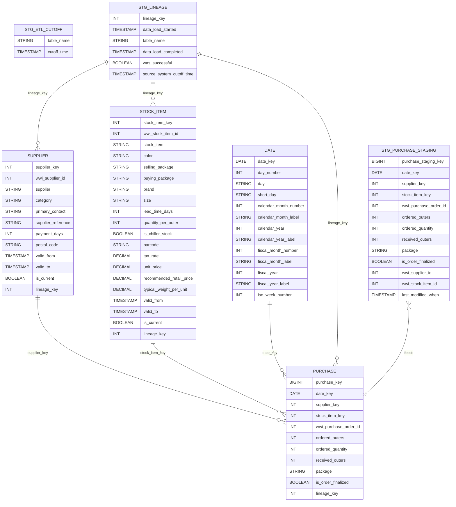

# To-Be Design: Purchase

_Generated: 2026-08-25 | Pipeline stage: to-be_


## 1. Definition

### 1.1 System Identity

| Attribute | Value |
|---|---|
| Product Name | Purchase |
| Project | GlobalPurchase_Project |
| Target Platform | Databricks (Delta Lake, Unity Catalog) |
| Unity Catalog | `globalpurchase` |
| Schema — Staging | `globalpurchase.stg` |
| Schema — Fact | `globalpurchase.fact` |
| Schema — Dimension | `globalpurchase.dim` |
| Primary Fact Table | `globalpurchase.fact.purchase` |
| Staging Table | `globalpurchase.stg.purchase_staging` |
| Grain | One row per purchase order line; natural key is (`wwi_purchase_order_id`, `stock_item_key`, `date_key`) |
| Surrogate Key | `purchase_key BIGINT GENERATED ALWAYS AS IDENTITY` |
| Source System (legacy) | `WideWorldImportersDW.Fact.Purchase` on SQL Server 2014 |

---

### 1.2 Business Purpose

The migrated Purchase data product answers the following business questions on the target Databricks platform:

- **Procurement volume tracking** — what quantities of each stock item were ordered and received from each supplier on each date, enabling buyer performance reporting and demand planning.
- **Order fulfilment analysis** — comparison of `ordered_outers` vs. `received_outers` to surface receipt shortfalls and fulfilment rate trends by supplier.
- **Order finalisation status** — identification of open vs. finalised purchase orders, supporting accounts-payable workflows and accrual reporting.
- **Packaging profile** — distribution of purchase lines by packaging type, used in warehouse space planning and logistics optimisation.
- **Derived quantity integrity** — provision of `ordered_quantity` (computed as `ordered_outers × quantity_per_outer`) as a first-class fact measure, enabling direct comparison with sales-side quantities without on-the-fly joins to product dimension attributes.

The product serves finance, procurement, supply chain, and warehouse operations stakeholders who consume these facts through analytical dashboards and scheduled reports built on the `globalpurchase` Unity Catalog.

---

### 1.3 Technology Stack

| Layer | Technology | Detail |
|---|---|---|
| Cloud Platform | Databricks | Runtime: Databricks Runtime (DBR), cluster managed by Databricks Workflows |
| Storage Format | Delta Lake | All tables created with `USING DELTA`; ACID transactions, time-travel, MERGE support |
| Metastore / Governance | Unity Catalog | Catalog: `globalpurchase`; schemas: `stg`, `dim`, `fact` |
| Orchestration | Databricks Workflow | Daily batch job; task dependency: `nb_extract_watermark` → `nb_extract_purchase_staging` → dimension loads → `nb_load_fact_purchase` |
| Extract Notebook | `nb_extract_purchase_staging.py` | PySpark; JDBC incremental read from OLTP source filtered by `last_modified_when` watermark; writes to `globalpurchase.stg.purchase_staging` via truncate-and-overwrite |
| Load Notebook | `nb_load_fact_purchase.py` | PySpark; two-phase order-level MERGE into `globalpurchase.fact.purchase` (DELETE by `wwi_purchase_order_id`, then INSERT all lines for that order) |
| Watermark Notebook | `nb_extract_watermark.py` | Manages `globalpurchase.stg.etl_cutoff`; injects `lineage_key` via `dbutils.jobs.taskValues` |
| Surrogate Key Generation | Delta `GENERATED ALWAYS AS IDENTITY` | Replaces SQL Server `IDENTITY` and all `SEQUENCE` objects; no Python counter |
| Credential Management | Databricks Secrets | JDBC connection strings and credentials for OLTP source extraction (rule IF-003) |
| Dimension Views | Temporary Views | `supplier`, `stock_item`, `date` resolved as temp views within the fact load notebook session |
| Data Quality | In-notebook DQ assertions | 5 assertions per rule QA-P01 (see Section 4); failures written to `globalpurchase.stg.dq_rejections` |
| Source Control | Git-backed Databricks Repos | Notebooks version-controlled; deployment via CI/CD pipeline |

---

### 1.4 Stakeholders

| Role | Responsibility in Target State |
|---|---|
| Data Engineering Lead | Owns Databricks Workflow configuration, notebook code, and deployment pipeline; approves go-live gate decisions |
| Procurement Analyst | Primary consumer; validates fact row counts, measure values, and supplier-level reports post-migration |
| Finance / Accounts Payable | Consumes order-finalisation status and accrual reports; signs off on `is_order_finalized` semantics |
| Warehouse / Logistics | Consumes packaging and received-quantity data for space planning; validates `received_outers` accuracy |
| Data Governance (Unity Catalog Owner) | Grants catalog-level privileges; maintains column-level access policies; approves schema naming conventions |
| Source System Owner (OLTP) | Confirms `quantity_per_outer` temporality semantics (open gate CX-P03) and authorises JDBC access credentials |
| QA / Data Quality Engineer | Designs and runs DQ assertion suite (QA-P01); monitors `dq_rejections` in steady state |
| Order Product Team | Confirms `package` column case-sensitivity behaviour shared with the Order data product (open gate LN-P01) |

---

### 1.5 Data Domain and Subject Area

| Attribute | Value |
|---|---|
| Data Domain | Procurement / Supply Chain |
| Subject Area | Purchase Orders |
| Grain (business) | One purchase order line per stock item per calendar date |
| Grain (technical) | One Delta row in `globalpurchase.fact.purchase` keyed by (`wwi_purchase_order_id`, `stock_item_key`, `date_key`) |
| Time Dimension | `globalpurchase.dim.date` joined on `date_key` |
| Supplier Dimension | `globalpurchase.dim.supplier` joined on `supplier_key` |
| Stock Item Dimension | `globalpurchase.dim.stock_item` joined on `stock_item_key` |
| Unknown Member Pattern | Surrogate key `= 0` rows retained in each dimension for unresolvable foreign keys; misses written to `globalpurchase.stg.dq_rejections` (rule CX-P02) |
| Historical Coverage | Full history migrated from SQL Server source; incremental thereafter via `last_modified_when` watermark |

---

### 1.6 Key Metrics and KPIs

All column names are in `lowercase_snake_case` per rule NM-001. SQL Server type mappings follow rules TY-001, TY-003, TY-004, TY-006.

| Measure / Attribute | Target Column Name | Target Type | Notes |
|---|---|---|---|
| Surrogate key | `purchase_key` | `BIGINT GENERATED ALWAYS AS IDENTITY` | Replaces SQL Server `IDENTITY`; rule OB-003 |
| Date foreign key | `date_key` | `DATE` | Joins to `date` |
| Supplier foreign key | `supplier_key` | `INT` | Joins to `supplier` |
| Stock item foreign key | `stock_item_key` | `INT` | Joins to `stock_item` |
| Source order identifier | `wwi_purchase_order_id` | `INT` | Nullable; business key for order-level MERGE |
| Ordered outer packs | `ordered_outers` | `INT` | Raw source measure |
| Ordered unit quantity | `ordered_quantity` | `INT` | Derived: `ordered_outers × quantity_per_outer`; computed in `nb_extract_purchase_staging.py` (rule CX-P01) |
| Received outer packs | `received_outers` | `INT` | Raw source measure; DQ assertion: `received_outers ≤ ordered_outers` (warning) |
| Packaging type | `package` | `STRING` | Preserved name and type; case-sensitivity risk documented (rule LN-P01) |
| Order finalisation flag | `is_order_finalized` | `BOOLEAN` | Replaces SQL Server `BIT`; NOT NULL blocking DQ assertion |
| Lineage identifier | `lineage_key` | `INT` | Injected via `dbutils.jobs.taskValues` from `nb_extract_watermark` (rule OB-003-EXT-P01) |

---

### 1.7 Operational Context

| Attribute | Value |
|---|---|
| Load Pattern | Daily incremental batch |
| Orchestration Engine | Databricks Workflow (replaces SSIS `pipeline_dailyetlmain`; rule IF-001) |
| Watermark Mechanism | `globalpurchase.stg.etl_cutoff` table; high-watermark column `last_modified_when` |
| Extract Strategy | JDBC incremental reads from OLTP source, filtered by watermark (rule IF-002) |
| Staging Refresh | `purchase_staging` truncated and overwritten each run (rule IF-004) |
| Fact Merge Strategy | Two-phase order-level replacement: DELETE all rows in `purchase` where `wwi_purchase_order_id` matches the current batch, then INSERT all staging rows for those orders (rules SX-004, SX-004-EXT-P01) |
| Transaction Handling | Delta Lake ACID transactions; no explicit `BEGIN TRAN / COMMIT / ROLLBACK` (rule SX-001) |
| Dimension Dependency | `nb_load_fact_purchase` depends on successful completion of `nb_load_supplier` AND `nb_load_stock_item` before execution (rule IF-001-EXT-P01) |
| Schedule | Daily; schedule time to be confirmed with data engineering lead during deployment |
| Credential Security | JDBC source credentials stored in Databricks Secrets; no plain-text connection strings in notebooks (rule IF-003) |
| Lineage Tracking | `lineage_key` passed as task value from `nb_extract_watermark`; written to `purchase.lineage_key` for auditability (rule OB-003-EXT-P01) |
| Data Quality Monitoring | Five DQ assertions run during `nb_load_fact_purchase`; blocking assertions halt the workflow; warning assertions write to `globalpurchase.stg.dq_rejections` and continue (rule QA-P01) |

#### 1.7.1 Open Stakeholder Gates

Two items require explicit stakeholder sign-off before go-live. The workflow MUST NOT be promoted to production until both gates are closed.

**Gate CX-P03 — `quantity_per_outer` Temporality (Source System Owner)**

The derived measure `ordered_quantity` is computed as `ordered_outers × quantity_per_outer` within `nb_extract_purchase_staging.py` at batch-run time. The `quantity_per_outer` value is read from the OLTP `StockItems` table at the moment of extraction, not from a historical snapshot. If `quantity_per_outer` changes between an order's creation date and the extraction date, the derived `ordered_quantity` will reflect the current value, not the value at the time of purchase.

Action required: the Source System Owner must confirm whether point-in-time `quantity_per_outer` semantics are required. If yes, a historical snapshot approach (e.g., joining to a slowly changing dimension or a versioned product attribute table) must be designed and approved before go-live.

**Gate LN-P01 — `package` Column Case-Sensitivity (Order Product Team)**

The `package` column is preserved with its original name and `STRING` type in `purchase`. This column is also present in the Order data product scope. Databricks Unity Catalog column names are case-insensitive by default at the metadata level, but string data values within `package` are case-sensitive in filter expressions. If the Order product team relies on case-insensitive matching or has normalised `package` values differently, downstream joins or reports spanning both products may return incorrect results.

Action required: the Order Product Team must confirm the accepted case-normalisation behaviour for `package` values and whether a shared reference table or a `LOWER()` convention should be adopted before go-live.


## 2. Consumers

This section describes the target-state consumer landscape for the Purchase data product following migration to Databricks Delta Lake. It covers all known downstream consumers, their connection requirements in the target environment, migration obligations, and the sequencing needed to restore or re-enable consumption after cutover.

---

### 2.1 Consumer Inventory

The table below inventories all consumers that reference Purchase data in the source system. Each consumer is classified by ownership, migration disposition, and target readiness dependency.

| Consumer | Type | Owner | Source Objects Read | Migration Disposition | Target Readiness Dependency |
|---|---|---|---|---|---|
| `wwidw-ordered-by-supplier` (id: `f8751a7d`) | BI Report | Purchase | `fact.purchase`, `dimension.supplier`, `dimension.date` | Migrate — reconnect to target | Purchase product only |
| `wwidw purchase and sale per stockitem dynamic` (id: `8db5c99c`) | BI Report | Purchase / cross-domain | `fact.purchase`, `fact.sale`, `dimension.stock item`, `dimension.date` | Migrate — reconnect to target; blocked on Sale | Purchase AND Sale products |
| `analytics.v_ordertoyearanalytics` | Cross-domain view | Order product team | `fact.purchase` (correlated subquery on `Package` column) | Not migrated by Purchase; Order team owns | Order product migration |
| `application.configuration_reseedetl` | Maintenance procedure | Application team | `fact.purchase` (TRUNCATE) | Not migrated (OB-004); optional bootstrap notebook | Not applicable |

**Legend:**
- *Purchase product only* — consumer can be re-enabled as soon as Purchase migration is complete.
- *Purchase AND Sale products* — consumer remains unavailable until both data products have migrated.
- *Not migrated by Purchase* — this product team has no obligation to migrate or reconnect this consumer.

---

### 2.2 BI Reports

Both Purchase-owned BI reports must be reconfigured to connect via a Databricks SQL Warehouse. The target connection endpoint replaces the source SQL Server Analysis Services or direct SQL Server connection. Reports must use Unity Catalog three-part names (`catalog.schema.table`) in all queries and must adopt the snake_case naming convention (rule NM-001) for all table, column, and schema references.

**Target connection parameters (both reports):**

| Parameter | Value |
|---|---|
| Connection type | Databricks SQL Warehouse (JDBC / ODBC) |
| Catalog | `globalpurchase` |
| HTTP Path | \<Databricks SQL Warehouse HTTP Path — populated at deployment\> |
| Authentication | Personal Access Token or OAuth M2M (per organisational standard) |
| Default schema | `fact` |

#### 2.2.1 wwidw-ordered-by-supplier (id: f8751a7d)

**Description.** Supplier ordering analysis report. Reads purchase transactions joined to supplier and date dimensions to analyse order volumes, values, and patterns by supplier over time.

**Source objects (as-is):**

| Source object | Schema | Type |
|---|---|---|
| `Purchase` | `fact` | Fact table |
| `Supplier` | `dimension` | Dimension table |
| `Date` | `dimension` | Dimension table |

**Target objects (to-be):**

| Target object | Catalog | Schema | Type |
|---|---|---|---|
| `purchase` | `globalpurchase` | `fact` | Fact table |
| `supplier` | `globalpurchase` | `dim` | Dimension table |
| `date` | `globalpurchase` | `dim` | Dimension table |

**Migration actions required by report owner:**

1. Update the data source connection to point to the Databricks SQL Warehouse endpoint for the `globalpurchase` catalog.
2. Replace all table references using the three-part naming convention: `globalpurchase.fact.purchase`, `globalpurchase.dim.supplier`, `globalpurchase.dim.date`.
3. Update all column references to snake_case (e.g. `SupplierID` → `supplier_id`, `OrderDate` → `order_date`).
4. Validate report output against a parallel-run baseline before decommissioning the source connection.

**Data availability SLA.** Daily batch refresh; data current to end of previous business day. Cadence is preserved from the source system.

**Readiness dependency.** This report depends on the Purchase product only. It can be reconnected immediately after Purchase cutover, independently of any other product migration.

---

#### 2.2.2 wwidw purchase and sale per stockitem dynamic (id: 8db5c99c)

**Description.** Primary purchase-and-sales comparison report. Cross-domain report that joins purchase transactions to sales transactions and to the stock item and date dimensions, enabling comparison of purchasing and selling activity at the stock item level.

**Source objects (as-is):**

| Source object | Schema | Type | Product |
|---|---|---|---|
| `Purchase` | `fact` | Fact table | Purchase |
| `Sale` | `fact` | Fact table | Sale (cross-domain) |
| `Stock Item` | `dimension` | Dimension table | Shared / conformed |
| `Date` | `dimension` | Dimension table | Shared / conformed |

**Target objects (to-be):**

| Target object | Catalog | Schema | Type | Product |
|---|---|---|---|---|
| `purchase` | `globalpurchase` | `fact` | Fact table | Purchase |
| `fact_sale` | `globalsale` (TBC) | `fact` | Fact table | Sale (cross-domain) |
| `stock_item` | `globalpurchase` | `dim` | Dimension table | Shared / conformed |
| `date` | `globalpurchase` | `dim` | Dimension table | Shared / conformed |

**Migration actions required by report owner:**

1. Update the data source connection(s) to point to the Databricks SQL Warehouse endpoint. The report joins across two data products; if these reside in separate Unity Catalog catalogs, two connection definitions or a cross-catalog query via Unity Catalog federation may be required — confirm with the Sale product team.
2. Replace all table references with three-part target names.
3. Update all column references to snake_case.
4. Coordinate cutover timing with the Sale product team: this report must not be switched to the target until both `purchase` and `fact_sale` are loaded and validated in the target environment.
5. Validate cross-domain join output against a parallel-run baseline before decommissioning source connections.

**Data availability SLA.** Daily batch refresh; data current to end of previous business day. Cadence preserved from source system. Both products must complete their daily load before this report's scheduled refresh.

**Readiness dependency.** This report is blocked until both the Purchase product AND the Sale product have completed migration and validated data loads. It cannot be reconnected on Purchase cutover alone.

---

### 2.3 Cross-Domain Views

#### analytics.v_ordertoyearanalytics

This view exists in the source system under the `analytics` schema and is driven primarily by `fact.order`. It references `fact.purchase` via a correlated subquery that filters on the `Package` column:

```sql
-- Representative source pattern (SQL Server)
WHERE fo.Package = p.Package
```

**Disposition (rule OB-005, LN-P01).** `analytics.v_ordertoyearanalytics` is **not migrated by the Purchase product team**. Ownership belongs to the Order product team, who will rebuild or re-platform this view as part of their own migration. The Purchase product's obligation is limited to preserving the `package` column name in `globalpurchase.fact.purchase` so that the view can reference it without modification when it is eventually rebuilt.

**Rule LN-P01 — column preservation.** The `package` column is retained in `purchase` with type `STRING`. The column name is not aliased, renamed, or dropped. This is a deliberate cross-product compatibility commitment.

**Schema remapping note (rule NM-005).** The `analytics` schema in the source maps to `mart` in the target (Unity Catalog). When the Order product team rebuilds `v_ordertoyearanalytics`, the target location will be in the `mart` schema of the appropriate catalog, following the `v_` prefix convention (rule OB-005). The Purchase product team has no further obligation for this object.

**Case-sensitivity risk — documented for Order product team.** SQL Server collation `CI_AS` (case-insensitive, accent-sensitive) means the correlated subquery `fo.Package = p.Package` in the source succeeds regardless of mixed casing in the `Package` values. Databricks Delta Lake uses **case-sensitive string comparison by default**. If any `package` values in `fact.order` and `purchase` differ in case (e.g. `"Carton"` vs `"carton"`), the join will silently produce fewer rows in the target environment, causing under-counting without an explicit error.

The Purchase product team documents this risk here so that the Order product team is aware when rebuilding the view. Mitigation options for the Order team include:

- Normalising `package` values to a canonical case (e.g. `UPPER()` or `LOWER()`) in both fact tables during ETL.
- Applying `LOWER(fo.Package) = LOWER(p.Package)` in the rebuilt view.
- Confirming through data profiling that casing is already consistent across both source tables before cutover.

The Purchase ETL does not apply case normalisation to the `package` column unilaterally, as this could change behaviour for other consumers. The risk is flagged, not resolved, by this product.

---

### 2.4 Consumption Patterns

In the target state all consumers access Purchase data through the **Databricks SQL Warehouse** layer, replacing direct SQL Server connectivity. The following consumption patterns apply.

**Interactive / scheduled BI queries.** Reports connect via JDBC or ODBC to a Databricks SQL Warehouse. Queries reference `globalpurchase.fact.purchase` and conformed dimension tables using three-part Unity Catalog names. The SQL Warehouse handles compute scaling; no dedicated report server or SSAS cube is required.

**Batch refresh window.** The Databricks ETL Workflow (rule PL-002: SSIS → Databricks Workflow) runs on a daily schedule. The fact table and dimension tables are fully refreshed (or incrementally merged, per ETL design) before the start of business. Reports scheduled to run in the morning window will find data current to end of previous business day, preserving the as-is SLA.

**Data access control.** Unity Catalog governs permissions. Consumers are granted `SELECT` on the target tables via Unity Catalog grants at the schema or table level. Report service accounts are granted access by the data platform team at product launch.

**Schema.** All target tables reside in the `globalpurchase` catalog:
- `globalpurchase.fact.purchase` — central fact table
- `globalpurchase.dim.supplier` — supplier dimension
- `globalpurchase.dim.stock_item` — stock item dimension
- `globalpurchase.dim.date` — date dimension

Staging tables (`globalpurchase.stg.*`) are internal to the ETL pipeline and are not exposed to BI consumers.

**No OLAP / cube layer.** The source system may have included an SSAS or similar OLAP layer. The target design does not include a dedicated cube; consumers query Delta Lake tables directly via SQL Warehouse. If an OLAP semantic layer is required in future, it is out of scope for this migration.

---

### 2.5 Migration Impact on Consumers

The table below summarises the actions each consumer must take to migrate from the source to the target environment.

| Consumer | Impact Category | Required Actions | Blocking Dependency |
|---|---|---|---|
| `wwidw-ordered-by-supplier` | Connection + query update | (1) Update connection to Databricks SQL Warehouse / `globalpurchase` catalog. (2) Rename table references to `purchase`, `supplier`, `date`. (3) Update column references to snake_case. (4) Test and validate. | Purchase product migration only |
| `wwidw purchase and sale per stockitem dynamic` | Connection + query update + cross-domain coordination | (1) Update connection(s) to Databricks SQL Warehouse. (2) Rename all table references (both Purchase and Sale target names). (3) Update all column references to snake_case. (4) Coordinate cutover with Sale product team. (5) Test cross-domain join output. (6) Validate before source decommission. | Purchase AND Sale product migrations |
| `analytics.v_ordertoyearanalytics` | Full rebuild by Order product team | (1) Order team rebuilds view referencing `globalpurchase.fact.purchase.package`. (2) Apply case-sensitivity mitigation for the `Package` join. (3) Deploy to `mart` schema in target catalog. | Order product migration |
| `application.configuration_reseedetl` | Decommission / optional replacement | (1) Procedure is not migrated (OB-004). (2) If bootstrap truncation is needed, an equivalent Databricks notebook cell (`TRUNCATE TABLE globalpurchase.fact.purchase`) may be created optionally. (3) Confirm with application team whether any automation triggers this procedure and update those triggers. | None (no data dependency) |

---

### 2.6 Consumer Priority for Migration

Consumers are sequenced based on their data product dependencies and business impact.

| Priority | Consumer | Rationale |
|---|---|---|
| **1 — Immediate** | `wwidw-ordered-by-supplier` (id: `f8751a7d`) | Depends on Purchase product only. Can be reconnected on Purchase cutover day. Supplier ordering analysis is a core operational report; early restoration reduces business disruption. |
| **2 — Coordinated** | `wwidw purchase and sale per stockitem dynamic` (id: `8db5c99c`) | Depends on both Purchase and Sale products. Must remain on the source system until Sale migration completes. Purchase product team should flag this report to the Sale product team as a joint cutover item and align on a shared go-live date. |
| **3 — Order team** | `analytics.v_ordertoyearanalytics` | Fully owned by the Order product team. Purchase product team's only obligation is the `package` column preservation commitment (LN-P01) and the documented case-sensitivity risk. No action required by Purchase team beyond documentation. |
| **4 — Decommission** | `application.configuration_reseedetl` | Not a consumer in the analytical sense; a maintenance procedure. Decommissioned under OB-004. Optional bootstrap notebook can be provided on request. Lowest priority; no reporting impact. |

**Summary.** The Purchase product migration unlocks Priority 1 immediately. Priority 2 requires a cross-team coordination milestone with the Sale product team. Priorities 3 and 4 are outside the Purchase product team's direct control and are managed by the Order and Application teams respectively, with supporting artefacts provided by the Purchase product team where noted.


## 3. Model

### 3.1 Model Overview

The Purchase data product is implemented in the `globalpurchase` Unity Catalog using a three-layer medallion architecture:

| Layer | Schema | Purpose |
|---|---|---|
| Bronze / Staging | `globalpurchase.stg` | Raw ingest from source SQL Server; nullable columns, full fidelity, no transformations beyond type casting. Staging tables are truncated and reloaded on each ETL run. |
| Silver / Dimensional | `globalpurchase.dim` | Conformed, history-tracked dimensions (SCD-2) in Delta format. Keyed by surrogate integer keys that replace source IDENTITY/SEQUENCE values. |
| Gold / Fact | `globalpurchase.fact` | Insert-only fact table in Delta format. Stores one row per purchase order line, linked to dimension tables by surrogate keys. |
| Reporting / Mart | `globalpurchase.mart` | (Reserved for aggregated views and pre-joined reporting tables — no mart objects are defined in the initial release.) |

All tables use `USING DELTA` storage. Unity Catalog governs access via column-level and row-level security grants applied post-DDL.

**Catalog and schema layout:**

```
globalpurchase                        -- Unity Catalog catalog
├── stg                               -- Staging / bronze
│   ├── purchase_staging
│   ├── etl_cutoff
│   └── lineage
├── dim                               -- Dimension / silver
│   ├── supplier        (SCD-2)
│   ├── stock_item      (SCD-2)
│   └── date            (static)
└── fact                              -- Fact / gold
    └── purchase
```

Surrogate keys follow the **GENERATED ALWAYS AS IDENTITY** pattern (rule PL-004); SEQUENCE objects used in the source are not replicated. Delta does not enforce primary-key or foreign-key constraints; referential integrity is enforced in ETL logic (MERGE predicates and NOT MATCHED guards).

---

### 3.2 Fact Table: purchase

#### 3.2.1 Target DDL

```sql
CREATE TABLE globalpurchase.fact.purchase
(
    purchase_key          BIGINT  GENERATED ALWAYS AS IDENTITY   COMMENT 'Surrogate PK — replaces source IDENTITY; Delta does not enforce uniqueness',
    date_key              DATE    NOT NULL                        COMMENT 'Natural date FK; joins to date.date_key',
    supplier_key          INT     NOT NULL                        COMMENT 'Surrogate FK to supplier.supplier_key',
    stock_item_key        INT     NOT NULL                        COMMENT 'Surrogate FK to stock_item.stock_item_key',
    wwi_purchase_order_id INT                                     COMMENT 'Source business key; used as MERGE predicate in ETL',
    ordered_outers        INT     NOT NULL                        COMMENT 'Ordered outer packs',
    ordered_quantity      INT     NOT NULL                        COMMENT 'Total ordered units',
    received_outers       INT     NOT NULL                        COMMENT 'Received outer packs',
    package               STRING  NOT NULL                        COMMENT 'Package description; name preserved per LN-P01',
    is_order_finalized    BOOLEAN NOT NULL                        COMMENT 'Source BIT → BOOLEAN per TY-005',
    lineage_key           INT     NOT NULL                        COMMENT 'ETL run reference; injected via dbutils.jobs.taskValues'
)
USING DELTA
COMMENT 'Gold fact table — one row per purchase order line. Insert-only; no deletes or updates after load.'
TBLPROPERTIES (
    'delta.minReaderVersion' = '1',
    'delta.minWriterVersion' = '2'
);
```

#### 3.2.2 Column Inventory

| # | Target Column | Data Type | Nullable | Source Column | Source Type | Transformation Rule |
|---|---|---|---|---|---|---|
| 1 | `purchase_key` | BIGINT GENERATED ALWAYS AS IDENTITY | NOT NULL | `[Purchase Key]` | bigint IDENTITY(1,1) | TY-006, PL-004: IDENTITY → GENERATED ALWAYS AS IDENTITY |
| 2 | `date_key` | DATE | NOT NULL | `[Date Key]` | date | TY-004: DATE → DATE (no change) |
| 3 | `supplier_key` | INT | NOT NULL | `[Supplier Key]` | int | TY-001: INT → INT (no change) |
| 4 | `stock_item_key` | INT | NOT NULL | `[Stock Item Key]` | int | TY-001: INT → INT (no change) |
| 5 | `wwi_purchase_order_id` | INT | NULL | `[WWI Purchase Order ID]` | int NULL | TY-001, NM-002: spaces → underscores |
| 6 | `ordered_outers` | INT | NOT NULL | `[Ordered Outers]` | int | TY-001, NM-002 |
| 7 | `ordered_quantity` | INT | NOT NULL | `[Ordered Quantity]` | int | TY-001, NM-002 |
| 8 | `received_outers` | INT | NOT NULL | `[Received Outers]` | int | TY-001, NM-002 |
| 9 | `package` | STRING | NOT NULL | `[Package]` | nvarchar(100) | TY-003: NVARCHAR → STRING; LN-P01: name preserved as `package` |
| 10 | `is_order_finalized` | BOOLEAN | NOT NULL | `[Is Order Finalized]` | bit | TY-005: BIT → BOOLEAN |
| 11 | `lineage_key` | INT | NOT NULL | `[Lineage Key]` | int | TY-001; sourced from ETL task context (OB-003-EXT-P01) |

**Notes:**
- The composite primary key `(Purchase Key, Date Key)` present in the source is not replicated. Delta Lake does not enforce primary-key constraints. ETL uniqueness is enforced by the MERGE predicate `ON target.wwi_purchase_order_id = source.wwi_purchase_order_id`.
- `purchase_key` is generated by Delta's IDENTITY mechanism; ETL must not supply a value for this column on INSERT.

---

### 3.3 Dimension Tables

#### 3.3.1 supplier

SCD Type 2 dimension. Each historical version of a supplier record occupies a distinct row, bounded by `valid_from` / `valid_to` timestamps. The current row has `is_current = TRUE`.

Sentinel row with `supplier_key = 0` is seeded during bootstrap (rule CX-P02) to represent "unknown supplier".

```sql
CREATE TABLE globalpurchase.dim.supplier
(
    supplier_key        INT         NOT NULL    COMMENT 'Surrogate PK — replaces source SEQUENCE-backed IDENTITY',
    wwi_supplier_id     INT         NOT NULL    COMMENT 'Source natural key',
    supplier            STRING      NOT NULL    COMMENT 'Supplier name',
    category            STRING      NOT NULL    COMMENT 'Supplier category',
    primary_contact     STRING      NOT NULL    COMMENT 'Primary contact name',
    supplier_reference  STRING                  COMMENT 'External reference code; nullable',
    payment_days        INT         NOT NULL    COMMENT 'Standard payment terms in days',
    postal_code         STRING      NOT NULL    COMMENT 'Postal / ZIP code',
    valid_from          TIMESTAMP   NOT NULL    COMMENT 'SCD-2 effective start; source datetime2 → TIMESTAMP per TY-004',
    valid_to            TIMESTAMP   NOT NULL    COMMENT 'SCD-2 effective end; open row uses 9999-12-31 convention',
    is_current          BOOLEAN     NOT NULL    COMMENT 'True for the active version of each supplier (added for SCD-2 flag)',
    lineage_key         INT         NOT NULL    COMMENT 'ETL run reference'
)
USING DELTA
COMMENT 'SCD-2 supplier dimension. Bootstrap seeds supplier_key=0 sentinel row (CX-P02).'
TBLPROPERTIES (
    'delta.minReaderVersion' = '1',
    'delta.minWriterVersion' = '2'
);
```

**Column mapping — supplier:**

| Target Column | Source Column | Source Type | Target Type | Rule |
|---|---|---|---|---|
| `supplier_key` | `Supplier Key` | int (SEQUENCE) | INT | PL-004, TY-001 |
| `wwi_supplier_id` | `WWI Supplier ID` | int | INT | TY-001, NM-002 |
| `supplier` | `Supplier` | nvarchar(200) | STRING | TY-003 |
| `category` | `Category` | nvarchar(100) | STRING | TY-003 |
| `primary_contact` | `Primary Contact` | nvarchar(100) | STRING | TY-003, NM-002 |
| `supplier_reference` | `Supplier Reference` | nvarchar(40) NULL | STRING | TY-003, NM-002 |
| `payment_days` | `Payment Days` | int | INT | TY-001, NM-002 |
| `postal_code` | `Postal Code` | nvarchar(20) | STRING | TY-003, NM-002 |
| `valid_from` | `Valid From` | datetime2 | TIMESTAMP | TY-004, NM-002 |
| `valid_to` | `Valid To` | datetime2 | TIMESTAMP | TY-004, NM-002 |
| `is_current` | _(derived)_ | — | BOOLEAN | Added — SCD-2 active-row flag; no source equivalent |
| `lineage_key` | `Lineage Key` | int | INT | TY-001, NM-002 |

---

#### 3.3.2 stock_item

SCD Type 2 dimension. The `Photo` column (`varbinary(1)`) present in the source is **excluded** from the target schema (rule TY-005-EXT-P01 — the column held only a placeholder value and carries no analytical value). The `is_current` flag is added for SCD-2 tracking.

Sentinel row with `stock_item_key = 0` is seeded during bootstrap (rule CX-P02).

```sql
CREATE TABLE globalpurchase.dim.stock_item
(
    stock_item_key              INT             NOT NULL    COMMENT 'Surrogate PK',
    wwi_stock_item_id           INT             NOT NULL    COMMENT 'Source natural key',
    stock_item                  STRING          NOT NULL    COMMENT 'Stock item description',
    color                       STRING          NOT NULL    COMMENT 'Colour',
    selling_package             STRING          NOT NULL    COMMENT 'Package used when selling',
    buying_package              STRING          NOT NULL    COMMENT 'Package used when buying',
    brand                       STRING          NOT NULL    COMMENT 'Brand',
    size                        STRING          NOT NULL    COMMENT 'Size descriptor',
    lead_time_days              INT             NOT NULL    COMMENT 'Procurement lead time in days',
    quantity_per_outer          INT             NOT NULL    COMMENT 'Units per outer pack',
    is_chiller_stock            BOOLEAN         NOT NULL    COMMENT 'Requires refrigeration; BIT → BOOLEAN per TY-005',
    barcode                     STRING                      COMMENT 'Barcode string; nullable',
    tax_rate                    DECIMAL(18,3)   NOT NULL    COMMENT 'Applicable tax rate; DECIMAL precision preserved per TY-002',
    unit_price                  DECIMAL(18,2)   NOT NULL    COMMENT 'Unit selling price',
    recommended_retail_price    DECIMAL(18,2)               COMMENT 'RRP; nullable',
    typical_weight_per_unit     DECIMAL(18,3)   NOT NULL    COMMENT 'Weight in kg',
    -- photo column EXCLUDED per TY-005-EXT-P01
    valid_from                  TIMESTAMP       NOT NULL    COMMENT 'SCD-2 effective start',
    valid_to                    TIMESTAMP       NOT NULL    COMMENT 'SCD-2 effective end',
    is_current                  BOOLEAN         NOT NULL    COMMENT 'True for the active version of each stock item (added for SCD-2 flag)',
    lineage_key                 INT             NOT NULL    COMMENT 'ETL run reference'
)
USING DELTA
COMMENT 'SCD-2 stock item dimension. Photo column excluded (TY-005-EXT-P01). Bootstrap seeds stock_item_key=0 sentinel row (CX-P02).'
TBLPROPERTIES (
    'delta.minReaderVersion' = '1',
    'delta.minWriterVersion' = '2'
);
```

**Column mapping — stock_item:**

| Target Column | Source Column | Source Type | Target Type | Rule |
|---|---|---|---|---|
| `stock_item_key` | `Stock Item Key` | int | INT | TY-001, NM-002 |
| `wwi_stock_item_id` | `WWI Stock Item ID` | int | INT | TY-001, NM-002 |
| `stock_item` | `Stock Item` | nvarchar(200) | STRING | TY-003, NM-002 |
| `color` | `Color` | nvarchar(40) | STRING | TY-003 |
| `selling_package` | `Selling Package` | nvarchar(100) | STRING | TY-003, NM-002 |
| `buying_package` | `Buying Package` | nvarchar(100) | STRING | TY-003, NM-002 |
| `brand` | `Brand` | nvarchar(100) | STRING | TY-003 |
| `size` | `Size` | nvarchar(40) | STRING | TY-003 |
| `lead_time_days` | `Lead Time Days` | int | INT | TY-001, NM-002 |
| `quantity_per_outer` | `Quantity Per Outer` | int | INT | TY-001, NM-002 |
| `is_chiller_stock` | `Is Chiller Stock` | bit | BOOLEAN | TY-005, NM-002 |
| `barcode` | `Barcode` | nvarchar(100) NULL | STRING | TY-003 |
| `tax_rate` | `Tax Rate` | decimal(18,3) | DECIMAL(18,3) | TY-002, NM-002 |
| `unit_price` | `Unit Price` | decimal(18,2) | DECIMAL(18,2) | TY-002, NM-002 |
| `recommended_retail_price` | `Recommended Retail Price` | decimal(18,2) NULL | DECIMAL(18,2) | TY-002, NM-002 |
| `typical_weight_per_unit` | `Typical Weight Per Unit` | decimal(18,3) | DECIMAL(18,3) | TY-002, NM-002 |
| _(excluded)_ | `Photo` | varbinary(1) | — | TY-005-EXT-P01: excluded |
| `valid_from` | `Valid From` | datetime2 | TIMESTAMP | TY-004, NM-002 |
| `valid_to` | `Valid To` | datetime2 | TIMESTAMP | TY-004, NM-002 |
| `is_current` | _(derived)_ | — | BOOLEAN | Added — SCD-2 active-row flag |
| `lineage_key` | `Lineage Key` | int | INT | TY-001, NM-002 |

---

#### 3.3.3 date

Static reference dimension. The source `Dimension.Date` table has 62 columns and uses `Date` (date type) as its natural primary key. The target preserves this structure verbatim with type mapping only. Because it is a static reference table — loaded once and never updated — it carries no `lineage_key` or SCD-2 columns.

Only the columns required for joining to `purchase` and common reporting use are shown below; the full 62-column set is preserved in the ETL load script.

```sql
CREATE TABLE globalpurchase.dim.date
(
    date_key                    DATE            NOT NULL    COMMENT 'Natural PK — joins to purchase.date_key',
    day_number                  INT             NOT NULL    COMMENT 'Day of month number',
    day                         STRING          NOT NULL    COMMENT 'Day name (Monday, Tuesday, …)',
    short_day                   STRING          NOT NULL    COMMENT 'Abbreviated day name (Mon, Tue, …)',
    calendar_month_number       INT             NOT NULL    COMMENT 'Month number within calendar year',
    calendar_month_label        STRING          NOT NULL    COMMENT 'Month label (January, February, …)',
    calendar_year               INT             NOT NULL    COMMENT 'Calendar year (e.g. 2024)',
    calendar_year_label         STRING          NOT NULL    COMMENT 'Calendar year label (e.g. "CY2024")',
    fiscal_month_number         INT             NOT NULL    COMMENT 'Month number within fiscal year',
    fiscal_month_label          STRING          NOT NULL    COMMENT 'Fiscal month label',
    fiscal_year                 INT             NOT NULL    COMMENT 'Fiscal year',
    fiscal_year_label           STRING          NOT NULL    COMMENT 'Fiscal year label',
    iso_week_number             INT             NOT NULL    COMMENT 'ISO 8601 week number'
    -- ... remaining 49 columns follow same pattern: INT or STRING per TY-001/TY-003
)
USING DELTA
COMMENT 'Static date dimension. Natural PK on date_key (DATE). No SCD-2; loaded once. Full 62-column set populated by ETL.'
TBLPROPERTIES (
    'delta.minReaderVersion' = '1',
    'delta.minWriterVersion' = '2'
);
```

**Key type decisions — date:**
- Source `DateKey` (integer, e.g. 20240115) is **not** used as the join key in the target. The natural `Date` (date) column is mapped to `date_key DATE`, matching the `purchase.date_key DATE` join column directly. This avoids integer-to-date conversion in queries.
- All source `nvarchar`/`varchar` columns become `STRING` (TY-003).
- Source integer columns become `INT` (TY-001).

---

### 3.4 Staging Tables

Staging tables reside in `globalpurchase.stg`. They receive raw data from the SQL Server source and are truncated before each load. Column names follow NM-001/NM-002 (lowercase snake_case). Nullable source columns remain nullable in staging.

#### 3.4.1 purchase_staging

Maps to source `Integration.Purchase_Staging`. Suffix `_staging` preserved per NM-004.

```sql
CREATE TABLE globalpurchase.stg.purchase_staging
(
    purchase_staging_key    BIGINT      GENERATED ALWAYS AS IDENTITY   COMMENT 'Surrogate staging PK — replaces source IDENTITY; TY-006',
    date_key                DATE                                        COMMENT 'Date FK candidate; nullable at staging',
    supplier_key            INT                                         COMMENT 'Supplier FK candidate; nullable at staging',
    stock_item_key          INT                                         COMMENT 'Stock item FK candidate; nullable at staging',
    wwi_purchase_order_id   INT                                         COMMENT 'Source purchase order ID',
    ordered_outers          INT                                         COMMENT 'Ordered outer packs',
    ordered_quantity        INT                                         COMMENT 'Total ordered units',
    received_outers         INT                                         COMMENT 'Received outer packs',
    package                 STRING                                      COMMENT 'Package description; LN-P01: name preserved',
    is_order_finalized      BOOLEAN                                     COMMENT 'BIT → BOOLEAN per TY-005',
    wwi_supplier_id         INT                                         COMMENT 'Source supplier natural key',
    wwi_stock_item_id       INT                                         COMMENT 'Source stock item natural key',
    last_modified_when      TIMESTAMP                                   COMMENT 'Source last-modified watermark; datetime2 → TIMESTAMP per TY-004'
)
USING DELTA
COMMENT 'Bronze staging table for purchase order lines. Truncated and reloaded each ETL run.'
TBLPROPERTIES (
    'delta.minReaderVersion' = '1',
    'delta.minWriterVersion' = '2'
);
```

#### 3.4.2 etl_cutoff

Maps to source `Integration.[ETL Cutoff]`. Name simplified to `etl_cutoff` (NM-001/NM-002); no `_staging` suffix (NM-004 exception for control tables).

```sql
CREATE TABLE globalpurchase.stg.etl_cutoff
(
    table_name      STRING      NOT NULL    COMMENT 'Source table identifier; sysname → STRING NOT NULL per TY-003-EXT-P01',
    cutoff_time     TIMESTAMP   NOT NULL    COMMENT 'Last successfully processed watermark; datetime2 → TIMESTAMP per TY-004'
)
USING DELTA
COMMENT 'ETL watermark control table. One row per tracked source table. Upserted by ETL orchestration.'
TBLPROPERTIES (
    'delta.minReaderVersion' = '1',
    'delta.minWriterVersion' = '2'
);
```

**Key decision:** Source `Table Name` uses SQL Server type `sysname` (an alias for `nvarchar(128) NOT NULL`). Target maps to `STRING NOT NULL` per TY-003-EXT-P01. The NOT NULL constraint is preserved.

#### 3.4.3 lineage

Maps to source `Integration.Lineage`. Name is `lineage` (NM-004 exception — control/audit table, no `_staging` suffix).

```sql
CREATE TABLE globalpurchase.stg.lineage
(
    lineage_key                 INT         GENERATED ALWAYS AS IDENTITY   COMMENT 'Surrogate PK — replaces source SEQUENCE-backed IDENTITY; PL-004, TY-006',
    data_load_started           TIMESTAMP   NOT NULL                        COMMENT 'ETL batch start time; datetime2 → TIMESTAMP per TY-004',
    table_name                  STRING      NOT NULL                        COMMENT 'Source table identifier; sysname → STRING NOT NULL per TY-003-EXT-P01',
    data_load_completed         TIMESTAMP                                   COMMENT 'ETL batch completion time; NULL until load finishes',
    was_successful              BOOLEAN                                     COMMENT 'Load outcome flag; BIT → BOOLEAN per TY-005',
    source_system_cutoff_time   TIMESTAMP                                   COMMENT 'Watermark from source at time of extract; datetime2 → TIMESTAMP per TY-004'
)
USING DELTA
COMMENT 'ETL run lineage / audit log. One row per ETL batch per table. Written by ETL orchestration layer.'
TBLPROPERTIES (
    'delta.minReaderVersion' = '1',
    'delta.minWriterVersion' = '2'
);
```

---

### 3.5 Key Design Decisions

#### 3.5.1 Composite PK Elimination

The source `Fact.Purchase` table defines a composite primary key on `([Purchase Key], [Date Key])`. Delta Lake does not support or enforce relational primary-key constraints. The composite PK is therefore not replicated in the target DDL. Uniqueness of fact rows is enforced in ETL via the MERGE predicate on `wwi_purchase_order_id`. The `purchase_key` column serves as a row identifier for downstream tooling only.

#### 3.5.2 IDENTITY and SEQUENCE Replacement (PL-004, TY-006)

Source tables use SQL Server `IDENTITY(1,1)` columns and, for dimension surrogate keys, `SEQUENCE` objects fed through `DEFAULT (NEXT VALUE FOR ...)`. Both patterns are replaced by `BIGINT GENERATED ALWAYS AS IDENTITY` (fact and staging tables) or `INT GENERATED ALWAYS AS IDENTITY` (dimension and lineage tables) using Delta's native identity column support. No `SEQUENCE` objects are created in the target catalog.

#### 3.5.3 sysname → STRING NOT NULL (TY-003-EXT-P01)

SQL Server's `sysname` pseudo-type is an alias for `nvarchar(128) NOT NULL`. In `etl_cutoff.table_name` and `lineage.table_name`, this maps to `STRING NOT NULL` — preserving both the string semantic and the NOT NULL constraint. No length cap is applied; Delta STRING is unbounded.

#### 3.5.4 Photo Column Exclusion (TY-005-EXT-P01)

The source `Dimension.[Stock Item]` table contains a `Photo varbinary(1)` column that held only a single-byte placeholder (`0x0`) — the source schema comment confirms no actual image data was ever stored. Loading this column would consume storage for zero analytical value. The column is excluded from `stock_item` entirely. ETL SELECT statements must omit `Photo` to avoid type-cast errors; this is documented in the ETL specification.

#### 3.5.5 SCD-2 is_current Flag Addition

Source SCD-2 dimensions (`Dimension.Supplier`, `Dimension.[Stock Item]`) track history via `Valid From` / `Valid To` bounds only. The target adds an `is_current BOOLEAN NOT NULL` column to each dimension table. This flag is set to `TRUE` for the row where `valid_to = '9999-12-31'` (the open-ended, currently-active row) and `FALSE` for all historical rows. The flag significantly simplifies BI queries that need only current-state data, avoiding the need for `WHERE valid_to = '9999-12-31'` predicates in every report.

#### 3.5.6 Naming Convention Applied (NM-001, NM-002, NM-005)

All object names are converted to `lowercase_snake_case`. Spaces in source column names are replaced with underscores. Schema prefixes are remapped: `Integration` → `stg`, `Dimension` → `dim`, `Fact` → `fact`. The column `package` retains its name without further alteration (LN-P01 — no reserved-word conflict in Databricks SQL for this identifier).

#### 3.5.7 Boolean Mapping (TY-005)

All source `bit` columns map to `BOOLEAN`. ETL must cast `1 → TRUE`, `0 → FALSE` explicitly when reading from the SQL Server JDBC source, as Databricks JDBC drivers may not auto-cast SQL Server `BIT` to Spark `BooleanType`.

#### 3.5.8 Decimal Precision Preservation (TY-002)

`DECIMAL(18,3)` and `DECIMAL(18,2)` precisions from the source are carried forward without truncation. No implicit rounding is introduced. This applies to `tax_rate`, `unit_price`, `recommended_retail_price`, and `typical_weight_per_unit` in `stock_item`.

#### 3.5.9 Sentinel Row Seeding (CX-P02)

`supplier` and `stock_item` must each have a sentinel row with surrogate key = 0 inserted during workspace bootstrap. This row represents "unknown / not applicable" and is referenced by `purchase` rows whose supplier or stock item could not be resolved during ETL. Because `GENERATED ALWAYS AS IDENTITY` prevents explicit key insertion in normal operation, the bootstrap script uses `ALTER TABLE ... ALTER COLUMN ... DROP GENERATED` temporarily, inserts the sentinel, then re-adds the IDENTITY property — or alternatively uses a separate identity-override procedure. Sentinel row values: key = 0, all descriptive fields = `'Unknown'`, `valid_from = '1900-01-01'`, `valid_to = '9999-12-31'`, `is_current = FALSE`.

---

### 3.6 Target ER Diagram



---

### 3.7 Source-to-Target Column Mapping — purchase

| # | Source Schema | Source Table | Source Column | Source Type | Nullable | Target Schema | Target Table | Target Column | Target Type | Nullable | Rules Applied |
|---|---|---|---|---|---|---|---|---|---|---|---|
| 1 | Fact | Purchase | `[Purchase Key]` | bigint IDENTITY(1,1) | NOT NULL | fact | purchase | `purchase_key` | BIGINT GENERATED ALWAYS AS IDENTITY | NOT NULL | NM-001, NM-002, TY-006, PL-004 |
| 2 | Fact | Purchase | `[Date Key]` | date | NOT NULL | fact | purchase | `date_key` | DATE | NOT NULL | NM-001, NM-002, TY-004 |
| 3 | Fact | Purchase | `[Supplier Key]` | int | NOT NULL | fact | purchase | `supplier_key` | INT | NOT NULL | NM-001, NM-002, TY-001 |
| 4 | Fact | Purchase | `[Stock Item Key]` | int | NOT NULL | fact | purchase | `stock_item_key` | INT | NOT NULL | NM-001, NM-002, TY-001 |
| 5 | Fact | Purchase | `[WWI Purchase Order ID]` | int | NULL | fact | purchase | `wwi_purchase_order_id` | INT | NULL | NM-001, NM-002, TY-001 |
| 6 | Fact | Purchase | `[Ordered Outers]` | int | NOT NULL | fact | purchase | `ordered_outers` | INT | NOT NULL | NM-001, NM-002, TY-001 |
| 7 | Fact | Purchase | `[Ordered Quantity]` | int | NOT NULL | fact | purchase | `ordered_quantity` | INT | NOT NULL | NM-001, NM-002, TY-001 |
| 8 | Fact | Purchase | `[Received Outers]` | int | NOT NULL | fact | purchase | `received_outers` | INT | NOT NULL | NM-001, NM-002, TY-001 |
| 9 | Fact | Purchase | `[Package]` | nvarchar(100) | NOT NULL | fact | purchase | `package` | STRING | NOT NULL | NM-001, TY-003, LN-P01 |
| 10 | Fact | Purchase | `[Is Order Finalized]` | bit | NOT NULL | fact | purchase | `is_order_finalized` | BOOLEAN | NOT NULL | NM-001, NM-002, TY-005 |
| 11 | Fact | Purchase | `[Lineage Key]` | int | NOT NULL | fact | purchase | `lineage_key` | INT | NOT NULL | NM-001, NM-002, TY-001; value injected from ETL task context |


## 4. Lineage

### 4.1 Lineage Overview

The target-state pipeline for the Purchase data product is a **6-task Databricks Workflow** (`purchase_daily_etl`) that delivers data from four OLTP source tables in Wide World Importers to `globalpurchase.fact.purchase`, which is then consumed by downstream BI reports and cross-domain analytics.

| Metric | As-Is | To-Be |
|---|---|---|
| Total pipeline hops | 7 (OLTP → stored proc → SSIS extract → staging → SSIS migrate → ETL proc → fact) | 6 (OLTP → watermark task → staging notebook → dim tasks → fact notebook → lineage close) |
| Orchestration engine | SSIS (`pipeline_dailyetlmain`) | Databricks Workflow (`purchase_daily_etl`) |
| Staging layer | SQL Server `integration.purchase_staging` | Delta table `globalpurchase.stg.purchase_staging` |
| Fact layer | SQL Server `fact.purchase` | Delta table `globalpurchase.fact.purchase` |
| Dimension resolution | SCD-2 correlated subquery UPDATEs in T-SQL procedure | Broadcast join + ROW_NUMBER tiebreaker in PySpark |
| Fact upsert pattern | DELETE + INSERT inside a single transaction | Two-phase Delta MERGE (DELETE phase then INSERT phase) keyed on `wwi_purchase_order_id` |
| Lineage key generation | `SEQUENCE` object + `integration.lineage` | `stg.lineage` row opened by `nb_extract_watermark`; key propagated via `dbutils.jobs.taskValues` |
| Atomicity guarantee | `BEGIN TRAN / COMMIT / ROLLBACK` (removed; rule SX-001) | Delta Lake ACID transactions per notebook write |

The pipeline reduces external stored-procedure dependencies to zero: `getpurchaseupdates` is replaced by direct JDBC reads (rule OB-002), and `migratestagedpurchasedata` is replaced by `nb_load_fact_purchase.py` (rule OB-002). The SSIS bug that truncated the wrong staging table is eliminated by design (see §4.7).

---

### 4.2 Upstream Lineage

The upstream lineage describes the data path from source OLTP tables into the Gold/Fact layer.

#### Layer 0 — OLTP Source Tables (Wide World Importers)

Four tables are read directly via JDBC, filtered by `last_modified_when > watermark` (rule IF-002):

| Source Table | Schema | Key Columns Used |
|---|---|---|
| `purchasing.purchaseorders` | wideworldimporters | `purchase_order_id`, `supplier_id`, `order_date`, `expected_delivery_date`, `is_order_finalized`, `last_modified_when` |
| `purchasing.purchaseorderlines` | wideworldimporters | `purchase_order_id`, `purchase_order_line_id`, `stock_item_id`, `ordered_outers`, `quantity_per_outer`, `received_outers`, `last_modified_when` |
| `warehouse.stockitems` | wideworldimporters | `stock_item_id` (join key for `package` column; preserved per rule LN-P01) |
| `warehouse.packagetypes` | wideworldimporters | `package_type_id`, `package_type_name` (resolves outer package description) |

JDBC credentials are stored in Databricks Secrets (rule IF-003). The watermark cursor (`last_modified_when`) is read from `stg.etl_cutoff` by `nb_extract_watermark` before JDBC reads begin; the watermark is committed only after all downstream loads succeed (rule IF-002).

#### Layer 1 — Bronze/Staging: `globalpurchase.stg.purchase_staging` (Delta)

Notebook: `nb_extract_purchase_staging.py`

- Joins the four OLTP tables in PySpark and computes the derived metric:  
  `ordered_quantity = ordered_outers × quantity_per_outer`
- Writes the result to `globalpurchase.stg.purchase_staging` using **truncate + overwrite** mode (rule IF-004), ensuring no stale rows carry over between runs.
- Column names follow snake_case (rule NM-001); schema prefixes follow NM-005 (`integration` → `stg`).
- Dimension surrogate keys (`supplier_key`, `stock_item_key`) are **not** resolved at this stage; staging holds only OLTP natural keys (`supplier_id`, `stock_item_id`).

#### Layer 2 — Silver/Dimension Resolution (within `nb_load_fact_purchase.py`)

`nb_load_fact_purchase.py` resolves surrogate keys against the current Gold dimension tables before writing to fact:

| Dimension | Source Table | Resolution Logic |
|---|---|---|
| Supplier | `globalpurchase.dim.supplier` | Broadcast join on `supplier_id`; SCD-2 validity filter (`valid_from ≤ order_date < valid_to`); `ROW_NUMBER() OVER (PARTITION BY supplier_id ORDER BY valid_from DESC)` as tiebreaker; `COALESCE(supplier_key, 0)` (Unknown fallback); misses written to `stg.dq_rejections` |
| Stock Item | `globalpurchase.dim.stock_item` | Same pattern as supplier; broadcast join on `stock_item_id`; SCD-2 validity filter; ROW_NUMBER tiebreaker; COALESCE key=0 fallback; misses to `stg.dq_rejections` |

This replaces the as-is SCD-2 correlated subquery UPDATEs against `purchase_staging` (as-is Steps 2–3 in `migratestagedpurchasedata`). Rule SX-003 governs this change.

#### Layer 3 — Gold/Fact: `globalpurchase.fact.purchase` (Delta)

Notebook: `nb_load_fact_purchase.py` (continued)

After key resolution, the fact table is updated using a **two-phase Delta MERGE** (rule SX-004, SX-004-EXT-P01):

1. **Phase 1 — DELETE:** Remove all existing fact rows whose `wwi_purchase_order_id` appears in the current staging batch (full-order-level replacement).
2. **Phase 2 — INSERT:** Insert all staging rows for those same `wwi_purchase_order_id` values, with resolved surrogate keys and the `lineage_key` stamped from `dbutils.jobs.taskValues`.

This replaces the as-is `DELETE + INSERT` inside a single `BEGIN TRAN / COMMIT` block (as-is Steps 4–5). Delta ACID handles atomicity; explicit transaction control is removed (rule SX-001).

---

### 4.3 Target ETL Steps

The following describes the step-by-step logic executed across the Databricks Workflow tasks, mapping each to its as-is counterpart.

#### Task 1: `nb_extract_watermark`

| Step | Action |
|---|---|
| 1a | Read `cutoff_time` from `globalpurchase.stg.etl_cutoff` WHERE `table_name = 'purchase'` |
| 1b | Insert a new row into `globalpurchase.stg.lineage` (`data_load_started = current_timestamp`, `was_successful = 0`) |
| 1c | Capture the auto-generated `lineage_key` of the new row |
| 1d | `dbutils.jobs.taskValues.set(key="lineage_key", value=<lineage_key>)` — propagates to all downstream tasks |
| 1e | `dbutils.jobs.taskValues.set(key="cutoff_time", value=<cutoff_time>)` |

**Maps to as-is:** Step 1 of `migratestagedpurchasedata` (`@LineageKey = NEXT VALUE FOR [Sequences].[LineageKey]`) and the `SEQUENCE` object. The `SEQUENCE` is eliminated (rule PL-004); lineage key propagation uses `dbutils.jobs.taskValues` (rule OB-003-EXT-P01).

#### Task 2: `nb_extract_purchase_staging`

| Step | Action |
|---|---|
| 2a | Retrieve `cutoff_time` via `dbutils.jobs.taskValues.get(taskKey="nb_extract_watermark", key="cutoff_time")` |
| 2b | JDBC read `purchasing.purchaseorders` WHERE `last_modified_when > cutoff_time` |
| 2c | JDBC read `purchasing.purchaseorderlines` (filter by `purchase_order_id` IN result of 2b) |
| 2d | JDBC read `warehouse.stockitems` (filter by `stock_item_id` IN lines) |
| 2e | JDBC read `warehouse.packagetypes` (lookup) |
| 2f | Join and compute `ordered_quantity = ordered_outers × quantity_per_outer` |
| 2g | Rename columns to snake_case per NM-001 |
| 2h | Write to `globalpurchase.stg.purchase_staging` (mode: truncate + overwrite) |

**Maps to as-is:** `getpurchaseupdates` (replaced entirely — not migrated, rule OB-002) + `pipeline_item_extract` (SSIS) + `integration.purchase_staging`. The SSIS bug (`pipeline_item_truncate` deleting from `Integration.Order_Staging` instead of `Purchase_Staging`) is eliminated by design: truncate + overwrite applies only to `stg.purchase_staging`, with no separate truncate step.

#### Tasks 3–4: `nb_load_supplier` and `nb_load_stock_item`

These tasks are owned by the shared dimension layer team. They run in parallel after `nb_extract_watermark` completes and must finish before `nb_load_fact_purchase` begins (rule IF-001-EXT-P01). Each performs a Delta MERGE INTO on its respective dimension table using SCD-2 logic. See §4.6 for cross-product dependency details.

**Maps to as-is:** Steps 2–3 of `migratestagedpurchasedata` (SCD-2 correlated subquery UPDATEs) — but those updates ran in the same procedure as the fact load. In the target, dimension loads are decoupled into separate, independently owned notebooks.

#### Task 5: `nb_load_fact_purchase`

| Step | Action |
|---|---|
| 5a | Retrieve `lineage_key` via `dbutils.jobs.taskValues.get(taskKey="nb_extract_watermark", key="lineage_key")` |
| 5b | Read `globalpurchase.stg.purchase_staging` into a DataFrame |
| 5c | Broadcast join with `globalpurchase.dim.supplier` on `supplier_id`; apply SCD-2 validity filter; apply ROW_NUMBER tiebreaker; COALESCE `supplier_key` to 0 (Unknown) |
| 5d | Broadcast join with `globalpurchase.dim.stock_item` on `stock_item_id`; same pattern; COALESCE `stock_item_key` to 0 |
| 5e | Write key-resolution misses to `globalpurchase.stg.dq_rejections` |
| 5f | Collect distinct `wwi_purchase_order_id` values from staging |
| 5g | **Phase 1 MERGE:** `MERGE INTO globalpurchase.fact.purchase USING (SELECT DISTINCT wwi_purchase_order_id FROM staging) AS src ON fact.wwi_purchase_order_id = src.wwi_purchase_order_id WHEN MATCHED THEN DELETE` |
| 5h | **Phase 2 INSERT:** `INSERT INTO globalpurchase.fact.purchase SELECT ..., lineage_key FROM staging_resolved` |
| 5i | Validate row counts; raise exception on unexpected zero-row result |

**Maps to as-is:** Steps 4–5 of `migratestagedpurchasedata` (`DELETE + INSERT` inside `BEGIN TRAN`). Two-phase MERGE replaces transaction-wrapped DELETE/INSERT (rules SX-001, SX-004, SX-004-EXT-P01). Lineage key stamping is preserved; source is `dbutils.jobs.taskValues` instead of T-SQL `@LineageKey` variable.

#### Task 6: `nb_complete_lineage`

| Step | Action |
|---|---|
| 6a | `UPDATE globalpurchase.stg.lineage SET was_successful = 1, data_load_completed = current_timestamp WHERE lineage_key = <key>` |
| 6b | `UPDATE globalpurchase.stg.etl_cutoff SET cutoff_time = <new_watermark> WHERE table_name = 'purchase'` |

**Maps to as-is:** Steps 6–8 of `migratestagedpurchasedata` (UPDATE `integration.lineage`, UPDATE `integration.[ETL Cutoff]`, COMMIT). The COMMIT is removed; Delta ACID has already guaranteed atomicity per task. Watermark advance is deferred to this final task to ensure it only advances after all loads succeed (rule IF-002).

---

### 4.4 Downstream Lineage

| Consumer | Type | Access Path | Notes |
|---|---|---|---|
| Purchase Orders BI Report | Power BI / Tableau | `globalpurchase.fact.purchase` (direct Delta read or semantic layer) | Replaces as-is report reading `fact.purchase` in SQL DW |
| Purchase Analytics BI Report | Power BI / Tableau | `globalpurchase.fact.purchase` | Same table, different report slice |
| `v_ordertoyearanalytics` | Cross-domain analytics view | Joins `globalpurchase.fact.purchase` with Order product tables | Owned by Order team; references `package` column — column name preserved per rule LN-P01 to avoid breaking this consumer. Case-sensitivity risk documented (see §4.6) |

All downstream consumers read from `globalpurchase.fact.purchase` (Delta). The schema rename from SQL Server `fact` schema to Databricks `globalpurchase.fact` catalog.schema is governed by rule NM-005.

---

### 4.5 Target Data Flow Diagram

```
══════════════════════════════════════════════════════════════════════════
  SOURCE LAYER (Wide World Importers — SQL Server)
══════════════════════════════════════════════════════════════════════════

  purchasing.purchaseorders          purchasing.purchaseorderlines
  warehouse.stockitems               warehouse.packagetypes
        │                                       │
        │  JDBC incremental read                │
        │  (filtered by last_modified_when      │
        │   > cutoff from stg.etl_cutoff)       │
        └───────────────────┬───────────────────┘
                            │
                            ▼
══════════════════════════════════════════════════════════════════════════
  DATABRICKS WORKFLOW: purchase_daily_etl
══════════════════════════════════════════════════════════════════════════

  ┌──────────────────────────────────────────────────────────────────┐
  │  Task 1: nb_extract_watermark                                    │
  │  • Read stg.etl_cutoff (cutoff_time)                             │
  │  • Open stg.lineage row → lineage_key                            │
  │  • Broadcast lineage_key + cutoff_time via taskValues            │
  └──────────────────────────┬───────────────────────────────────────┘
                             │ depends_on: (start of workflow)
              ┌──────────────┴─────────────────┐
              │                                │
              ▼                                ▼
  ┌───────────────────────┐      ┌────────────────────────────┐
  │ Task 2:               │      │ Task 3:  nb_load_dim_       │
  │ nb_extract_purchase_  │      │          supplier           │
  │ staging               │      │ (SCD-2 Delta MERGE INTO     │
  │ • JDBC read 4 tables  │      │  dim.supplier)              │
  │ • Compute             │      │ [shared dimension layer]    │
  │   ordered_quantity    │      └────────────┬───────────────┘
  │ • Truncate+overwrite  │                   │
  │   stg.purchase_       │      ┌────────────┴───────────────┐
  │   staging             │      │ Task 4:  nb_load_dim_       │
  └──────────┬────────────┘      │          stock_item         │
             │                  │ (SCD-2 Delta MERGE INTO     │
             │                  │  dim.stock_item)            │
             │                  │ [shared dimension layer]    │
             │                  └────────────┬───────────────┘
             │                               │
             └──────────────┬────────────────┘
                            │ depends_on: Tasks 2 + 3 + 4
                            ▼
  ┌──────────────────────────────────────────────────────────────────┐
  │  Task 5: nb_load_fact_purchase                                   │
  │  • Read stg.purchase_staging                                     │
  │  • Broadcast join dim.supplier  → resolve supplier_key           │
  │    (SCD-2 filter + ROW_NUMBER + COALESCE key=0)                  │
  │  • Broadcast join dim.stock_item → resolve stock_item_key        │
  │    (SCD-2 filter + ROW_NUMBER + COALESCE key=0)                  │
  │  • Write key-resolution misses → stg.dq_rejections               │
  │  • Phase 1 MERGE: DELETE fact rows by wwi_purchase_order_id      │
  │  • Phase 2 INSERT: INSERT staging rows + lineage_key             │
  │                                                                  │
  │             ┌────────────────────────────────────┐               │
  │             │   globalpurchase.fact.purchase      │               │
  │             │   (Delta Lake, ACID)                │               │
  │             └────────────────────────────────────┘               │
  └──────────────────────────────┬───────────────────────────────────┘
                                 │ depends_on: Task 5
                                 ▼
  ┌──────────────────────────────────────────────────────────────────┐
  │  Task 6: nb_complete_lineage                                     │
  │  • UPDATE stg.lineage: was_successful=1, data_load_completed=now │
  │  • UPDATE stg.etl_cutoff: advance cutoff_time                    │
  └──────────────────────────────────────────────────────────────────┘

══════════════════════════════════════════════════════════════════════════
  DOWNSTREAM CONSUMERS
══════════════════════════════════════════════════════════════════════════

  globalpurchase.fact.purchase
        │
        ├──► Purchase Orders BI Report
        ├──► Purchase Analytics BI Report
        └──► v_ordertoyearanalytics (cross-domain, Order team)
```

---

### 4.6 Lineage Dependencies (Cross-Product)

`nb_load_fact_purchase` resolves surrogate keys against `dim.supplier` and `dim.stock_item`. These dimension tables are owned by the shared dimension product layer and must be fully loaded and committed before the fact notebook begins execution.

The Databricks Workflow enforces this through explicit task dependencies (rule IF-001-EXT-P01):

```
nb_load_fact_purchase:
  depends_on:
    - nb_extract_purchase_staging    # stg.purchase_staging must be populated
    - nb_load_supplier           # dim.supplier current-state rows must be available
    - nb_load_stock_item         # dim.stock_item current-state rows must be available
```

If either dimension task fails, Databricks Workflow will not execute `nb_load_fact_purchase`, and the workflow run fails. `nb_complete_lineage` will not execute, so `stg.etl_cutoff` will not advance — the next run will re-process the same watermark window.

**Cross-domain column risk — `package` column (rule LN-P01):**  
`v_ordertoyearanalytics` is a cross-domain analytics view owned by the Order team. It references the `package` column from the Purchase fact data path. The column name `package` is preserved exactly in the target (not renamed to `package_type_name` or similar) to avoid breaking this consumer. However, Databricks is case-sensitive for column references by default; the Order team must verify that their view references `package` in the correct case. This risk is documented and requires a joint validation step before go-live.

---

### 4.7 Shared Infrastructure in Target Lineage

Three shared infrastructure components appear in the Purchase pipeline lineage. These are not Purchase-owned objects but are part of the shared `globalpurchase.stg` schema used across products.

| Component | Schema.Object | Role in Purchase Pipeline | As-Is Counterpart |
|---|---|---|---|
| ETL Cutoff | `globalpurchase.stg.etl_cutoff` | Stores the last successful `last_modified_when` watermark for the `'purchase'` table; read by `nb_extract_watermark` at start; advanced by `nb_complete_lineage` at end | `integration.[ETL Cutoff]` (SQL Server) |
| Lineage Control | `globalpurchase.stg.lineage` | Receives one row per pipeline run: opened with `was_successful=0` by `nb_extract_watermark`; closed with `was_successful=1` by `nb_complete_lineage` | `integration.lineage` (SQL Server) |
| Watermark/Lineage Propagation | `dbutils.jobs.taskValues` | Carries `lineage_key` and `cutoff_time` from `nb_extract_watermark` to all downstream tasks without writing to a shared table; eliminated the need for a SQL Server `SEQUENCE` object | `[Sequences].[LineageKey]` SEQUENCE + T-SQL `@LineageKey` variable |
| DQ Rejections | `globalpurchase.stg.dq_rejections` | Receives rows where `supplier_key` or `stock_item_key` could not be resolved; enables monitoring and remediation without failing the pipeline | No as-is equivalent (key resolution failures were silent or caused errors) |

**SSIS bug fix by design:**  
In the as-is system, the SSIS task `pipeline_item_truncate` issued `DELETE FROM Integration.Order_Staging` instead of `DELETE FROM Integration.Purchase_Staging`, meaning purchase staging rows from prior runs could accumulate. In the target, `nb_extract_purchase_staging` uses **truncate + overwrite** mode on `stg.purchase_staging` unconditionally at the start of each write. There is no separate truncate step and no dependency on a correct table name — the overwrite is intrinsic to the notebook write operation. This eliminates the bug entirely.

---

### 4.8 Lineage Traceability

In the as-is system, `@LineageKey` was a T-SQL local variable populated from a SQL Server `SEQUENCE` object at the start of `migratestagedpurchasedata`. It was available only within that stored procedure's execution scope and was stamped onto `fact.purchase` rows and written back to `integration.lineage`.

In the target, lineage traceability is implemented as follows:

1. `nb_extract_watermark` inserts a row into `globalpurchase.stg.lineage` at the start of each workflow run and captures the auto-generated `lineage_key` (e.g., a Delta-generated identity or UUID).
2. The `lineage_key` is published workflow-wide via:
   ```python
   dbutils.jobs.taskValues.set(key="lineage_key", value=lineage_key)
   ```
3. `nb_load_fact_purchase` retrieves it via:
   ```python
   lineage_key = dbutils.jobs.taskValues.get(
       taskKey="nb_extract_watermark",
       key="lineage_key"
   )
   ```
4. The `lineage_key` is stamped on every row inserted into `globalpurchase.fact.purchase` during Phase 2 of the MERGE.
5. `nb_complete_lineage` closes the `stg.lineage` row with `was_successful=1` and `data_load_completed = current_timestamp`.

This approach (rule OB-003-EXT-P01) eliminates the `SEQUENCE` object dependency (rule PL-004), makes the lineage key available to any task in the workflow without a shared mutable table, and ensures that the `stg.lineage` row is always updated regardless of which task reads the key.

If the pipeline fails after `nb_extract_watermark` but before `nb_complete_lineage`, the `stg.lineage` row remains with `was_successful=0` and `data_load_completed = NULL`, providing a clear audit trail of failed runs. The `stg.etl_cutoff` watermark is not advanced, so the next run re-processes the same window.

---

### 4.9 Source-to-Target Lineage Impact

The table below maps each as-is pipeline stage to its to-be equivalent and describes the transformation applied.

| # | As-Is Stage | As-Is Object | To-Be Stage | To-Be Object | Transformation Rule(s) | Change Summary |
|---|---|---|---|---|---|---|
| 1 | OLTP source tables | `purchasing.purchaseorders`, `purchasing.purchaseorderlines`, `warehouse.stockitems`, `warehouse.packagetypes` (wideworldimporters) | OLTP source tables | Same tables, same database | IF-002, IF-003 | No structural change; access method changes from SSIS OLE DB Source to JDBC incremental read with watermark filter; credentials moved to Databricks Secrets |
| 2 | Extraction stored procedure | `getpurchaseupdates` (SQL Server stored proc) | Eliminated | — | OB-002 | Not migrated; replaced by direct JDBC reads in `nb_extract_purchase_staging.py`. Logic is re-implemented natively in PySpark. |
| 3 | SSIS extract pipeline | `pipeline_item_extract` (SSIS package task) | Databricks notebook | `nb_extract_purchase_staging.py` | PL-002, IF-001, SX-002 | SSIS orchestration replaced by Databricks Workflow task; extract logic rewritten in PySpark |
| 4 | SQL Server staging table | `integration.purchase_staging` | Delta staging table | `globalpurchase.stg.purchase_staging` | NM-001, NM-005, IF-004 | Schema renamed (`integration` → `stg`); columns renamed to snake_case; storage changes from SQL Server heap to Delta Lake; write mode is truncate+overwrite (eliminates SSIS truncate-wrong-table bug) |
| 5 | SSIS migrate pipeline | `pipeline_item_migrate` (SSIS package task) | Databricks notebook | `nb_load_fact_purchase.py` | PL-002, IF-001, SX-002 | SSIS task replaced by Databricks Workflow task; ETL logic rewritten in PySpark |
| 6a | SCD-2 supplier resolution (T-SQL UPDATE) | Steps 2 of `migratestagedpurchasedata` | PySpark broadcast join | Within `nb_load_fact_purchase.py` | SX-003 | Correlated subquery UPDATE replaced by broadcast join + SCD-2 validity filter + ROW_NUMBER tiebreaker + COALESCE(key, 0) Unknown fallback; key-miss rows written to `stg.dq_rejections` |
| 6b | SCD-2 stock item resolution (T-SQL UPDATE) | Step 3 of `migratestagedpurchasedata` | PySpark broadcast join | Within `nb_load_fact_purchase.py` | SX-003 | Same pattern as supplier resolution |
| 6c | Fact DELETE | Step 4 of `migratestagedpurchasedata` | Delta MERGE Phase 1 | Within `nb_load_fact_purchase.py` | SX-004, SX-004-EXT-P01 | `DELETE FROM fact.purchase WHERE wwi_purchase_order_id IN (staging)` replaced by Delta MERGE DELETE clause; full-order-level replacement semantics preserved |
| 6d | Fact INSERT | Step 5 of `migratestagedpurchasedata` | Delta MERGE Phase 2 | Within `nb_load_fact_purchase.py` | SX-004, SX-004-EXT-P01 | `INSERT INTO fact.purchase FROM staging` replaced by Delta MERGE INSERT clause; `lineage_key` stamped from `dbutils.jobs.taskValues` instead of T-SQL variable |
| 6e | Lineage key generation | `NEXT VALUE FOR [Sequences].[LineageKey]` | `dbutils.jobs.taskValues` | `nb_extract_watermark.py` | PL-004, OB-003-EXT-P01 | SEQUENCE object eliminated; lineage key generated from `stg.lineage` insert, propagated via `taskValues` |
| 6f | Transaction control | `BEGIN TRAN / COMMIT / ROLLBACK` in `migratestagedpurchasedata` | Delta ACID | Per-notebook Delta write | SX-001 | Explicit transaction control removed; Delta Lake provides per-operation ACID guarantees |
| 7a | Lineage close | Steps 6 of `migratestagedpurchasedata` (`UPDATE integration.lineage`) | Notebook | `nb_complete_lineage.py` | NM-005, OB-002 | Separated into own task; `was_successful=1` + timestamp written after all fact loads confirm success |
| 7b | ETL cutoff advance | Step 7 of `migratestagedpurchasedata` (`UPDATE integration.[ETL Cutoff]`) | Notebook | `nb_complete_lineage.py` | NM-001, NM-005, IF-002 | Watermark advance deferred to final task; advances only after successful end-to-end run |
| 8 | Fact table | `fact.purchase` (SQL Server) | Delta fact table | `globalpurchase.fact.purchase` | NM-001, NM-005 | Schema and catalog renamed; storage changes to Delta Lake; all column names in snake_case |
| 9 | BI Reports (2) | Direct SQL Server `fact.purchase` readers | BI Reports (2) | `globalpurchase.fact.purchase` (Delta read) | — | Connection string update required; no semantic change |
| 10 | Cross-domain view | `v_ordertoyearanalytics` (Order team) | Cross-domain view | Updated to read `globalpurchase.fact.purchase` | LN-P01 | `package` column name preserved; case-sensitivity risk documented; joint validation required |


## 5. Calculations

---

### 5.1 Calculations Overview

The following table summarises all calculation areas migrated from the as-is SQL Server / SSIS implementation to the target Databricks Spark SQL / Python stack.

| # | Calculation Area | As-Is Location | Target Location | Complexity | Rule Ref |
|---|---|---|---|---|---|
| 1 | `ordered_quantity` derivation | `getpurchaseupdates` stored procedure | `nb_extract_purchase_staging.py` (Spark column expr) | MEDIUM | CX-P01 |
| 2 | SCD-2 surrogate key resolution — Supplier | `migratestagedpurchasedata` (correlated UPDATE subquery) | `nb_load_fact_purchase.py` (broadcast join + ROW_NUMBER) | HIGH | SX-003 |
| 3 | SCD-2 surrogate key resolution — Stock Item | `migratestagedpurchasedata` (correlated UPDATE subquery) | `nb_load_fact_purchase.py` (broadcast join + ROW_NUMBER) | HIGH | SX-003 |
| 4 | Fact load — full-order replacement | `migratestagedpurchasedata` (DELETE + INSERT) | `nb_load_fact_purchase.py` (two-phase DELETE + INSERT) | HIGH | SX-004-EXT-P01 |
| 5 | Unknown-member fallback (`key=0`) | `COALESCE(..., 0)` inline in UPDATE | `nb_load_fact_purchase.py` (`F.coalesce(..., F.lit(0))`) + `stg.dq_rejections` write | LOW | CX-P02 |
| 6 | Lineage / watermark management | `getlineagekey` + `migratestagedpurchasedata` | `nb_extract_watermark.py` → `dbutils.jobs.taskValues` | MEDIUM | OB-003-EXT-P01 |
| 7 | Data type conversions | Implicit T-SQL casts | Explicit Spark SQL casts in staging DDL and notebook | LOW | SX-005 |
| 8 | Transaction atomicity | `BEGIN TRAN` / `COMMIT` / `ROLLBACK` | Delta Lake ACID per statement | LOW | SX-001 |
| 9 | `QuantityPerOuter` semantics | Batch-run-time join to `Warehouse.StockItems` | TBD — STAKEHOLDER GATE open | HIGH | CX-P03 |
| 10 | Data quality assertions | None (silent bad-data writes) | 5 assertions in `nb_load_fact_purchase.py` | MEDIUM | QA-P01 |

---

### 5.2 ordered_quantity Derivation (CX-P01)

#### As-Is
`ordered_quantity` was computed inside the `getpurchaseupdates` stored procedure as:

```sql
pol.OrderedOuters * si.QuantityPerOuter AS [Ordered Quantity]
```

`si.QuantityPerOuter` was read from `Warehouse.StockItems` at batch run time — not at the time the purchase order was placed. This means the value reflects whatever `QuantityPerOuter` was current when the ETL job ran, which may differ from the value in effect when the order was created (see CX-P03).

#### Target Implementation
Per rule **CX-P01**, `ordered_quantity` is computed as a Spark column expression during the staging extraction phase in `nb_extract_purchase_staging.py`, before any key resolution occurs:

```python
# nb_extract_purchase_staging.py
from pyspark.sql import functions as F

staging_raw = spark.table("globalpurchase.src.purchase_orders_lines")  # source view over WideWorldImporters

staging = staging_raw.withColumn(
    "ordered_quantity",
    F.col("ordered_outers") * F.col("quantity_per_outer")   # CX-P01
)
```

**Rationale:**
- Keeps `ordered_quantity` a pure, deterministic product of two source columns — no implicit late binding to a current-state lookup table.
- Moves the calculation upstream so downstream notebooks consume a pre-resolved staging layer with no hidden dependencies on live `QuantityPerOuter` values.
- The formula itself is unchanged from as-is; only the execution location changes.

> **Dependency:** The correct value of `quantity_per_outer` joined here is still the batch-run-time value unless the stakeholder gate CX-P03 is resolved to use point-in-time lookup (see §5.9).

---

### 5.3 Surrogate Key Resolution (SCD-2 Lookups)

#### As-Is
Key resolution used a correlated UPDATE subquery with `TOP(1)` and an inner `ORDER BY Valid From DESC` against `Dimension.Supplier` and `Dimension.StockItem`:

```sql
UPDATE p
SET p.[Supplier Key] = COALESCE(
    (SELECT TOP(1) s.[Supplier Key]
     FROM Dimension.Supplier AS s
     WHERE s.[WWI Supplier ID] = p.[WWI Supplier ID]
       AND p.[Last Modified When] > s.[Valid From]
       AND p.[Last Modified When] <= s.[Valid To]
     ORDER BY s.[Valid From]),
    0
)
FROM Integration.Purchase_Staging AS p;
```

Correlated subqueries execute once per staging row — O(n) nested loop over the dimension — and do not scale to large staging batches or large SCD-2 histories.

#### Target Implementation
Per rule **SX-003**, SCD-2 resolution uses a **broadcast join** (dimension is small) combined with a **ROW_NUMBER** window function to break ties when multiple SCD-2 rows overlap with a staging event timestamp. This is equivalent to the as-is `TOP(1) ORDER BY Valid From` but fully parallelised.

```python
# nb_load_fact_purchase.py  — supplier key resolution
from pyspark.sql import functions as F
from pyspark.sql.window import Window

staging      = spark.table("globalpurchase.stg.purchase_staging")
supplier = spark.table("globalpurchase.dim.supplier")
dim_stock    = spark.table("globalpurchase.dim.stock_item")

# ── Supplier key ──────────────────────────────────────────────────────────────
w_supplier = Window.partitionBy("wwi_supplier_id_stg").orderBy(F.asc("valid_from"))

stg_with_supplier = (
    staging.alias("stg")
    .join(
        F.broadcast(
            supplier
            .select("wwi_supplier_id", "supplier_key", "valid_from", "valid_to")
            .withColumnRenamed("wwi_supplier_id", "wwi_supplier_id_dim")
        ).withColumn("rn", F.row_number().over(w_supplier)),
        on=(
            (F.col("stg.wwi_supplier_id") == F.col("wwi_supplier_id_dim")) &
            (F.col("stg.last_modified_when") >  F.col("valid_from")) &
            (F.col("stg.last_modified_when") <= F.col("valid_to"))
        ),
        how="left"
    )
    .filter(
        (F.col("rn") == 1) | F.col("rn").isNull()   # keep best match or unmatched
    )
    .withColumn(
        "supplier_key",
        F.coalesce(F.col("supplier_key"), F.lit(0))  # unknown member — CX-P02
    )
    .drop("wwi_supplier_id_dim", "valid_from", "valid_to", "rn")
)

# ── Stock item key ─────────────────────────────────────────────────────────────
w_stock = Window.partitionBy("wwi_stock_item_id_stg").orderBy(F.asc("valid_from"))

stg_resolved = (
    stg_with_supplier.alias("stg2")
    .join(
        F.broadcast(
            dim_stock
            .select("wwi_stock_item_id", "stock_item_key", "valid_from", "valid_to")
            .withColumnRenamed("wwi_stock_item_id", "wwi_stock_item_id_dim")
        ).withColumn("rn", F.row_number().over(w_stock)),
        on=(
            (F.col("stg2.wwi_stock_item_id") == F.col("wwi_stock_item_id_dim")) &
            (F.col("stg2.last_modified_when") >  F.col("valid_from")) &
            (F.col("stg2.last_modified_when") <= F.col("valid_to"))
        ),
        how="left"
    )
    .filter(
        (F.col("rn") == 1) | F.col("rn").isNull()
    )
    .withColumn(
        "stock_item_key",
        F.coalesce(F.col("stock_item_key"), F.lit(0))   # unknown member — CX-P02
    )
    .drop("wwi_stock_item_id_dim", "valid_from", "valid_to", "rn")
)
```

**Design rationale:**

| Decision | Reason |
|---|---|
| `F.broadcast()` hint | Both `supplier` and `stock_item` are small dimension tables; broadcasting avoids a shuffle join and eliminates the row-by-row correlated lookup pattern of the as-is implementation |
| `ROW_NUMBER` + `filter rn == 1` | Mirrors the as-is `TOP(1) ORDER BY Valid From` semantic in a distributed, push-down-friendly way; ensures exactly one SCD-2 row is selected per staging event timestamp |
| `left` join | Preserves staging rows that fail to match a dimension record; those rows receive `key=0` and are also written to `stg.dq_rejections` (CX-P02) |
| `coalesce(key, lit(0))` | Retains the as-is unknown-member pattern while making the fallback explicit and visible |

---

### 5.4 Fact Load Pattern: Two-Phase Full-Order MERGE (SX-004-EXT-P01)

#### As-Is
The as-is pattern used a DELETE followed by an INSERT, operating at purchase-order level:

```sql
DELETE p FROM Fact.Purchase AS p
WHERE p.[WWI Purchase Order ID]
    IN (SELECT [WWI Purchase Order ID] FROM Integration.Purchase_Staging);

INSERT Fact.Purchase (...)
SELECT ... FROM Integration.Purchase_Staging;
```

This pattern correctly handles the case where a purchase order arrives with a different number of line items than the existing fact rows — standard row-level MERGE (`MATCHED / NOT MATCHED`) cannot delete absent lines and would leave stale rows in the fact table.

#### Target Implementation
Per rule **SX-004-EXT-P01**, the target replicates the full-order replacement semantic using a **two-phase Delta operation** inside `nb_load_fact_purchase.py`:

```python
# nb_load_fact_purchase.py  — two-phase fact load (SX-004-EXT-P01)

lineage_key = dbutils.jobs.taskValues.get(
    taskKey="nb_extract_watermark", key="lineage_key"   # OB-003-EXT-P01
)

# ── Phase 1: Delete all existing fact rows for affected purchase orders ────────
spark.sql("""
    DELETE FROM globalpurchase.fact.purchase
    WHERE wwi_purchase_order_id IN (
        SELECT DISTINCT wwi_purchase_order_id
        FROM   globalpurchase.stg.purchase_staging
    )
""")

# ── Phase 2: Insert the full resolved staging set ─────────────────────────────
spark.sql(f"""
    INSERT INTO globalpurchase.fact.purchase (
        date_key,
        supplier_key,
        stock_item_key,
        wwi_purchase_order_id,
        ordered_outers,
        ordered_quantity,
        received_outers,
        package,
        is_order_finalized,
        lineage_key
    )
    SELECT
        date_key,
        supplier_key,
        stock_item_key,
        wwi_purchase_order_id,
        ordered_outers,
        ordered_quantity,
        received_outers,
        package,
        is_order_finalized,
        {lineage_key} AS lineage_key
    FROM globalpurchase.stg.purchase_staging
""")
```

**Design rationale:**

| Decision | Reason |
|---|---|
| Two-phase DELETE + INSERT (not MERGE) | A standard `MERGE` targets individual rows and cannot delete lines that no longer appear in staging but still exist in the fact table; the DELETE-then-INSERT pattern mirrors the as-is semantic exactly |
| Subquery scope in Phase 1 | Scoping the DELETE to `wwi_purchase_order_id IN (SELECT ... FROM stg)` limits the blast radius to affected orders only; untouched orders are never touched |
| Delta Lake ACID | Because Delta ACID provides statement-level atomicity (SX-001), no `BEGIN TRAN` wrapper is needed; if Phase 2 fails, Phase 1 is already committed — the job must be designed to be re-runnable (staging is idempotent, so Phase 1 will harmlessly re-delete on retry) |
| `lineage_key` from `taskValues` | Injected at INSERT time rather than looked up inline, per OB-003-EXT-P01; see §5.6 |

> **Re-run safety:** Staging must be populated before Phase 1 executes. The job DAG enforces this via task dependencies: `nb_extract_purchase_staging` → `nb_load_fact_purchase`.

---

### 5.5 key=0 Unknown Member Pattern (CX-P02)

#### As-Is
The as-is `COALESCE(subquery, 0)` silently wrote `0` to `[Supplier Key]` or `[Stock Item Key]` when no matching SCD-2 row was found. There was no logging, no alerting, and no way to identify which source rows triggered the fallback.

#### Target Implementation
Per rule **CX-P02**, the unknown-member fallback (`key=0`) is retained in `purchase`, but rows that trigger it are also written to `stg.dq_rejections` for observability:

```python
# nb_load_fact_purchase.py  — CX-P02 observability

from pyspark.sql import functions as F
import datetime

# Identify rows that fell back to key=0 for either dimension
unresolved = stg_resolved.filter(
    (F.col("supplier_key") == 0) | (F.col("stock_item_key") == 0)
).select(
    F.lit("purchase").alias("target_table"),
    F.col("wwi_purchase_order_id").alias("business_key"),
    F.when(F.col("supplier_key") == 0, "supplier_key_unresolved")
     .when(F.col("stock_item_key") == 0, "stock_item_key_unresolved")
     .otherwise("both_keys_unresolved").alias("rejection_reason"),
    F.current_timestamp().alias("rejected_at"),
    F.lit(lineage_key).alias("lineage_key")
)

if unresolved.count() > 0:
    unresolved.write.format("delta").mode("append").saveAsTable(
        "globalpurchase.stg.dq_rejections"
    )
    print(f"[CX-P02] {unresolved.count()} rows written to stg.dq_rejections with key=0 fallback")
```

**Behaviour summary:**

| Scenario | purchase | stg.dq_rejections |
|---|---|---|
| Key resolved successfully | `supplier_key` or `stock_item_key` = actual surrogate | No entry |
| Key resolution fails (no SCD-2 match) | `supplier_key` or `stock_item_key` = **0** (unknown member row retained) | Row appended with rejection reason |

The `key=0` rows remain in `purchase` to preserve the as-is aggregate behaviour for downstream BI. The `stg.dq_rejections` table enables data engineering and business teams to investigate and remediate resolution failures without altering query results.

---

### 5.6 Lineage and Watermark Management (OB-003-EXT-P01)

#### As-Is
Lineage management involved two stored procedures:
1. `getlineagekey` — inserted an open row into `Integration.Lineage` using `sequences.lineagekey`, returned the generated key via `@@IDENTITY`-equivalent output.
2. `migratestagedpurchasedata` — read the open lineage key with `SELECT TOP(1) ... WHERE [Data Load Completed] IS NULL` and updated the row with completion timestamp and ETL cutoff inside the same transaction.

The lineage key was passed between procedures via a T-SQL variable within a single session/transaction scope.

#### Target Implementation
Per rule **OB-003-EXT-P01**, the lineage key is **not** generated inside Python via a counter or a database sequence. Instead it is:

1. Created and stored by `nb_extract_watermark.py` at the start of the pipeline run.
2. Published as a Databricks **task value** so all downstream notebooks in the same job run can consume it without re-querying the database.

```python
# nb_extract_watermark.py  — open lineage record + publish key

from pyspark.sql import functions as F

# Insert open lineage row (status = 'in_progress')
spark.sql(f"""
    INSERT INTO globalpurchase.ctrl.etl_lineage
        (source_system, data_product, load_started_at, load_completed_at, etl_cutoff_from, etl_cutoff_to, status)
    VALUES
        ('WideWorldImporters', 'Purchase', current_timestamp(), NULL, '{etl_cutoff_from}', '{etl_cutoff_to}', 'in_progress')
""")

lineage_key = spark.sql("""
    SELECT MAX(lineage_key) AS lk FROM globalpurchase.ctrl.etl_lineage
    WHERE data_product = 'Purchase' AND status = 'in_progress'
""").collect()[0]["lk"]

# Publish so all downstream tasks can read it without DB re-query
dbutils.jobs.taskValues.set(key="lineage_key", value=lineage_key)
```

```python
# nb_load_fact_purchase.py  — consume lineage key

lineage_key = dbutils.jobs.taskValues.get(
    taskKey="nb_extract_watermark",
    key="lineage_key"
)
```

```python
# nb_finalize_watermark.py  — close lineage row on success

spark.sql(f"""
    UPDATE globalpurchase.ctrl.etl_lineage
    SET    load_completed_at = current_timestamp(),
           status            = 'completed'
    WHERE  lineage_key = {lineage_key}
""")
```

**Design rationale:**

| Decision | Reason |
|---|---|
| `dbutils.jobs.taskValues` | Databricks-native mechanism for passing scalar values between tasks in a job; avoids re-querying `ctrl.etl_lineage` in every notebook and eliminates the as-is `TOP(1) WHERE completed IS NULL` race condition |
| Open/close pattern | Mirrors the as-is open/complete lifecycle; a failed run leaves an `in_progress` row that can be used for retry detection and alerting |
| Separate `nb_finalize_watermark` task | Runs only if the load task succeeds (job DAG condition), so a failure leaves the lineage row open — matching the as-is behavior of rolling back the lineage update on error |

---

### 5.7 Data Type Conversions

Per rule **SX-005**, all T-SQL types are mapped to Spark SQL equivalents at the staging DDL boundary. No implicit casts occur inside notebook logic.

| T-SQL Type | Spark SQL Type | Column(s) | Notes |
|---|---|---|---|
| `INT` | `INT` | `wwi_purchase_order_id`, `ordered_outers`, `received_outers` | Direct equivalent |
| `BIGINT` | `BIGINT` | `supplier_key`, `stock_item_key`, `stock_item_key`, `date_key`, `lineage_key` | Surrogate keys |
| `DECIMAL(18,2)` | `DECIMAL(18,2)` | `ordered_quantity` (derived) | Spark supports DECIMAL natively |
| `NVARCHAR(50)` | `STRING` | `package` | Spark uses STRING; no length limit needed |
| `BIT` | `BOOLEAN` | `is_order_finalized` | Spark BOOLEAN maps to Delta BOOLEAN; no 0/1 int |
| `DATETIME` | `TIMESTAMP` | `last_modified_when` | Spark TIMESTAMP is TZ-agnostic by default; source is UTC |
| `DATETIME2` | `TIMESTAMP` | `valid_from`, `valid_to` in SCD-2 dims | Same mapping |

**T-SQL function replacements (SX-005):**

| T-SQL | Spark SQL / Python |
|---|---|
| `GETDATE()` | `current_timestamp()` |
| `SYSDATETIME()` | `current_timestamp()` |
| `ISNULL(x, y)` | `COALESCE(x, y)` or `F.coalesce(F.col(x), F.lit(y))` |
| `TOP(n)` | `LIMIT n` |
| `XACT_ABORT ON` | N/A — Delta ACID handles statement rollback |
| `EXECUTE AS OWNER` | N/A — Databricks uses Unity Catalog RBAC |

---

### 5.8 Transaction Atomicity

#### As-Is
The as-is load procedures were wrapped in explicit `BEGIN TRANSACTION` / `COMMIT` / `ROLLBACK` blocks with `SET XACT_ABORT ON` to ensure atomicity across the DELETE and INSERT phases.

#### Target Implementation
Per rule **SX-001**, explicit transaction wrappers are removed. Delta Lake provides **ACID semantics at the statement level** — each `DELETE`, `INSERT`, and `UPDATE` against a Delta table is fully atomic and isolated.

| As-Is Construct | Target Equivalent | Notes |
|---|---|---|
| `BEGIN TRAN` | Removed | No equivalent needed; each Delta statement is atomic |
| `COMMIT` | Removed | Auto-committed on statement completion |
| `ROLLBACK` | Job failure / retry | On Python exception, the partial statement is rolled back by Delta; job retry re-runs from the failed task |
| `SET XACT_ABORT ON` | Removed | Delta does not partially apply failed statements |

**Multi-statement atomicity:** The two-phase DELETE + INSERT in §5.4 is **not** wrapped in a single atomic transaction — this is a deliberate design decision. Phase 1 (DELETE) commits before Phase 2 (INSERT) begins. If Phase 2 fails, the job retries from `nb_load_fact_purchase` with staging still populated, so Phase 1 harmlessly re-deletes (idempotent) before Phase 2 re-runs.

If strict two-phase atomicity is required (Phase 1 and Phase 2 must either both succeed or both fail), replace the two statements with a **Delta MERGE** using a custom `WHEN NOT MATCHED BY TARGET` / `WHEN NOT MATCHED BY SOURCE DELETE` pattern available in Delta Lake 2.x — this should be evaluated during the build phase.

---

### 5.9 Stakeholder Gate: QuantityPerOuter Semantics (CX-P03)

> **STATUS: OPEN — BLOCKING DECISION REQUIRED BEFORE GO-LIVE**

#### The Issue
In the as-is implementation, `ordered_quantity` is computed as:

```sql
pol.OrderedOuters * si.QuantityPerOuter AS [Ordered Quantity]
```

`si.QuantityPerOuter` is read from `Warehouse.StockItems` **at ETL batch run time** — not at the time the purchase order was placed. If `QuantityPerOuter` changes between the order date and the ETL run date (e.g., a repackaging event), the historical `ordered_quantity` value will silently reflect the new packaging, not the original order.

#### Options

| Option | Behaviour | Implementation |
|---|---|---|
| **A — Preserve batch-run-time (as-is)** | `quantity_per_outer` is always the current value from `Warehouse.StockItems` at extract time. Historical recalculations change if `QuantityPerOuter` changes. | No change to current design — `nb_extract_purchase_staging.py` reads the source table directly |
| **B — Point-in-time lookup** | `quantity_per_outer` is the value effective at `order_date` (or `last_modified_when`). Historical values are stable. | Join to `stock_item` using `order_date BETWEEN valid_from AND valid_to` instead of the current-state `Warehouse.StockItems` |

#### Impact If Option B Selected
`nb_extract_purchase_staging.py` must be modified to join against the SCD-2 dimension at order date:

```python
# Option B — point-in-time quantity_per_outer
stg_with_qpo = (
    orders_lines.alias("ol")
    .join(
        F.broadcast(stock_item.alias("dsi")),
        on=(
            (F.col("ol.wwi_stock_item_id") == F.col("dsi.wwi_stock_item_id")) &
            (F.col("ol.order_date")        >= F.col("dsi.valid_from")) &
            (F.col("ol.order_date")        <  F.col("dsi.valid_to"))
        ),
        how="left"
    )
    .withColumn("ordered_quantity",
        F.col("ol.ordered_outers") * F.coalesce(F.col("dsi.quantity_per_outer"), F.lit(0))
    )
)
```

#### Required Action
A business stakeholder with authority over purchase data semantics must confirm which option is required before go-live. This decision must be documented in the product transformation rules and reflected in the as-is/to-be delta analysis.

**Recommended confirmation deadline:** Before the `nb_extract_purchase_staging` notebook enters UAT.

---

### 5.10 Data Quality Assertions (QA-P01)

Per rule **QA-P01**, five DQ assertions are implemented in `nb_load_fact_purchase.py`, executed after key resolution and before or after the fact load. Assertions are classified as **WARNING** (logged, pipeline continues) or **BLOCKING** (raises exception, pipeline halts).

#### Assertion 1 — Received vs. Ordered Outers (WARNING)

```python
# QA-P01 / Assertion 1 — received_outers <= ordered_outers
violations_1 = stg_resolved.filter(F.col("received_outers") > F.col("ordered_outers"))
count_1 = violations_1.count()
if count_1 > 0:
    print(f"[QA-P01-A1] WARNING: {count_1} rows have received_outers > ordered_outers")
    violations_1.select("wwi_purchase_order_id", "received_outers", "ordered_outers") \
                .write.format("delta").mode("append").saveAsTable("globalpurchase.stg.dq_rejections")
```

#### Assertion 2 — Non-Negative Quantity Guards (WARNING)

```python
# QA-P01 / Assertion 2 — ordered_outers > 0, ordered_quantity > 0, received_outers >= 0
violations_2 = stg_resolved.filter(
    (F.col("ordered_outers")   <= 0) |
    (F.col("ordered_quantity") <= 0) |
    (F.col("received_outers")  <  0)
)
count_2 = violations_2.count()
if count_2 > 0:
    print(f"[QA-P01-A2] WARNING: {count_2} rows fail non-negative quantity guards")
    violations_2.select("wwi_purchase_order_id", "ordered_outers", "ordered_quantity", "received_outers") \
                .write.format("delta").mode("append").saveAsTable("globalpurchase.stg.dq_rejections")
```

#### Assertion 3 — Row Count Reconciliation (BLOCKING)

```python
# QA-P01 / Assertion 3 — staging count == fact rows inserted for affected order IDs
staging_count = spark.sql("""
    SELECT COUNT(*) AS cnt FROM globalpurchase.stg.purchase_staging
""").collect()[0]["cnt"]

affected_ids = spark.sql("""
    SELECT DISTINCT wwi_purchase_order_id FROM globalpurchase.stg.purchase_staging
""")

fact_count_post = spark.sql("""
    SELECT COUNT(*) AS cnt
    FROM   globalpurchase.fact.purchase fp
    WHERE  fp.wwi_purchase_order_id IN (
               SELECT DISTINCT wwi_purchase_order_id FROM globalpurchase.stg.purchase_staging
           )
""").collect()[0]["cnt"]

if staging_count != fact_count_post:
    raise AssertionError(
        f"[QA-P01-A3] BLOCKING: Staging row count ({staging_count}) != "
        f"fact rows for affected orders ({fact_count_post}). Pipeline halted."
    )
```

#### Assertion 4 — key=0 Fraction Threshold (WARNING)

```python
# QA-P01 / Assertion 4 — key=0 fraction warning
KEY_ZERO_THRESHOLD = 0.05   # configurable; default 5%

total_rows = stg_resolved.count()
key_zero_rows = stg_resolved.filter(
    (F.col("supplier_key") == 0) | (F.col("stock_item_key") == 0)
).count()

key_zero_fraction = key_zero_rows / total_rows if total_rows > 0 else 0.0

if key_zero_fraction > KEY_ZERO_THRESHOLD:
    print(
        f"[QA-P01-A4] WARNING: key=0 fraction = {key_zero_fraction:.2%} "
        f"exceeds threshold {KEY_ZERO_THRESHOLD:.0%}. "
        f"({key_zero_rows} of {total_rows} rows)"
    )
```

#### Assertion 5 — is_order_finalized NOT NULL (BLOCKING)

```python
# QA-P01 / Assertion 5 — is_order_finalized must not be NULL
null_finalized = stg_resolved.filter(F.col("is_order_finalized").isNull()).count()
if null_finalized > 0:
    raise AssertionError(
        f"[QA-P01-A5] BLOCKING: {null_finalized} rows have NULL is_order_finalized. "
        f"Column is NOT NULL in target DDL. Pipeline halted."
    )
```

#### Summary Table

| # | Assertion | Classification | Action on Failure |
|---|---|---|---|
| A1 | `received_outers <= ordered_outers` | WARNING | Log to `stg.dq_rejections`; continue |
| A2 | `ordered_outers > 0`, `ordered_quantity > 0`, `received_outers >= 0` | WARNING | Log to `stg.dq_rejections`; continue |
| A3 | Staging row count == fact rows for affected orders | BLOCKING | Raise `AssertionError`; halt pipeline |
| A4 | `key=0` fraction ≤ threshold (default 5%) | WARNING | Print alert; continue |
| A5 | `is_order_finalized IS NOT NULL` | BLOCKING | Raise `AssertionError`; halt pipeline |

All assertion failures are surfaced via Databricks job notifications. WARNING-level failures produce entries in `stg.dq_rejections` with a `rejection_reason` column identifying the failed assertion code (e.g., `QA-P01-A1`). BLOCKING failures produce a job task failure that triggers the configured alert channel.


## 6. Sources

This section describes the target-state source system design for the Purchase data product. It covers how the Databricks pipeline replaces the legacy SSIS extraction layer, how incremental load watermarks are managed in the target platform, how the staging zone is structured, and what connectivity is required to reach the wideworldimporters OLTP source.

---

### 6.1 Source System Inventory

The following source systems feed the Purchase data product in the target architecture. The legacy `getpurchaseupdates` stored procedure is not migrated; it is replaced entirely by direct JDBC reads from the four underlying OLTP tables (rule OB-002).

| # | Source System | Type | Database / Schema | Access Method | Scope |
|---|---|---|---|---|---|
| 1 | wideworldimporters OLTP | SQL Server | `purchasing` | Databricks JDBC (read-only) | In scope — primary extraction |
| 2 | wideworldimporters OLTP | SQL Server | `warehouse` | Databricks JDBC (read-only) | In scope — reference data for derivation |
| 3 | globalpurchase.stg | Delta Lake | `globalpurchase.stg` | Spark native (Delta) | In scope — staging zone and control tables |
| 4 | globalpurchase.dim | Delta Lake | `globalpurchase.dim` | Spark native (Delta) | Dependency only — supplier, stock_item read by fact load |

The legacy `integration.getpurchaseupdates` stored procedure and all `integration.*` control tables in wideworldimporters are retired. Control state (watermark, lineage) is maintained exclusively in `globalpurchase.stg` Delta tables (rule PL-003).

---

### 6.2 OLTP Source Tables

Four OLTP tables are read directly via JDBC, replicating the join logic that was previously encapsulated inside `wideworldimporters.integration.getpurchaseupdates`. No stored procedures are called at runtime.

| # | OLTP Table | Schema | Role | Key Columns Used | Watermark Column |
|---|---|---|---|---|---|
| 1 | `PurchaseOrders` | `purchasing` | Header — one row per purchase order | `PurchaseOrderID`, `OrderDate`, `SupplierID`, `LastEditedWhen` | `LastEditedWhen` |
| 2 | `PurchaseOrderLines` | `purchasing` | Lines — one row per line item | `PurchaseOrderID`, `StockItemID`, `PackageTypeID`, `OrderedOuters`, `ReceivedOuters`, `IsOrderLineFinalized`, `LastEditedWhen` | `LastEditedWhen` |
| 3 | `StockItems` | `warehouse` | Reference — quantity per outer for derivation | `StockItemID`, `QuantityPerOuter` | — (reference, no watermark filter) |
| 4 | `PackageTypes` | `warehouse` | Reference — package type description | `PackageTypeID`, `PackageTypeName` | — (reference, no watermark filter) |

**Open gate — CX-P03 (QuantityPerOuter semantics):** The `ordered_quantity` derivation (`ordered_outers * quantity_per_outer`) uses the `QuantityPerOuter` value present in `warehouse.StockItems` at the time the batch runs, not the value at the time the purchase order was placed. This matches the as-is behavior of `getpurchaseupdates`. Stakeholder confirmation is required before release:

- **Option A (current behavior — batch-run-time):** Join `warehouse.StockItems` directly. Simple; replicates legacy semantics exactly.
- **Option B (point-in-time lookup):** Join `stock_item` using an ASOF join or snapshot lookup keyed on `OrderDate`. Corrects historical inaccuracies when `QuantityPerOuter` changes after the order date.

Until stakeholders confirm the intended semantics, the notebook implements Option A and the CX-P03 gate is flagged as a blocking open item for UAT sign-off.

---

### 6.3 Extraction Method

The SSIS package `pipeline_item_purchase` and the stored procedure `getpurchaseupdates` are fully retired. Extraction is replaced by the Databricks notebook `nb_extract_purchase_staging.py`, which reads each OLTP table independently via JDBC and replicates the join, filter, and derivation logic in Spark (rule OB-002, IF-002).

**Why direct JDBC reads instead of a stored procedure:**

| Concern | SSIS + getpurchaseupdates (as-is) | Databricks JDBC (to-be) |
|---|---|---|
| Extraction unit | Single stored-procedure call; all logic hidden in SQL Server | Four independent JDBC reads; logic transparent in Python |
| Parallelism | Serial; SP executes on SQL Server | Reads can be parallelised across partitions if volume warrants |
| Testability | SP must be called end-to-end | Each JDBC read and transformation step is unit-testable |
| Dependency on source schema | High — SP encapsulates joins; callers cannot observe them | Low — table-level reads; schema changes are visible immediately |
| Watermark control | Managed by SQL Server SP parameters | Managed by `stg.etl_cutoff` Delta table; committed by Databricks |

**Extraction notebook pseudocode (nb_extract_purchase_staging.py):**

```python
from pyspark.sql import functions as F
from datetime import datetime

# --- Secrets (rule IF-003) ---
jdbc_url  = dbutils.secrets.get(scope="globalpurchase-<env>", key="jdbc-url")
db_user   = dbutils.secrets.get(scope="globalpurchase-<env>", key="db-user")
db_pass   = dbutils.secrets.get(scope="globalpurchase-<env>", key="db-password")
jdbc_props = {
    "user":     db_user,
    "password": db_pass,
    "driver":   "com.microsoft.sqlserver.jdbc.SQLServerDriver"
}

# --- 1. Read watermark (rule IF-002) ---
last_cutoff = spark.sql(
    "SELECT cutoff_time FROM globalpurchase.stg.etl_cutoff "
    "WHERE table_name = 'purchase'"
).collect()[0][0]
new_cutoff = datetime.utcnow()

# --- 2. JDBC reads — four separate table reads (rule OB-002) ---
purchase_orders = spark.read.jdbc(
    url=jdbc_url, table="purchasing.PurchaseOrders", properties=jdbc_props
)
purchase_order_lines = spark.read.jdbc(
    url=jdbc_url, table="purchasing.PurchaseOrderLines", properties=jdbc_props
)
stock_items = spark.read.jdbc(
    url=jdbc_url, table="warehouse.StockItems", properties=jdbc_props
)
package_types = spark.read.jdbc(
    url=jdbc_url, table="warehouse.PackageTypes", properties=jdbc_props
)

# --- 3. Join, filter by watermark, derive ordered_quantity (rules CX-P01, IF-002) ---
staged = (
    purchase_orders.alias("po")
    .join(purchase_order_lines.alias("pol"), "PurchaseOrderID")
    .join(stock_items.alias("si"),           "StockItemID")
    .join(package_types.alias("pt"),         "PackageTypeID")
    .withColumn(
        "last_modified_when",
        F.greatest(F.col("pol.LastEditedWhen"), F.col("po.LastEditedWhen"))
    )
    .filter(
        (F.col("last_modified_when") > last_cutoff) &
        (F.col("last_modified_when") <= new_cutoff)
    )
    .withColumn(
        "ordered_quantity",                              # CX-P01
        F.col("pol.OrderedOuters") * F.col("si.QuantityPerOuter")
    )
    .select(
        F.col("po.OrderDate").cast("date")               .alias("date_key"),
        F.col("po.PurchaseOrderID")                      .alias("wwi_purchase_order_id"),
        F.col("pol.OrderedOuters")                       .alias("ordered_outers"),
        F.col("ordered_quantity"),
        F.col("pol.ReceivedOuters")                      .alias("received_outers"),
        F.col("pt.PackageTypeName")                      .alias("package"),
        F.col("pol.IsOrderLineFinalized")                .alias("is_order_finalized"),
        F.col("po.SupplierID")                           .alias("wwi_supplier_id"),
        F.col("pol.StockItemID")                         .alias("wwi_stock_item_id"),
        F.col("last_modified_when")
    )
)

# --- 4. Truncate+overwrite staging (rule IF-004; eliminates SSIS accumulation bug) ---
staged.write.format("delta").mode("overwrite").saveAsTable("globalpurchase.stg.purchase_staging")

# --- 5. Commit watermark after all downstream loads succeed (rule IF-002) ---
# Watermark is updated by nb_extract_watermark ONLY after fact load completes successfully.
# See Section 6.4 for the commit protocol.
```

> **CX-P03 gate:** If stakeholders select Option B (point-in-time `QuantityPerOuter`), the `stock_items` join in step 3 must be replaced with a point-in-time lookup against `globalpurchase.dim.stock_item` filtered to the snapshot effective at `po.OrderDate`. This change is isolated to `nb_extract_purchase_staging.py` and does not affect downstream notebooks.

---

### 6.4 Incremental Load Pattern

Incremental extraction uses a two-timestamp watermark managed entirely within the `globalpurchase` catalog. The watermark is never stored in wideworldimporters; the legacy `integration.[ETL Cutoff]` table is retired.

**Watermark tables (rule PL-003, NM-001, NM-004, NM-005):**

| Target Table | Target Schema | Format | Description |
|---|---|---|---|
| `globalpurchase.stg.etl_cutoff` | `stg` | Delta | One row per tracked entity; holds `table_name` (STRING NOT NULL) and `cutoff_time` (TIMESTAMP). Replaces `integration.[ETL Cutoff]`. |
| `globalpurchase.stg.lineage` | `stg` | Delta | Run audit log; one row per pipeline run. Replaces `integration.Lineage`. |

**Watermark commit protocol — nb_extract_watermark.py:**

The watermark is a two-phase commit managed by a dedicated notebook (`nb_extract_watermark.py`) that runs as a separate Databricks job task:

```
Phase 1 — Open run (start of job):
  INSERT INTO globalpurchase.stg.lineage
    (data_load_started, table_name, was_successful, source_system_cutoff_time)
  VALUES (current_timestamp(), 'purchase', false, <new_cutoff>)
  -- lineage_key returned via dbutils.jobs.taskValues (rule OB-003-EXT-P01; no SEQUENCE)

Phase 2 — Close run (after fact load succeeds):
  UPDATE globalpurchase.stg.etl_cutoff
    SET cutoff_time = <new_cutoff>
    WHERE table_name = 'purchase'

  UPDATE globalpurchase.stg.lineage
    SET data_load_completed = current_timestamp(), was_successful = true
    WHERE lineage_key = <lineage_key>
```

If any task in the Databricks job fails, Phase 2 is not executed. The watermark in `stg.etl_cutoff` retains the previous `last_cutoff` value, and the next run re-extracts the same window. This is equivalent to the rollback semantics of the legacy SSIS control flow, but implemented natively in Delta Lake.

**lineage_key generation (rule OB-003-EXT-P01):** The legacy `integration.Lineage` table used a SQL Server `SEQUENCE` object to generate `Lineage Key`. In the target, `lineage_key` is a BIGINT generated by the Delta table's `GENERATED ALWAYS AS IDENTITY` property, and the assigned key is passed between Databricks tasks using `dbutils.jobs.taskValues.set(key="lineage_key", value=<key>)`. No SEQUENCE object is used.

---

### 6.5 Staging Zone

The staging zone is a single Delta table that holds the result of each extraction run. It is the handoff point between the extraction notebook and the fact-load notebook.

| Property | Value |
|---|---|
| Target table | `globalpurchase.stg.purchase_staging` |
| Schema | `stg` (rule NM-005: `integration` → `stg`) |
| Table name | `purchase_staging` (rule NM-004: `_staging` suffix retained) |
| Format | Delta Lake (managed table in Unity Catalog) |
| Write mode | Truncate + overwrite (`mode("overwrite")`) per rule IF-004 |
| Partitioning | None (daily batch; volume does not warrant partitioning at initial load) |
| Retention | Transient — overwritten on every successful run; not a historical store |

**SSIS accumulation bug — eliminated by design (rule IF-004):**

The as-is SSIS package contains a defect: `pipeline_item_truncate purchase_staging` executes `DELETE FROM Integration.Order_Staging` (the wrong target table). As a result, `Integration.Purchase_Staging` is never truncated between runs, and stale rows from prior extractions accumulate indefinitely.

In the target architecture, this bug is eliminated structurally. The `mode("overwrite")` write in `nb_extract_purchase_staging.py` always replaces the entire contents of `stg.purchase_staging` with the current extraction window. There is no separate truncate step and therefore no possibility of a wrong-table reference. The fact-load notebook reads only the rows present after the most recent overwrite.

**Staging table schema:**

| Column | Type | Source | Notes |
|---|---|---|---|
| `date_key` | DATE | `purchasing.PurchaseOrders.OrderDate` | Cast from datetime; join key to date |
| `wwi_purchase_order_id` | INT | `purchasing.PurchaseOrders.PurchaseOrderID` | Surrogate lookup key |
| `ordered_outers` | INT | `purchasing.PurchaseOrderLines.OrderedOuters` | Raw measure |
| `ordered_quantity` | BIGINT | Derived: `OrderedOuters * QuantityPerOuter` | CX-P01; CX-P03 gate applies |
| `received_outers` | INT | `purchasing.PurchaseOrderLines.ReceivedOuters` | Raw measure |
| `package` | STRING | `warehouse.PackageTypes.PackageTypeName` | Denormalized at staging |
| `is_order_finalized` | BOOLEAN | `purchasing.PurchaseOrderLines.IsOrderLineFinalized` | Rule TY-004: BIT → BOOLEAN |
| `wwi_supplier_id` | INT | `purchasing.PurchaseOrders.SupplierID` | Surrogate lookup key |
| `wwi_stock_item_id` | INT | `purchasing.PurchaseOrderLines.StockItemID` | Surrogate lookup key |
| `last_modified_when` | TIMESTAMP | `GREATEST(po.LastEditedWhen, pol.LastEditedWhen)` | Watermark column; rule TY-004: datetime2 → TIMESTAMP |

---

### 6.6 Dimension Sources

The Purchase fact load depends on three dimensions: `date`, `supplier`, and `stock_item`. These dimensions are owned and loaded by separate data products or shared infrastructure pipelines. The Purchase product consumes them as read-only Delta tables; it does not own or load them.

| Dimension | Source Table(s) | Owner | Lookup Key | Notes |
|---|---|---|---|---|
| `globalpurchase.dim.date` | Calendar logic (generated) | Shared infra | `date_key` (DATE) | No JDBC dependency; generated or loaded separately |
| `globalpurchase.dim.supplier` | `purchasing.Suppliers` (OLTP) | Supplier data product or shared infra | `wwi_supplier_id` | Out of Purchase scope; must exist before fact load runs |
| `globalpurchase.dim.stock_item` | `warehouse.StockItems` (OLTP) | Stock Item data product or shared infra | `wwi_stock_item_id` | Out of Purchase scope; if CX-P03 resolves to Option B, this table also provides point-in-time `quantity_per_outer` |

**Dependency management:** The Databricks job for the Purchase product must declare `supplier` and `stock_item` load tasks as upstream dependencies (job task dependency graph). The fact-load notebook (`nb_load_fact_purchase.py`) performs surrogate key lookups against these tables using `wwi_supplier_id` and `wwi_stock_item_id`; if either dimension table is stale or absent, the fact load will produce unresolved foreign keys and must fail fast rather than insert nulls.

---

### 6.7 Data Freshness and Latency

| Property | Value |
|---|---|
| Load schedule | Daily batch (once per day, overnight) |
| Source lag | Data in OLTP is captured up to `new_cutoff = current_timestamp()` at the moment the extraction notebook begins |
| Staging lag | Same as source; `stg.purchase_staging` reflects OLTP state as of the start of the batch run |
| Fact lag | Data is available in `purchase` after the full job completes (typically within the batch window) |
| SLA | Fact data current as of the previous business day by start of business |
| Historical backfill | Supported by resetting `stg.etl_cutoff.cutoff_time` to an earlier timestamp and re-running the job; the `mode("overwrite")` staging write is idempotent per window |

The latency profile is unchanged from the as-is SSIS pipeline. No near-real-time or streaming mode is in scope for the initial release.

---

### 6.8 Source-to-Target Column Mapping

The table below traces each OLTP source column through the staging layer into the target fact table, showing the transformation applied at each stage.

| OLTP Table | OLTP Column | OLTP Type | Staging Column | Staging Type | Fact Column | Fact Type | Transformation / Rule |
|---|---|---|---|---|---|---|---|
| `purchasing.PurchaseOrders` | `OrderDate` | datetime2 | `date_key` | DATE | `date_key` | DATE | Cast to DATE; used as FK to date. TY-004. |
| `purchasing.PurchaseOrders` | `PurchaseOrderID` | int | `wwi_purchase_order_id` | INT | `wwi_purchase_order_id` | INT | Carried through; no transformation. NM-001. |
| `purchasing.PurchaseOrders` | `SupplierID` | int | `wwi_supplier_id` | INT | `supplier_key` | INT | Staging: raw OLTP ID. Fact: surrogate lookup against supplier. |
| `purchasing.PurchaseOrders` | `LastEditedWhen` | datetime2 | `last_modified_when` (partial) | TIMESTAMP | — | — | Combined with pol.LastEditedWhen via GREATEST(); used for watermark only; not loaded to fact. TY-004. |
| `purchasing.PurchaseOrderLines` | `PurchaseOrderID` | int | — | — | — | — | Join key; not a separate staging column. |
| `purchasing.PurchaseOrderLines` | `StockItemID` | int | `wwi_stock_item_id` | INT | `stock_item_key` | INT | Staging: raw OLTP ID. Fact: surrogate lookup against stock_item. |
| `purchasing.PurchaseOrderLines` | `PackageTypeID` | int | — | — | — | — | Resolved to PackageTypeName at staging; ID not carried forward. |
| `purchasing.PurchaseOrderLines` | `OrderedOuters` | int | `ordered_outers` | INT | `ordered_outers` | INT | No transformation. NM-001. |
| `purchasing.PurchaseOrderLines` | `ReceivedOuters` | int | `received_outers` | INT | `received_outers` | INT | No transformation. NM-001. |
| `purchasing.PurchaseOrderLines` | `IsOrderLineFinalized` | bit | `is_order_finalized` | BOOLEAN | `is_order_finalized` | BOOLEAN | BIT → BOOLEAN (TY-004). NM-001. |
| `purchasing.PurchaseOrderLines` | `LastEditedWhen` | datetime2 | `last_modified_when` (partial) | TIMESTAMP | — | — | Combined with po.LastEditedWhen via GREATEST(); watermark only. TY-004. |
| `warehouse.StockItems` | `StockItemID` | int | — | — | — | — | Join key only. |
| `warehouse.StockItems` | `QuantityPerOuter` | int | — (used in derivation) | — | — | — | Used in `ordered_quantity` derivation at staging. CX-P01. CX-P03 gate. |
| `warehouse.PackageTypes` | `PackageTypeID` | int | — | — | — | — | Join key only; resolved to name. |
| `warehouse.PackageTypes` | `PackageTypeName` | nvarchar | `package` | STRING | `package` | STRING | Denormalized string; NM-001; TY-003-EXT-P01 (nvarchar → STRING). |
| Derived | `OrderedOuters * QuantityPerOuter` | — | `ordered_quantity` | BIGINT | `ordered_quantity` | BIGINT | CX-P01 derivation. CX-P03 gate for point-in-time correctness. |
| `integration.[ETL Cutoff]` | `Cutoff Time` | datetime2 | `stg.etl_cutoff.cutoff_time` | TIMESTAMP | — | — | Retired OLTP control table; replaced by Delta table in stg schema. PL-003, TY-004. |
| `integration.[ETL Cutoff]` | `Table Name` | sysname | `stg.etl_cutoff.table_name` | STRING NOT NULL | — | — | TY-003-EXT-P01: sysname → STRING NOT NULL. NM-001, NM-002. |
| `integration.Lineage` | `Lineage Key` | int IDENTITY | `stg.lineage.lineage_key` | BIGINT IDENTITY | — | — | OB-003-EXT-P01: SEQUENCE replaced by Delta IDENTITY + dbutils.jobs.taskValues. |
| `integration.Lineage` | `Data Load Started` | datetime2 | `stg.lineage.data_load_started` | TIMESTAMP | — | — | TY-004. NM-001, NM-002. |
| `integration.Lineage` | `Data Load Completed` | datetime2 NULL | `stg.lineage.data_load_completed` | TIMESTAMP NULL | — | — | TY-004. NM-001, NM-002. |
| `integration.Lineage` | `Was Successful` | bit | `stg.lineage.was_successful` | BOOLEAN | — | — | TY-004 (BIT → BOOLEAN). NM-001, NM-002. |
| `integration.Lineage` | `Source System Cutoff Time` | datetime2 | `stg.lineage.source_system_cutoff_time` | TIMESTAMP | — | — | TY-004. NM-001, NM-002. |
| `integration.Lineage` | `Table Name` | sysname | `stg.lineage.table_name` | STRING NOT NULL | — | — | TY-003-EXT-P01. NM-001, NM-002. |

---

### 6.9 Connectivity Requirements

All connectivity details are managed via Databricks Secrets; no credentials are stored in notebooks, job configurations, or source control (rule IF-003).

**Network:**

| Requirement | Detail |
|---|---|
| Protocol | TCP port 1433 (SQL Server default) |
| Source | Databricks cluster nodes (all worker and driver nodes in the job cluster) |
| Target | wideworldimporters SQL Server instance (hostname or IP to be provided by infrastructure team) |
| Firewall | Inbound rule on the SQL Server host must permit TCP/1433 from the Databricks cluster subnet |
| DNS | SQL Server FQDN or IP must be resolvable from within the Databricks VNet |

**Databricks Secrets:**

| Secret Scope | Key | Description |
|---|---|---|
| `globalpurchase-<env>` | `jdbc-url` | Full JDBC connection string, e.g. `jdbc:sqlserver://<host>:1433;databaseName=WideWorldImporters` |
| `globalpurchase-<env>` | `db-user` | Read-only service account username |
| `globalpurchase-<env>` | `db-password` | Service account password |

`<env>` is one of `dev`, `test`, `prod`. Separate secret scopes are required per environment.

**JDBC Driver:**

| Property | Value |
|---|---|
| Driver class | `com.microsoft.sqlserver.jdbc.SQLServerDriver` |
| Provisioning | Maven coordinates added to cluster init script or job cluster `libraries` block: `com.microsoft.sqlserver:mssql-jdbc:<version>` |
| Databricks Runtime compatibility | Driver version must be compatible with the Databricks Runtime version in use; verify against Databricks JDBC driver compatibility matrix |

**Source database service account:**

| Requirement | Detail |
|---|---|
| Account type | Read-only SQL login or Windows service account |
| Required permissions | `SELECT` on `purchasing.PurchaseOrders`, `purchasing.PurchaseOrderLines`, `warehouse.StockItems`, `warehouse.PackageTypes` |
| Denied permissions | No `INSERT`, `UPDATE`, `DELETE`, `EXECUTE`, or DDL permissions required or permitted |
| Schema access | No access required to `integration.*` schema (legacy control tables are not read by the Databricks pipeline) |

---

### 6.10 Migration Impact on Sources

The migration introduces no schema changes and no data writes to the wideworldimporters OLTP database. The impact on source systems is limited to the addition of a read-only access path.

| Item | As-Is | To-Be | Change Required |
|---|---|---|---|
| `integration.getpurchaseupdates` | Called by SSIS at every run | Not called; retired in place | None — SP can remain in wideworldimporters for rollback safety; it is simply not invoked |
| `integration.[ETL Cutoff]` | Written by SSIS at watermark commit | Not written; superseded by `stg.etl_cutoff` | None — table can remain; it will not be updated by Databricks |
| `integration.Lineage` | Written by SSIS at run open/close | Not written; superseded by `stg.lineage` | None — table can remain; it will not receive new rows from Databricks |
| `purchasing.PurchaseOrders` | Read via SP | Read directly via JDBC | Service account requires SELECT grant if not already present |
| `purchasing.PurchaseOrderLines` | Read via SP | Read directly via JDBC | Service account requires SELECT grant if not already present |
| `warehouse.StockItems` | Read via SP | Read directly via JDBC | Service account requires SELECT grant if not already present |
| `warehouse.PackageTypes` | Read via SP | Read directly via JDBC | Service account requires SELECT grant if not already present |
| `integration.Purchase_Staging` (legacy) | Populated by SSIS; never truncated (bug) | Not written; superseded by `stg.purchase_staging` | None — legacy table can remain; Databricks does not interact with it |
| SSIS package `pipeline_item_purchase` | Executed on schedule | Decommissioned | SSIS job schedule must be disabled before Databricks job is activated to prevent dual-write conflicts on any shared downstream objects |

**Decommission sequencing:** To avoid dual-run conflicts during cutover:

1. Disable the SSIS job schedule for `pipeline_item_purchase`.
2. Validate that `stg.etl_cutoff` has been seeded with the correct initial `cutoff_time` (matching the last successful SSIS run's cutoff, or an agreed historical start date for full reload).
3. Execute the Databricks Purchase job in dry-run mode (write to a shadow staging table, do not update `stg.etl_cutoff`).
4. Compare shadow staging output against legacy `integration.Purchase_Staging` for the same extraction window.
5. Promote to production: enable the Databricks job schedule and confirm Phase 2 watermark commit succeeds.
6. After two consecutive successful Databricks runs, archive the SSIS package and retire the legacy `integration.*` objects per the project decommission plan.
