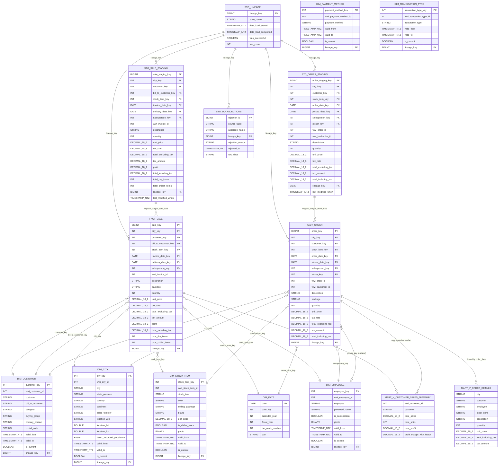
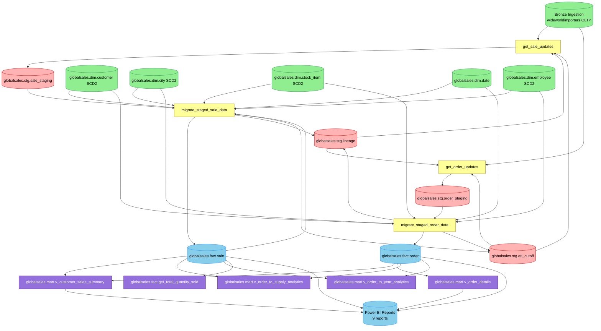

# To-Be Design: Sales_Orders

_Generated: 2026-08-28 | Pipeline stage: to-be_


## 1. Analytical Data Product Description

### 1.1 Definition

Sales_Orders is the primary analytical data product for the GlobalSales_Project, delivering a complete order-to-cash view of the wholesale distribution domain. In the target platform, the product is implemented as a medallion lakehouse on Databricks with Delta Lake storage, governed by Unity Catalog under the `globalsales` catalog.

The product is organized across four catalog schemas:

- **`globalsales.stg.*` — Staging layer (5 Delta tables):** Landing tables for incremental ingestion — `globalsales.stg.sale_staging`, `globalsales.stg.order_staging`, `globalsales.stg.customer_staging`, `globalsales.stg.employee_staging`, and `globalsales.stg.city_staging`. All five tables are transient (truncate-and-reload per ETL cycle) and carry no clustering or auto-optimize properties. `globalsales.stg.sale_staging` gains a new `lineage_key` column (absent in the source) to correct a lineage asymmetry and align with the rest of the staging layer. A dedicated `globalsales.stg.dq_rejections` table captures failed-row isolation output from all quality gate assertions, and `globalsales.stg.lineage` serves as the central ETL audit log.

- **`globalsales.dim.*` — Dimension layer (7 SCD Type-2 tables):** `globalsales.dim.customer`, `globalsales.dim.city`, `globalsales.dim.stock_item`, `globalsales.dim.date`, `globalsales.dim.employee`, `globalsales.dim.payment_method`, and `globalsales.dim.transaction_type`. All seven tables are Delta tables with `autoOptimize` write and compaction properties enabled. The `globalsales.dim.date` table is a static calendar reference with no SCD2 control columns. `globalsales.dim.city` replaces the source geography column with three derived attributes — `location_wkt` (well-known text), `location_lat` (latitude), and `location_lon` (longitude) — enabling geospatial analytics without proprietary type dependencies.

- **`globalsales.fact.*` — Fact layer:** `globalsales.fact.sale` is a high-volume Delta table (~12 million rows per year, history from 2013-01-01) with liquid clustering on `(invoice_date_key, customer_key, stock_item_key)` — the idiomatic Databricks replacement for the source clustered columnstore index. `globalsales.fact.order` is partitioned by `order_date_key` with `OPTIMIZE ... ZORDER BY (customer_key, stock_item_key)` applied in the nightly pipeline; the two physical layout strategies are mutually exclusive and are applied independently to each fact table. Both fact tables carry `lineage_key` as a non-nullable foreign key to `globalsales.stg.lineage`. The consolidated UDF `globalsales.fact.get_total_quantity_sold` (BIGINT return type, NULL guard) replaces the two duplicate source scalar functions. VACUUM and file retention are governed by Unity Catalog table properties.

- **`globalsales.mart.*` — Mart layer (4 analytical views):** `globalsales.mart.v_customer_sales_summary` (materialized view candidate — cross-fact aggregation), `globalsales.mart.v_order_details` (parameterised by `start_date`; consolidates both source views into a single authoritative target), `globalsales.mart.v_order_to_year_analytics` (parameterised by `window_days` rolling window), and `globalsales.mart.v_order_to_supply_analytics` (standard view; source NOLOCK hints removed). All mart views expose Gold-layer column aliases for Power BI compatibility alongside canonical snake_case names.

Orchestration is handled by the Databricks Workflow `nightly_etl_main`, a multi-task job that executes the four nightly ETL tasks — `get_sale_updates`, `get_order_updates`, `migrate_staged_sale_data`, `migrate_staged_order_data` — in dependency order, followed by dimension refresh, Silver-to-Gold quality gate, and OPTIMIZE steps. Each task wraps its execution in `open_lineage_record()` / `close_lineage_record()` calls for end-to-end auditability.

Nine Power BI reports are reconnected to the `globalsales` catalog via a dedicated Databricks SQL endpoint. Reports consuming both the legacy analytics view and its deprecated dbo-schema duplicate are consolidated onto the single target `globalsales.mart.v_order_details`. The OLTP-direct report is subject to a pending decision (CX-P04).

The migration delivers elastic scalability through Databricks compute auto-scaling, open-format Delta Lake storage with full ACID guarantees, Unity Catalog governance including row-level security and column masking on customer PII, and parameterised analytics views that replace hard-coded date filters with configurable runtime parameters.

---

### 1.2 Metadata Table

| # | Field | Description |
|---|---|---|
| 1 | Domain Name | Sales and Order Management |
| 2 | Business Process | Order-to-Cash — from customer order through picking, invoicing, and delivery |
| 3 | Process Type | Analytical / Reporting |
| 4 | Business Entities | `globalsales.dim.customer`, `globalsales.dim.city`, `globalsales.dim.stock_item`, `globalsales.dim.employee`, `globalsales.dim.date`, `globalsales.dim.payment_method`, `globalsales.dim.transaction_type` (7 SCD Type-2 dimensions) |
| 5 | Business Metric | Total Sales (`total_including_tax`), Total Units Sold (`quantity`), Profit (`profit`), Profit Margin with Factor (`profit_margin_with_factor` = `(SUM(profit) / NULLIF(SUM(total_including_tax), 0) * 100) * PROFIT_MARGIN_FACTOR` where `PROFIT_MARGIN_FACTOR = 1.05`), Tax Amount (`tax_amount`), Total Excluding Tax (`total_excluding_tax`), Total Dry Items (`total_dry_items`), Total Chiller Items (`total_chiller_items`), Quantity Ordered, Backorder Count (`wwi_backorder_id`), Total Quantity Sold (`globalsales.fact.get_total_quantity_sold`) |
| 6 | Description | Sales_Orders implements the order-to-cash analytical domain in a medallion architecture on the Databricks Lakehouse (`globalsales` catalog). The product ingests daily incremental data into the staging layer (`globalsales.stg.*`), resolves SCD2 dimension keys (`globalsales.dim.*`), loads star-schema facts (`globalsales.fact.*`), and exposes analytical views (`globalsales.mart.*`). History baseline from 2013-01-01; production volume approximately 12 million rows per year on `globalsales.fact.sale`. |
| 7 | Impacted Analytical Reports | All 9 Power BI reports reconnected to Databricks SQL endpoint: `wwidw-sales`, `wwidw-sales-nofilter`, `wwidw dynamic of product basket per customer`, `wwidw dynamic of product basket per customer previous year`, `wwidw purchase and sale per stockitem dynamic`, `wwidw-orderdetails`, `wwidw-orderdetails-by-employee-2024`, `wwidw-orderitemsrankings`, `wwidw-total-orders-summary-march-per province`. Report `dae – global – demos / wwi sales orders` is [PENDING DECISION — CX-P04]. |
| 8 | Data Access and Restrictions | Unity Catalog row-level security and column masking applied to `globalsales.dim.customer` for PII columns. ETL service principals hold write access to `stg`, `dim`, and `fact` schemas; analysts have read-only access to `fact`, `dim`, and `mart` via Unity Catalog grants. Role-to-permission matrix [PENDING DECISION — to be confirmed with data governance team before go-live]. |
| 9 | Data Sources | `globalsales.stg.sale_staging` and `globalsales.stg.order_staging` (primary fact ingestion); `globalsales.stg.customer_staging`, `globalsales.stg.employee_staging`, `globalsales.stg.city_staging` (dimension ingestion — 5 staging tables total); 7 SCD2 dimension tables (`globalsales.dim.*`); external volume for city population statistics (ad-hoc reference, not part of nightly ETL). |
| 10 | Filters Applied | 1. Incremental load watermark — only rows modified since the last ETL cutoff timestamp and up to five minutes before the current run time are extracted into staging. 2. `globalsales.mart.v_order_details` `start_date` parameter — configurable baseline date (default `2023-01-01`; parameterised per CX-P02, replacing source hard-coded filter). 3. `globalsales.mart.v_order_to_year_analytics` `window_days` parameter — configurable rolling window (default 100 days; parameterised per CX-P02, replacing source hard-coded rolling offset). 4. `globalsales.mart.v_order_to_supply_analytics` finance coverage filter — order records with financial coverage code between 10,000 and 900,000 and order date after 2013-12-31. |
| 11 | Calculated Fields Added | 1. `total_excluding_tax` — net line revenue before tax. 2. `tax_amount` — tax charged on the line. 3. `total_including_tax` — gross line revenue inclusive of tax. 4. `profit` — invoice line profit, carried through from source. 5. `total_dry_items` — quantity when stock item is ambient (non-chiller), otherwise zero. 6. `total_chiller_items` — quantity when stock item requires refrigeration, otherwise zero. 7. `profit_margin_with_factor` — customer-level metric computed as `(SUM(profit) / NULLIF(SUM(total_including_tax), 0) * 100) * 1.05`; the 1.05 factor is codified as the named constant `PROFIT_MARGIN_FACTOR` in `config/environment.yaml` (CX-P01). 8. `globalsales.fact.get_total_quantity_sold` — consolidated UDF (BIGINT return, NULL guard), replacing two duplicate source scalar functions (OB-EXTEND-001). |
| 12 | Business DQ Rules | 1. Quantity sold splits correctly: `total_dry_items + total_chiller_items = quantity` on every `fact.sale` row. 2. Profit is within expected range: `profit >= -1000` (rows below threshold flagged for review). 3. Backorder references are valid: `wwi_backorder_id IS NULL OR wwi_backorder_id > 0`. 4. Cross-fact totals align: `SUM(fact.sale.total_including_tax)` within 5% of `SUM(fact.order.total_including_tax)` per ETL run. 5. `profit_margin_with_factor` does not exceed 200 (sanity bound). [PENDING SIGN-OFF — business DQ rule thresholds to be confirmed with business owner before go-live.] |
| 13 | Technical DQ Rules | QA-P01 — five post-load assertions: (1) `fact_sale_completeness` row-level check, (2) `fact_sale_profit_guard` informational flag, (3) `fact_order_backorder_integrity` row-level check, (4) `cross_fact_total_variance` aggregate check (≤5% relative divergence), (5) `scd2_dim_key_orphan_check` LEFT ANTI JOIN across all FK columns in both fact tables. QA-P02 — failed rows isolated to `globalsales.stg.dq_rejections`; blocking assertion failures prevent Gold promotion; DQ summary written to lineage record via `close_lineage_record()`. QA-P03 — zero-tolerance three-way row count reconciliation between staging counts, Gold fact counts, and lineage-recorded counts after each ETL run. |
| 14 | Storage | Delta Lake in Unity Catalog `globalsales`. `globalsales.fact.sale`: liquid clustering on `(invoice_date_key, customer_key, stock_item_key)`; no `PARTITIONED BY`; nightly `OPTIMIZE` without `ZORDER BY`; `autoOptimize.optimizeWrite = true`, `autoOptimize.autoCompact = true`. `globalsales.fact.order`: `PARTITIONED BY (order_date_key)`; nightly `OPTIMIZE ZORDER BY (customer_key, stock_item_key)`; `autoOptimize` properties applied. All 7 dimension tables: plain Delta with `autoOptimize` properties; no clustering. Staging tables: transient Delta, no OPTIMIZE, no autoOptimize, no clustering. VACUUM and file retention governed by Unity Catalog table properties. |
| 15 | Internal Consumers | `globalsales.mart.v_customer_sales_summary`, `globalsales.mart.v_order_details`, `globalsales.mart.v_order_to_year_analytics`, `globalsales.mart.v_order_to_supply_analytics` (4 mart views); `globalsales.fact.get_total_quantity_sold` (consolidated UDF). `dbo.OrderDetails` is decommissioned and not migrated per CX-P03 — all dependents reconnected to `globalsales.mart.v_order_details`. `dae – global – demos / wwi sales orders` report dependency [PENDING DECISION — CX-P04 resolution required before go-live]. |

---

<!-- TRANSFORMATION SUMMARY — rules applied to produce this section

Platform / Layer:
  PL-001  Source platform confirmed as Microsoft SQL Server 2014; target as Databricks (Delta Lake) with Unity Catalog — all object identities in this section use target terms exclusively.
  PL-002  SQL Server two-part schema names replaced by Unity Catalog three-part names: Dimension.* → globalsales.dim.*, Fact.* → globalsales.fact.*, Integration.* → globalsales.stg.*, Analytics.* → globalsales.mart.*.
  PL-003  All tables declared USING DELTA; CCX_Fact_Sale columnstore index dropped; storage optimization per layer (liquid clustering on fact.sale, partitioned+Z-ORDER on fact.order).
  PL-004  Sequences.LineageKey SEQUENCE replaced by BIGINT GENERATED ALWAYS AS IDENTITY on globalsales.stg.lineage; all NEXT VALUE FOR calls removed.
  PL-005  SSIS dailyetlmain and T-SQL stored procedures replaced by PySpark ETL tasks in Databricks Workflow; MERGE INTO pattern for fact/dim loads.
  PL-006  CCX_Fact_Sale replaced by liquid clustering on fact.sale (invoice_date_key, customer_key, stock_item_key); fact.order uses partition+Z-ORDER (PE-EXTEND-001 governs the mutual exclusivity).
  PL-009  Medallion architecture implemented: stg (Bronze/staging), dim/fact (Silver), mart (Gold) layers within globalsales catalog.
  PL-010  SQL Server Agent / SSIS dailyetlmain replaced by Databricks Workflow nightly_etl_main with nightly cron trigger.

Naming:
  NM-001  All PascalCase/camelCase identifiers converted to snake_case (e.g., Fact.Sale → fact.sale, CustomerSalesSummary → v_customer_sales_summary).
  NM-002  Spaces in dimension names replaced with underscores (Stock Item → stock_item, Payment Method → payment_method, Transaction Type → transaction_type).
  NM-003  Schema namespace mapping applied: all source schema-qualified names replaced by globalsales.* three-part names.
  NM-004  v_ prefix applied to all mart views (CustomerSalesSummary → v_customer_sales_summary; existing v_ prefix retained on v_order_to_supply_analytics, v_order_to_year_analytics).
  NM-005  _staging suffix retained on all staging tables (sale_staging, order_staging, etc.).
  NM-006  Stored procedure and UDF names converted to snake_case Python function names; both duplicate UDFs (getTotalQuantitySold1, getTotalQuantitySold2) consolidated to single target get_total_quantity_sold.
  NM-007  dbo.OrderDetails and Sequences.LineageKey marked NOT MIGRATED; no target names assigned.
  NM-008  Column aliases in mart views use snake_case; Gold-layer display-name aliases added per IF-P02.

Objects:
  OB-001  All 7 SCD2 dimension tables migrated to globalsales.dim.*; SCD2 control columns (valid_from, valid_to, is_current) preserved; geography column on dim.city decomposed per TY-EXTEND-001.
  OB-002  Both fact tables migrated; liquid clustering elected for fact.sale; rowstore layout (partition+Z-ORDER) for fact.order.
  OB-003  All 5 staging tables migrated to globalsales.stg.*; lineage_key column added to stg.sale_staging to correct source asymmetry (LN-EXTEND-001).
  OB-005  4 analytics views classified and migrated: v_customer_sales_summary (materialized candidate), v_order_details (parameterised), v_order_to_year_analytics (parameterised), v_order_to_supply_analytics (standard; NOLOCK removed).
  OB-006  Two duplicate scalar UDFs consolidated into single globalsales.fact.get_total_quantity_sold with BIGINT return type and NULL guard (OB-EXTEND-001).
  OB-011  dbo.OrderDetails excluded from migration; all dependents reconnected to globalsales.mart.v_order_details per CX-P03.

Performance:
  PE-001  CCX_Fact_Sale clustered columnstore index dropped; intent carried forward by PE-004 liquid clustering.
  PE-002  PARTITIONED BY (order_date_key) applied to fact.order only; Fact.Sale excluded (liquid clustering elected).
  PE-003  ZORDER BY (customer_key, stock_item_key) applied to fact.order OPTIMIZE only; fact.sale OPTIMIZE omits ZORDER BY.
  PE-004  Liquid clustering CLUSTER BY (invoice_date_key, customer_key, stock_item_key) applied to fact.sale only (PE-EXTEND-001).
  PE-005  Nightly OPTIMIZE scheduled for all 9 non-staging tables; fact.sale OPTIMIZE omits ZORDER BY; fact.order OPTIMIZE includes ZORDER BY (customer_key, stock_item_key).
  PE-007  Staging tables explicitly excluded from OPTIMIZE, autoOptimize, and clustering.
  PE-008  autoOptimize.optimizeWrite = true and autoOptimize.autoCompact = true applied to all 9 non-staging tables.
  PE-EXTEND-001  Liquid clustering elected for fact.sale over static PARTITIONED BY + ZORDER (mutual exclusivity documented); partition+Z-ORDER retained for fact.order.

Custom Rules:
  CX-P01  1.05 profit margin business factor codified as named constant PROFIT_MARGIN_FACTOR = 1.05 in config/environment.yaml; referenced in v_customer_sales_summary DDL with business confirmation comment; profit_margin_with_factor DQ assertion added.
  CX-P02  Hard-coded date filters parameterised: v_order_details start_date parameter (default 2023-01-01); v_order_to_year_analytics window_days parameter (default 100).
  CX-P03  dbo.OrderDetails decommissioned; both BI reports reconnected to single target globalsales.mart.v_order_details.
  CX-P04  OLTP-direct BI report (dae – global – demos / wwi sales orders) documented as PENDING DECISION; noted in rows 7 and 15 of the metadata table.

Quality:
  QA-P01  Five post-load DQ assertions defined for globalsales.fact.sale and globalsales.fact.order (completeness, profit guard, backorder integrity, cross-fact variance, SCD2 orphan check).
  QA-P02  Silver-to-Gold quality gate integrates all QA-P01 assertions; failed rows isolated to globalsales.stg.dq_rejections; blocking assertions prevent Gold promotion; DQ summary written to lineage record.
  QA-P03  Zero-tolerance three-way row count reconciliation (staging vs Gold vs lineage) after every ETL run.

Lineage:
  LN-001  Integration.Lineage migrated to globalsales.stg.lineage; column names snake_cased.
  LN-002  Sequences.LineageKey SEQUENCE replaced by IDENTITY column on globalsales.stg.lineage.lineage_key.
  LN-004  lineage_key propagated to fact.sale, fact.order, stg.order_staging, and stg.sale_staging (new column — LN-EXTEND-001 corrects source asymmetry).
  LN-006  Unity Catalog system lineage enabled for all Sales_Orders tables in globalsales catalog.
  LN-EXTEND-001  globalsales.stg.sale_staging gains lineage_key BIGINT NOT NULL column; get_sale_updates ETL task injects value from open_lineage_record().

Interface:
  IF-P01  All 9 DW-connected Power BI reports reconnected from SQL Server 2014 connections to Databricks SQL endpoint; dae – global – demos pending CX-P04 decision.
  IF-P02  Gold/Mart views expose snake_case canonical columns plus backtick-quoted display-name aliases for Power BI compatibility (e.g., total_including_tax AS `Total Including Tax`).
  IF-P03  Dedicated Databricks SQL warehouse provisioned for BI connectivity; sub-30 second query SLA; service principal authentication; auto-stop disabled during business hours.

Source system references (not to appear in main content):
  - Microsoft SQL Server 2014 / WideWorldImportersDW / wideworldimporters
  - SSIS dailyetlmain
  - Fact.Sale (CCX_Fact_Sale), Fact.Order, Dimension.*, Integration.*, Analytics.*, dbo.OrderDetails, Sequences.LineageKey
  - Integration.GetLineageKey, Integration.GetSaleUpdates, Integration.GetOrderUpdates
  - MigrateStagedSaleData, MigrateStagedOrderData
  - Fact.getTotalQuantitySold1, Fact.getTotalQuantitySold2
-->


## 2. Consumers and Use Cases

| Consumer Name | Use Cases | Business Questions Answered | Consumption Method |
|---|---|---|---|
| wwidw-sales | Core revenue reporting on invoiced sales | What is total revenue by customer, stock item, city, and salesperson? What are monthly and annual sales trends? | Power BI report — Databricks SQL endpoint → `globalsales.fact.sale` |
| wwidw-sales-nofilter | Unrestricted sales analysis; data validation and executive views | What is the full unfiltered sales volume? Are there anomalies in the complete sales dataset? | Power BI report — Databricks SQL endpoint → `globalsales.fact.sale` |
| wwidw dynamic product basket (current year) | Current-year product basket mix analysis per customer | Which products does each customer buy together? What is the current-year basket composition by customer segment? | Power BI report — Databricks SQL endpoint → `globalsales.fact.sale` |
| wwidw dynamic product basket (prior year) | Prior-year basket comparison | How has each customer's product basket changed year over year? Which products have been added or dropped? | Power BI report — Databricks SQL endpoint → `globalsales.fact.sale` |
| wwidw purchase and sale per stockitem | Per-product sales vs. procurement performance | What is the sell-through rate per stock item? Which items have high purchase volume but low sales? | Power BI report — Databricks SQL endpoint → `globalsales.fact.sale` |
| wwidw-orderdetails | Order line-item drill-through reporting | What are the detailed order lines for a given customer, city, employee, or stock item? What is the tax and total per order line? | Power BI report — Databricks SQL endpoint → `globalsales.mart.v_order_details` (consolidated from two source views per CX-P03) |
| wwidw-orderdetails-by-employee-2024 | Employee-scoped order performance for 2024 | Which orders did each salesperson handle in 2024? What is the order volume and total value per employee? | Power BI report — Databricks SQL endpoint → `globalsales.mart.v_order_details` (consolidated from two source views per CX-P03) |
| wwidw-orderitemsrankings | Order item demand rankings | Which stock items are most frequently ordered? What is the demand-side leaderboard by quantity or value? | Power BI report — Databricks SQL endpoint → `globalsales.fact.order` |
| wwidw-total-orders-summary-march-per-province | Provincial order volume for March | What is the total order volume per province for the March reporting period? | Power BI report — Databricks SQL endpoint → `globalsales.fact.order` + `globalsales.dim.city` (province join) |
| dae – global – demos / wwi sales orders | Near-real-time operational order tracking | What are the current open orders with delivery location, salesperson, and customer contact details? | **[PENDING DECISION per CX-P04]** — OLTP-direct connection strategy must be resolved before go-live; target endpoint TBD pending CX-P04 resolution |
| globalsales.mart.v_customer_sales_summary | Customer-level sales aggregation for ad-hoc analysis | What is total sales, units, profit, and profit margin per customer? How does margin compare across the customer base? | Databricks SQL endpoint — mart view consumed by ad-hoc queries and downstream analytical processes |
| globalsales.mart.v_order_details | Flattened order detail access | What are enriched order line records (city, customer, employee, stock item) filtered to recent orders? | Databricks SQL endpoint — mart view consumed by two Power BI order-detail reports (wwidw-orderdetails and wwidw-orderdetails-by-employee-2024) |
| globalsales.mart.v_order_to_supply_analytics | Supply chain cross-domain analysis | How do order and sale patterns relate to supply coverage codes, location partitions, and financial coverage metrics? | Databricks SQL endpoint — mart view consumed by supply chain tooling or analytical processes |
| globalsales.mart.v_order_to_year_analytics | Year-dimensioned order trending | What are order trends across calendar and fiscal years? How do order volumes compare to purchase volumes by year and picker? | Databricks SQL endpoint — mart view consumed by year-level analytical queries and reporting |
| ETL orchestration (migrate_staged_sale_data / migrate_staged_order_data Workflow tasks) | ETL orchestration — reads `globalsales.fact.order` for cutoff watermark management | Has the fact data been successfully loaded for this run? What is the last processed cutoff timestamp for each entity? | Internal Databricks Workflows task — part of the target platform daily ETL pipeline |

---

> **Transformation summary (Section 2):**
> Nine Power BI reports are reconnected from direct SQL Server 2014 connections to a dedicated Databricks SQL endpoint per **IF-P01** and **IF-P03**. Reports previously consuming `Fact.Sale` (wwidw-sales, wwidw-sales-nofilter, wwidw dynamic product basket current year and prior year, wwidw purchase and sale per stockitem) now connect to `globalsales.fact.sale`; reports consuming `Fact.Order` directly (wwidw-orderitemsrankings, wwidw-total-orders-summary-march-per-province) now connect to `globalsales.fact.order`. All source and target object identifiers follow snake_case convention per **NM-001** and the three-part Unity Catalog namespace per **NM-003**. Analytics views acquire the `v_` prefix per **NM-004**, yielding `globalsales.mart.v_customer_sales_summary`, `globalsales.mart.v_order_details`, `globalsales.mart.v_order_to_supply_analytics`, and `globalsales.mart.v_order_to_year_analytics`. Per **CX-P03**, `dbo.OrderDetails` is decommissioned and not migrated; the two Power BI reports that previously consumed both `Analytics.OrderDetails` and `dbo.OrderDetails` (wwidw-orderdetails and wwidw-orderdetails-by-employee-2024) are consolidated to the single target view `globalsales.mart.v_order_details`. Per **CX-P04**, the `dae – global – demos / wwi sales orders` report, which bypasses the DW ETL via an OLTP-direct connection, is flagged as pending decision and must not go live until the reconnection strategy is resolved. The ETL orchestration consumer is remapped from the source `Integration.MigrateStagedSaleData` / `Integration.MigrateStagedOrderData` stored procedures to the target `migrate_staged_sale_data` / `migrate_staged_order_data` Workflow tasks per **PL-010** and **NM-001**, with all object names in snake_case. Analytics views are migrated under **OB-005**: `globalsales.mart.v_customer_sales_summary` as a materialized view candidate, `globalsales.mart.v_order_details` and `globalsales.mart.v_order_to_year_analytics` as parameterized views (hard-coded date filters replaced per **CX-P02**), and `globalsales.mart.v_order_to_supply_analytics` as a standard view with NOLOCK hints removed. A PascalCase column alias compatibility layer is applied to all mart and fact views consumed by Power BI per **IF-P02**, preserving display names without requiring full Power BI data model rebuilds.


## 3. Model Analytical Data Product

### 3.1 ER Diagram



---

### 3.2 Textual Description

| Layer | Tables | Description |
|---|---|---|
| Primary Source | `wideworldimporters.Sales.Invoices`, `Sales.InvoiceLines`, `Sales.Orders`, `Sales.OrderLines`, `Warehouse.StockItems`, `Warehouse.PackageTypes`, `Sales.Customers`, `Application.Cities`, `Application.StateProvinces`, `Application.Countries`, `Application.People` (and `_Archive` temporal variants) | Upstream OLTP feed on Microsoft SQL Server 2014; delta-extracted daily using `LastEditedWhen` watermark for fact staging and `FOR SYSTEM_TIME AS OF` temporal queries for SCD2 dimension refresh. Source data flows into the Bronze/Staging layer via Python ingestion notebooks (`get_sale_updates`, `get_order_updates`). |
| Fact Tables | `globalsales.fact.sale`, `globalsales.fact.order` | `globalsales.fact.sale`: 21 columns migrated from `Fact.Sale`; surrogate PK `sale_key BIGINT GENERATED ALWAYS AS IDENTITY`; CLUSTER BY (invoice_date, customer_key, stock_item_key) — liquid clustering per PE-EXTEND-001/PE-004 replacing the source CCX_Fact_Sale columnstore index; no PARTITIONED BY; type conversions applied (NVARCHAR → STRING, DATETIME2 → TIMESTAMP_NTZ, BIT → BOOLEAN, VARBINARY → BINARY, DECIMAL preserved). `globalsales.fact.order`: 19 columns migrated from `Fact.Order`; surrogate PK `order_key BIGINT GENERATED ALWAYS AS IDENTITY`; PARTITIONED BY (order_date) with OPTIMIZE ZORDER BY (customer_key, stock_item_key) per PE-002/PE-003. Both PKs are `GENERATED ALWAYS AS IDENTITY` per TY-023. `dbo.OrderDetails` is decommissioned and not migrated (CX-P03). |
| Dimension / Dictionary | `globalsales.dim.customer`, `globalsales.dim.city`, `globalsales.dim.stock_item`, `globalsales.dim.date`, `globalsales.dim.employee`, `globalsales.dim.payment_method`, `globalsales.dim.transaction_type` | Seven conformed dimensions migrated from the `Dimension.*` schema. All six SCD2 dimensions carry `valid_from` / `valid_to` as `TIMESTAMP_NTZ` (TY-015) and an `is_current BOOLEAN` flag. `globalsales.dim.date` is a static calendar table (no SCD2). `globalsales.dim.city`: SQL Server `geography Location` column decomposed into three target columns per TY-EXTEND-001 — `location_wkt STRING`, `location_lat DOUBLE`, `location_lon DOUBLE`; the `geography` type does not appear in the target DDL. `globalsales.dim.stock_item`: `is_chiller_stock BOOLEAN` (TY-020), `photo BINARY` (TY-018). `globalsales.dim.employee`: `is_salesperson BOOLEAN` (TY-020), `photo BINARY` (TY-018). `globalsales.dim.payment_method` and `globalsales.dim.transaction_type` are orphaned dimensions (no FK binding to either fact table) but are migrated for schema completeness per OB-001. |
| Processing | `globalsales.stg.sale_staging`, `globalsales.stg.order_staging`, `globalsales.stg.lineage` + Python notebook tasks | Staging tables buffer inbound daily deltas before dimension-key resolution and fact load. `globalsales.stg.sale_staging` gains a new `lineage_key BIGINT NOT NULL` column correcting the source asymmetry where `Integration.Sale_Staging` lacked this column (LN-EXTEND-001). `globalsales.stg.lineage` replaces `Integration.Lineage` with a `lineage_key BIGINT GENERATED ALWAYS AS IDENTITY` column replacing the source `Sequences.LineageKey` SEQUENCE object (LN-001/LN-002). ETL is rewritten as Python notebook tasks (`get_sale_updates`, `get_order_updates`, `migrate_staged_sale_data`, `migrate_staged_order_data`) replacing the source T-SQL stored procedures (OB-007). The two source scalar UDFs `Fact.getTotalQuantitySold1` and `Fact.getTotalQuantitySold2` are consolidated into a single target function `globalsales.fact.get_total_quantity_sold(stock_item_key BIGINT) RETURNS BIGINT` with a NULL guard returning 0 per OB-EXTEND-001. |
| Output | `globalsales.mart.v_customer_sales_summary` (materialized), `globalsales.mart.v_order_details`, `globalsales.mart.v_order_to_supply_analytics`, `globalsales.mart.v_order_to_year_analytics` | Four Gold/Mart objects migrated from the `Analytics.*` schema. `v_customer_sales_summary` is a materialized view candidate (cross-fact aggregation, OB-005); `v_order_details` consolidates both `Analytics.OrderDetails` and `dbo.OrderDetails` into one authoritative view — `dbo.OrderDetails` is decommissioned (CX-P03). `v_order_to_supply_analytics` migrated as a standard view with all `NOLOCK` hints removed. All four view names carry the `v_` prefix per NM-004. Hard-coded date filters in `v_order_details` (post-2023) and rolling 100-day window in `v_order_to_year_analytics` are parameterized per CX-P02. |

---

<!-- Transformation summary:
  NM-001/002/003: All PascalCase/space-bearing identifiers converted to snake_case; SQL Server two-part schema names mapped to Unity Catalog three-part globalsales.<schema>.<object> names (Fact→fact, Dimension→dim, Integration→stg, Analytics→mart).
  NM-004: v_ prefix added to CustomerSalesSummary and OrderDetails target views; retained on v_OrderToSupplyAnalytics and v_OrderToYearAnalytics.
  TY-011: NVARCHAR/VARCHAR columns (Description, Package, SalesTerritory, customer/city/employee names) mapped to STRING.
  TY-012: DATE columns (invoice_date_key, order_date_key, delivery_date_key, picked_date_key) mapped to DATE.
  TY-015: DATETIME2 columns (ValidFrom, ValidTo, LastModifiedWhen) mapped to TIMESTAMP_NTZ across all dimension and staging tables.
  TY-018: VARBINARY Photo columns on dim.stock_item and dim.employee mapped to BINARY.
  TY-020: BIT columns (IsChillerStock, IsSalesperson) mapped to BOOLEAN.
  TY-023: IDENTITY PKs (SaleKey, OrderKey) replaced with BIGINT GENERATED ALWAYS AS IDENTITY.
  TY-EXTEND-001: SQL Server geography Location column on Dimension.City decomposed into location_wkt STRING, location_lat DOUBLE, location_lon DOUBLE; geography type not present in target DDL.
  OB-001–003: All 7 SCD2 dimension tables, 2 fact tables, and 5 staging tables migrated to globalsales Unity Catalog schemas with snake_case naming.
  OB-005: 4 analytics views classified and migrated: v_customer_sales_summary as materialized view candidate, v_order_details and v_order_to_year_analytics as parameterized views (CX-P02), v_order_to_supply_analytics as standard view with NOLOCK removed.
  OB-007: T-SQL stored procedures replaced with Python notebook tasks (get_sale_updates, get_order_updates, migrate_staged_sale_data, migrate_staged_order_data).
  OB-008: Sequences.LineageKey SEQUENCE replaced by BIGINT GENERATED ALWAYS AS IDENTITY on globalsales.stg.lineage.lineage_key.
  OB-EXTEND-001: Fact.getTotalQuantitySold1 and Fact.getTotalQuantitySold2 consolidated into globalsales.fact.get_total_quantity_sold(stock_item_key BIGINT) RETURNS BIGINT with COALESCE(SUM(quantity), 0) NULL guard.
  PE-EXTEND-001/PE-004: globalsales.fact.sale uses CLUSTER BY (invoice_date, customer_key, stock_item_key) — liquid clustering replacing CCX_Fact_Sale; no PARTITIONED BY on fact.sale.
  PE-002/003: globalsales.fact.order uses PARTITIONED BY (order_date) with OPTIMIZE ZORDER BY (customer_key, stock_item_key).
  LN-EXTEND-001: globalsales.stg.sale_staging gains lineage_key BIGINT NOT NULL column, correcting source asymmetry where Integration.Sale_Staging lacked [Lineage Key].
  CX-P03: dbo.OrderDetails not migrated; both BI reports consuming it reconnected to the single target globalsales.mart.v_order_details.
  PL-009/010: All objects organized into medallion architecture (stg/dim/fact/mart); nightly Databricks Workflow replaces SSIS dailyetlmain / SQL Agent scheduling.
-->


## 4. Column-Level Lineage

### 4.1 Key Columns / Metrics

| # | Column / Metric | Type | Description |
|---|---|---|---|
| 1 | `globalsales.fact.sale.total_excluding_tax` | Derived | Computed in `get_sale_updates` as `extended_price - tax_amount` from the bronze invoice line; represents net invoice-line revenue before tax. Passed through staging unchanged into `fact.sale`. |
| 2 | `globalsales.fact.sale.tax_amount` | Pass-through | Sourced directly from bronze `sales.invoice_lines.tax_amount`; staged in `stg.sale_staging.tax_amount` and loaded verbatim into `fact.sale`. |
| 3 | `globalsales.fact.sale.total_including_tax` | Pass-through | Sourced from bronze `sales.invoice_lines.extended_price` (pre-stored gross line value inclusive of tax); passed through staging and loaded verbatim into `fact.sale`. |
| 4 | `globalsales.fact.sale.profit` | Pass-through | Sourced from bronze `sales.invoice_lines.line_profit`; no arithmetic applied at any layer — passed through staging unchanged into `fact.sale`. |
| 5 | `globalsales.fact.sale.quantity` | Pass-through | Sourced from bronze `sales.invoice_lines.quantity`; total units sold on the invoice line. Passed through staging unchanged. |
| 6 | `globalsales.fact.sale.total_dry_items` | Derived | Computed in `get_sale_updates` via CASE expression on `warehouse.stock_items.is_chiller_stock`: `CASE WHEN is_chiller_stock = false THEN quantity ELSE 0 END`. Staged in `stg.sale_staging.total_dry_items`; loaded verbatim into `fact.sale`. |
| 7 | `globalsales.fact.sale.total_chiller_items` | Derived | Computed in `get_sale_updates` via CASE expression: `CASE WHEN is_chiller_stock = true THEN quantity ELSE 0 END`. Staged in `stg.sale_staging.total_chiller_items`; loaded verbatim into `fact.sale`. |
| 8 | `globalsales.fact.order.total_excluding_tax` | Calculated | Re-derived in `get_order_updates` from unit economics: `ROUND(quantity * unit_price, 2)`. No pre-stored source column exists. Staged in `stg.order_staging.total_excluding_tax`; loaded verbatim into `fact.order`. |
| 9 | `globalsales.fact.order.tax_amount` | Calculated | Re-derived in `get_order_updates`: `ROUND(quantity * unit_price * tax_rate / 100.0, 2)`. Staged in `stg.order_staging.tax_amount`; loaded verbatim into `fact.order`. |
| 10 | `globalsales.fact.order.total_including_tax` | Calculated | Sum of the two independently rounded order measures: `total_excluding_tax + tax_amount`. Staged in `stg.order_staging.total_including_tax`; loaded verbatim into `fact.order`. |
| 11 | `globalsales.fact.order.wwi_backorder_id` | Pass-through | Sourced from bronze `sales.orders.backorder_order_id`; nullable — NULL when no backorder exists. Passed through staging unchanged. |
| 12 | `globalsales.fact.order.picked_date_key` | Derived | Cast from bronze `sales.order_lines.picking_completed_when` to DATE: `CAST(picking_completed_when AS DATE)`. Line-level pick timestamp, not an order-header date. Staged in `stg.order_staging.picked_date_key`. |
| 13 | `globalsales.mart.v_customer_sales_summary.total_sales` | Aggregated | `SUM(total_including_tax)` from `fact.order` grouped by `customer_key` in the `customer_totals` CTE of `v_customer_sales_summary`. |
| 14 | `globalsales.mart.v_customer_sales_summary.profit_margin_with_factor` | Calculated | Cross-fact metric computed in `v_customer_sales_summary` `profit_margins` CTE: `(SUM(profit) / NULLIF(SUM(total_including_tax), 0) * 100) * 1.05`. The 1.05 factor is the business-rule constant governed by CX-P01; it must be defined as a named constant `profit_margin_adjustment_factor: 1.05` in `config/environment.yaml`. |
| 15 | `globalsales.fact.get_total_quantity_sold` (UDF) | Aggregated | Consolidated target function (OB-EXTEND-001); replaces both source UDFs `getTotalQuantitySold1` and `getTotalQuantitySold2`. Returns `COALESCE(SUM(quantity), 0)` from `fact.sale` filtered by `stock_item_key` parameter. Return type widened to BIGINT; NULL guard added per OB-EXTEND-001. |
| 16 | `globalsales.fact.sale.lineage_key` | Derived | Injected by `open_lineage_record()` Python utility (LN-EXTEND-001 / LN-003); corrects the source asymmetry where `Integration.Sale_Staging` lacked a `LineageKey` column. The returned `lineage_key` BIGINT is stamped on every staged sale row and propagated to `fact.sale` during `migrate_staged_sale_data`. |
| 17 | `globalsales.fact.sale.customer_key` | Lookup | SCD2 surrogate key resolved in `migrate_staged_sale_data` via ROW_NUMBER() OVER (PARTITION BY ww_customer_id ORDER BY valid_from DESC) = 1 against `globalsales.dim.customer`; COALESCE fallback = 0 (unknown member). |
| 18 | `globalsales.fact.sale.stock_item_key` | Lookup | SCD2 surrogate key resolved in `migrate_staged_sale_data` via same ROW_NUMBER() LIMIT 1 pattern against `globalsales.dim.stock_item`; COALESCE fallback = 0. |

*Column types: Calculated, Aggregated, Derived, Pass-through, Lookup*

---

### 4.2 Lineage Diagram



*Color coding: Green `#90EE90` = source / dimension tables (Bronze and SCD2 dims); Red `#FFB3B3` = staging and CTE objects; Yellow `#FFFF99` = computation / ETL tasks; Purple `#9370DB` = mart aggregations and BI layer; Blue `#87CEEB` = fact tables and BI reports.*

---

### 4.3 Column-Level Lineage Table

| Target Table | Target Column | Source Table | Source Column | Intermediate Table / Column | Derived Metric |
|---|---|---|---|---|---|
| `globalsales.fact.sale` | `invoice_date_key` | Bronze `sales.invoices` | `invoice_date` | `stg.sale_staging.invoice_date_key` | `CAST(invoice_date AS DATE)` |
| `globalsales.fact.sale` | `delivery_date_key` | Bronze `sales.invoices` | `confirmed_delivery_time` | `stg.sale_staging.delivery_date_key` | `CAST(confirmed_delivery_time AS DATE)` |
| `globalsales.fact.sale` | `wwi_invoice_id` | Bronze `sales.invoices` | `invoice_id` | `stg.sale_staging.wwi_invoice_id` | Pass-through |
| `globalsales.fact.sale` | `quantity` | Bronze `sales.invoice_lines` | `quantity` | `stg.sale_staging.quantity` | Pass-through |
| `globalsales.fact.sale` | `unit_price` | Bronze `sales.invoice_lines` | `unit_price` | `stg.sale_staging.unit_price` | Pass-through |
| `globalsales.fact.sale` | `tax_rate` | Bronze `sales.invoice_lines` | `tax_rate` | `stg.sale_staging.tax_rate` | Pass-through |
| `globalsales.fact.sale` | `total_excluding_tax` | Bronze `sales.invoice_lines` | `extended_price`, `tax_amount` | `stg.sale_staging.total_excluding_tax` | `extended_price - tax_amount` |
| `globalsales.fact.sale` | `tax_amount` | Bronze `sales.invoice_lines` | `tax_amount` | `stg.sale_staging.tax_amount` | Pass-through |
| `globalsales.fact.sale` | `total_including_tax` | Bronze `sales.invoice_lines` | `extended_price` | `stg.sale_staging.total_including_tax` | Pass-through (`extended_price` — pre-stored gross value) |
| `globalsales.fact.sale` | `profit` | Bronze `sales.invoice_lines` | `line_profit` | `stg.sale_staging.profit` | Pass-through |
| `globalsales.fact.sale` | `total_dry_items` | Bronze `sales.invoice_lines` + `warehouse.stock_items` | `quantity`, `is_chiller_stock` | `stg.sale_staging.total_dry_items` | `CASE WHEN is_chiller_stock = false THEN quantity ELSE 0 END` |
| `globalsales.fact.sale` | `total_chiller_items` | Bronze `sales.invoice_lines` + `warehouse.stock_items` | `quantity`, `is_chiller_stock` | `stg.sale_staging.total_chiller_items` | `CASE WHEN is_chiller_stock = true THEN quantity ELSE 0 END` |
| `globalsales.fact.sale` | `package` | Bronze `warehouse.package_types` | `package_type_name` | `stg.sale_staging.package` | Pass-through |
| `globalsales.fact.sale` | `customer_key` | `globalsales.dim.customer` | `customer_key` (SCD2 lookup on `wwi_customer_id`) | `stg.sale_staging.customer_key` (resolved by `migrate_staged_sale_data`) | SCD2 lookup: `ROW_NUMBER() OVER (PARTITION BY wwi_customer_id ORDER BY valid_from DESC) = 1`; `COALESCE(..., 0)` fallback (SX-007) |
| `globalsales.fact.sale` | `bill_to_customer_key` | `globalsales.dim.customer` | `customer_key` (SCD2 lookup on `wwi_bill_to_customer_id`) | `stg.sale_staging.bill_to_customer_key` | SCD2 lookup on billing customer; `COALESCE(..., 0)` fallback |
| `globalsales.fact.sale` | `salesperson_key` | `globalsales.dim.employee` | `employee_key` (SCD2 lookup on `wwi_salesperson_id`) | `stg.sale_staging.salesperson_key` | SCD2 lookup; `COALESCE(..., 0)` fallback |
| `globalsales.fact.sale` | `stock_item_key` | `globalsales.dim.stock_item` | `stock_item_key` (SCD2 lookup on `wwi_stock_item_id`) | `stg.sale_staging.stock_item_key` | SCD2 lookup; `COALESCE(..., 0)` fallback |
| `globalsales.fact.sale` | `lineage_key` | `globalsales.stg.lineage` | `lineage_key` (returned by `open_lineage_record()`) | Injected directly by ETL task — no staging column in source (LN-EXTEND-001) | `open_lineage_record(table_name='stg.sale_staging', spark=spark)` → BIGINT injected into every staged row |
| `globalsales.fact.order` | `order_date_key` | Bronze `sales.orders` | `order_date` | `stg.order_staging.order_date_key` | `CAST(order_date AS DATE)` |
| `globalsales.fact.order` | `picked_date_key` | Bronze `sales.order_lines` | `picking_completed_when` | `stg.order_staging.picked_date_key` | `CAST(picking_completed_when AS DATE)` — line-level timestamp |
| `globalsales.fact.order` | `wwi_order_id` | Bronze `sales.orders` | `order_id` | `stg.order_staging.wwi_order_id` | Pass-through |
| `globalsales.fact.order` | `wwi_backorder_id` | Bronze `sales.orders` | `backorder_order_id` | `stg.order_staging.wwi_backorder_id` | Pass-through; nullable — NULL if no backorder |
| `globalsales.fact.order` | `total_excluding_tax` | Bronze `sales.order_lines` | `quantity`, `unit_price` | `stg.order_staging.total_excluding_tax` | `ROUND(quantity * unit_price, 2)` — re-derived from unit economics (SX-016) |
| `globalsales.fact.order` | `tax_amount` | Bronze `sales.order_lines` | `quantity`, `unit_price`, `tax_rate` | `stg.order_staging.tax_amount` | `ROUND(quantity * unit_price * tax_rate / 100.0, 2)` (SX-016) |
| `globalsales.fact.order` | `total_including_tax` | Bronze `sales.order_lines` | computed | `stg.order_staging.total_including_tax` | `total_excluding_tax + tax_amount` (sum of two independently rounded components) |
| `globalsales.fact.order` | `picker_key` | `globalsales.dim.employee` | `employee_key` (SCD2 lookup on `wwi_picker_id`) | `stg.order_staging.picker_key` | SCD2 lookup; nullable — NULL if order not yet picked |
| `globalsales.mart.v_customer_sales_summary` | `total_sales` | `globalsales.fact.order` | `total_including_tax` | `customer_totals` CTE | `SUM(total_including_tax)` grouped by `customer_key` |
| `globalsales.mart.v_customer_sales_summary` | `profit_margin_with_factor` | `globalsales.fact.sale` | `profit`, `total_including_tax` | `profit_margins` CTE | `(SUM(profit) / NULLIF(SUM(total_including_tax), 0) * 100) * 1.05` — CX-P01 factor as named constant |
| `globalsales.mart.v_order_details` | `city`, `customer`, `employee`, `stock_item`, `description`, `quantity`, `unit_price`, `total_including_tax`, `tax_amount` | `globalsales.fact.order` + 4 dims | multiple | JOIN on dim keys | Enriched order line view; `order_date > TO_DATE(:start_date, 'yyyy-MM-dd')` parameter (CX-P02); no `dbo.OrderDetails` — consolidated per CX-P03 |

---

### 4.4 Step-by-Step Transformation Table

| Step | Layer | Object Name | Transformation | SQL Logic | Business Meaning |
|---|---|---|---|---|---|
| 1 | Orchestration | `nightly_etl_main` (Databricks Workflow) | Entry-point workflow that sequences all four nightly ETL tasks with task-level dependency control | `Task order: get_sale_updates → get_order_updates → migrate_staged_sale_data → migrate_staged_order_data` | Replaces the source SSIS `dailyetlmain` package; ensures clean, idempotent daily load cycle for both fact tables |
| 2 | Staging — Truncate | `globalsales.stg.sale_staging` / `globalsales.stg.order_staging` | Truncate both staging Delta tables before each run to prevent stale rows from contaminating the current load window | `spark.sql("TRUNCATE TABLE globalsales.stg.sale_staging"); spark.sql("TRUNCATE TABLE globalsales.stg.order_staging")` | Idempotent staging reset; guarantees each ETL cycle processes only the current incremental window |
| 3 | Extract — Sale | `get_sale_updates` | Join Bronze invoice + invoice-line + stock-items + package-types + customers tables; compute derived monetary and chiller/dry columns; inject `lineage_key` from `open_lineage_record()`; INSERT into `stg.sale_staging` (LN-EXTEND-001) | `INSERT INTO globalsales.stg.sale_staging SELECT ..., extended_price - tax_amount AS total_excluding_tax, CASE WHEN is_chiller_stock = false THEN quantity ELSE 0 END AS total_dry_items, CASE WHEN is_chiller_stock = true THEN quantity ELSE 0 END AS total_chiller_items, CAST(invoice_date AS DATE) AS invoice_date_key, :lineage_key AS lineage_key FROM bronze.sales_invoices si JOIN bronze.sales_invoice_lines sil ON si.invoice_id = sil.invoice_id JOIN bronze.warehouse_stock_items wsi ON sil.stock_item_id = wsi.stock_item_id WHERE sil.last_edited_when > :last_cutoff AND sil.last_edited_when <= current_timestamp()` | Flattens the OLTP invoice model into one staging row per invoice line; computes dry/chiller split, net/gross amounts, and injects lineage key (correcting source asymmetry) |
| 4 | Extract — Order | `get_order_updates` | Join Bronze orders + order-lines + package-types + customers; re-derive all monetary measures from unit economics; INSERT into `stg.order_staging` | `INSERT INTO globalsales.stg.order_staging SELECT ..., ROUND(quantity * unit_price, 2) AS total_excluding_tax, ROUND(quantity * unit_price * tax_rate / 100.0, 2) AS tax_amount, ROUND(quantity * unit_price, 2) + ROUND(quantity * unit_price * tax_rate / 100.0, 2) AS total_including_tax, CAST(picking_completed_when AS DATE) AS picked_date_key, :lineage_key AS lineage_key FROM bronze.sales_orders so JOIN bronze.sales_order_lines sol ON so.order_id = sol.order_id WHERE sol.last_edited_when > :last_cutoff AND sol.last_edited_when <= current_timestamp()` | Produces a per-order-line staging row with fully recomputed monetary measures; no pre-stored extended-price column exists on order lines (SX-016) |
| 5 | Key Resolution — Sale | `migrate_staged_sale_data` | Resolve `customer_key` in `stg.sale_staging` via SCD2 LIMIT 1 lookup using ROW_NUMBER() window function replacing T-SQL TOP(1) (SX-007); apply COALESCE fallback (SX-006) | `WITH ranked AS (SELECT customer_key, wwi_customer_id, ROW_NUMBER() OVER (PARTITION BY wwi_customer_id ORDER BY valid_from DESC) AS rn FROM globalsales.dim.customer) UPDATE globalsales.stg.sale_staging SET customer_key = COALESCE((SELECT customer_key FROM ranked WHERE rn = 1 AND wwi_customer_id = sale_staging.wwi_customer_id), 0)` | Anchors each staging row to the correct SCD2 dimension version effective at invoice-edit time; defaults to unknown-member (key=0) on no match |
| 6 | Key Resolution — Sale | `migrate_staged_sale_data` | Resolve remaining 4 dimension keys (`bill_to_customer_key`, `city_key`, `stock_item_key`, `salesperson_key`) using same SCD2 ROW_NUMBER() LIMIT 1 pattern against respective dim tables | Same ROW_NUMBER() + COALESCE(…, 0) pattern applied to `dim.customer` (bill-to), `dim.city`, `dim.stock_item`, `dim.employee` using their respective `wwi_*_id` columns | All five SCD2 surrogate keys resolved before the Delta MERGE load step; ensures referential integrity in fact table |
| 7 | Load — Sale | `migrate_staged_sale_data` | Delta MERGE INTO `globalsales.fact.sale` USING resolved `stg.sale_staging`; inject `lineage_key`; atomic single operation replacing source DELETE + INSERT pattern (SX-001, SX-003) | `MERGE INTO globalsales.fact.sale AS tgt USING globalsales.stg.sale_staging AS src ON tgt.wwi_invoice_id = src.wwi_invoice_id WHEN MATCHED THEN UPDATE SET tgt.total_excluding_tax = src.total_excluding_tax, tgt.tax_amount = src.tax_amount, tgt.total_including_tax = src.total_including_tax, tgt.profit = src.profit, tgt.quantity = src.quantity, tgt.total_dry_items = src.total_dry_items, tgt.total_chiller_items = src.total_chiller_items, tgt.lineage_key = src.lineage_key WHEN NOT MATCHED THEN INSERT (*)` | Full invoice re-load pattern; handles updates/corrections atomically via Delta ACID guarantees; `lineage_key` stamped on every loaded row |
| 8 | Key Resolution — Order | `migrate_staged_order_data` | Resolve 5 SCD2 keys in `stg.order_staging` (`customer_key`, `city_key`, `stock_item_key`, `salesperson_key`, `picker_key`) using the same ROW_NUMBER() LIMIT 1 pattern | Same SCD2 ROW_NUMBER() OVER (PARTITION BY wwi_*_id ORDER BY valid_from DESC) = 1 pattern with `COALESCE(..., 0)` fallback; `picker_key` uses nullable pattern — NULL if `wwi_picker_id` IS NULL or no match | Ensures order facts carry SCD2-correct dimension keys; `picker_key` remains NULL for unprocessed orders (not yet picked) |
| 9 | Load — Order | `migrate_staged_order_data` | Delta MERGE INTO `globalsales.fact.order` USING resolved `stg.order_staging`; inject `lineage_key` (SX-001, SX-003) | `MERGE INTO globalsales.fact.order AS tgt USING globalsales.stg.order_staging AS src ON tgt.wwi_order_id = src.wwi_order_id WHEN MATCHED THEN UPDATE SET tgt.total_excluding_tax = src.total_excluding_tax, tgt.tax_amount = src.tax_amount, tgt.total_including_tax = src.total_including_tax, tgt.wwi_backorder_id = src.wwi_backorder_id, tgt.picked_date_key = src.picked_date_key, tgt.lineage_key = src.lineage_key WHEN NOT MATCHED THEN INSERT (*)` | Atomic Delta MERGE replaces source DELETE+INSERT transaction; handles backorder updates and pick-date resolution correctly |
| 10 | Lineage — Close + Watermark | `close_lineage_record()` / `globalsales.stg.etl_cutoff` | Call `close_lineage_record()` for each of the 4 tasks; advance ETL watermark in `stg.etl_cutoff` to `current_timestamp()` (LN-003, SX-005) | `close_lineage_record(lineage_key=lk, row_count=n, was_successful=True, spark=spark)` — sets `data_load_completed = current_timestamp(), was_successful = TRUE, row_count = n` in `globalsales.stg.lineage`; `UPDATE globalsales.stg.etl_cutoff SET cutoff_time = current_timestamp() WHERE table_name = 'fact.sale'` | Maintains incremental-load watermark for both Sale and Order tables; controls the next extraction window; `current_timestamp()` replaces T-SQL `SYSDATETIME()` (SX-005) |
| 11 | Mart | `globalsales.mart.v_order_details` | JOIN `fact.order` with `dim.city`, `dim.customer`, `dim.employee`, `dim.stock_item`; apply configurable baseline-date parameter replacing hard-coded `'20230101'` filter (CX-P02); NOLOCK hints removed (SX-008); dbo.OrderDetails consolidated per CX-P03 | `CREATE OR REPLACE VIEW globalsales.mart.v_order_details AS SELECT dc.city, dcust.customer, de.employee, dsi.stock_item, fo.description, fo.quantity, fo.unit_price, fo.total_including_tax, fo.tax_amount FROM globalsales.fact.order fo JOIN globalsales.dim.city dc ON dc.city_key = fo.city_key JOIN globalsales.dim.customer dcust ON dcust.customer_key = fo.customer_key JOIN globalsales.dim.employee de ON de.employee_key = fo.salesperson_key JOIN globalsales.dim.stock_item dsi ON dsi.stock_item_key = fo.stock_item_key WHERE fo.order_date > TO_DATE(:start_date, 'yyyy-MM-dd')` | Single consolidated order-detail view replacing both `Analytics.OrderDetails` and `dbo.OrderDetails`; `:start_date` default = `'2023-01-01'`; all column names in snake_case (NM-001) |
| 12 | Mart | `globalsales.mart.v_customer_sales_summary` | Two CTEs: `profit_margins` (profit ratio from `fact.sale`) and `customer_totals` (order volume from `fact.order`); apply 1.05 factor as named constant from config (CX-P01); NULLIF guard replaces source divide-by-zero risk | `WITH profit_margins AS (SELECT customer_key, SUM(profit) AS total_profit, SUM(total_including_tax) AS sales_with_tax, (SUM(profit) / NULLIF(SUM(total_including_tax), 0) * 100) * {{ profit_margin_adjustment_factor }} AS profit_margin_with_factor FROM globalsales.fact.sale GROUP BY customer_key), customer_totals AS (SELECT customer_key, wwi_customer_id, customer, SUM(total_including_tax) AS total_sales, SUM(quantity) AS total_units FROM ...) SELECT ct.wwi_customer_id, ct.customer, ct.total_sales, ct.total_units, pm.total_profit, pm.profit_margin_with_factor FROM customer_totals ct LEFT JOIN profit_margins pm ON ct.customer_key = pm.customer_key` | Cross-fact customer summary; 1.05 factor sourced from `config/environment.yaml` key `profit_margin_adjustment_factor` per CX-P01; NULLIF guard ensures NULL (not error) when total_including_tax = 0 |
| 13 | Mart | `globalsales.mart.v_order_to_supply_analytics` | JOIN `fact.sale` and `fact.order` via `stock_item_key` + `salesperson_key`; enrich with 5 auxiliary analytics tables; remove all `WITH(NOLOCK)` hints (SX-008) | `CREATE OR REPLACE VIEW globalsales.mart.v_order_to_supply_analytics AS SELECT ... FROM globalsales.fact.sale fs JOIN globalsales.fact.order fo ON fo.stock_item_key = fs.stock_item_key AND fo.salesperson_key = fs.salesperson_key JOIN globalsales.stg.supply_chain sc ON ... JOIN globalsales.stg.product_extension pe ON ... JOIN globalsales.stg.warehouse_status ws ON ... JOIN globalsales.stg.order_fulfillment of ON ... JOIN globalsales.stg.delivery_metrics dm ON ... WHERE fo.order_date_key > '2013-12-31'` | Bridges sales and order performance data with supply/coverage analytics; NOLOCK hints removed — Delta snapshot isolation provides consistent reads without dirty-read workarounds |
| 14 | Mart | `globalsales.mart.v_order_to_year_analytics` | JOIN `fact.order` with `dim.date` (twice for calendar and fiscal year), `dim.customer`, `dim.employee`; replace rolling 100-day `CONVERT(CHAR(8), GETDATE()-100, 112)` with `DATE_FORMAT(DATE_SUB(current_date(), :window_days), 'yyyyMMdd')` (SX-016, CX-P02) | `CREATE OR REPLACE VIEW globalsales.mart.v_order_to_year_analytics AS SELECT ..., DATE_FORMAT(DATE_SUB(current_date(), :window_days), 'yyyyMMdd') AS rolling_window_date, ROUND((fo.total_excluding_tax - fo.tax_amount) * fo.tax_rate, 2) AS tax_coverage FROM globalsales.fact.order fo JOIN globalsales.dim.date dd ON dd.date = fo.order_date_key JOIN globalsales.dim.date dod ON dod.date = fo.picked_date_key JOIN globalsales.dim.customer dc ON dc.customer_key = fo.customer_key JOIN globalsales.dim.employee de ON de.employee_key = fo.salesperson_key WHERE fo.order_date_key > DATE_FORMAT(DATE_SUB(current_date(), :window_days), 'yyyyMMdd')` | Year-based order analytics with configurable rolling window (`:window_days` default = 100 per CX-P02); `DATE_FORMAT(DATE_SUB(...), 'yyyyMMdd')` replaces T-SQL `CONVERT(CHAR(8), GETDATE()-100, 112)` (SX-016) |

*Steps ordered chronologically by execution order. SQL Logic shows key clauses (WHERE, GROUP BY, CASE, MERGE), not full statements. All Spark SQL uses Databricks/Delta dialect.*

---

### 4.5 Known Downstream Dependencies

| Dependent Object | Object Type | Relationship | Description |
|---|---|---|---|
| `globalsales.mart.v_customer_sales_summary` | Databricks SQL View (materialized view candidate) | Reads `globalsales.fact.sale` + `globalsales.fact.order` | Cross-fact customer summary combining order volume with invoice-level profitability; `profit_margin_with_factor` applies the CX-P01 1.05 factor as a named constant from `config/environment.yaml`; NULLIF guard prevents division-by-zero |
| `globalsales.mart.v_order_details` | Databricks SQL View (parameterized) | Reads `globalsales.fact.order` + 4 dimension tables | Consolidated order detail view replacing both source `Analytics.OrderDetails` and `dbo.OrderDetails`; `:start_date` parameter replaces hard-coded `'20230101'` filter (CX-P02, CX-P03) |
| `globalsales.mart.v_order_to_supply_analytics` | Databricks SQL View | Reads `globalsales.fact.sale` + `globalsales.fact.order` + 5 auxiliary tables | Supply chain cross-domain view; all `WITH(NOLOCK)` hints removed (SX-008); 5 auxiliary table ownership must be confirmed per SX-EXTEND-001 |
| `globalsales.mart.v_order_to_year_analytics` | Databricks SQL View (parameterized) | Reads `globalsales.fact.order` + `globalsales.dim.date` (×2) | Year-dimensioned order analytics; `:window_days` parameter replaces hard-coded 100-day rolling window (CX-P02, SX-016) |
| `globalsales.fact.get_total_quantity_sold` | Python / Databricks SQL UDF | Reads `globalsales.fact.sale` | Consolidated single UDF replacing both source `getTotalQuantitySold1` and `getTotalQuantitySold2`; returns `COALESCE(SUM(quantity), 0)` with BIGINT return type (OB-EXTEND-001) |
| `globalsales.stg.lineage` | Delta Table (ETL audit log) | Written by `open_lineage_record()` / `close_lineage_record()` for all 4 ETL tasks | Central audit table for every ETL run; records `data_load_started`, `data_load_completed`, `was_successful`, `row_count` per task per night (LN-001, LN-003) |
| `globalsales.stg.etl_cutoff` | Delta Table (watermark control) | Read at ETL start / written at ETL end by `migrate_staged_*_data` tasks | Per-entity ETL watermark store; `cutoff_time` advances to `current_timestamp()` after each successful load (SX-005); controls the next extraction window |
| `wwidw-sales` | BI Report (Power BI) | Reads `globalsales.fact.sale` directly via Databricks SQL endpoint | Core revenue reporting on invoiced sales; reconnected from SQL Server 2014 to Databricks SQL per IF-P01 |
| `wwidw-sales-nofilter` | BI Report (Power BI) | Reads `globalsales.fact.sale` directly | Unrestricted sales analysis variant; reconnected per IF-P01 |
| `wwidw dynamic of product basket per customer` | BI Report (Power BI) | Reads `globalsales.fact.sale` directly | Current-year product basket mix analysis; reconnected per IF-P01 |
| `wwidw dynamic of product basket per customer previous year` | BI Report (Power BI) | Reads `globalsales.fact.sale` directly | Prior-year basket comparison; reconnected per IF-P01 |
| `wwidw purchase and sale per stockitem dynamic` | BI Report (Power BI) | Reads `globalsales.fact.sale` directly | Per-product sales vs. procurement performance; reconnected per IF-P01 |
| `wwidw-orderitemsrankings` | BI Report (Power BI) | Reads `globalsales.fact.order` directly | Order item demand rankings by quantity or total_including_tax; reconnected per IF-P01 |
| `wwidw-total-orders-summary-march-per province` | BI Report (Power BI) | Reads `globalsales.fact.order` directly | Geographically aggregated order summary for March; reconnected per IF-P01 |
| `wwidw-orderdetails` | BI Report (Power BI) | Reads via `globalsales.mart.v_order_details` | Detailed order report; consolidated from dual source `Analytics.OrderDetails` + `dbo.OrderDetails` to single target view per CX-P03 |
| `wwidw-orderdetails-by-employee-2024` | BI Report (Power BI) | Reads via `globalsales.mart.v_order_details` | Employee-filtered order detail report for 2024; reconnected to single consolidated view per CX-P03, IF-P01 |

---

<!-- TRANSFORMATION SUMMARY
Section 04 applies the following transformation rules:

- NM-001: All object and column identifiers converted from PascalCase/camelCase to snake_case throughout all column names, view names, ETL function names, and SQL aliases in this section.
- NM-003: All source two-part schema references (Fact.*, Integration.*, Analytics.*, Dimension.*) mapped to three-part Unity Catalog names (globalsales.fact.*, globalsales.stg.*, globalsales.mart.*, globalsales.dim.*).
- NM-004: Views prefixed with v_ — Analytics.CustomerSalesSummary → v_customer_sales_summary; Analytics.OrderDetails → v_order_details; v_ prefix retained on v_order_to_supply_analytics and v_order_to_year_analytics.
- NM-005: Staging table _staging suffix retained: Integration.Sale_Staging → stg.sale_staging; Integration.Order_Staging → stg.order_staging.
- NM-006: Stored procedure and UDF names converted to snake_case Python functions: GetSaleUpdates → get_sale_updates; GetOrderUpdates → get_order_updates; MigrateStagedSaleData → migrate_staged_sale_data; MigrateStagedOrderData → migrate_staged_order_data; getTotalQuantitySold1/2 → get_total_quantity_sold (consolidated).
- SX-001 (MERGE): Source correlated UPDATE / DELETE+INSERT patterns in MigrateStagedSaleData and MigrateStagedOrderData rewritten as Delta Lake MERGE INTO … USING … ON … WHEN MATCHED / WHEN NOT MATCHED. Applied in Steps 7 and 9.
- SX-003 (Transaction Control): Explicit T-SQL BEGIN/COMMIT/ROLLBACK transaction blocks replaced by Delta Lake ACID MERGE guarantees. Python try/finally wraps open_lineage_record() / close_lineage_record() to ensure lineage closure even on failure.
- SX-005 (Date Functions): SYSDATETIME() and GETUTCDATE() replaced with current_timestamp() in lineage record closure (Step 10) and ETL cutoff watermark update.
- SX-006 (COALESCE): ISNULL(d.SurrogateKey, 0) patterns replaced with COALESCE(d.surrogate_key, 0) for SCD2 unknown-member key fallback in Steps 5, 6, and 8.
- SX-007 (TOP→LIMIT): T-SQL TOP(1) … ORDER BY SCD2 lookups replaced with ROW_NUMBER() OVER (PARTITION BY wwi_*_id ORDER BY valid_from DESC) = 1 pattern in Steps 5, 6, and 8. Referenced in 4.3 lineage table for customer_key and stock_item_key lookups.
- SX-008 (NOLOCK Removal): All WITH(NOLOCK) hints removed from v_order_to_supply_analytics in Step 13; Delta snapshot isolation provides consistent reads without dirty-read workarounds.
- SX-015 (Bracket Quoting): All T-SQL bracket-quoted identifiers ([Sale_Staging], [Customer Key], etc.) replaced with unquoted snake_case identifiers throughout all SQL snippets in this section.
- SX-016 (CONVERT): CONVERT(CHAR(8), GETDATE()-100, 112) replaced with DATE_FORMAT(DATE_SUB(current_date(), :window_days), 'yyyyMMdd') in v_order_to_year_analytics (Step 14). ROUND(Quantity * UnitPrice, 2) retained identically as ROUND(quantity * unit_price, 2) in Spark SQL (Step 4).
- CX-P01 (Profit Factor): The undocumented 1.05 profit margin multiplier in v_customer_sales_summary (Step 12) is codified as the named constant profit_margin_adjustment_factor: 1.05 in config/environment.yaml; referenced in 4.1 entry 14, 4.3 lineage row, and Step 12 SQL logic.
- CX-P02 (Date Params): Hard-coded date filters parameterised in v_order_details (Step 11: :start_date replaces '20230101') and v_order_to_year_analytics (Step 14: :window_days replaces hard-coded 100); defaults match original source values.
- CX-P03 (dbo Decommission): dbo.OrderDetails not migrated; both Power BI reports (wwidw-orderdetails, wwidw-orderdetails-by-employee-2024) consolidated to single globalsales.mart.v_order_details per 4.5 downstream dependencies.
- LN-003 (open/close lineage record): open_lineage_record() called at the start of each of the 4 nightly ETL tasks; close_lineage_record() called in the finally block (Step 10). lineage_key returned by open_lineage_record() is injected into stg.sale_staging and stg.order_staging rows and propagated to fact.sale and fact.order.
- LN-EXTEND-001 (Sale Staging lineage_key): lineage_key BIGINT NOT NULL column added to globalsales.stg.sale_staging (Step 3) to correct source asymmetry where Integration.Sale_Staging lacked a LineageKey column; referenced in 4.1 entry 16 and 4.3 lineage row for fact.sale.lineage_key.
- OB-EXTEND-001 (UDF Consolidation): Both source scalar UDFs (getTotalQuantitySold1, getTotalQuantitySold2) consolidated into single globalsales.fact.get_total_quantity_sold with COALESCE(SUM(quantity), 0) NULL guard and BIGINT return type; referenced in 4.1 entry 15 and 4.5 downstream dependencies.
-->


## 5. Calculation Logic

---

## 5.1 — Total Excluding Tax

**Business Purpose:** Represents the net revenue value of a line item before any tax is applied, used as the primary pre-tax revenue measure in both the Sale and Order fact tables.

**Mathematical Formula:**
```
-- Sale path (stored values from OLTP invoice lines):
total_excluding_tax = extended_price - tax_amount

-- Order path (re-derived from unit economics):
total_excluding_tax = ROUND(quantity * unit_price, 2)
```

**Input Columns / Tables:**

| Input | Source Table | Description |
|---|---|---|
| `total_excluding_tax` | `globalsales.stg.sale_staging` | Pre-computed net invoice-line revenue before tax; computed as `extended_price - tax_amount` in `get_sale_updates` and stored in staging |
| `tax_amount` | `globalsales.stg.sale_staging` (sourced from OLTP `Sales.InvoiceLines.TaxAmount`) | Pre-calculated tax amount stored at invoice creation |
| `quantity` | `globalsales.stg.order_staging` (sourced from OLTP `Sales.OrderLines.Quantity`) | Number of units ordered on a single order line |
| `unit_price` | `globalsales.stg.order_staging` (sourced from OLTP `Sales.OrderLines.UnitPrice`) | Per-unit selling price at time of order |

**SQL Code:**
```sql
-- Sale path: INSERT INTO globalsales.fact.sale
INSERT INTO globalsales.fact.sale (
    city_key, customer_key, bill_to_customer_key, stock_item_key,
    invoice_date_key, delivery_date_key, salesperson_key,
    wwi_invoice_id, description, package, quantity,
    unit_price, tax_rate, total_excluding_tax, tax_amount,
    profit, total_including_tax, total_dry_items, total_chiller_items,
    lineage_key
)
SELECT
    s.city_key,
    s.customer_key,
    s.bill_to_customer_key,
    s.stock_item_key,
    s.invoice_date_key,
    s.delivery_date_key,
    s.salesperson_key,
    s.wwi_invoice_id,
    s.description,
    s.package,
    s.quantity,
    s.unit_price,
    s.tax_rate,
    s.total_excluding_tax,
    s.tax_amount,
    s.profit,
    s.total_including_tax,
    s.total_dry_items,
    s.total_chiller_items,
    s.lineage_key
FROM globalsales.stg.sale_staging AS s;

-- Order path: INSERT INTO globalsales.fact.order
INSERT INTO globalsales.fact.order (
    city_key, customer_key, stock_item_key,
    order_date_key, picked_date_key, salesperson_key, picker_key,
    wwi_order_id, wwi_backorder_id, description, package, quantity,
    unit_price, tax_rate, total_excluding_tax, tax_amount,
    total_including_tax, lineage_key
)
SELECT
    o.city_key,
    o.customer_key,
    o.stock_item_key,
    o.order_date_key,
    o.picked_date_key,
    o.salesperson_key,
    o.picker_key,
    o.wwi_order_id,
    o.wwi_backorder_id,
    o.description,
    o.package,
    o.quantity,
    o.unit_price,
    o.tax_rate,
    ROUND(o.quantity * o.unit_price, 2)                                AS total_excluding_tax,
    ROUND(o.quantity * o.unit_price * o.tax_rate / 100.0, 2)          AS tax_amount,
    ROUND(o.quantity * o.unit_price, 2)
        + ROUND(o.quantity * o.unit_price * o.tax_rate / 100.0, 2)    AS total_including_tax,
    o.lineage_key
FROM globalsales.stg.order_staging AS o;
```

**Step-by-Step Calculation:**
1. **Sale path:** `total_excluding_tax` is pre-computed in `get_sale_updates` as `extended_price - tax_amount` during the Bronze→Staging extraction and stored in `globalsales.stg.sale_staging.total_excluding_tax`. The INSERT into `globalsales.fact.sale` passes the value through from staging unchanged.
2. **Order path:** The staging record carries the raw `quantity`, `unit_price`, and `tax_rate` columns. `total_excluding_tax` is computed as `ROUND(quantity * unit_price, 2)` during the INSERT into `globalsales.fact.order`; the ROUND to two decimal places is preserved per SX-016.
3. Both paths follow the SX-001 INSERT INTO ... SELECT pattern (T-SQL `INSERT table (...) SELECT ...` rewritten as Databricks SQL `INSERT INTO`).
4. All column names are snake_case per NM-001; all table references use `globalsales.*` three-part names per NM-003.

**Thresholds and Categorization:**

| Condition | Category | Description |
|---|---|---|
| N/A | N/A | This metric does not use threshold-based categorization |

---

## 5.2 — Tax Amount

**Business Purpose:** Captures the monetary value of tax charged on a line item. For Sale lines the authoritative stored tax figure is passed through directly; for Order lines the tax is computed from unit economics because no stored tax amount exists on order lines in the source system.

**Mathematical Formula:**
```
-- Sale path (stored OLTP value — pass-through):
tax_amount = TaxAmount  [stored column, Sales.InvoiceLines]

-- Order path (computed from unit economics and tax rate):
tax_amount = ROUND(quantity * unit_price * tax_rate / 100.0, 2)
```

**Input Columns / Tables:**

| Input | Source Table | Description |
|---|---|---|
| `tax_amount` | `globalsales.stg.sale_staging` (sourced from OLTP `Sales.InvoiceLines.TaxAmount`) | Pre-stored tax amount per invoice line; authoritative for Sale facts |
| `quantity` | `globalsales.stg.order_staging` (sourced from OLTP `Sales.OrderLines.Quantity`) | Number of units on the order line |
| `unit_price` | `globalsales.stg.order_staging` (sourced from OLTP `Sales.OrderLines.UnitPrice`) | Per-unit selling price |
| `tax_rate` | `globalsales.stg.order_staging` (sourced from OLTP `Sales.OrderLines.TaxRate`) | Tax rate expressed as a percentage (e.g., 15.0 for 15%) |

**SQL Code:**
```sql
-- Sale path — tax_amount column passed through in the INSERT INTO globalsales.fact.sale:
-- (excerpt from the full INSERT shown in 5.1)
    s.tax_amount    AS tax_amount,

-- Order path — computed in the INSERT INTO globalsales.fact.order:
-- (excerpt from the full INSERT shown in 5.1)
    ROUND(o.quantity * o.unit_price * o.tax_rate / 100.0, 2)  AS tax_amount,
```

**Step-by-Step Calculation:**
1. **Sale path:** The `tax_amount` column is read directly from `globalsales.stg.sale_staging` where it was loaded verbatim from `Sales.InvoiceLines.TaxAmount`. No arithmetic is applied; the value was stored when the invoice was raised.
2. **Order path:** Because `Sales.OrderLines` carries no stored tax amount, the value is re-derived: `quantity × unit_price` gives the pre-tax line value; multiplying by `tax_rate / 100.0` converts the percentage rate to a decimal factor; `ROUND(..., 2)` rounds to two decimal places per SX-016.
3. The double-rounding design (Order path rounds `total_excluding_tax` and `tax_amount` independently before summing to `total_including_tax`) is intentional and carries forward the as-is behavior; a ±0.01 variance between the summed components and a single-expression calculation is expected and accepted.

**Thresholds and Categorization:**

| Condition | Category | Description |
|---|---|---|
| N/A | N/A | This metric does not use threshold-based categorization |

---

## 5.3 — Total Including Tax

**Business Purpose:** The gross line value inclusive of all applicable taxes. For Sale lines this equals the pre-stored `ExtendedPrice` from the OLTP invoice (which already embeds tax); for Order lines it is the sum of the two independently rounded components.

**Mathematical Formula:**
```
-- Sale path (stored OLTP value — pass-through):
total_including_tax = ExtendedPrice  [stored column, Sales.InvoiceLines]

-- Order path (sum of two independently rounded values):
total_including_tax =
    ROUND(quantity * unit_price, 2)
  + ROUND(quantity * unit_price * tax_rate / 100.0, 2)
```

**Input Columns / Tables:**

| Input | Source Table | Description |
|---|---|---|
| `total_including_tax` | `globalsales.stg.sale_staging` | Pre-computed gross line value inclusive of tax; sourced from OLTP `Sales.InvoiceLines.ExtendedPrice` and stored in staging during `get_sale_updates` |
| `quantity` | `globalsales.stg.order_staging` (sourced from OLTP `Sales.OrderLines.Quantity`) | Number of units on the order line |
| `unit_price` | `globalsales.stg.order_staging` (sourced from OLTP `Sales.OrderLines.UnitPrice`) | Per-unit selling price |
| `tax_rate` | `globalsales.stg.order_staging` (sourced from OLTP `Sales.OrderLines.TaxRate`) | Tax rate expressed as a percentage |

**SQL Code:**
```sql
-- Sale path — total_including_tax passed through from staging:
-- (excerpt from the full INSERT shown in 5.1)
    s.total_including_tax,

-- Order path — sum of two independently rounded components:
-- (excerpt from the full INSERT shown in 5.1)
    ROUND(o.quantity * o.unit_price, 2)
        + ROUND(o.quantity * o.unit_price * o.tax_rate / 100.0, 2)  AS total_including_tax,
```

**Step-by-Step Calculation:**
1. **Sale path:** `total_including_tax` is pre-computed in `get_sale_updates` from OLTP `Sales.InvoiceLines.ExtendedPrice` and stored in `globalsales.stg.sale_staging.total_including_tax`. The INSERT into `globalsales.fact.sale` passes the value through from staging unchanged.
2. **Order path:** `total_including_tax` is the arithmetic sum of the independently computed and individually rounded `total_excluding_tax` and `tax_amount` components (both derived per sections 5.1 and 5.2). Because each component is rounded separately before addition, the result may differ by ±0.01 from a single-expression calculation.
3. The double-rounding design is intentional; it matches the as-is behavior and must not be collapsed into a single `ROUND(quantity * unit_price * (1 + tax_rate / 100.0), 2)` expression, which would produce a different result.
4. Both paths follow the SX-001 INSERT INTO ... SELECT pattern; ROUND is preserved per SX-016.

**Thresholds and Categorization:**

| Condition | Category | Description |
|---|---|---|
| N/A | N/A | This metric does not use threshold-based categorization |

---

## 5.4 — Total Dry Items

**Business Purpose:** Counts the quantity of invoice line units that belong to ambient (non-refrigerated) stock. Supports logistics and fulfilment planning by separating dry-goods volume from cold-chain volume on each sale line. This metric exists only on `globalsales.fact.sale` — the Order fact table does not carry this attribute.

**Mathematical Formula:**
```
-- Fact.sale only (no Order path):
total_dry_items = CASE WHEN is_chiller_stock = false THEN quantity ELSE 0 END
```

**Input Columns / Tables:**

| Input | Source Table | Description |
|---|---|---|
| `total_dry_items` | `globalsales.stg.sale_staging` | Pre-computed quantity of dry (non-chiller) units; computed in `get_sale_updates` as `CASE WHEN is_chiller_stock = false THEN quantity ELSE 0 END` against bronze `warehouse.stock_items.is_chiller_stock`; loaded verbatim into `fact.sale` |
| `quantity` | `globalsales.stg.sale_staging` (sourced from OLTP `Sales.InvoiceLines.Quantity`) | Number of units on the invoice line |

**SQL Code:**
```sql
-- Stage 1 (get_sale_updates): pre-compute total_dry_items during Bronze→Staging extraction
--   INSERT INTO globalsales.stg.sale_staging
--   SELECT ...,
--       CASE WHEN wsi.is_chiller_stock = false THEN sil.quantity ELSE 0 END AS total_dry_items,
--       CASE WHEN wsi.is_chiller_stock = true  THEN sil.quantity ELSE 0 END AS total_chiller_items,
--       ...
--   FROM bronze.sales_invoice_lines sil
--   JOIN bronze.warehouse_stock_items wsi ON sil.stock_item_id = wsi.stock_item_id ...

-- Stage 2 (migrate_staged_sale_data): pass pre-computed values from staging into fact.sale
INSERT INTO globalsales.fact.sale (
    city_key, customer_key, bill_to_customer_key, stock_item_key,
    invoice_date_key, delivery_date_key, salesperson_key,
    wwi_invoice_id, description, package, quantity,
    unit_price, tax_rate, total_excluding_tax, tax_amount,
    profit, total_including_tax, total_dry_items, total_chiller_items,
    lineage_key
)
SELECT
    s.city_key,
    s.customer_key,
    s.bill_to_customer_key,
    s.stock_item_key,
    s.invoice_date_key,
    s.delivery_date_key,
    s.salesperson_key,
    s.wwi_invoice_id,
    s.description,
    s.package,
    s.quantity,
    s.unit_price,
    s.tax_rate,
    s.total_excluding_tax,
    s.tax_amount,
    s.profit,
    s.total_including_tax,
    s.total_dry_items,
    s.total_chiller_items,
    s.lineage_key
FROM globalsales.stg.sale_staging AS s;
```

**Step-by-Step Calculation:**
1. In `get_sale_updates` (Stage 1), the Bronze→Staging extraction joins `bronze.warehouse_stock_items` to evaluate `is_chiller_stock` using BOOLEAN semantics (TY-020: source BIT `0` → `false`, `1` → `true`): `CASE WHEN is_chiller_stock = false THEN quantity ELSE 0 END` is stored as `total_dry_items` in `globalsales.stg.sale_staging`.
2. In `migrate_staged_sale_data` (Stage 2), the INSERT into `globalsales.fact.sale` reads `s.total_dry_items` directly from staging — no JOIN to `globalsales.dim.stock_item` is needed at this stage.
3. The pre-computed value flows into `globalsales.fact.sale.total_dry_items` (INT NOT NULL) as a staging pass-through.
4. `total_dry_items` and `total_chiller_items` are computed in the same Stage 1 pass (see 5.5), ensuring they are always exact complements: `total_dry_items + total_chiller_items = quantity` for every row.

**Thresholds and Categorization:**

| Condition | Category | Description |
|---|---|---|
| `is_chiller_stock = false` | Dry Item | Line quantity counted as dry; `total_dry_items` receives full `quantity` value |
| `is_chiller_stock = true` | Chiller Item | Line is a chiller item; `total_dry_items` is set to 0 |

---

## 5.5 — Total Chiller Items

**Business Purpose:** Counts the quantity of invoice line units that require refrigeration (cold-chain stock). The exact complement of Total Dry Items: for any given invoice line exactly one of `total_dry_items` or `total_chiller_items` carries the line `quantity`, and the other is zero. This metric exists only on `globalsales.fact.sale` — the Order fact table does not carry this attribute.

**Mathematical Formula:**
```
-- Fact.sale only (no Order path):
total_chiller_items = CASE WHEN is_chiller_stock = true THEN quantity ELSE 0 END
```

**Input Columns / Tables:**

| Input | Source Table | Description |
|---|---|---|
| `total_chiller_items` | `globalsales.stg.sale_staging` | Pre-computed quantity of chiller (refrigerated) units; computed in `get_sale_updates` as `CASE WHEN is_chiller_stock = true THEN quantity ELSE 0 END` against bronze `warehouse.stock_items.is_chiller_stock`; loaded verbatim into `fact.sale` |
| `quantity` | `globalsales.stg.sale_staging` (sourced from OLTP `Sales.InvoiceLines.Quantity`) | Number of units on the invoice line |

**SQL Code:**
```sql
-- Stage 2 (migrate_staged_sale_data): pass pre-computed value from staging (same INSERT as 5.4):
    s.total_chiller_items,
```

**Step-by-Step Calculation:**
1. In `get_sale_updates` (Stage 1), the Bronze→Staging extraction joins `bronze.warehouse_stock_items` to evaluate `is_chiller_stock` using BOOLEAN semantics (TY-020): `CASE WHEN is_chiller_stock = true THEN quantity ELSE 0 END` is stored as `total_chiller_items` in `globalsales.stg.sale_staging`.
2. In `migrate_staged_sale_data` (Stage 2), the INSERT into `globalsales.fact.sale` reads `s.total_chiller_items` directly from staging — no JOIN to `globalsales.dim.stock_item` is needed at this stage.
3. The pre-computed value flows into `globalsales.fact.sale.total_chiller_items` (INT NOT NULL) as a staging pass-through in the same INSERT statement as `total_dry_items`.
4. The two Stage 1 CASE expressions are structurally complementary: every row sets exactly one of the two staging columns to `quantity` and the other to `0`, preserving the DQ invariant `total_dry_items + total_chiller_items = quantity`.

**Thresholds and Categorization:**

| Condition | Category | Description |
|---|---|---|
| `is_chiller_stock = true` | Chiller | Line quantity counted as chiller; `total_chiller_items` receives full `quantity` value |
| `is_chiller_stock = false` | Dry | Line is a dry/ambient item; `total_chiller_items` is set to 0 |

---

## 5.6 — Profit Margin with Factor

**Business Purpose:** A customer-level profitability KPI exposed in the `globalsales.mart.v_customer_sales_summary` view. It calculates each customer's profit margin as a percentage of sales revenue and applies a documented 1.05 uplift factor (codified as the named constant `PROFIT_MARGIN_FACTOR` per CX-P01), producing an adjusted margin figure used for customer profitability scoring and segmentation in reporting.

**Mathematical Formula:**
```
-- mart.v_customer_sales_summary only (not computed in fact tables directly):
DECLARE PROFIT_MARGIN_FACTOR = 1.05;  -- business rule constant per CX-P01

profit_margin_with_factor =
    CASE
        WHEN SUM(total_including_tax) <> 0
        THEN ( SUM(profit) / SUM(total_including_tax) ) * 100 * PROFIT_MARGIN_FACTOR
        ELSE NULL
    END
```

**Input Columns / Tables:**

| Input | Source Table | Description |
|---|---|---|
| `profit` | `globalsales.fact.sale` | Per-line profit amount sourced from OLTP `Sales.InvoiceLines.LineProfit` |
| `total_including_tax` | `globalsales.fact.sale` | Gross line value inclusive of tax (from fact.sale, used for profit margin denominator) |
| `total_including_tax` | `globalsales.fact.order` | Gross line value inclusive of tax (from fact.order, used for `total_sales` in `customer_totals` CTE) |
| `customer_key` | `globalsales.fact.sale` / `globalsales.fact.order` | Surrogate key grouping dimension for per-customer aggregation |

**SQL Code:**
```sql
-- globalsales.mart.v_customer_sales_summary (Databricks SQL):
CREATE OR REPLACE VIEW globalsales.mart.v_customer_sales_summary AS

-- Business rule constant — value confirmed by [BUSINESS_OWNER] on [DATE] per CX-P01
-- profit_margin_factor: 1.05
WITH profit_margins AS (
    SELECT
        s.customer_key,
        SUM(s.profit)               AS total_profit,
        SUM(s.total_including_tax)  AS sales_with_tax,
        CASE
            WHEN SUM(s.total_including_tax) <> 0
            THEN (SUM(s.profit) / SUM(s.total_including_tax)) * 100 * 1.05
            ELSE NULL
        END                         AS profit_margin_with_factor
    FROM globalsales.fact.sale AS s
    GROUP BY s.customer_key
),
customer_totals AS (
    SELECT
        o.customer_key,
        dc.ww_i_customer_id,
        dc.customer,
        SUM(o.total_including_tax)  AS total_sales,
        SUM(o.quantity)             AS total_units
    FROM globalsales.fact.order AS o
    INNER JOIN globalsales.dim.customer AS dc
        ON dc.customer_key = o.customer_key
    GROUP BY o.customer_key, dc.ww_i_customer_id, dc.customer
)
SELECT
    ct.ww_i_customer_id,
    ct.customer,
    ct.total_sales,
    ct.total_units,
    pm.total_profit,
    pm.profit_margin_with_factor
FROM customer_totals AS ct
LEFT JOIN profit_margins AS pm
    ON pm.customer_key = ct.customer_key;
```

**Step-by-Step Calculation:**
1. The `profit_margins` CTE aggregates `globalsales.fact.sale` at the `customer_key` level, summing `profit` and `total_including_tax` across all invoice lines per customer.
2. The zero-division guard uses a `CASE WHEN SUM(total_including_tax) <> 0` expression; if the denominator is zero the result is `NULL`, excluding non-selling customers from margin ranking (equivalent to the source-side `CASE WHEN SUM([Total Including Tax]) <> 0` pattern).
3. If the denominator is non-zero, the raw profit margin percentage is computed as `(SUM(profit) / SUM(total_including_tax)) * 100`.
4. The named constant `1.05` is applied as the `PROFIT_MARGIN_FACTOR` multiplier (CX-P01: must be documented as a named constant, not a magic number; the value must be confirmed with the business owner before go-live and codified in `config/environment.yaml` as `profit_margin_adjustment_factor: 1.05`).
5. The `customer_totals` CTE independently aggregates `globalsales.fact.order` to produce `total_sales` and `total_units` from the order side, joined to `globalsales.dim.customer` for display attributes.
6. The final SELECT left-joins `customer_totals` to `profit_margins` on `customer_key` so all customers with order history appear even if they have no sale facts.

**Thresholds and Categorization:**

| Condition | Category | Description |
|---|---|---|
| `SUM(total_including_tax) <> 0` | Valid margin | Profit margin percentage computed and multiplied by the 1.05 PROFIT_MARGIN_FACTOR |
| `SUM(total_including_tax) = 0` | Null / excluded | Returns NULL; customer excluded from margin-based ranking |
| `profit_margin_with_factor > 200` | DQ sanity violation (CX-P01) | Exceeds the CX-P01 sanity bound; flagged for investigation; result written to `globalsales.stg.dq_rejections` per QA-P02 |

---

## 5.7 — get_total_quantity_sold (UDF)

**Business Purpose:** A scalar user-defined function that returns the total historical quantity sold for a given stock item across all records in `globalsales.fact.sale`. Per OB-EXTEND-001, the two source functions `getTotalQuantitySold1` and `getTotalQuantitySold2` (functionally identical, differing only in parameter name) are consolidated into a single target function with a widened BIGINT return type and a defensive COALESCE NULL guard that returns 0 instead of NULL when no rows match.

**Mathematical Formula:**
```
get_total_quantity_sold(stock_item_key_param) =
    COALESCE(SUM(quantity), 0)
    FROM globalsales.fact.sale
    WHERE stock_item_key = stock_item_key_param
```

**Input Columns / Tables:**

| Input | Source Table | Description |
|---|---|---|
| `quantity` | `globalsales.fact.sale` | Per-line quantity sold; summed across all historical sale records for the given stock item key |
| `stock_item_key` | `globalsales.fact.sale` | Surrogate key used to filter sale records to the requested stock item |
| `stock_item_key_param` | Function parameter (INT) | Caller-supplied surrogate key for the stock item of interest |

**SQL Code:**
```sql
-- Consolidated UDF — globalsales.fact.get_total_quantity_sold (Databricks SQL):
-- Consolidates: Fact.getTotalQuantitySold1 + Fact.getTotalQuantitySold2 per OB-EXTEND-001
-- NULL guard: COALESCE(SUM(quantity), 0) returns 0 instead of NULL when no rows match
CREATE OR REPLACE FUNCTION globalsales.fact.get_total_quantity_sold(
    stock_item_key_param INT
)
RETURNS BIGINT
RETURN (
    SELECT COALESCE(SUM(quantity), 0)
    FROM globalsales.fact.sale
    WHERE stock_item_key = stock_item_key_param
);
```

**Step-by-Step Calculation:**
1. The calling context passes a single integer `stock_item_key_param` representing the surrogate key for the stock item of interest.
2. The function executes a scalar aggregation: `SUM(quantity)` over all rows in `globalsales.fact.sale` where `stock_item_key` matches the parameter.
3. `COALESCE(SUM(quantity), 0)` applies the NULL guard (OB-EXTEND-001): if no rows match — meaning the stock item has never been sold — `SUM` would return `NULL`; COALESCE replaces this with `0`, returning a safe default instead of propagating NULL to the caller.
4. The return type is `BIGINT` (widened from source `INT`) to accommodate the ~12 million rows/year volume in `globalsales.fact.sale` and prevent integer overflow in high-volume aggregation scenarios.
5. All callers that previously referenced `Fact.getTotalQuantitySold1` or `Fact.getTotalQuantitySold2` must be updated to reference `globalsales.fact.get_total_quantity_sold`; no orphaned references to either source function name are permitted in the target codebase.

**Thresholds and Categorization:**

| Condition | Category | Description |
|---|---|---|
| Matching rows found in `globalsales.fact.sale` | Valid quantity | Returns `COALESCE(SUM(quantity), 0)` as BIGINT for the stock item |
| No matching rows (stock item never sold) | Safe zero default | COALESCE NULL guard returns 0 instead of NULL; callers receive a safe default |

---

<!-- Transformation Summary
  Section 5 applies the following rules across all 7 metrics:
  - NM-001: All column names converted to snake_case throughout
  - NM-003: All table references use globalsales.* three-part catalog names
  - SX-001: INSERT patterns rewritten as INSERT INTO ... SELECT (Spark SQL / Databricks SQL)
  - SX-016: ROUND() preserved — supported natively in Spark SQL
  - TY-020: BIT IsChillerStock → BOOLEAN is_chiller_stock; CASE WHEN uses = false / = true comparisons
  - CX-P01: The 1.05 profit margin uplift factor is codified as named constant PROFIT_MARGIN_FACTOR in 5.6
  - OB-EXTEND-001: getTotalQuantitySold1/2 consolidated into globalsales.fact.get_total_quantity_sold with COALESCE(SUM(quantity), 0) NULL guard in 5.7
  - Business Purpose, Mathematical Formula, and Thresholds: carried forward unchanged from as-is (platform-independent)
-->


## 6. Data Sources

### 6.1 Input Source Tables (Target Platform)

The following Delta tables are read by the Sales_Orders ETL pipeline on the target platform. All object names use the `globalsales.*` Unity Catalog prefix and snake_case identifiers per NM-001 and NM-003.

| Target Dataset | Target Object | Target Object Type | Description | Key Fields Used |
|---|---|---|---|---|
| globalsales.stg | stg.invoices | Delta table (bronze staging) | Invoice header records for completed sales; delta-extracted using `last_edited_when` watermark | invoice_id, customer_id, bill_to_customer_id, salesperson_person_id, invoice_date, last_edited_when |
| globalsales.stg | stg.invoice_lines | Delta table (bronze staging) | Invoice line items; one row per stock item per invoice | invoice_line_id, invoice_id, stock_item_id, package_type_id, quantity, unit_price, tax_rate, line_profit, extended_price, tax_amount, last_edited_when |
| globalsales.stg | stg.orders | Delta table (bronze staging) | Order header records; delta-extracted using `last_edited_when` watermark | order_id, customer_id, salesperson_person_id, picked_by_person_id, order_date, picking_completed_when, last_edited_when |
| globalsales.stg | stg.order_lines | Delta table (bronze staging) | Order line items; one row per stock item per order | order_line_id, order_id, stock_item_id, package_type_id, quantity, unit_price, tax_rate, picked_quantity, last_edited_when |
| globalsales.stg | stg.stock_items | Delta table (bronze staging) | Product master; provides is_chiller_stock flag for dry/chiller item classification | stock_item_id, stock_item_name, is_chiller_stock |
| globalsales.stg | stg.package_types | Delta table (bronze staging) | Packaging type lookup | package_type_id, package_type_name |
| globalsales.stg | stg.customers | Delta table (bronze staging) | Customer master; temporal source for SCD2 dim.customer | customer_id, customer_name, bill_to_customer_id, customer_category_id, buying_group_id, postal_code |
| globalsales.stg | stg.customer_categories | Delta table (bronze staging) | Customer category lookup | customer_category_id, customer_category_name |
| globalsales.stg | stg.buying_groups | Delta table (bronze staging) | Buying group lookup | buying_group_id, buying_group_name |
| globalsales.stg | stg.people | Delta table (bronze staging) | Employee and person master; provides salesperson and picker attributes for SCD2 dim.employee | person_id, full_name, preferred_name, is_employee, photo |
| globalsales.stg | stg.cities | Delta table (bronze staging) | City master; temporal source for SCD2 dim.city; geography decomposed per TY-EXTEND-001 | city_id, city_name, state_province_id, location_wkt, location_lat, location_lon |
| globalsales.stg | stg.state_provinces | Delta table (bronze staging) | State/province master | state_province_id, state_province_name, country_id, sales_territory |
| globalsales.stg | stg.countries | Delta table (bronze staging) | Country master | country_id, country_name, continent, region, subregion |
| globalsales.stg | stg.etl_cutoff | Delta table (control/watermark) | Per-entity ETL watermark store; one row per tracked entity; controls the incremental extraction window | table_name (PK), cutoff_time |
| globalsales.stg | stg.lineage | Delta table (control/audit) | ETL run audit log; tracks start/end/success per entity per run; lineage_key is an IDENTITY BIGINT column — Sequences.LineageKey SEQUENCE retired | lineage_key (IDENTITY BIGINT PK), data_load_started, table_name, data_load_completed, was_successful, row_count |
| globalsales.dim | dim.date | Delta table (static calendar) | Static date calendar dimension; pre-populated; no SCD2 processing | date (PK), date_key, calendar_year, fiscal_year, iso_week_number |
| globalsales.stg | stg.city_population_statistics | Delta table (ad hoc / cloud ingest) | City population statistics loaded from cloud storage via AutoLoader or COPY INTO; replaces the Azure Blob PolyBase external table pattern | city_id, state_province_code, city_name, year_number, latest_recorded_population |
| globalsales.mart | mart.v_sales_orders_realtime | View (OLTP-direct, pending) | Near-real-time order view with delivery location and salesperson details; currently sourced OLTP-direct — migration decision pending per CX-P04 | order_id, customer_name, salesperson_name, delivery_location, delivery_method_name, phone_number |

#### Lineage Traceability

| Target Dataset | Target Object | Source System | Source Schema | Source Object | Notes |
|---|---|---|---|---|---|
| globalsales.stg | stg.invoices | wideworldimporters | Sales | Invoices | Delta-extracted via last_edited_when watermark |
| globalsales.stg | stg.invoice_lines | wideworldimporters | Sales | InvoiceLines | Delta-extracted; provides unit economics for Fact.Sale |
| globalsales.stg | stg.orders | wideworldimporters | Sales | Orders | Delta-extracted via last_edited_when watermark |
| globalsales.stg | stg.order_lines | wideworldimporters | Sales | OrderLines | Delta-extracted; provides quantity/price/tax for Fact.Order |
| globalsales.stg | stg.stock_items | wideworldimporters | Warehouse | StockItems | Temporal source; is_chiller_stock drives dry/chiller classification |
| globalsales.stg | stg.package_types | wideworldimporters | Warehouse | PackageTypes | Lookup table; package_type_name passed through to fact staging |
| globalsales.stg | stg.customers | wideworldimporters | Sales | Customers | Temporal source for SCD2 dim.customer |
| globalsales.stg | stg.customer_categories | wideworldimporters | Sales | CustomerCategories | Lookup for customer category enrichment |
| globalsales.stg | stg.buying_groups | wideworldimporters | Sales | BuyingGroups | Lookup for buying group enrichment |
| globalsales.stg | stg.people | wideworldimporters | Application | People | Temporal source for SCD2 dim.employee; provides both salesperson and picker identities |
| globalsales.stg | stg.cities | wideworldimporters | Application | Cities | Temporal source for SCD2 dim.city; geography column decomposed to location_wkt/location_lat/location_lon per TY-EXTEND-001 |
| globalsales.stg | stg.state_provinces | wideworldimporters | Application | StateProvinces | Temporal source; state/province attributes enriched into dim.city |
| globalsales.stg | stg.countries | wideworldimporters | Application | Countries | Temporal source; country attributes enriched into dim.city |
| globalsales.stg | stg.etl_cutoff | wideworldimportersdw | Integration | ETL Cutoff | Per-entity watermark control table; PL-007/OB-009 — no application procedures in scope; migrated to stg layer |
| globalsales.stg | stg.lineage | wideworldimportersdw | Integration | Lineage | LN-001/LN-002: Delta IDENTITY on lineage_key; Sequences.LineageKey SEQUENCE retired — PL-004, NM-007 |
| globalsales.dim | dim.date | wideworldimportersdw | Dimension | Date | Static calendar table migrated as-is to silver (globalsales.dim); no SCD2 |
| globalsales.stg | stg.city_population_statistics | sqldwdatasets.blob.core.windows.net | dbo | CityPopulationStatistics | Formerly Azure Blob via PolyBase; now ingested via AutoLoader or COPY INTO from cloud storage |
| globalsales.mart | mart.v_sales_orders_realtime | wideworldimporters | WebApi | SalesOrders | OLTP-direct connection — [PENDING DECISION per CX-P04]; not part of daily ETL pipeline |

---

### 6.2 Output Tables (Target Platform)

All target objects reside in the `globalsales` Unity Catalog. Names use snake_case per NM-001, `v_` prefix on all views per NM-004, and `_staging` suffix on staging tables per NM-005.

| Target Dataset | Target Object | Target Object Type | Description |
|---|---|---|---|
| globalsales.fact | fact.sale | Delta table (fact, liquid clustering) | Invoice line-item revenue fact; ~12M rows/year; CLUSTER BY (invoice_date, customer_key, stock_item_key) — replaces Fact.Sale clustered columnstore index CCX_Fact_Sale per PE-EXTEND-001; lineage_key BIGINT NOT NULL present |
| globalsales.fact | fact.order | Delta table (fact, PARTITIONED BY order_date_key, ZORDER BY customer_key/stock_item_key) | Order line-item demand fact; replaces Fact.Order rowstore B-tree per PE-002/PE-003; lineage_key BIGINT NOT NULL present |
| globalsales.dim | dim.customer | Delta table (SCD2 dimension) | Customer conformed dimension; SCD Type-2; valid_from/valid_to/is_current SCD2 control columns |
| globalsales.dim | dim.city | Delta table (SCD2 dimension) | City conformed dimension; SCD Type-2; SQL Server geography column decomposed into location_wkt STRING, location_lat DOUBLE, location_lon DOUBLE per TY-EXTEND-001 |
| globalsales.dim | dim.stock_item | Delta table (SCD2 dimension) | Stock item conformed dimension; SCD Type-2; varbinary photo column type-mapped per project TY rules |
| globalsales.dim | dim.employee | Delta table (SCD2 dimension) | Employee conformed dimension; SCD Type-2; dual-role FK in fact.order (salesperson_key and picker_key) |
| globalsales.dim | dim.date | Delta table (static calendar) | Static date calendar dimension; pre-populated; no SCD2; migrated as-is to silver layer |
| globalsales.dim | dim.payment_method | Delta table (SCD2 dimension) | Payment method dimension; SCD Type-2; no FK binding to fact.sale or fact.order (orphaned dimension — OB-001) |
| globalsales.dim | dim.transaction_type | Delta table (SCD2 dimension) | Transaction type dimension; SCD Type-2; no FK binding to fact.sale or fact.order (orphaned dimension — OB-001) |
| globalsales.stg | stg.order_staging | Delta table (staging buffer) | Staging buffer for order data; truncated and reloaded each ETL run; lineage_key BIGINT NOT NULL carried from source Integration.Order_Staging |
| globalsales.stg | stg.sale_staging | Delta table (staging buffer) | Staging buffer for sale data; truncated and reloaded each ETL run; lineage_key BIGINT NOT NULL column added to correct source asymmetry per LN-EXTEND-001 |
| globalsales.stg | stg.dq_rejections | Delta table (quality capture) | New target-only table; captures rows that fail QA-P02 data quality assertions; quarantine layer for failed-row investigation |
| globalsales.mart | mart.v_customer_sales_summary | View (gold) | Customer-level aggregation of sales volume, units, profit, and profit margin (1.05 factor documented per CX-P01); cross-joins fact.sale and fact.order on customer_key |
| globalsales.mart | mart.v_order_details | View (gold) | Flattened order line detail with city, customer, employee, stock item enrichment; replaces Analytics.OrderDetails AND decommissions dbo.OrderDetails — both Power BI order-detail reports reconnected here per CX-P03 |
| globalsales.mart | mart.v_order_to_supply_analytics | View (gold) | Supply chain cross-domain analytics view; NOLOCK hints removed per SX-EXTEND-001; auxiliary table scope reviewed |
| globalsales.mart | mart.v_order_to_year_analytics | View (gold) | Year-dimensioned order trending view; rolling 100-day window parameterised per CX-P02 |
| globalsales.fact | fact.get_total_quantity_sold | SQL UDF | Consolidated scalar UDF replacing Fact.getTotalQuantitySold1 and Fact.getTotalQuantitySold2 per OB-EXTEND-001; returns BIGINT; COALESCE NULL guard added |

---

> **Transformation summary:** The to-be data sources layer applies the following key transformations relative to the as-is state. All object identifiers are converted to snake_case under NM-001/NM-003 and registered in the globalsales Unity Catalog with three-part names per PL-001/PL-002. The medallion architecture (PL-009) maps source Integration.* to globalsales.stg.*, Dimension.* to globalsales.dim.*, Fact.* to globalsales.fact.*, and Analytics.* to globalsales.mart.*. The Sequences.LineageKey SQL Server SEQUENCE object is retired with no target equivalent per PL-004 and NM-007; its function is replaced by a BIGINT GENERATED ALWAYS AS IDENTITY column on globalsales.stg.lineage (LN-002). The critical source asymmetry — Integration.Sale_Staging lacked a LineageKey column while Integration.Order_Staging had one — is corrected in the target: stg.sale_staging gains a lineage_key BIGINT NOT NULL column per LN-EXTEND-001, ensuring symmetric lineage tracking across all staging and fact tables. The Dimension.City geography column is decomposed into three typed columns (location_wkt STRING, location_lat DOUBLE, location_lon DOUBLE) per TY-EXTEND-001, as the SQL Server CLR-based geography type has no direct Spark SQL equivalent. The dbo.OrderDetails legacy duplicate view is decommissioned and not migrated; all consumers are consolidated onto the single authoritative target mart.v_order_details per CX-P03. The ad hoc Azure Blob PolyBase source for city population statistics is replaced by AutoLoader or COPY INTO from cloud storage. The OLTP-direct BI connection for the dae – global – demos / wwi sales orders report (via WebApi.SalesOrders) remains a PENDING DECISION per CX-P04 and must be resolved before go-live. The stg.dq_rejections table is a new target-only object introduced to capture rows failing QA-P02 data quality assertions.

**Stop condition:** Stop after Section 6.2. This is the final section of the to-be specification.
