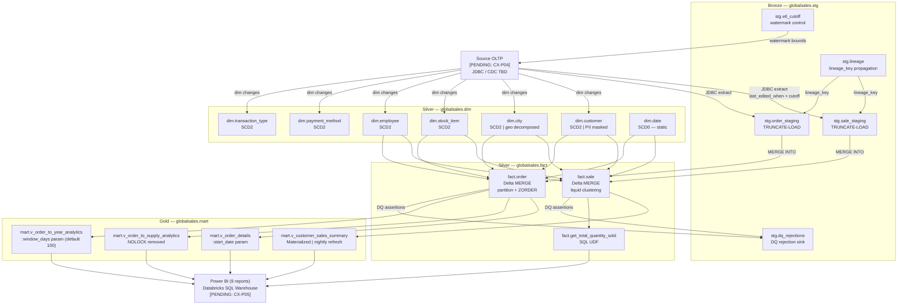

# Architecture & Lineage Diagram — Sales_Orders
_TASK-DOCS-003_

## Data flow overview

Source OLTP → Bronze Staging → Silver Dimensions + Facts → Gold Mart → BI



## lineage_key propagation chain

Every row in every table can be traced to its source pipeline run:

```
stg.lineage (lineage_key=42, pipeline_run_id=..., batch_start=2024-01-15T02:00Z)
  ↓ stamped at extract
stg.sale_staging (lineage_key=42)
  ↓ propagated at MERGE
fact.sale (lineage_key=42)
  ↓ aggregated via mart view
mart.v_customer_sales_summary (references fact.sale)
```

Query: which batch loaded a specific sale row?

```sql
SELECT l.*
FROM   globalsales.fact.sale  s
JOIN   globalsales.stg.lineage l ON l.lineage_key = s.lineage_key
WHERE  s.sale_key = :target_sale_key;
```

## Pending decision nodes

| Node | Pending | Impact |
|---|---|---|
| Source OLTP connection | CX-P04 — connection strategy TBD | Ingestion notebooks have `{{SOURCE_JDBC_URL}}` placeholders |
| BI grants | CX-P05 — UC role matrix TBD | Grant scripts have `{{UC_ROLE_*}}` placeholders |
| DQ thresholds | CX-DQ-01 — business thresholds TBD | Zero-tolerance active; `dq_threshold_config.yaml` has placeholder structure |
