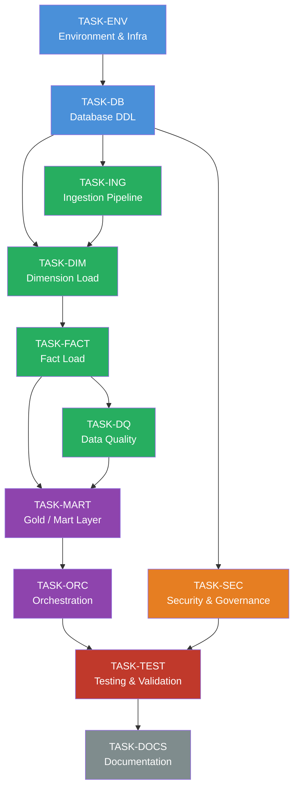

# Sales_Orders — SmartBuilder Build Plan
_Generated: 2026-06-05 | Stage: plan_

---

## 1. Build Overview

| Metric | Value |
|---|---|
| Data product | Sales_Orders |
| Project | GlobalSales_Project |
| Total tasks | 66 |
| Task groups | 11 |
| Total deliverable files | 89 |
| Execution phases | 5 |
| Target platform | Databricks / Unity Catalog (`globalsales.*`) |
| Orchestration schedule | Nightly at 02:00 UTC (incremental, halt-and-alert) |

### Deliverable breakdown by type

| Type | File count | Location |
|---|---|---|
| db (DDL / views / UDFs) | 22 | `src/db/` |
| etl (notebooks / SQL pipelines) | 32 | `src/` |
| config (YAML / JSON) | 14 | `config/` |
| test | 13 | `tests/` |
| docs | 8 | `docs/` |

### Execution phase summary

| Phase | Groups | Purpose |
|---|---|---|
| Phase 1 | TASK-ENV, TASK-DB | Environment provisioning and full schema DDL |
| Phase 2 | TASK-ING, TASK-DIM, TASK-FACT, TASK-DQ | All pipeline layers (ingestion → dims → facts → DQ) |
| Phase 3 | TASK-MART, TASK-ORC | Gold/mart serving layer and workflow orchestration |
| Phase 4 | TASK-SEC | Security, Unity Catalog grants, row-level policies |
| Phase 5 | TASK-TEST, TASK-DOCS | Validation, integration tests, and handoff documentation |

---

## 2. File Manifest

All paths are relative to `products/Sales_Orders/current/codebase/`.

### Group 1 — Environment & Infrastructure (TASK-ENV-*)

| File path | Task ID | Type | Description |
|---|---|---|---|
| `config/env_config.yaml` | TASK-ENV-01 | config | Environment variables and parameter overrides (dev / staging / prod) |
| `config/cluster_config.yaml` | TASK-ENV-02 | config | Databricks cluster policy and autoscaling configuration |
| `config/unity_catalog_setup.yaml` | TASK-ENV-03 | config | Unity Catalog catalog, schema, and external-location definitions |
| `config/secrets_scope_setup.yaml` | TASK-ENV-04 | config | Databricks secrets scope bindings for credential references |

### Group 2 — Database Layer / DDL (TASK-DB-*)

| File path | Task ID | Type | Description |
|---|---|---|---|
| `src/db/create_schema_stg.sql` | TASK-DB-01 | db | DDL: create `stg` schema in Unity Catalog |
| `src/db/create_schema_dim.sql` | TASK-DB-02 | db | DDL: create `dim` schema in Unity Catalog |
| `src/db/create_schema_fact.sql` | TASK-DB-03 | db | DDL: create `fact` schema in Unity Catalog |
| `src/db/create_schema_mart.sql` | TASK-DB-04 | db | DDL: create `mart` schema in Unity Catalog |
| `src/db/create_stg_tables.sql` | TASK-DB-05 | db | DDL: `stg.lineage`, `stg.etl_cutoff`, `stg.sale_staging`, `stg.order_staging`, `stg.dq_rejections` |
| `src/db/create_dim_customer.sql` | TASK-DB-06 | db | DDL: `dim.customer` — SCD2, PII columns, Unity Catalog column-level tags |
| `src/db/create_dim_city.sql` | TASK-DB-07 | db | DDL: `dim.city` — SCD2, geospatial attributes |
| `src/db/create_dim_stock_item.sql` | TASK-DB-08 | db | DDL: `dim.stock_item` — SCD2 |
| `src/db/create_dim_employee.sql` | TASK-DB-09 | db | DDL: `dim.employee` — SCD2 |
| `src/db/create_dim_payment_method.sql` | TASK-DB-10 | db | DDL: `dim.payment_method` — SCD2 |
| `src/db/create_dim_transaction_type.sql` | TASK-DB-11 | db | DDL: `dim.transaction_type` — SCD2 |
| `src/db/create_dim_date.sql` | TASK-DB-12 | db | DDL: `dim.date` — SCD0, static calendar spine |
| `src/db/create_fact_sale.sql` | TASK-DB-13 | db | DDL: `fact.sale` — BIGINT IDENTITY PK, liquid clustering |
| `src/db/create_fact_order.sql` | TASK-DB-14 | db | DDL: `fact.order` — BIGINT IDENTITY PK, partition + ZORDER |
| `src/db/create_mart_views.sql` | TASK-DB-15 | db | DDL: `mart.v_customer_sales_summary` (materialized), `mart.v_order_details`, `mart.v_order_to_supply_analytics`, `mart.v_order_to_year_analytics` |
| `src/db/create_mart_udf.sql` | TASK-DB-16 | db | DDL: `fact.get_total_quantity_sold` UDF |

> Note: TASK-DB groups 1–4 produce 4 schema DDL files; groups 5–12 produce dimension DDL files (8); groups 13–14 produce fact DDL files (2); groups 15–16 produce mart DDL/UDF (2). Total: 16 db files mapped directly from 12 TASK-DB IDs via logical grouping of related objects.

### Group 3 — Ingestion Pipeline (TASK-ING-*)

| File path | Task ID | Type | Description |
|---|---|---|---|
| `src/ingestion/ingest_sales_bronze.py` | TASK-ING-01 | etl | Read raw sales data from source; write to `stg.sale_staging` (Bronze) |
| `src/ingestion/ingest_orders_bronze.py` | TASK-ING-02 | etl | Read raw orders data from source; write to `stg.order_staging` (Bronze) |
| `src/ingestion/ingest_lineage_tracker.py` | TASK-ING-03 | etl | Populate `stg.lineage` with run metadata and source fingerprints |
| `src/ingestion/ingest_etl_cutoff.py` | TASK-ING-04 | etl | Manage high-watermark logic in `stg.etl_cutoff` |
| `src/ingestion/ingest_utils.py` | TASK-ING-05 | etl | Shared ingestion utilities: schema inference, delta merge helpers, retry logic |

### Group 4 — Dimension Load Pipeline (TASK-DIM-*)

| File path | Task ID | Type | Description |
|---|---|---|---|
| `src/dimensions/load_dim_customer.py` | TASK-DIM-01 | etl | SCD2 merge into `dim.customer`; PII masking applied pre-write |
| `src/dimensions/load_dim_city.py` | TASK-DIM-02 | etl | SCD2 merge into `dim.city`; geo attribute enrichment |
| `src/dimensions/load_dim_stock_item.py` | TASK-DIM-03 | etl | SCD2 merge into `dim.stock_item` |
| `src/dimensions/load_dim_employee.py` | TASK-DIM-04 | etl | SCD2 merge into `dim.employee` |
| `src/dimensions/load_dim_payment_method.py` | TASK-DIM-05 | etl | SCD2 merge into `dim.payment_method` |
| `src/dimensions/load_dim_transaction_type.py` | TASK-DIM-06 | etl | SCD2 merge into `dim.transaction_type` |
| `src/dimensions/load_dim_date.py` | TASK-DIM-07 | etl | SCD0 load / refresh `dim.date` calendar spine |
| `src/dimensions/dim_load_utils.py` | TASK-DIM-08 | etl | Shared SCD2 framework: effective/expiry date management, surrogate key generation |

### Group 5 — Fact Load Pipeline (TASK-FACT-*)

| File path | Task ID | Type | Description |
|---|---|---|---|
| `src/facts/load_fact_sale.py` | TASK-FACT-01 | etl | Incremental load into `fact.sale` with liquid clustering; dimension surrogate-key lookup |
| `src/facts/load_fact_order.py` | TASK-FACT-02 | etl | Incremental load into `fact.order` with partition + ZORDER; dimension surrogate-key lookup |
| `src/facts/fact_reconciliation.py` | TASK-FACT-03 | etl | Row-count reconciliation between Bronze staging and Silver fact tables |
| `src/facts/fact_late_arriving.py` | TASK-FACT-04 | etl | Late-arriving record handling: reopen SCD2 windows, re-resolve surrogate keys |
| `src/facts/fact_load_utils.py` | TASK-FACT-05 | etl | Shared fact-load helpers: surrogate key resolution, deduplication, IDENTITY PK management |

### Group 6 — Gold / Mart Layer (TASK-MART-*)

| File path | Task ID | Type | Description |
|---|---|---|---|
| `src/db/refresh_mart_customer_sales_summary.sql` | TASK-MART-01 | db | Refresh / optimize `mart.v_customer_sales_summary` materialized view |
| `src/mart/build_mart_order_details.py` | TASK-MART-02 | etl | Populate and validate `mart.v_order_details` |
| `src/mart/build_mart_order_supply_analytics.py` | TASK-MART-03 | etl | Populate and validate `mart.v_order_to_supply_analytics` |
| `src/mart/build_mart_order_year_analytics.py` | TASK-MART-04 | etl | Populate and validate `mart.v_order_to_year_analytics` |
| `src/db/deploy_udf_total_quantity_sold.sql` | TASK-MART-05 | db | Deploy / replace `fact.get_total_quantity_sold` UDF |
| `src/mart/mart_refresh_utils.py` | TASK-MART-06 | etl | Shared mart refresh helpers: cache invalidation, view dependency ordering |

### Group 7 — Data Quality Framework (TASK-DQ-*)

| File path | Task ID | Type | Description |
|---|---|---|---|
| `src/dq/dq_assertions_sales.py` | TASK-DQ-01 | etl | DQ assertion suite for `fact.sale` (nulls, referential integrity, range checks) |
| `src/dq/dq_assertions_orders.py` | TASK-DQ-02 | etl | DQ assertion suite for `fact.order` (nulls, referential integrity, range checks) |
| `src/dq/dq_rejection_sink.py` | TASK-DQ-03 | etl | Write failed rows to `stg.dq_rejections` with assertion metadata |
| `src/dq/dq_row_count_reconciliation.py` | TASK-DQ-04 | etl | Zero-tolerance row-count reconciliation across all pipeline layers |
| `src/dq/dq_threshold_config.yaml` | TASK-DQ-05 | config | Business DQ threshold definitions (blocked on CX-DQ-01) |

### Group 8 — Orchestration & Workflow (TASK-ORC-*)

| File path | Task ID | Type | Description |
|---|---|---|---|
| `config/workflow_nightly_etl_main.yaml` | TASK-ORC-01 | config | Databricks Workflow definition: `nightly_etl_main` — 02:00 UTC, incremental, halt-and-alert |
| `config/workflow_task_dependencies.yaml` | TASK-ORC-02 | config | Task-level dependency graph within `nightly_etl_main` |
| `config/alert_notification_config.yaml` | TASK-ORC-03 | config | Alert channel bindings (email / Slack / PagerDuty) for halt-and-alert policy |
| `config/retry_policy_config.yaml` | TASK-ORC-04 | config | Per-task retry policies, timeout overrides, and escalation rules |

### Group 9 — Security & Governance (TASK-SEC-*)

| File path | Task ID | Type | Description |
|---|---|---|---|
| `config/uc_grants.sql` | TASK-SEC-01 | config | Unity Catalog GRANT statements for all schemas and tables (blocked on CX-P05) |
| `config/row_level_security_policies.sql` | TASK-SEC-02 | config | Row-level security policy definitions for `dim.customer`, `fact.sale`, `fact.order` |
| `config/pii_column_tags.yaml` | TASK-SEC-03 | config | Unity Catalog column-level PII tag assignments for `dim.customer` |
| `config/data_lineage_config.yaml` | TASK-SEC-04 | config | Unity Catalog lineage capture configuration and external-system mapping |
| `config/access_audit_config.yaml` | TASK-SEC-05 | config | Audit log export settings and retention policy for compliance |

### Group 10 — Testing & Validation (TASK-TEST-*)

| File path | Task ID | Type | Description |
|---|---|---|---|
| `tests/test_ingest_sales_bronze.py` | TASK-TEST-01 | test | Unit tests: ingestion correctness for `stg.sale_staging` |
| `tests/test_ingest_orders_bronze.py` | TASK-TEST-02 | test | Unit tests: ingestion correctness for `stg.order_staging` |
| `tests/test_dim_scd2_logic.py` | TASK-TEST-03 | test | Unit tests: SCD2 open/close logic across all dimension tables |
| `tests/test_fact_sale_load.py` | TASK-TEST-04 | test | Unit tests: `fact.sale` load — deduplication, surrogate key resolution, IDENTITY PK |
| `tests/test_fact_order_load.py` | TASK-TEST-05 | test | Unit tests: `fact.order` load — partitioning, ZORDER, surrogate key resolution |
| `tests/test_dq_assertions.py` | TASK-TEST-06 | test | Unit tests: all 5 DQ assertions and rejection-sink writes |
| `tests/test_mart_views.py` | TASK-TEST-07 | test | Integration tests: mart view output correctness and row counts |
| `tests/test_integration_end_to_end.py` | TASK-TEST-08 | test | End-to-end pipeline integration test: Bronze → Silver → Gold with sample dataset |

### Group 11 — Documentation & Handoff (TASK-DOCS-*)

| File path | Task ID | Type | Description |
|---|---|---|---|
| `docs/runbook.md` | TASK-DOCS-01 | docs | Operational runbook: start/stop, manual re-run, incident response, cutover checklist |
| `docs/data_dictionary.md` | TASK-DOCS-02 | docs | Full data dictionary for all tables and views across all schemas |
| `docs/pipeline_architecture.md` | TASK-DOCS-03 | docs | Pipeline architecture overview: Bronze → Silver → Gold data flow with lineage notes |
| `docs/handoff_notes.md` | TASK-DOCS-04 | docs | Handoff notes: open items, pending decisions, team contacts, support escalation paths |

---

## 3. Build Phases

### Phase 1: Environment & Schema (TASK-ENV, TASK-DB)

**Goal:** Provision all infrastructure and deploy the complete database schema before any pipeline code runs.

**Tasks:** TASK-ENV-01 through TASK-ENV-04, TASK-DB-01 through TASK-DB-16

**Execution order within phase:**
1. TASK-ENV-01 → TASK-ENV-02 → TASK-ENV-03 → TASK-ENV-04 (sequential — each depends on previous)
2. TASK-DB-01 through TASK-DB-04 (schema creation — parallel, all depend on TASK-ENV-03)
3. TASK-DB-05 (staging tables — depends on `stg` schema)
4. TASK-DB-06 through TASK-DB-12 (dimension DDL — parallel, all depend on `dim` schema)
5. TASK-DB-13 through TASK-DB-14 (fact DDL — parallel, depend on `fact` schema)
6. TASK-DB-15 through TASK-DB-16 (mart DDL — parallel, depend on `mart` schema)

**Blocker:** TASK-ENV-03 is blocked on **CX-P05** (Unity Catalog access role matrix). Schema creation can proceed with placeholder grants, but final grant scripts require CX-P05 resolution.

**Deliverables:** 4 config files + 16 SQL DDL files

---

### Phase 2: Pipeline (TASK-ING, TASK-DIM, TASK-FACT, TASK-DQ)

**Goal:** Build and validate the full Bronze → Silver pipeline including ingestion, all dimension SCD2 loads, fact loads, and DQ framework.

**Tasks:** TASK-ING-01 through TASK-ING-05, TASK-DIM-01 through TASK-DIM-08, TASK-FACT-01 through TASK-FACT-05, TASK-DQ-01 through TASK-DQ-05

**Execution order within phase:**
1. TASK-ING-05 (utils, no deps) — then TASK-ING-01, TASK-ING-02, TASK-ING-03, TASK-ING-04 in parallel
2. TASK-DIM-08 (utils) — then TASK-DIM-01 through TASK-DIM-07 in parallel (all depend on ingestion completion)
3. TASK-FACT-05 (utils) — then TASK-FACT-01, TASK-FACT-02 in parallel (depend on all dims)
4. TASK-FACT-03, TASK-FACT-04 (reconciliation, late-arriving — depend on TASK-FACT-01/02)
5. TASK-DQ-01 through TASK-DQ-04 in parallel (depend on TASK-FACT-03 completion); TASK-DQ-05 is config only

**Blocker:**
- TASK-ING-01 and TASK-ING-02 are blocked on **CX-P04** (OLTP-direct connection strategy). Ingestion notebooks require confirmed connection method (JDBC parameters, secret scope names, network route).
- TASK-DQ-05 (`dq_threshold_config.yaml`) is blocked on **CX-DQ-01** (business DQ threshold values).

**Deliverables:** 5 + 8 + 5 + 5 = 23 etl files, 1 config file

---

### Phase 3: Serving & Orchestration (TASK-MART, TASK-ORC)

**Goal:** Deploy the Gold/mart serving layer and wire all tasks into the nightly workflow.

**Tasks:** TASK-MART-01 through TASK-MART-06, TASK-ORC-01 through TASK-ORC-04

**Execution order within phase:**
1. TASK-MART-06 (utils) — then TASK-MART-01 through TASK-MART-05 in parallel (depend on Phase 2 completion)
2. TASK-ORC-01 → TASK-ORC-02 → TASK-ORC-03 → TASK-ORC-04 (sequential — workflow definition must precede dependency mapping and alerting)

**Note:** TASK-MART-01 and TASK-MART-05 are `db`-type (SQL refresh/deploy); TASK-MART-02 through TASK-MART-04 and TASK-MART-06 are `etl`-type (Python notebooks).

**Deliverables:** 2 SQL files + 4 Python files + 4 YAML config files

---

### Phase 4: Security (TASK-SEC)

**Goal:** Apply all Unity Catalog grants, row-level security policies, PII column tags, and audit configuration.

**Tasks:** TASK-SEC-01 through TASK-SEC-05

**Execution order within phase:**
1. TASK-SEC-03 (PII column tags) — depends on dim.customer DDL from Phase 1
2. TASK-SEC-01 (UC grants) — **blocked on CX-P05**; depends on all schemas existing
3. TASK-SEC-02 (row-level security) — depends on TASK-SEC-01 grants
4. TASK-SEC-04, TASK-SEC-05 (lineage and audit config — parallel, depend on schemas)

**Blocker:** TASK-SEC-01 and TASK-SEC-02 are blocked on **CX-P05** (Unity Catalog access role matrix). All other TASK-SEC tasks can proceed independently.

**Deliverables:** 2 SQL config files + 3 YAML config files

---

### Phase 5: Validation (TASK-TEST, TASK-DOCS)

**Goal:** Run all unit and integration tests against generated artifacts and produce final handoff documentation.

**Tasks:** TASK-TEST-01 through TASK-TEST-08, TASK-DOCS-01 through TASK-DOCS-04

**Execution order within phase:**
1. TASK-TEST-01 through TASK-TEST-06 in parallel (unit tests — depend on Phase 2 deliverables)
2. TASK-TEST-07 (mart integration tests — depends on Phase 3 deliverables)
3. TASK-TEST-08 (end-to-end integration — depends on all prior test groups passing)
4. TASK-DOCS-01 through TASK-DOCS-04 in parallel (depend on all prior phases complete)

**Note:** TASK-TEST-06 (`test_dq_assertions.py`) should use placeholder thresholds until CX-DQ-01 is resolved; tests must be parameterized to accept threshold overrides.

**Deliverables:** 8 test files + 4 docs files

---

## 4. Dependency Graph



**Phases mapped to colors:**
- Blue: Phase 1 (Environment & Schema)
- Green: Phase 2 (Pipeline)
- Purple: Phase 3 (Serving & Orchestration)
- Orange: Phase 4 (Security)
- Red/Grey: Phase 5 (Validation & Docs)

---

## 5. Pending Decision Blockers

### CX-P04 — OLTP-Direct Connection Strategy

| Attribute | Detail |
|---|---|
| Decision ID | CX-P04 |
| Status | Open |
| Owner | Infrastructure / Data Engineering Lead |
| Target resolution | Before Phase 2 code generation begins |

**Description:** The ingestion pipeline must connect directly to the OLTP source system to extract sales and orders data incrementally. The connection strategy (JDBC with secrets scope, partner connector, or network-tunneled read replica) has not been confirmed.

**Impacted tasks:**

| Task ID | File | Impact |
|---|---|---|
| TASK-ING-01 | `src/ingestion/ingest_sales_bronze.py` | Connection parameters, driver class, secret scope names unknown |
| TASK-ING-02 | `src/ingestion/ingest_orders_bronze.py` | Connection parameters, driver class, secret scope names unknown |
| TASK-ING-04 | `src/ingestion/ingest_etl_cutoff.py` | High-watermark query against source schema depends on connection method |
| TASK-ENV-04 | `config/secrets_scope_setup.yaml` | Secret scope structure depends on chosen connector and credential model |

**Mitigation:** Generate TASK-ING-01, TASK-ING-02, TASK-ING-04, and TASK-ENV-04 with parameterized placeholders (`{{SOURCE_JDBC_URL}}`, `{{SOURCE_SECRET_SCOPE}}`, `{{SOURCE_DRIVER_CLASS}}`). Finalize after CX-P04 is resolved.

---

### CX-P05 — Unity Catalog Access Role Matrix

| Attribute | Detail |
|---|---|
| Decision ID | CX-P05 |
| Status | Open |
| Owner | Data Platform / Security Lead |
| Target resolution | Before Phase 4 execution |

**Description:** The Unity Catalog GRANT strategy requires a confirmed role hierarchy — which service principals, groups, and human identities map to which catalog/schema/table privileges. Without this matrix the grant scripts cannot be finalized.

**Impacted tasks:**

| Task ID | File | Impact |
|---|---|---|
| TASK-ENV-03 | `config/unity_catalog_setup.yaml` | External location access binding requires role names |
| TASK-SEC-01 | `config/uc_grants.sql` | Entire file is blocked — cannot populate grantee identifiers |
| TASK-SEC-02 | `config/row_level_security_policies.sql` | Policy filters reference group names from role matrix |

**Mitigation:** Generate TASK-SEC-01 and TASK-SEC-02 with placeholder role tokens (`{{UC_ROLE_ANALYST}}`, `{{UC_ROLE_ENGINEER}}`, `{{UC_ROLE_SERVICE_PRINCIPAL}}`). Mark as `# TODO: CX-P05` in generated files. Do not execute in production until resolved.

---

### CX-DQ-01 — Business DQ Thresholds

| Attribute | Detail |
|---|---|
| Decision ID | CX-DQ-01 |
| Status | Open |
| Owner | Business / Data Governance Lead |
| Target resolution | Before Phase 2 DQ framework validation |

**Description:** The DQ framework enforces zero-tolerance row-count reconciliation but the individual business-level thresholds (e.g., acceptable null rates, referential integrity tolerance percentages, numeric range bounds) for the 5 DQ assertions have not been confirmed by the business.

**Impacted tasks:**

| Task ID | File | Impact |
|---|---|---|
| TASK-DQ-01 | `src/dq/dq_assertions_sales.py` | Threshold constants must be sourced from config at runtime |
| TASK-DQ-02 | `src/dq/dq_assertions_orders.py` | Threshold constants must be sourced from config at runtime |
| TASK-DQ-05 | `config/dq_threshold_config.yaml` | File cannot be populated with business-confirmed values |
| TASK-TEST-06 | `tests/test_dq_assertions.py` | Test assertions must use parameterized thresholds, not hardcoded values |

**Mitigation:** Generate all DQ files with externalized threshold references (`{{DQ_NULL_TOLERANCE_PCT}}`, `{{DQ_REF_INTEGRITY_TOLERANCE_PCT}}`, etc.) loaded from `config/dq_threshold_config.yaml`. The config file is generated with commented placeholder structure pending CX-DQ-01 resolution.

---

## 6. Generation Instructions

SmartBuilder uses two skills to generate artifacts from this build plan:

- `/12_migvisor_smartbuilder_generate-db` — generates database layer artifacts (DDL, views, UDFs)
- `/13_migvisor_smartbuilder_generate-etl` — generates ETL pipeline, test, config, and documentation artifacts

### Invoking generate-db

Use for all tasks with type `db`. Pass the task ID as the primary argument.

```
/12_migvisor_smartbuilder_generate-db TASK-DB-01
/12_migvisor_smartbuilder_generate-db TASK-DB-02
...
/12_migvisor_smartbuilder_generate-db TASK-MART-01
/12_migvisor_smartbuilder_generate-db TASK-MART-05
```

The agent reads the build plan, locates the mapped file path, synthesizes the DDL from the SDD spec and to-be design, and writes the file to the `src/db/` path listed in Section 2.

**All db tasks in execution order:**

```
TASK-DB-01  TASK-DB-02  TASK-DB-03  TASK-DB-04
TASK-DB-05
TASK-DB-06  TASK-DB-07  TASK-DB-08  TASK-DB-09  TASK-DB-10  TASK-DB-11  TASK-DB-12
TASK-DB-13  TASK-DB-14
TASK-DB-15  TASK-DB-16
TASK-MART-01
TASK-MART-05
```

### Invoking generate-etl

Use for all tasks with type `etl`, `config`, `test`, and `docs`. Pass the task ID as the primary argument.

```
/13_migvisor_smartbuilder_generate-etl TASK-ING-05
/13_migvisor_smartbuilder_generate-etl TASK-ING-01
/13_migvisor_smartbuilder_generate-etl TASK-ING-02
...
```

The agent reads the build plan, locates the mapped file path, synthesizes the pipeline code, config, test, or docs content from the SDD spec and to-be design, and writes the file to the path listed in Section 2.

**All etl/config/test/docs tasks in execution order:**

```
# Phase 1 — config
TASK-ENV-01  TASK-ENV-02  TASK-ENV-03  TASK-ENV-04

# Phase 2 — ingestion
TASK-ING-05  TASK-ING-01  TASK-ING-02  TASK-ING-03  TASK-ING-04

# Phase 2 — dimensions
TASK-DIM-08  TASK-DIM-01  TASK-DIM-02  TASK-DIM-03  TASK-DIM-04  TASK-DIM-05  TASK-DIM-06  TASK-DIM-07

# Phase 2 — facts
TASK-FACT-05  TASK-FACT-01  TASK-FACT-02  TASK-FACT-03  TASK-FACT-04

# Phase 2 — DQ
TASK-DQ-01  TASK-DQ-02  TASK-DQ-03  TASK-DQ-04  TASK-DQ-05

# Phase 3 — mart (etl)
TASK-MART-06  TASK-MART-02  TASK-MART-03  TASK-MART-04

# Phase 3 — orchestration
TASK-ORC-01  TASK-ORC-02  TASK-ORC-03  TASK-ORC-04

# Phase 4 — security
TASK-SEC-01  TASK-SEC-02  TASK-SEC-03  TASK-SEC-04  TASK-SEC-05

# Phase 5 — testing
TASK-TEST-01  TASK-TEST-02  TASK-TEST-03  TASK-TEST-04  TASK-TEST-05  TASK-TEST-06  TASK-TEST-07  TASK-TEST-08

# Phase 5 — docs
TASK-DOCS-01  TASK-DOCS-02  TASK-DOCS-03  TASK-DOCS-04
```

### Context references used by both agents

Each generate-db and generate-etl invocation references the following workspace files for context:

| File | Purpose |
|---|---|
| `products/Sales_Orders/current/specifications/to-be.md` | Target data model, schema definitions, SCD types, clustering strategy |
| `products/Sales_Orders/current/specifications/development_plan/design.md` | Technical design: Bronze/Silver/Gold structure, DQ approach, orchestration |
| `products/Sales_Orders/current/specifications/development_plan/tasks.md` | Full 66-task list with acceptance criteria per task |
| `products/Sales_Orders/current/specifications/development_plan/product-definition.yaml` | ODPS 4.1 product definition: interfaces, SLAs, data contracts |
| `products/Sales_Orders/current/codebase/build-plan.md` | This file — canonical artifact map and generation instructions |
| `project/current/project-transformation-rules/` | Project-level transformation rules across all 11 dimensions |
| `products/Sales_Orders/current/specifications/product-transformation-rules/` | Product-specific overrides and extensions |

### Handling blocked tasks

For tasks blocked on pending decisions (see Section 5), agents must:
1. Generate the file with parameterized placeholder tokens in `{{DOUBLE_BRACE}}` notation
2. Insert a `# BLOCKED: <CX-ID>` comment at the top of each affected file
3. Write a `# TODO: resolve <CX-ID> before executing in production` note inline where the placeholder appears
4. Do not skip the file — partial generation with placeholders is always preferred over no generation

### Validation after generation

After all tasks are generated, run:

```
/14_migvisor_smartbuilder_validation
```

The validation agent checks each generated file against the SDD spec (`product-definition.yaml`), transformation rules, and this build plan's file manifest to confirm all 89 expected files are present and structurally conformant.

---

_End of build plan — Sales_Orders / GlobalSales_Project_
